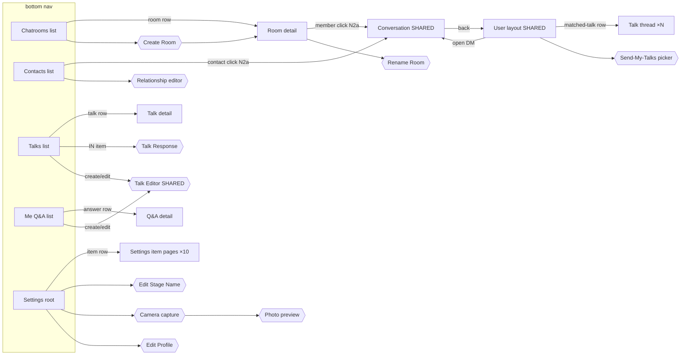

# GUI Redesign Plan — Consistent Navigation & Layout

Status: proposed / not yet implemented. This is a design + refactor plan only; no behavior has changed yet.

Companion: `docs/gui-layout-catalog-and-e2e-plan.md` — full catalog of every existing screen, current e2e coverage per screen, and the e2e test plan this redesign must ship with.

## Goal

Establish one consistent shell used by every screen: a **fixed bottom navigation bar** plus a **single top bar** that combines status and actions. Today several screens stack two separate rows at the top (the global `top-header` plus a per-view `tab-action-bar`), and the one-on-one peer view lays its actions out as full-width stacked buttons. This plan unifies all of that into one pattern and one reusable component.

## Current state (for reference)

Defined in `src/web/ui/ui-manager.ts` `render()` (the `appContainer.innerHTML` template, ~line 789+):

- `#top-header` — row 1: `#header-title`, `#header-status` (status text per view), `#header-actions` with the single `#create-talk-btn` (➕).
- Each view panel then has its own `.tab-action-bar` — row 2. For chatrooms that is `#chatroom-action-bar` with three text buttons: `#create-custom-chatroom-btn` ("New Room"), `#return-home-btn` ("Return Home"), `#broadcast-talk-btn` ("Broadcast"), plus a hidden `#back-to-chatrooms` ("‹ Back").
- `.bottom-nav` — fixed bottom navigation (`.nav-btn` for chatrooms / contacts / talks / me / settings). This already matches the target and stays.
- Peer one-on-one overlay: `#peer-detail-overlay` in `ui-manager.ts` (~line 1030) + `src/web/ui/user-detail-view.ts`. Actions are full-width stacked buttons in `.peer-send-section`: `#peer-send-talks-btn` ("📤 Send My Talks"), `#peer-dm-input` + `#peer-dm-send-btn` ("💬 Send Message"), `#peer-block-user-btn` ("Block User"). A separate `#peer-conversations-section` renders the "Open Chat" list higher up in the body — so messaging is split across two disconnected places.
- Contact detail: `#contact-detail-container` / `.contact-detail-header` (in `contacts-view.ts`) is a cleaner header + list; the peer overlay should converge on this.
- Notifications: `showNotification()` in `ui-manager.ts` (~line 6206). Non-match toasts auto-dismiss (3s); "Match!" notices are treated as durable and only clear on click. (A `persistent` option was recently added.)

The "two rows" the redesign removes: `#top-header` **and** `.tab-action-bar` both being visible at once.

## Target design

### 1. One top bar per screen (the "AppBar")

A single horizontal bar directly under the OS chrome, replacing the current `top-header` + `tab-action-bar` stack. Three zones:

- **Left** — a contextual control: the screen title when at a list root, or a **back icon** (`‹` / chevron) when inside a sub-view (chatroom detail, peer detail, conversation, contact detail). The text "‹ Back" buttons (`#back-to-chatrooms`, `#back-to-contacts-list`, `#talks-nav-back`, `#back-from-peer-detail`, `#back-from-conversation`) all collapse into this one left-corner icon.
- **Center** — the status / context line (single line, truncates with ellipsis). Reuses the existing per-view status text (`#status-bar-text`, `#contacts-status-text`, etc.).
- **Right** — a row of **action icons**, contextual to the screen. Icons render inline until they no longer fit; overflow collapses into a single **`⋯` (more) button** that opens a small menu with the remaining actions and their labels.

Every screen uses the same component so spacing, height, icon size, and the overflow behavior are identical everywhere.

### 2. Chatrooms tab

Merge the two rows into the single top bar. The three text buttons become **icons, in parallel with the ➕ create-talk icon**:

| Action | Current | Target icon |
|---|---|---|
| Create talk | `#create-talk-btn` ➕ | ➕ |
| New room | `#create-custom-chatroom-btn` "New Room" | e.g. 🏠➕ / "+room" glyph |
| Return home | `#return-home-btn` "Return Home" | e.g. 🏠 / home glyph |
| Broadcast | `#broadcast-talk-btn` "Broadcast" | e.g. 📣 |

- All four sit in the top bar's right zone, in parallel.
- When the window is too narrow to show them all, the ones that don't fit collapse into the `⋯` overflow menu (labels shown in the menu for clarity). Priority order (most → least likely to stay inline) to be finalized during build; suggested: ➕ create talk, 📣 broadcast, home, new room.
- `#return-home-btn`'s existing enabled/disabled logic and `#broadcast-talk-btn`'s visibility logic (`syncStatusBroadcastButtonVisibility`) carry over to the icon/menu items.
- Keep `data-testid` attributes on the new icon buttons (and menu items) so existing E2E selectors keep working: `create-custom-chatroom-btn`, `return-home-btn`, `broadcast-talk-btn`, `bottom-navigation-button-*`.

### 3. Inside a chatroom (chatroom detail)

- The "‹ Back" (`#back-to-chatrooms`) becomes the **left-corner back icon** of the same single top bar.
- Center shows the room title/status (`#current-chatroom-title` / `#current-chatroom-status` content).
- Right zone shows only the actions valid inside a room (e.g. broadcast, create talk); room-list-only actions (new room / return-home as appropriate) hide or move to overflow.

### 4. Notifications auto-dismiss

All toasts disappear after a few seconds — including the "Match!" notices, which currently linger until clicked.

- In `showNotification()`, give every toast a timeout. Durable/match notices can get a longer timeout (e.g. ~6–8s) instead of never dismissing, and stay click-to-dismiss.
- Keep the `data-match-notification` attribute (an E2E assertion depends on it) but stop treating "no timeout" as the way match notices are identified.
- Verify the E2E specs that assert badge/notification behavior still pass (`stage1 .../00-ui-navigation-settings`, `stage2 .../30-messaging-read-state`).

### 5. One-on-one peer view — restructure to match the Contact/User layout

The peer overlay (`#peer-detail-overlay` + `user-detail-view.ts`) is the messy screen. Target:

- **All actions move to the top bar as icons**: `Block User` (e.g. 🚫), `Send My Talks` (📤), plus the back icon on the left. Low-frequency / destructive actions (Block) can live under `⋯`.
- **Merge messaging into one place.** Today the "Conversations / Open Chat" list (`#peer-conversations-section`) and the "Send Message" composer (`#peer-dm-*`) are separated by the talk-history block. Combine them into a single messaging area: the conversation(s) with this peer and the message composer together, so "see the chat" and "send a message" are one unit.
- **Adopt the Contact detail layout.** The peer overlay and the Contact detail view (`#contact-detail-container`) should render from **one shared layout/component**: same header (avatar/name/subtitle), same body order (relationship/stats → messaging → talk history). Clicking a user from a chatroom member list and clicking a user from the Contacts tab should land on the **identical screen**.
- **Conversation-first entry.** Clicking a user anywhere (chatroom member row, contact row) opens the **direct Conversation page immediately** — not the User layout. The click pushes two levels in one action (User layout, then the default DM Conversation on top — rule N2a in §7), so the AppBar back icon from the Conversation lands on the **User layout**, and a second back returns to wherever the user was clicked (room detail or Contacts list).
- **Matched-talk threads (email model).** The User layout's talk history becomes a **thread list**: one row per matched talk between the two people, rendered like an email inbox — subject = talk title, snippet = latest reply, timestamp, unread badge. Each row expands into its **own per-talk Thread page** (a Conversation page scoped to that talk): full reply history for that talk plus a composer, so every matched talk **can be replied to** in its own thread. Back from a Thread returns to the User layout. The talk-independent DM thread (the page a user-click opens directly) and per-talk Threads share the same Conversation component, differing only in scope (`conversationId` vs. `conversationId + talkId`).

### 6. Shared component & consistency pass

- Introduce a single `renderAppBar({ title, statusText, backAction?, actions: [{icon, label, onClick, testId, hidden?, disabled?}] })` helper (new file, e.g. `src/web/ui/app-bar.ts`) that owns: layout, icon rendering, the narrow-width measurement, and the `⋯` overflow menu. Every view calls it instead of hand-rolling a `.tab-action-bar`.
- Introduce a shared peer/contact detail renderer so §5's "same layout" is enforced structurally, not by copy-paste.
- Define a small icon set (emoji or an icon font/SVG sprite — decide during build) and reuse it across bars.
- Remove the per-view `.tab-action-bar` inline styles once migrated.

## 7. Page transition specification (complete)

This section is the normative navigation contract. Every edge the app can take is listed here; anything not listed is a bug. Page names follow the tree in `docs/gui-layout-catalog-and-e2e-plan.md` Part 1B.

### 7.1 Navigation model

App state = **(activeTab, per-tab sub-view stack, modal stack)**.

- **N1 — Tabs.** The bottom nav switches `activeTab`. Switching tabs closes any open modal, pops the leaving tab's sub-view stack to its root, and shows the target tab's root list. Tapping the already-active tab scrolls its root list to top. The bottom nav stays visible on every page; modals overlay it.
- **N2 — Push/pop.** Entering a sub-view (room detail, User layout, Conversation, Q&A detail, Settings item page) pushes one level. The AppBar back icon (left zone) pops exactly one level — always to the parent that opened the view, never to a fixed tab root (this matters for the shared destinations, §5).
- **N2a — Conversation-first user click.** Clicking a user pushes **two levels in one action**: the User layout, then the default DM Conversation on top of it. Back then pops normally: Conversation → User layout → opener (room detail or Contacts list). Per-talk Threads opened from the User layout push a single level as usual.
- **N3 — Modals.** Modals stack above pages and never change the page stack. Three uniform close paths: Cancel/`✕` button, scrim (click on `.modal-overlay` outside `.modal-content`), and `Esc` (to be added uniformly in `app-bar.ts`-era work — today only some dialogs honor scrim). Submit resolves the dialog's promise and closes it. Closing a modal restores focus to its trigger.
- **N4 — Chained modals** replace, not stack: Camera capture → Photo preview is one chain; cancel at any link returns to the page (Settings), not to the previous link, and discards the capture.
- **N5 — Guards.** A transition with a guard listed below must be disabled/hidden when the guard fails (not fail after click). Existing logic carries over: `#return-home-btn` disabled at home, `syncStatusBroadcastButtonVisibility` for broadcast.
- **N6 — Notification taps.** Clicking a Match! toast opens the Conversation for that match (pushes onto the current tab). Clicking the location-room suggestion "Join" switches to Chatrooms and pushes that Room detail. Other toasts dismiss on click with no navigation.

### 7.2 Transition tables

Legend: **From → To** with trigger (selector) and back target. `⟨User⟩` = shared User layout, `⟨Conv⟩` = shared default DM Conversation, `⟨Thread⟩` = per-matched-talk Conversation page (same component as ⟨Conv⟩, scoped to one talk), `⟨Editor⟩` = shared Talk Editor.

**Chatrooms tab**

| # | From | Trigger | To | Back returns to |
|---|---|---|---|---|
| C1 | Chatroom list | click room row in `#chatroom-list` (leaf or custom room) | Room detail (`#chatroom-detail-container`) | Chatroom list |
| C2 | Chatroom list | click hierarchy node caret | same page (expand/collapse only, no push) | — |
| C3 | Room detail | click member row in `#chatroom-members-list` | **⟨Conv⟩ directly** (pushes ⟨User⟩ + ⟨Conv⟩, rule N2a) | ⟨User⟩, then Room detail |
| C4 | ⟨User⟩ | click a matched-talk row in the thread list | ⟨Thread⟩ for that talk (reply composer included) | ⟨User⟩ |
| C4b | ⟨User⟩ | open DM in merged messaging area | ⟨Conv⟩ | ⟨User⟩ |
| C5 | Chatroom list | `create-custom-chatroom-btn` (icon/⋯) | **Create Room dialog** | on cancel: list · on create: Room detail of new room (`showChatroomDetail(createdId)`) |
| C6 | Room detail (owner) | `chatroom-rename-btn` | **Rename Room dialog** | Room detail |
| C7 | Room detail (owner) | `chatroom-delete-btn` | confirm → Chatroom list | — |
| C8 | Room detail / list | `broadcast-talk-btn` (icon) — guard: OUT list non-empty (else guard toast), visibility per `syncStatusBroadcastButtonVisibility` | **Broadcast preamble dialog** | same page; on send: same page + `#broadcast-bulk-ack` status |
| C9 | Chatroom list | `return-home-btn` (icon) — guard: travel mode active (disabled at home) | Home room's Room detail | Chatroom list |
| C10 | any Chatrooms page | `create-talk-btn` ➕ | **⟨Editor⟩ dialog** | same page |

**Contacts tab**

| # | From | Trigger | To | Back returns to |
|---|---|---|---|---|
| K1 | Contacts list | click contact row | **⟨Conv⟩ directly** (pushes ⟨User⟩ + ⟨Conv⟩, rule N2a — identical screens to C3's) | ⟨User⟩, then Contacts list |
| K2 | Contacts list | relationship chip / edit control on a row | **Relationship editor dialog** (`#contact-relationship-modal`) | Contacts list |
| K3 | ⟨User⟩ | click a matched-talk row | ⟨Thread⟩ — same thread object as C4 for the same peer + talk | ⟨User⟩ |
| K4 | ⟨User⟩ | open DM | ⟨Conv⟩ — same thread object as C3/K1 for the same peer | ⟨User⟩ |

**Talks tab**

| # | From | Trigger | To | Back returns to |
|---|---|---|---|---|
| T1 | Talks list | `talks-nav-all/in/out` | same page, mode switch (no push) | — |
| T2 | Talks list | click a talk row | Talk detail / responses | Talks list (`talks-nav-back`) |
| T3 | Talks list (IN) or talk-received notification | answer action | **Talk Response dialog** (`#talk-response-modal`) | Talks list; on submit: outcome toast (+ match ⇒ conversation created) |
| T4 | Talks list / Talk detail | ➕ create or edit action | **⟨Editor⟩ dialog** (`#talk-editor-modal`) | same page |
| T5 | Talks list | `survey-stats-button` on a survey talk | **Survey stats dialog** | Talks list |
| T6 | Talks list | triage panel filters (`reply-*`) | same page (inline panel, no push) | — |

**Me tab**

| # | From | Trigger | To | Back returns to |
|---|---|---|---|---|
| M1 | Q&A list | filter/sort controls | same page (no push) | — |
| M2 | Q&A list | click an answer row | Q&A detail | Q&A list |
| M3 | Q&A list / detail | create or edit | **⟨Editor⟩ dialog**, seeded from the Q&A context | same page |

**Settings tab** (target structure per Part 1B: root + item pages)

| # | From | Trigger | To | Back returns to |
|---|---|---|---|---|
| S1 | Settings root | any itemized row (profile languages, incoming-language, distance, grammar, dirty-word, cutoff, location, travel, age-verify, feature toggles) | that item's page | Settings root |
| S2 | Settings root | Edit Stage Name | **Edit Stage Name dialog** | Settings root |
| S3 | Settings root | Headshot → Take Photo | **Camera capture dialog** → **Photo preview dialog** (chain, rule N4) | Settings root |
| S4 | Settings root | Headshot → Choose Photo (file input) | **Photo preview dialog** | Settings root |
| S5 | Settings root | `settings-edit-profile-btn` | **Edit Profile dialog** | Settings root |
| S6 | Settings root | Credit / Reputation row | Credit page (read-only) | Settings root |
| S7 | Settings root | Development settings row | Dev settings page (storage inspector etc.) | Settings root |
| S8 | Settings root | Linked devices row | Linked devices page (§10) — hosts **Link-device code**, **Enter-code**, and **Unlink confirm** dialogs | Settings root |
| S9 | Settings root | Erase this device row (danger zone) | **Erase confirm dialog** (§11) → optional **Sync progress dialog** → full wipe + reload to fresh boot (new identity) | Settings root (on cancel) |

**Global overlays (reachable from any page)**

| # | Trigger | Opens | Dismissal |
|---|---|---|---|
| G1 | any `showNotification()` | toast | auto (3s; Match! 8s) · click (Match! navigates per N6) |
| G2 | location detected near a room | location-room suggestion banner | Join (→ Room detail) · dismiss · auto |
| G3 | server announcement | system announcement banner | dismiss |
| G4 | My Talks entry point | **My Talks dialog** | `close-my-talks-modal` / scrim / Esc |
| G5 | preferences entry point | **Preferences (My Answers) dialog** | `close-preferences-modal` / scrim / Esc |
| G6 | ⟨User⟩ `peer-send-talks-btn` | **Send-My-Talks picker** | confirm / cancel / `✕` / scrim / Esc |

### 7.3 Transition diagram

Braces `{{ }}` are modals (no page-stack change); rectangles are pages (push/pop). A user click lands on `CV` directly (rule N2a); `U` sits underneath it on the stack and hosts the per-talk `TH` threads. The shared nodes `U`/`CV`/`TH` and the shared editor `ED` implement the traversal contract in the companion doc.

## 8. Popup window (modal/dialog) specification — all screen sizes

All popups share the frame: `.modal-overlay` (full-viewport scrim, `rgba(0,0,0,.5)`, z-index 1000, flex-centered) containing `.modal-content` (white, radius 8, base `max-width:500px; width:90%; max-height:80vh; overflow-y:auto`). Per-dialog `max-width` overrides put every popup in one of four size classes.

### 8.1 Size classes and behavior per viewport width

Reference widths (= the e2e width matrix): **320 · 390 · 768 · 1024** px.

| Class | Intrinsic max-width | Dialogs |
|---|---|---|
| **S** | 400–480px | Create Room (420) · Rename Room (400) · Send-My-Talks picker (420) · Photo preview (420) · Camera capture (480) · Broadcast preamble · Relationship editor |
| **M** | 500–620px | default `.modal-content` (500) · Edit Stage Name (500) · Talk Response (600) · Response review screen (620) |
| **L** | 760–860px | Edit Profile (760) · Preferences / My Answers (800) · My Talks (800) · Survey stats (860) |
| **XL** | 1000px, `max-height:90vh` | Talk Editor |

| Viewport | S | M | L | XL |
|---|---|---|---|---|
| **1024** | centered card at intrinsic width | centered card | centered card | centered card, 90vh |
| **768** | centered card | centered card | card clamps to `calc(100vw − 40px)` (≈728) | same clamp, 90vh |
| **390** | **bottom sheet**: width `100vw − 24px`, `max-height 92dvh`, actions stacked full-width | bottom sheet | **full-screen takeover**: `100vw × 100dvh`, own AppBar with `✕`/back in left zone | full-screen takeover |
| **320** | bottom sheet (same rule) | bottom sheet | full-screen takeover | full-screen takeover |

Rules at ≤ 480px (covers 320/390):

- `.modal-actions` switches to `flex-direction:column`; every button full-width; primary action last (bottom).
- Inputs/selects never narrower than 44px touch height; no horizontal scrolling inside any dialog (e2e-asserted).
- Full-screen takeovers (L/XL) reuse the shared AppBar component from §1 — title in center, `✕` left, dialog-specific action icons right — so even modals obey the one-bar pattern.
- Multi-column grids inside dialogs (Edit Profile Q&A rows: `1fr 1fr 154px auto`; Settings credit grid: 2 columns) collapse to a single column.
- Scrim-click closing is disabled for full-screen takeovers (there is no visible scrim); `✕`/back and Esc remain.

Banners and toasts: at ≥ 768 toasts stack top-right (max 3 visible, newest on top); at < 768 they render full-width at the top, one at a time. The location-suggestion and system-announcement banners are full-width bars directly under the AppBar at every size.

### 8.2 Popup inventory (contents, close paths, per-size notes)

| Popup | id / key testids | Class | Contents (controls) | Close paths | Narrow-width notes |
|---|---|---|---|---|---|
| Create Room | `custom-room-name-input`, `custom-room-submit-btn` | S | type select (community/business — business reveals headline input, maxlength 120), name (2–80, required), description (≤500, optional), capacity (1–50000, optional) | Cancel · scrim · submit (name < 2 ⇒ warning toast, stays open) | bottom sheet |
| Rename Room | `rename-custom-room-input` | S | name input prefilled (2–80) | Cancel · scrim · submit | bottom sheet |
| Edit Stage Name | `stage-name-input`, `save-stage-name-button` | M | name input (3–50, required); too-short ⇒ inline error, stays open | Cancel · submit | bottom sheet |
| Edit Profile | `settings-edit-profile-button` opens; `profile-languages-select` | L | language checkboxes; headshot choices; profile Q&A rows (question, answer, visibility select public/contacts/private, remove) + add row | Cancel · Save | full-screen takeover; Q&A rows stack |
| Camera capture | `settings-camera-capture-modal`, `settings-camera-capture`, `settings-camera-cancel` | S | live `<video>` preview, Capture, Cancel; permission-denied ⇒ status text + error toast, modal never opens | Capture (→ Photo preview) · Cancel | bottom sheet; video letterboxed |
| Photo preview | `settings-photo-preview-modal`, `-confirm`, `-cancel` | S | image preview, Save, Cancel | Save · Cancel | bottom sheet |
| Talk Editor | `#talk-editor-modal` | XL | title (req), language select, type radios ×4 (tag/flow/survey/route — switching swaps question area), tag-like checkbox (tag only), questions container + Add Question, route DAG editor (`route-branch-*`), expiration (forever/1y/1M/1w/1d), location radius (anywhere/10/100/1000 mi), Send-to-Chatroom checkbox (create only), 🔞 adult checkbox, validation-error + autofix banners | Cancel · Create/Save (validation blocks submit, errors shown inline) | full-screen takeover; route editor scrolls internally |
| Talk Response | `#talk-response-modal`, `close-response-btn`, `back-question-btn` | M | tag: single match checkbox + Submit; flow/route: one question per step with answer buttons + Back; survey: sequential questions; review screen (620): pre-filled radios, "(pre-filled)" tags, superseded banner, Edit-manually + Confirm | Submit path · close · scrim | bottom sheet; answer options full-width |
| Survey stats | `survey-stats-button` opens | L | per-question response counts/funnel | close · scrim | full-screen takeover |
| My Talks | `close-my-talks-modal` | L | per-talk cards: role + type badges, last interaction, talk id, broadcast enable/disable toggle | `✕` · scrim | full-screen takeover |
| Preferences (My Answers) | `close-preferences-modal` | L | per answered question: answer select (all options) + mode select (ask again / auto once / always auto / skip) | `✕` · scrim | full-screen takeover |
| Send-My-Talks picker | `peer-send-picker-modal`, `confirm-send-picker`, `cancel-send-picker` | S | eligible talks as checked checkboxes; omitted talks with reasons (read-only); confirm disabled when none eligible | Confirm · Cancel · `✕` · scrim | bottom sheet |
| Relationship editor | `contact-relationship-modal`, `close-contact-relationship-modal` | S | relationship label (friend/relative/coworker/acquaintance/partner/custom + custom label), credit panel | `✕` · Close btn · scrim | bottom sheet |
| Broadcast preamble | `broadcast-preamble-modal`, `-send`, `-cancel` | S | preview of what will broadcast; Send / Cancel | Send · Cancel · scrim | bottom sheet |
| Block confirm (peer) | via `peer-block-user-btn` | S | confirm text, Block / Cancel; warns + offers cluster-wide block when the target has linked identities (§10.2) | either button | bottom sheet |
| Link-device code | `link-device-code-modal`, `link-device-code`, `link-device-copy` | S | link code + QR + expiry countdown + Copy | Done · scrim · auto-close on expiry | bottom sheet; QR scales to width |
| Enter link code | `enter-link-code-modal`, `enter-link-code-input`, `enter-link-code-submit` | S | code input; inline error (expired / invalid / reused) | Cancel · scrim · submit | bottom sheet |
| Unlink confirm | `unlink-device-confirm` | S | device summary, Unlink / Cancel | either button | bottom sheet |
| Erase confirm | `erase-device-modal`, `erase-confirm-input`, `erase-device-btn`, `erase-sync-first-btn` | M | warning text, type-`ERASE` input (erase button disabled until it matches), "Save to ⟨device⟩ first" (when linked + online) / link-now offer / erase-without-saving | Cancel · scrim (Esc only before typing) · erase | bottom sheet; buttons stacked, erase last |
| Sync progress | `erase-sync-progress-modal`, `erase-sync-done` | S | per-category progress (profile, contacts, filters, answers, talks, conversations), receiving-device acknowledgment state | auto-advance to Erase confirm on ack · Cancel (aborts sync, no erase) | bottom sheet |

Every popup keeps its listed testids after the redesign (Execution gate in the companion doc). Any popup not in this table is out of scope for v1 and must be added here before being built.

## 9. Content filters v2 — dirty-word and grammar enforcement on messages

Today `ContentFilter` (`src/shared/reputation.ts`) only gates **incoming talks** (via `talkPassesIntakeFilters`), its word list is hardcoded (`latinBlockedWords`), and DMs/threads are never filtered. This section makes both filters real for **messages** in both directions.

### 9.1 Dirty-word filter

- **Default word list:** `fuck`, `cunt`, `bitch`, `cock` — seeded into a new user-editable list, merged at match time with the existing built-in spam/CJK terms in `ContentFilter`. Matching stays whole-word on NFKC-lowercased text (the existing `containsDirtyWords` tokenizer), so "cocktail" does not match `cock`.
- **Word-list editor** lives on the **Dirty-word filter Settings page** (the page already planned in the target IA with its explicit open/close control). Controls: the enable/disable toggle (`settings-dirty-words-filter`), the current list rendered as removable chips (`dirty-word-chip`, each with a remove ✕), an add-word input + Add button (`dirty-word-add-input`, `dirty-word-add-btn`), and **Reset to defaults** (`dirty-word-reset-btn`). Validation reuses the `normalizeCustomBlockedTerms` rules: 2–48 chars, lowercased, deduped, max 50 entries; duplicates and too-short entries are rejected with an inline message. Stored as a new `dirtyWords: string[]` field on `TalkIntakeFilters` (SEA-private like the rest), separate from `customBlockedTerms` (which remains the talk-phrase blocker).
- **Enforcement when enabled** — applies to the DM Conversation, per-talk Threads (§5), and the peer DM composer, in both directions:
  - **Send:** the composer's send action runs the filter first. On a hit the message is **not sent**; a warning toast fires — "Message not sent: contains a blocked word ('X')" (`data-content-filter-notification="send"`); the composer keeps the text for editing.
  - **Receive:** the receiver's device checks each incoming message before rendering (receiver-side, consistent with the P2P model — the message exists in the pair's Gun graph but is never displayed). A hidden message triggers one warning toast — "A message was hidden by your dirty-word filter" (`data-content-filter-notification="receive"`) — and a collapsed "1 message hidden by your filters" placeholder row in the thread (no content shown; tapping it does nothing while the filter is on).
  - Toggling the filter **off** reveals previously hidden messages (they were stored, only suppressed at render) and stops both checks.
- The sender is never told the receiver filtered them (receiver-side privacy); the sender-side block is purely about the sender's own outgoing content.

### 9.2 Grammar filter

Same shape, same enforcement points, driven by the existing `assessGrammar` score against `CONFIG.GRAMMAR_THRESHOLD`:

- The **Grammar filter Settings page** keeps its enable/disable control (`settings-grammar-filter`); no editable list — instead it shows a short explanation and the strictness (read-only in v1, from `CONFIG`).
- **Send:** an outgoing message scoring below threshold is blocked with a warning toast "Message not sent: failed the grammar check" (`data-content-filter-notification="grammar-send"`), text preserved.
- **Receive:** below-threshold incoming messages are hidden with the same placeholder-row + toast pattern (`grammar-receive`).

### 9.3 Shared rules

- Both filters keep their existing role on incoming **talks** unchanged; this section only adds the message path. One shared helper (e.g. `filterOutgoingMessage` / `filterIncomingMessage` in `src/shared/`) is used by the conversation send path, the thread reply path, and the peer DM composer — never duplicated per call site (same invariant style as the match engine).
- The block/hide toasts are ordinary §4 toasts (warning type, 3s auto-dismiss) and carry the `data-content-filter-notification` attribute for e2e.
- Empty user word list + filter enabled = built-ins only; filter disabled = no message checks at all, regardless of list contents.

## 10. Multi-device identity linking

**Principle (decision, 2026-07-13):** a person who runs the app on multiple devices has a **different identity (SEA keypair) on each device** — keys are generated locally and never exported or copied between devices (consistent with the key-custody model, `stage1/00-p2p-sea-key-custody`). What gets developed is a way to **link** those identities into one person cluster. This replaces the former open question "same identity on two platforms?" — the answer is no; linking is the mechanism.

**Non-goal for now (decision, 2026-07-13):** the inverse — **one person managing multiple identities on a single device** (profile switching) — is a **low-priority future item**. The v1 model stays strictly one identity per device install; nothing in §10/§11 (attestations, archives, erase) may assume otherwise, but no switching UI is designed or built until it's prioritized.

### 10.1 Linking flow

1. On device A (existing identity): Settings → **Linked devices** → **Link a device** — shows a short-lived **link code** (and QR of the same payload): device A's pub key + a one-time pairing secret + expiry (~5 min), with a countdown.
2. On device B: Settings → Linked devices → **Enter link code** (or scan). B verifies the secret, then both devices write **mutual signed link attestations** to Gun — `identity-links/<pubA>/<pubB>` signed by A and `identity-links/<pubB>/<pubA>` signed by B. A link exists only when **both** attestations are present and verify (one-sided claims are ignored).
3. Either device can **Unlink** at any time (confirm dialog); unlinking writes a signed revocation that supersedes the attestation. Expired, reused, or malformed codes are rejected with an inline error.

### 10.2 v1 semantics of a link

- **Public effect:** linked identities are attested as the same person; a peer viewing either identity's User layout sees a "also on N other devices" line, and the Contacts list **merges linked identities into one contact row** (expandable to per-device identities).
- **What does NOT merge in v1:** message history and conversations stay per device-pair (P2P, device-local Gun); reputation stays per identity (aggregation is a flagged open question); blocks apply per identity but blocking one linked identity **warns** the blocker and offers to block the whole cluster.
- Stage name may differ per device; the cluster displays the most recently updated one as primary.

### 10.3 Same-device linking (app ↔ browser on one phone or computer)

When the native app and the web browser run on the **same device** (iPhone/Android especially, but also desktop), typing a code from another screen is needless friction. Easier paths, same attestation protocol underneath (§10.1 — only the code delivery changes):

- **Mobile (iPhone/Android):** the app's Linked devices page offers **"Link this device's browser"** — it opens iinpublic.com in the browser with the pairing payload in the URL fragment (`iinpublic.com/#link=…`; the fragment never reaches any server), and the web session auto-completes the link after one confirmation tap. The reverse direction: the website shows **"Open in app to link"** using the app's universal/app link with the same payload. Fallback for both: **Copy link code** to the clipboard, paste in the other side's Enter-code dialog.
- **Desktop (Electron webapp + browser on the same machine):** the webapp's embedded node listens on loopback (`IINPUBLIC_LOCAL_PORT`); the browser session detects it, and the Linked devices page shows a one-click **"Link with the app on this computer"** — the handshake runs over localhost, no code shown at all.
- **Data sharing after linking** on the same device uses the same encrypted handoff archive as §11.2, but transfers locally (loopback / same hub), so "move my browser data into the app" (or the reverse) is one tap from the Linked devices page: **"Copy my data to ⟨other side⟩"**.
- One-time payloads expire and are single-use exactly like typed codes; a link opened twice fails with the same reused-code error.

### 10.4 GUI

- **Linked devices page** (new Settings itemized row, transition S8): list of linked identities — stage name, platform glyph, linked date, per-row **Unlink**; actions **Link a device**, **Enter link code**, and the context-aware same-device shortcuts from §10.3 (**Link this device's browser** / **Open in app to link** / **Link with the app on this computer**, shown only when applicable) plus per-link **Copy my data to ⟨other side⟩**.
- Three new popups (all size class **S**, §8 rules apply): **Link-device code dialog** (code + QR + countdown + copy), **Enter-code dialog** (input + inline error for expired/invalid), **Unlink confirm**.
- e2e requires the cross-platform harness (companion doc Part 6, revised X3): linking is most meaningful website ↔ webapp.

## 11. Public-device exit — sync-then-erase

Decentralized reality: there is **no server login/logout**. Visiting iinpublic.com from a public/library PC creates a device-local identity (SEA keypair + Gun data + localStorage) that would otherwise **stay on that PC** for the next person to find. The app must offer a clean exit.

### 11.1 Erase this device

- New Settings itemized row **"Erase this device"** (danger zone, last row before Development settings; transition S9). It opens the **Erase confirm dialog**: a plain-language warning ("this removes your identity and all data from this computer; without a sync it is gone forever"), a **type-to-confirm** input (type `ERASE`), and the sync offer (§11.2) when available.
- On confirm, the app: (1) writes best-effort **signed link revocations** for any linked identities (§10) while still online, (2) destroys the SEA keypair, (3) clears **all** device storage — localStorage, IndexedDB/Gun radata, caches, session state — and (4) reloads to a **fresh boot**: the next person gets a brand-new auto-created identity (user creation is automatic, layout H2) with none of the previous person's data reachable.
- Honest limits, stated in the dialog: records already published to the shared graph (public user record, broadcast talks, delivered messages on peers' devices) are not recalled — erasing destroys the key, making the old identity permanently unusable, and marks it retired.

### 11.2 Save & synchronize first (when a linked personal device is online)

- If the device is **linked** (§10) and a linked personal device is currently online, the Erase dialog leads with **"Save to ⟨device⟩ first"**. If unlinked, it offers to run the §10 linking flow now ("link your phone to keep your data"); if no linked device is online, it says so and allows **Erase without saving** (extra warning).
- **Sync = encrypted handoff archive**: the public-PC identity's private data — profile, contacts/known people, talk filters + dirty-word list, answer preferences, my-talks, and this device's conversation/thread history — is packaged, **encrypted to the personal device's pub key**, and transferred over the existing P2P channel. A **Sync progress dialog** shows per-category progress and ends in a verifiable "saved to ⟨device⟩" state; erase stays disabled until the archive is acknowledged by the receiving device (or the user explicitly skips).
- On the **personal device**, the archive appears on the Linked devices page as an importable item: **merge per category** (contacts, talks/answers merge into the local identity; conversation history imports as a read-only archive, since those pair-threads belong to the erased identity).

### 11.3 Rules

- Erase is never reachable in fewer than two deliberate steps (row → typed confirm), is disabled while a sync is in flight, and never appears in the `⋯` overflow (too destructive for a one-tap surface).
- The full wipe is verifiable: after reload, localStorage and IndexedDB are empty of prior keys, the new identity's pub differs, and no prior contact/talk/conversation is reachable (e2e-asserted).

## Resolved decisions (v1)

- **Icon system: emoji.** Zero-dependency, matches the existing bottom nav. Revisit SVG sprite only if theming demands it.
- **Glyphs:** create talk **➕** · broadcast **📣** · return home **🏠** · new room **🆕** · send my talks **📤** · block **🚫** · overflow **⋯** · back **‹**.
- **Overflow priority** (stays inline longest → first into `⋯`): Chatrooms root: ➕, 📣, 🏠, 🆕. Room detail: ➕, 📣. User layout: 📤 inline; 🚫 always under `⋯` (destructive). Other tabs: ➕ only, never overflows.
- **Match-notice timeout: 8s** (other toasts keep 3s); still click-to-dismiss, click navigates per §7 N6.
- **Filter controls** (Talks, Contacts, triage panel, Me): inline at ≥ 768px; below that they collapse into a single "Filters ▾" disclosure panel under the AppBar (same principle as `⋯`; each control keeps its id/testid inside the panel).

## Suggested implementation order

1. Build `app-bar.ts` (the shared top bar + overflow menu) with tests for the narrow-width collapse.
2. Migrate the **Chatrooms** tab to it (list root + room detail), converting the three buttons to icons. Keep `data-testid`s.
3. Fix notifications: universal auto-dismiss in `showNotification()`.
4. Build the shared **peer/contact detail** renderer; migrate both entry points to it; move actions to the app bar; merge the messaging area.
5. Migrate remaining tabs (Contacts, Talks, Me, Settings) to the app bar for full consistency.
6. Full pass: run `npm run health` (type-check + lint + unit + integration + build) and the affected E2E specs; visually verify narrow-width overflow on each screen.

## Files likely touched

- `src/web/ui/ui-manager.ts` — shell template, `showNotification`, wiring.
- `src/web/ui/app-bar.ts` — **new** shared top bar component.
- `src/web/ui/chatrooms-view.ts` — chatroom list/detail bars.
- `src/web/ui/user-detail-view.ts` + `src/web/ui/contacts-view.ts` — unified peer/contact detail.
- `src/web/ui/conversations-view.ts` — messaging area reuse.
- `src/web/styles/main.css` — app-bar, icon, and overflow-menu styles; remove old `.tab-action-bar` rules.
- `src/web/ui/ui-translations.ts` — labels/tooltips for the new icon actions and overflow menu.
