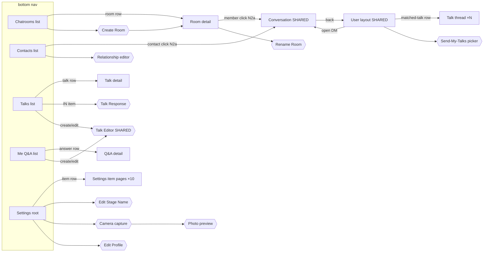

# IinPublic — Technical Specification
## Software Requirements, Architecture, Security, Data, Network, Mobile & API Interfaces

> **Version:** 4.7 — Part VII adds the authoritative open-source discovery, connection-management, Gun-authoritative synchronization, chatbot, and platform-adapter architecture (§29)
> **Date:** 2026-08-10
> **Status:** Authoritative — single source of truth for all requirements and design decisions

---

## Table of Contents

**Part I — Requirements**
1. [Introduction](#1-introduction)
2. [Overall Description](#2-overall-description)
3. [Functional Requirements](#3-functional-requirements)
4. [External Interface Requirements](#4-external-interface-requirements)
5. [Non-Functional Requirements](#5-non-functional-requirements)

**Part II — Technical Design**
6. [Architecture Overview](#6-architecture-overview)
7. [Security & Privacy](#7-security--privacy)
8. [Data Integrity & Conflict Resolution](#8-data-integrity--conflict-resolution)
9. [Network & Scalability](#9-network--scalability)
10. [Mobile-Specific Cases](#10-mobile-specific-cases)
11. [API & Interface Standardization](#11-api--interface-standardization)
12. [Gun.js Data Model Specifications](#12-gunjs-data-model-specifications)
13. [UI/UX Component Specifications](#13-uiux-component-specifications)

**Part III — Implementation & Testing**
14. [Implementation Roadmap](#14-implementation-roadmap)
15. [Testing Strategy & Quality Assurance](#15-testing-strategy--quality-assurance)
16. [Open Issues and Future Enhancements](#16-open-issues-and-future-enhancements)
17. [Key Technical Decisions](#17-key-technical-decisions)
18. [Appendix: Cross-Reference Matrix](#18-appendix-cross-reference-matrix)


**Part IV — Architecture Deep Dives**

19. [P2P Architecture: Data Storage and Network Design](#19-p2p-architecture-data-storage-and-network-design)
    - [19.13 P2P Identity, Trust, Versioning, and Upgrades](#1913-p2p-identity-trust-versioning-and-upgrades)
    - [19.14 Data Ownership and Visibility Zones](#1914-data-ownership-and-visibility-zones)
      - [19.14.9 SEA and Zone B](#19149-sea-and-zone-b-confidentiality-guarantees-and-limits)
      - [19.14.10 Zone C Redundancy](#191410-zone-c-redundancy-when-one-talk-fanouts-to-many-receivers)
20. [Interaction Ledger: DAG-Based History and Delta Sync](#20-interaction-ledger-dag-based-history-and-delta-sync)
21. [Survey: Blockchain and DAG Structures in P2P Messaging Networks](#21-survey-blockchain-and-dag-structures-in-p2p-messaging-networks)
22. [Scalable "Find Similar People" by Matched Tags](#22-scalable-find-similar-people-by-matched-tags)
23. [Mesh Talk Delivery Design (PeerMeshService)](#23-mesh-talk-delivery-design-peermeshservice)
24. [Phase D — DHT Bootstrap Design](#24-phase-d--dht-bootstrap-design)
25. [libp2p Transport Migration & IPFS Content Layer](#25-libp2p-transport-migration--ipfs-content-layer)

**Part VI — Consolidated Design Documents (merged 2026-07-29)**

26. [GUI Navigation Shell Redesign & Layout Catalog](#26-gui-navigation-shell-redesign--layout-catalog)
27. [Cross-Platform Native Clients — Embedded Node Shell (S3)](#27-cross-platform-native-clients--embedded-node-shell-s3)
28. [Gun Database Architecture, Scalability & Retention](#28-gun-database-architecture-scalability--retention)

**Part VII — Discovery, Connectivity & Gun Synchronization (merged 2026-08-10)**

29. [Open-Source Discovery, Connectivity, Chatbot & Gun Synchronization](#29-open-source-discovery-connectivity-chatbot--gun-synchronization)

**Part VIII — Matching Engine Extensions (design note, 2026-08-10)**

30. [Opposite-Attribute Matching: Typed Comparisons, Preference-Sets, and the Dating Use Case](#30-opposite-attribute-matching-typed-comparisons-preference-sets-and-the-dating-use-case)

---

> **Consolidation note (2026-07-29):** Sections 26–28 were merged in from `docs/gui-redesign-plan.md`,
> `docs/gui-layout-catalog-and-e2e-plan.md`, `docs/design/S3-embedded-node-shell.md`, and
> `docs/Gun-Database-Architecture.md`. Section 19.7 was expanded with the current TechSupport K1–K6
> contract (from `docs/design/techsupport-bootstrap-contract.md`). Source documents — plus other
> design notes whose conclusions were already fully captured here or in `docs/completed.md` — were
> moved to `docs/archive/consolidated-2026-07-29/`. See that folder's README for the full mapping.

> **Consolidation note (2026-06-08):** Sections 22–24 were merged in from previously separate feature-design documents (`similar-people-scalable-srs.md`, `p2p-mesh-talk-delivery-plan.md`, `roadmap/phase-d-dht-bootstrap.md`) so that all feature/design detail lives in this single specification. Their action items remain in `docs/TODO.md`; their test-impact notes are in `docs/testing/testplan.md`; the source documents were moved to `docs/archive/`.

# PART I — REQUIREMENTS

---

## 1. Introduction

### 1.1 Purpose

This document is the authoritative specification for the **IinPublic** application, combining:

- The original **Software Requirements Specification (SRS)** — functional and non-functional requirements, user stories, and acceptance test scenarios.
- The **Technical Design Specification** — architecture, data models, security model, API interfaces, and implementation roadmap.

It is intended for:
- Product owners and stakeholders (concept, scope, and requirements)
- Architects and developers (detailed requirements and design)
- Testers (deriving test plans and test cases)
- UX designers (UX constraints and expectations)

### 1.2 Scope

**IinPublic** is a web-first, later mobile, decentralized application where:

- Users are auto-assigned a unique ID and placed into location-based chatrooms.
- Users create and send **talks** (structured question chains) to many nearby users at once.
- Chatbots automatically answer previously answered questions using public (auto) answers.
- Users filter, match, and connect one-on-one based on answers, location, tags, and reputation.

The system supports:
- Bulk matching (e.g., find a tennis partner, date, buyer/seller, hobby buddy).
- Surveys (aggregate statistics from simple talks).
- Reputation and abuse-prevention via decentralized signals (blocks, feedback).
- Business chatrooms tied to physical locations.

### 1.3 Definitions, Acronyms, and Abbreviations

| Term | Definition |
|---|---|
| **Talk** | The umbrella term for any of the four types: Tag, Flow, Survey, or Route. |
| **Auto Answer** | A public answer marked as re-usable by the user's chatbot. Stored with `visibility: 'auto'`. |
| **Manual Answer** | A private answer not re-used by the chatbot. Stored with `visibility: 'manual'`, SEA-encrypted. |
| **Temporary Answer** | A reusable chatbot memory entry selected normally by the user. It may be auto-used only when the same exact question appears and the current option set contains that exact saved answer. |
| **Permanent Answer** | A fixed/custom chatbot memory entry chosen by the user. It takes priority over temporary history; if the current option set contains it, the chatbot answers automatically, otherwise the chatbot skips the question. |
| **Suppressed Question** | A question the user ignored or skipped. In chatbot memory this is stored as `SUPPRESSED`, meaning the exact question is skipped forever unless the user later changes the saved state. |
| **Chatroom** | A public, location-based or user-defined "place" where users can find each other; all conversations remain one-on-one. |
| **Business Chatroom** | A user-defined chatroom bound to a specific brand and address (e.g., a bar). |
| **Traveller** | A user present in a chatroom outside their blurred true-location region. |
| **Tag** | The simplest talk unit: a single keyword or short phrase with a checkbox (checked = interested / match, unchecked = not interested / ignore). No question-mark required. No answers beyond the checked/unchecked state. |
| **Flow** | The Linear Thread. A path-graph talk: sequential chain of Q/A where every question uses all prior Q/A as context. Chatbot auto-replies only when the full preceding context matches a stored answer. |
| **Survey** | One or more independent Q/A pairs where every question stands alone — no prior Q/A is used as context. Each question's answer is stored and retrieved without context. Suitable for collecting aggregate statistics. |
| **Route** | The Logical Map. A DAG/general-tree talk combining flow and survey logic. Each question carries a `contextPath` (for construction only); answers are stored with a `contextHash` (FNV-1a hex). The chatbot auto-replies only when the stored hash matches the hash of the current conversation path. |
| **ContextPath** | An ordered list of `{ questionId, answerId }` steps representing the path through a route that preceded a given question. Used during route construction and validation; not stored in answer records. |
| **ContextHash** | An 8-character lowercase hex string (FNV-1a 32-bit hash of the canonical context-path string). Stored in every answer record in place of the full ContextPath. The chatbot computes the hash of the current path and compares it with the stored hash — O(1) lookup. Root/no-context questions use `''` (empty string). |
| **Survey** | The Distributed Collection. A star-graph talk: independent Q/A pairs with no shared context. Ideal for collecting aggregate statistics. |
| **Reputation** | Aggregated feedback metrics (star ratings, blocks, confirmations). Read-only to the user. |
| **StageName** | A user-chosen display name. Not unique; multiple users may share one. |
| **SEA** | Gun.js Security, Encryption, and Authorization module — used for all cryptographic operations. |
| **HAM** | Hypothetical Amnesia Machine — Gun.js's built-in CRDT for conflict resolution. |
| **CRDT** | Conflict-Free Replicated Data Type — data structure that resolves concurrent writes without a central authority. |
| **T4T** | Tit-for-Tat — fairness algorithm where a mobile device relays for others proportional to what it consumes. |
| **DAG** | Directed Acyclic Graph — the talk structure must be a DAG (no loops). |
| **FR** | Functional Requirement. |
| **NFR** | Non-Functional Requirement. |

### 1.4 References

- Gun.js documentation — real-time decentralized database: https://gun.eco/docs/
- Gun SEA documentation — cryptography: https://gun.eco/docs/SEA
- Node.js documentation: https://nodejs.org/docs/
- IEEE-830 / ISO-IEC-29148 SRS templates.

### 1.5 Document Overview

- **Part I** (Sections 1–5): What the system must do — requirements, user classes, interfaces, NFRs.
- **Part II** (Sections 6–13): How the system is designed — architecture, security model, data model, APIs.
- **Part III** (Sections 14–18): How it will be built, tested, and evolved.

---

## 2. Overall Description

### 2.1 Product Perspective

IinPublic is:

- A **decentralized**, Gun.js-backed application. No central server stores user data.
- Web-first (browser + embedded Node.js peer), followed by Android, with iOS TBD.
- A real-time system using hierarchical, location-based chatrooms to manage scale.

The product is not a traditional group chat: chatrooms are for **discovery and routing only**; all conversations remain one-on-one with optional chatbot participation.

**Long-term architecture goal:** The website (`www.iinpublic.com`) is only a discovery and bootstrap entry point. User-to-user communication occurs directly whenever possible; no central server is required for message storage. User identity is cryptographically verifiable from the public key alone. Communities and talks are designed to survive even if the original website disappears — the network should be resilient through overlapping peer neighborhoods, content-addressed identifiers, and optional distributed peer discovery (Phase D, §19.12).

### 2.2 Product Functions (High-Level)

- Automatic user identity assignment and location-based chatroom placement.
- Hierarchical chatrooms with automatic splitting when rooms exceed capacity.
- User profiles as Q/A attribute lists with StageName and a reputation section.
- Simple predefined Q/A talk system (DAG, no loops, logic-OR allowed).
- Bulk sending of talks to up to N users (default 1000) in a given scope.
- Built-in filters: language, grammar, dirty words.
- Tag system (Craigslist-style catalogs) for fast interest and item filtering.
- Bulk matching logic for dating, sports, buying/selling, hobby matching, etc.
- Surveys for collecting and aggregating statistics.
- Decentralized moderation: blocking, age-gating, reputation, block count.
- Headshot avatars with chatbot overlays to distinguish bot vs. human replies.
- Green/Red conversation modes to control chatbot automation level (Auto / Manual).
- Three-tier message security: public, one-way encrypted (known), mutual ECDH-encrypted (mutual).

### 2.3 User Classes and Characteristics

| User Class | Description |
|---|---|
| **Regular User** | Wants to find matches (friends, dates, partners, buyers/sellers). Often non-technical; needs simple Yes/No flows. |
| **Power User / Talk Designer** | Designs complex talks and surveys. Reuses templates; uses tags for precise targeting. |
| **Business Owner** | Creates business chatrooms tied to physical locations. Runs surveys and targeted talks to customers. |
| **Underage User** | Restricted from adult content talks. Never sees adult-tagged content. |
| **Abusive / Blocked User** | Experiences reduced send capacity and stricter limits driven by reputation signals. |

### 2.4 Operating Environment

- **Web**: Modern browsers, TypeScript/JavaScript, in-browser Gun.js peer via embedded Node.js.
- **Android**: Native Kotlin app with embedded Node-like runtime and GPS access. API 24 (Android 7.0) minimum; API 34 target.
- **iOS**: To be determined — Node.js feasibility on iOS is uncertain; alternative implementation may be needed.
- **Backend/Data**: Gun.js for real-time decentralized data synchronization. `server.js` acts only as a Gun relay peer and static asset server.

### 2.5 Design and Implementation Constraints

- Decentralized architecture; no centralized moderation or data storage.
- Gun.js constraints: eventual consistency, peer connectivity required for sync, client-side storage limits.
- Mobile GPS provides true location, but location must be blurred before any public sharing.
- No user registration or server-side authentication — identity is solely the Gun SEA key pair.
- Node.js feasibility on iOS is uncertain and requires separate investigation.
- **Out of scope (current phase):** Full IPFS as a general data store, blockchain, cryptocurrency, token systems, distributed consensus, mining, and global immutable ledgers are explicitly excluded. Gun.js is the data layer; IPFS is used only for binary media blobs referenced by CID field values in Gun nodes (§21.4).

### 2.6 Assumptions and Dependencies

- Users have network connectivity at least periodically; offline operation queues and syncs later.
- GPS or equivalent location data is available on mobile devices.
- Legal frameworks cover misuse of brands/logos and business identity; reputation covers the rest.
- Community-driven mechanisms (feedback, blocks) will be sufficient for abuse mitigation.
- Gun.js relay peers are available and stable enough for real-time sync.

---

## 3. Functional Requirements

### 3.1 User Management & Profiles

- **FR-UM-1**: The system SHALL assign a unique user ID at first use, with no login required. The ID is a Gun SEA public key pair generated on-device.
- **FR-UM-2**: The system SHALL allow each user to define or change a **StageName** at any time. StageName is not unique.
- **FR-UM-3 (Profile scope, revised 2026-08-11)**: The **profile** SHALL hold only non-string/media identity attributes — currently **StageName** (FR-UM-2) and **headshot** (FR-UM-4). Every other user-declared attribute, including typed/categorical criteria used for matching (e.g. seeking-preferences, age range, price range — §30), SHALL be represented as an ordinary `AnswerRecord` in the Q&A system (§3.4) and surfaced through the "Me" tab (§13.7), never added as a bespoke profile field or a new Talk-level struct field. This keeps a single place — the Q&A answer store — as the home for everything a user has "said" about themselves, with profile reserved for the small set of attributes that are not answers to any question.
- **FR-UM-4**: The system SHALL allow users to choose a **headshot icon** as avatar.
- **FR-UM-5**: When an answer is auto-generated by the chatbot, the UI SHALL overlay a small chatbot icon on the user's headshot in the conversation view.
- **FR-UM-6**: The system SHALL maintain a **Reputation Section** that is read-only to the user, including at least:
  - Questions answered count
  - Talks sent count
  - Matches found count
  - Number of friends
  - Mutual friends count
  - Star-rating style reviews
  - Age verification feedback (true/false votes)
  - Block count
- **FR-UM-7**: Users SHALL be able to hide all or parts of their reputation from others but SHALL NOT be able to edit the underlying metrics.
- **FR-UM-8**: The system SHALL allow users to maintain lists of active users across multiple locations/chatrooms.
- **FR-UM-9 (Identity header)**: The "Me" tab SHALL pin the profile (StageName + headshot) as a fixed, non-scrolling header row above the Q&A answer list (§13.7), so identity remains visible while the answer list below it is sectioned/scrolled.

### 3.2 Built-in Filters

- **FR-BF-1**: Each talk SHALL be tagged with a single primary language.
- **FR-BF-2**: The system SHALL store a list of languages each user understands.
- **FR-BF-3**: The **language filter** SHALL drop (ignore) incoming talks whose language is not in the user's understood languages, unless the filter is disabled.
- **FR-BF-4**: The **grammar filter** SHALL identify and optionally drop talks with significant grammar errors.
- **FR-BF-5**: The **dirty words filter** SHALL drop talks containing configured offensive terms.
- **FR-BF-6**: Users SHALL be able to enable/disable each filter individually and adjust sensitivity where applicable.

### 3.3 Chatroom Management

- **FR-CR-1**: The system SHALL maintain a **global chatroom** accessible to all users at app start.
- **FR-CR-2**: The system SHALL automatically place new users into the global chatroom first.
- **FR-CR-3**: When a chatroom exceeds a capacity threshold (default 1000 users), the system SHALL:
  - Split the room into finer location-based subrooms (continent → country → state → city → district → GPS grid).
  - Move users into appropriate subrooms based on GPS coordinates.
- **FR-CR-4**: The system SHALL automatically create pure location-based chatrooms; users SHALL NOT be able to delete these automatic rooms.
- **FR-CR-5**: Users SHALL be able to create **user-defined chatrooms** (including business chatrooms) and name, rename, or delete them.
- **FR-CR-6**: Each **business chatroom** SHALL include: brand name, address, owner ID, GPS coordinates, and a description.
- **FR-CR-7**: When a chatroom is full and a new user enters, the system SHALL identify the longest-staying user, notify that user, and remove that user to maintain capacity (FIFO eviction).
- **FR-CR-8**: The system SHALL store **true location** from GPS and use a blurred region for all public operations.
- **FR-CR-9**: A user MAY belong to multiple chatrooms that include their true location.
- **FR-CR-10**: A user MAY actively "travel" to exactly one remote chatroom at a time and SHALL be marked as **traveller** there.
- **FR-CR-11 (Content-Addressed Community Identity)**: Each chatroom/community SHALL have a stable, globally unique identifier derived from its root object: `CommunityID = CIDv1(CommunityRootObject)` for user-defined rooms, or `CommunityID = CIDv1(Hash(OwnerPublicKey + label))` for owner-keyed rooms. A community address alone SHALL be sufficient to join, discover peers, and synchronize content — no centralized registry lookup is required. This aligns with the CIDv1 content-addressing scheme used for talks and ledger events (§3.12, §20).
- **FR-CR-12 (Community Ownership and Roles)**: Each user-defined chatroom SHALL support a four-level ownership model: **Owner** (full control, can transfer ownership), **Moderator** (content and membership control), **Member** (standard participant), **Guest** (limited interaction, no posting by default). Permissions at each level SHALL be configurable by the Owner.

### 3.4 Question-Answer System

- **FR-QA-1**: All questions SHALL be simple text. A question is defined as a sentence or phrase that ends with `?`.
- **FR-QA-2**: All answers SHALL be drawn from predefined options (binary, multiple choice, ranges, tags). An answer is defined as a sentence or phrase ending with `.` that follows a question.
- **FR-QA-3**: Every question SHALL support **Ignore** as a mandatory answer option.
- **FR-QA-4**: The system SHALL support two answer visibility attributes:
  - **Auto**: public, re-usable by the chatbot (`visibility: 'auto'`).
  - **Manual**: private, not re-used (`visibility: 'manual'`, SEA-encrypted).
- **FR-QA-5**: When a question is re-asked and the user has an auto answer, the chatbot SHALL answer automatically and mark the reply as chatbot-generated.
- **FR-QA-6**: For manual answers, the chatbot MAY remind the user of their prior manual answer but SHALL NOT answer automatically.
- **FR-QA-7 (Exact Chatbot Memory)**: Chatbot reuse SHALL be pure deterministic logic: no AI, fuzzy matching, semantic matching, synonym matching, or raw-text search. The lookup key SHALL be a deterministic question ID made from normalized exact question text.
- **FR-QA-8 (Answer Memory Modes)**: For each exact question, chatbot memory SHALL support only `TEMPORARY`, `PERMANENT`, and `SUPPRESSED` modes.
- **FR-QA-9 (Temporary Answer Reuse)**: A normally selected option SHALL be saved as `TEMPORARY`. On future presentations of the same exact question, the chatbot SHALL scan temporary history newest-to-oldest and auto-answer with the first saved answer whose exact answer ID exists in the current option set. If no temporary history answer exists in the current option set, the system SHALL ask the user again.
- **FR-QA-10 (Permanent Answer Priority)**: A custom answer, or an option explicitly marked permanent/custom, SHALL be saved as `PERMANENT`. Permanent answers SHALL take priority over all temporary history. If the current option set contains the permanent answer, the chatbot SHALL auto-answer. If it does not, the chatbot SHALL skip the question and SHALL NOT search temporary history.
- **FR-QA-11 (Suppressed Question Semantics)**: Ignoring or skipping a question SHALL save the exact question as `SUPPRESSED`. A suppressed question SHALL be skipped on all future appearances of that exact question until the user explicitly changes or clears the saved memory.
- **FR-QA-12 (Auto-Use Metrics)**: Every chatbot auto-use of a saved answer SHALL record how many times that saved answer was used automatically and the latest auto-use timestamp. In distributed GUN storage, append-only use events SHALL be the source of truth; cached counters may be maintained for display.


#### Chatbot Differential Answering (REQ-CHATBOT-*)

- **REQ-CHATBOT-01 — Per-question answer cache:** The chatbot's answer cache is keyed by `questionId`, not by `talkId`. The cache path is `talkAnswerTemplateByUser/<userId>/byQuestion/<questionId>`. An answer written when the user answers any talk propagates to all future talks sharing the same `questionId`, regardless of sender or timing.

- **REQ-CHATBOT-02 — Differential answering:** When a new talk arrives, the chatbot classifies each question as auto-filled (cached answer found) or needs-input (no cached answer). Only needs-input questions are presented as active inputs; auto-filled answers appear alongside in a grayed, overridable state. If all questions are auto-filled, a review screen is shown before submission — silent auto-submit is not permitted.

- **REQ-CHATBOT-03 — TALK_SUPERSEDED triggers cache seed:** When a new talk T2 arrives and the sender's ledger contains `TALK_SUPERSEDED { oldTalkId: T1, newTalkId: T2 }`, the chatbot pre-seeds its cache for T2 using the user's answers to T1 before running the differential algorithm. The client prompts: *"[Sender] updated this talk. Your previous answers are pre-filled — please review and answer any new questions."*

- **REQ-CHATBOT-04 — No silent re-submission after TALK_SUPERSEDED:** If the chatbot had previously auto-submitted to T1 without manual review, a review step is always forced for T2 — a change in the talk means the situation has materially changed and silent re-submission is not appropriate.

- **REQ-CHATBOT-05 — Cache write-back:** On every talk submission (whether manual, semi-automatic, or chatbot-assisted), the client writes `answerCache[q.id] = answer` for every question in the submitted response, including auto-filled ones left unchanged. This keeps the most recently used answer available for future talks.

- **FR-QA-13 (Deterministic IDs)**: Question and answer IDs SHALL be generated from normalized text using a stable hash such as SHA-256 with prefixes `q_` and `a_`. Normalization SHALL at minimum trim surrounding whitespace. If case-sensitive exact matching is desired, normalization SHALL NOT lowercase text; if case-insensitive exact matching is desired, normalization MAY lowercase text consistently for both questions and answers.

- **FR-QA-14 (Context-aware "Me" answer list)**: The "Me" tab SHALL present the user's saved answers as a question/answer list keyed by `(questionId, contextHash)` — the same key used for storage (FR-TK-11). For **tag** and **survey** answers (`contextHash = ''`) the list is flat: one row per question. For **flow** and **route** answers (`contextHash ≠ ''`) the same question text MAY appear in multiple rows, one per distinct context, and each context-bearing row SHALL display its preceding `Q→A` context so the answer is interpretable; the list SHALL NOT collapse distinct-context answers into a single row. To remain self-describing after the source talk is withdrawn/retracted/pruned, each `AnswerRecord` SHALL persist a display-only `contextLabel` (human-readable `"Q→A · Q→A"`) alongside `contextHash`; `contextHash` remains the authoritative match key. See [§13.7](#137-me-tab--answer-list-rendering-context-aware).

- **FR-QA-15 (Multi-value / "pick any that apply" questions, design 2026-08-11)**: A question SHALL declare an `answerSelectionMode` of `'single'` (default, today's radio-button behavior, unchanged) or `'multiple'`. A `'multiple'` question presents its options as a checklist; the respondent MAY select zero or more, and the stored answer is the **set** of selected answer IDs rather than one ID. Authoring UI SHALL use the widely-recognized "Multiple choice vs. Checkboxes" toggle pattern (as in common survey-builder tools) — the respondent-facing surface is a plain checklist; the terms "AND," "OR," "set," "union," and "intersection" SHALL NOT appear in any user-facing string. See §30.8 for the matching rationale and worked example.

- **FR-QA-16 (Set-intersection match rule)**: Every stored answer, single- or multi-select, SHALL be treated as a set of answer IDs (a `'single'`-mode answer is the degenerate case, a set of size one). The match predicate for a question SHALL be **set intersection is non-empty** between the two sides' stored answer-ID sets. This is a strict generalization of today's exact-ID equality (singleton ∩ singleton non-empty ⟺ equal), so it introduces no behavior change for any existing `'single'`-mode question. This predicate SHALL remain pure ID-set comparison — no fuzzy, semantic, or AI matching — preserving FR-QA-7's determinism invariant.

**Inline Syntax (chat auto-capture):**

| Marker | Meaning |
|---|---|
| Sentence ending `?` | Question |
| `**` before option | User's own default answer |
| `*` before option | Alternative option for recipient |
| `;` | Separator between options |

Examples:
```
What's your name?                          // Question, no suggested options
My name is Bernard.                        // Standalone answer
What's your name? ** My name is Bernard.   // Question + user's own inline answer
Are you a doctor? ** yes; * no.            // Question + 2 options; "yes" is user's own
Do you like to play tennis? ** yes; * no.  // Question with answer chips
```

### 3.5 Tag System

- **FR-TG-1**: Users SHALL be able to create tags freely.
- **FR-TG-2**: Tags SHALL be categorized in Craigslist-style catalogs (For Sale, Housing, Services, Community, Personals, etc.).
- **FR-TG-3**: Tags SHALL be attachable to talks, individual questions, and user profiles (interests).
- **FR-TG-4**: The system SHALL compute regional popularity of tags and use popularity for tag suggestion order.
- **FR-TG-5**: Tags SHALL be usable as part of pre-filtering for target selection in bulk sends.
- **FR-TG-6 (Mandatory Preamble)**: Every talk — auto-captured or editor-built — SHALL begin with a tag/location pre-filter step. The system SHALL prepend the talk with the user's chosen tags and location filters before any questions are presented. Auto-captured talks must automatically attach the preamble before bulk sending is allowed.

### 3.6 Talk Structure and Execution

#### 3.6.1 The Four Talk Types

The system defines exactly four talk types, arranged from simplest to most complex:

| Type | Graph Structure | Context Logic | Chatbot auto-reply condition |
|------|----------------|---------------|------------------------------|
| **tag** | Isolated node | None | Always (no context needed) |
| **flow** | Path graph (unary tree) | Full sequential (all prior Q/A) | Full preceding context matches stored answer |
| **survey** | Star graph (height 1) | None (each question is standalone) | Always (no context needed per question) |
| **route** | DAG / general tree | Path-dependent (`contextHash`) | Stored `contextHash` (FNV-1a 8-char hex) matches hash of current conversation path |

**Tag** — *The Atom of Interest.* Isolated node (Boolean toggle). A single keyword or short phrase; no question mark. Checked = match/interested, unchecked = ignore. No context required.

**Flow** — *The Linear Thread.* Path graph (degenerate/unary tree — every internal node has exactly one child). Questions are presented in strict sequence; each answer depends on all prior Q/A. Only one stored record per question (context is implied by sequential position). The chatbot auto-replies only when it has answered all preceding questions in the same session.

**Survey** — *The Distributed Collection.* Star graph (all nodes connect directly to a single root at height 1). Every question is independent — no prior Q/A is used as context. The same question always receives the same stored answer regardless of surrounding questions. Ideal for aggregate statistics and flat profile data.

**Route** — *The Logical Map.* Directed Acyclic Graph (general tree). Combines flow branches (context-dependent) and survey branches (context-independent) in one structure. Each question carries a `contextPath` (used for construction/validation only — not stored in answer records). Every stored answer record carries a single `contextHash`: the 8-char FNV-1a 32-bit hex hash of the canonical path string. The same surface question (e.g., "What is your skill level?") produces **separate records** for each distinct branch because each branch hashes differently. The chatbot auto-replies by hashing the current path and doing an O(1) equality check — no list traversal required.

**Example (route):**
```
Q1a: "Do you like tennis?"  → Yes
Q1b: "Do you like badminton?" → Yes   (independent root questions, no shared context)
Q2:  "What is your skill level?"
     - reached via Q1a=Yes → stored answer: "Beginner"  (contextPath: [{q1a, yes}])
     - reached via Q1b=Yes → stored answer: "Professional" (contextPath: [{q1b, yes}])
```
The flat answer list for Q2 contains two distinct entries, keyed by their different context paths. Without the correct preceding context the chatbot does **not** reply automatically.

**Context-aware answers in summary:** The same question text may warrant different answers depending on the conversational context that preceded it. This is the core motivation for the `route` type and `contextHash` — multiple contexts per question are supported, context is inherited from the preceding Q/A path, and context matching happens before chatbot answer selection. `tag` and `survey` questions have no context (`contextHash = ''`); `flow` questions derive context implicitly from sequential position; `route` questions derive context from the hash of the explicit branch path.

#### 3.6.2 Talk Requirements

- **FR-TK-1**: A talk SHALL be defined as a directed acyclic graph (DAG); no loops are permitted.
- **FR-TK-2**: The system SHALL prevent users from creating cycles in talk graphs.
- **FR-TK-3**: A talk SHALL support route (DAG) and flow (linear) structures.
- **FR-TK-4**: Logic-OR SHALL be supported: multiple answers may point to the same next question.
- **FR-TK-5**: The final question in a talk SHALL support two terminal answers:
  - **"Ignore"** → terminate the conversation, filter out the user.
  - **"Let's talk in person"** → mark as a potential match and open a direct chat.
- **FR-TK-6**: Talks SHALL be markable as **survey** type, with designated questions to aggregate.
- **FR-TK-7 (Auto Linear Capture)**: During one-on-one chat, if User A writes `Question? Answer1; Answer2; …; AnswerN.`, the system SHALL:
  - Present the predefined answers as selectable chips to User B.
  - On selection, record the chosen answer, discard the others, and advance to the next such line.
  - Stop the flow when a final sentence ending with `.` is reached with no further answer list.
  - Automatically record the resulting Q&A sequence as a **linear talk** draft for User A to reuse and broadcast later.
- **FR-TK-8 (Editing Constraints)**: Route and survey talks MAY only be created or edited in the Talk Editor UI. Auto-captured chats produce flow talks only.
- **FR-TK-9 (Tag)**: A tag talk SHALL contain exactly one question (a word or short phrase) and exactly two answers: one `isMatch=true` (checked) and one `isIgnore=true` (unchecked). No other answers are permitted.
- **FR-TK-10 (Survey Independence)**: In a survey, every question SHALL be treated as independent — no `contextPath` is assigned, and the chatbot MAY auto-reply to any question regardless of the answers to sibling questions.
- **FR-TK-11 (Route Context Storage)**: In a route talk, when saving a user's answer to a flat answer list, the system SHALL store a `contextHash` — the FNV-1a 32-bit hash of the canonical context-path string — alongside each answer. The full ContextPath list SHALL NOT be stored in the answer record; only the hash is persisted. Two answers to the same question reached via different branches produce different hashes and are stored as separate records.
- **FR-TK-12 (Route Context Reply Guard)**: When the chatbot considers auto-replying to a route question, it SHALL compute the hash of the current conversation's active context path and look for a stored answer whose `(questionId, contextHash)` pair matches. If no match exists the chatbot SHALL NOT reply automatically. The question SHALL be presented to the user for a manual answer.
- **FR-TK-13 (Context Hash Algorithm)**: The contextHash SHALL be computed using FNV-1a 32-bit over the UTF-8 encoding of the canonical context string `"qId1:aId1|qId2:aId2|..."`. Root/no-context questions (tag, survey, and flow types) SHALL use `''` (empty string) as their contextHash. The algorithm SHALL be implemented in pure JavaScript with no external dependencies so it runs identically in Node.js and browser environments.

### 3.7 Bulk Matching and Sending

- **FR-BM-1**: The system SHALL allow sending a talk to multiple users at once within a selected scope.
- **FR-BM-2**: There SHALL be a default maximum target count (e.g., 1000 recipients), configurable per user up to a global cap.
- **FR-BM-3**: Bulk send capacity SHALL be adjusted based on reputation (e.g., blocks reduce capacity).
- **FR-BM-4**: For each recipient, the system SHALL create a separate conversation instance with its own state (versioned answer bucket).
- **FR-BM-5**: The system SHALL support sending from:
  - Current automatic location-based chatroom
  - Business chatroom
  - Other user-defined chatrooms
  - Filtered subsets (tags, distance radius)
- **FR-BM-6**: When a talk is auto-captured from chat, its stored draft SHALL include the mandatory tags/location preamble (FR-TG-6) before bulk sending is allowed.
- **FR-BM-7 (Same chatroom bulk send)**: When bulk sending from a **chatrooms** context, receivers SHALL be limited to users present in **that chatroom node only**. The system SHALL NOT implicitly deliver bulk sends to descendant rooms in the location hierarchy (e.g. broadcasting from **North America** MUST NOT reach members joined only under **United States**). Reach to other hierarchy nodes requires the sender to join that node explicitly.

### 3.8 Spam Prevention & Moderation

- **FR-SP-1**: The system SHALL support configurable send/receive rate limits per user (e.g., once per day/week).
- **FR-SP-2**: The same limiting period SHALL apply symmetrically to sending and receiving (fair-game rule).
- **FR-SP-3**: Users SHALL be able to configure an acceptable location range for incoming talks.
- **FR-SP-4**: Users SHALL be able to maintain a blacklist of blocked users.
- **FR-SP-5**: Blocked users SHALL NOT be able to send talks to or view the profile of the blocker.
- **FR-SP-6**: The system SHALL track how many users block a given user and adjust that user's send capacity downward as block count increases.
- **FR-SP-7**: Age-restricted talks SHALL require an age verification question as the first question.
- **FR-SP-8**: Underage users SHALL never see adult content talks.

### 3.9 Survey Talks

- **FR-SV-1**: The Talk Editor SHALL allow marking a talk as **survey** type.
- **FR-SV-2**: Survey talks SHALL support multiple simple questions with predefined answers and an aggregation configuration specifying which questions/statistics to compute.
- **FR-SV-3**: The system SHALL aggregate survey results into frequency distributions per answer and basic stats (counts, percentages).
- **FR-SV-4**: Individual survey responses MAY remain anonymous to the survey owner; only aggregated statistics are required by default.
- **FR-SV-5**: If the final question uses "Let's talk in person", individual follow-up conversations SHALL be created for those respondents.
- **FR-SV-6**: Surveys are editor-only; auto-capture cannot produce survey talks.

### 3.10 Build, Test, and Deploy

- **FR-BTD-1 (Build Web)**: Provide scripts to install dependencies, build/compile the web app (browser + embedded Node.js peer), and produce distributable assets.
- **FR-BTD-2 (Build Android)**: Provide scripts/CI steps to install the Android toolchain, build/compile the Android app (with embedded Node-like runtime), and generate a signed APK/AAB.
- **FR-BTD-3 (Debug)**: Provide documented debug profiles for web (dev server, source maps) and Android (USB/network debugging, logcat).
- **FR-BTD-4 (Test)**: Provide automated test suites (unit, integration, end-to-end) covering: talk creation, auto-linear capture, bulk send, filters/tags preamble, age-gate/adult flows, survey aggregation, platform sanity (web, Android), and offline/resync behaviour.
- **FR-BTD-5 (Deploy Web)**: Provide deployment steps to publish the built web assets (static hosting + signaling/bootstrap service if needed).
- **FR-BTD-6 (Deploy Android)**: Provide steps to sign and upload APK/AAB to Play Store (or internal track), including versioning and release notes.
- **FR-BTD-7 (CI/CD)**: Set up CI to run build, lint, and tests on every PR; set up CD to push web deploys and Android internal releases after passing all checks.


### 3.11 Interaction Ledger

> Detailed design: [§20 Interaction Ledger Deep-Dive](#20-interaction-ledger-dag-based-history-and-delta-sync)

- **REQ-LEDGER-01:** Each user maintains a personal **interaction ledger** — an append-only, hash-linked sequence of signed interaction events stored in Gun at `ledger/<userId>/events/<seq>`.

- **REQ-LEDGER-02:** Each event contains: a CIDv1 `id` (dag-json, sha2-256 via `multiformats`), a monotonically increasing `seq`, a `prev` pointer to the preceding event's `id`, an event `kind` (TALK_CREATED | TALK_BROADCAST | TALK_RECEIVED | TALK_ANSWERED | TALK_SUPERSEDED | TALK_WITHDRAWN | MATCH_CREATED | CONVERSATION_MSG), the author's `pubkey`, a `timestamp`, a JSON `content` payload, and a SEA `sig` over all fields. Receiving peers verify the CIDv1 `id`, the `prev` chain integrity, and the `sig`.

- **REQ-LEDGER-03 — Talk versioning:** Modifying any field of a talk produces a new CIDv1 → new `talkId`. A new `TALK_CREATED` event is appended. The original talk and its ledger entry remain immutable.

- **REQ-LEDGER-04 — Response versioning:** Modifying an answer produces a new `responseId = CIDv1(canonicalSerialize({ talkId, responderId, responseContentJson }))` and a new `TALK_ANSWERED` event. The new response supersedes the old one for match logic; the old remains in ledger history.

- **REQ-LEDGER-05 — Deduplication:** A peer receiving a talk or response whose `talkId`/`responseId` is already in its local ledger discards the duplicate without writing a new event.

- **REQ-LEDGER-06 — Delta sync:** On WebRTC connection, peers exchange a `LEDGER_STATE` message (highest `seq` per feed). Each peer sends only events with `seq` greater than what the other declared. Volume is O(Δ), not O(total history).

- **REQ-LEDGER-07 — Immutability:** `ledger/<userId>/events/<seq>` is written once and never overwritten.

- **REQ-LEDGER-08 — Conversation sub-DAG:** Each message in a conversation references both the sender's previous message (`seq`) and the last message seen from the other party (`prevSeen`), enabling causal ordering without a central sequencer.

- **REQ-LEDGER-09 — Ledger indexes:** `ledger/<userId>/index/talkId/<id>` → seq of TALK_CREATED; `ledger/<userId>/index/responseId/<id>` → seq of TALK_ANSWERED; `ledger/<userId>/index/withdrawn/<talkId>` → seq of TALK_WITHDRAWN.

- **REQ-LEDGER-10 — Migration compatibility:** During Phases E–G, new interactions write to both legacy Gun paths and ledger paths. Back-filling of pre-ledger history is not required. See [§19.12 Network Migration Phases](#1912-network-migration-phases-ad-hub-evolution).

- **REQ-LEDGER-11 — TALK_SUPERSEDED:** Advisory event emitted when a talk is edited and a new version broadcast. Carries `{ oldTalkId, newTalkId }`. Does not invalidate prior answers or matches. Triggers chatbot differential answering (REQ-CHATBOT-03).

- **REQ-LEDGER-12 — CIDv1 for all content addresses:** All content-addressed identifiers (`talkId`, `responseId`, `messageId`, event `id`) use CIDv1 (dag-json, sha2-256) via `multiformats`. No IPFS daemon required. Text-only talks are never added to IPFS; CIDv1 is a locally-computed identifier only.

- **REQ-LEDGER-13 — TALK_WITHDRAWN (soft, advisory):** Author emits `TALK_WITHDRAWN { talkId }` to stop new delivery. Peers cease routing the talk to recipients who have not yet seen it. In-flight answers still evaluated; existing matches preserved. Used in the edit chain where matches carried over to the new version. After the configurable grace window (default 24h, see NFR-LEDGER-01), the author's client may demote new match notifications to archival. Standard post-edit workflow: TALK_CREATED(T2) → TALK_SUPERSEDED(T1→T2) → TALK_WITHDRAWN(T1).

- **REQ-LEDGER-14 — Question-level identity:** `questionId = CIDv1(canonicalSerialize({ text, type, options }))`. If text and options are unchanged between T1 and T2, the `questionId` is the same even if routing or match-flag logic changed, enabling the per-question chatbot cache to carry answers forward.

- **REQ-LEDGER-15 — TALK_RETRACTED (hard withdrawal with match teardown):** When the author **deletes a talk or unchecks a tag** — i.e. actively retracts it rather than editing it — the author emits `TALK_RETRACTED { talkId, retractedAt }` into the ledger. This is distinct from the advisory `TALK_WITHDRAWN` (REQ-LEDGER-13): it is a **retraction of any engagement on that talk**, and every peer that ingests it MUST:
  1. **Notify the responder.** Each responder/receiver who holds the talk (e.g. Jerry and Bob who answered Tom's `tennis` tag) surfaces a clear notice — *"[Author] removed this talk — the match is gone · `retractedAt`"* — with the retraction timestamp.
  2. **Tear down the match.** Any conversation/match created from `talkId` is moved to `status: 'withdrawn'` (ended, read-only) on **both** sides. A match record, once written, is not erased from history, but it is marked retracted as of `retractedAt`.
  3. **Stop inbound answer changes.** Responders MUST suppress any further change-of-mind propagation (REQ-LEDGER-04 `TALK_ANSWERED`) for that `talkId` back to the author. A retracted talk is a dead inbox — so Jerry and Bob never bother Tom with new `tennis` answers after he unchecked it.
  4. **Stop sender re-asks and outcome tracking.** The author drops the talk from its broadcast set and its local per-responder outcome record (step 8 of the mesh epic); it is neither re-announced nor re-evaluated.

  `retractedAt` is authoritative for last-writer ordering: an inbound `TALK_ANSWERED` with a timestamp **earlier** than `retractedAt` is ignored; the retraction wins. Ledger index: `ledger/<userId>/index/retracted/<talkId>` → seq of the TALK_RETRACTED event.

- **REQ-LEDGER-16 — Mutual exchange suppression (no re-sending an already-exchanged tag back across a pair):** A talk/tag identity is content-addressed (`identityKey` / CIDv1), so the **same** tag — e.g. `tennis` — has the **same** identity no matter who broadcasts it. Once two users have completed an exchange on that identity (one sent it, the other answered, and the answer is recorded), the pair has already swapped stances; re-sending the same identity in either direction is pure redundancy and MUST be suppressed automatically.

  - **Pair-exchange record.** Each user keeps a local, per-peer set of exchanged identities: `exchanged/<peerId>/<identityKey>` → `{ outcome, version, lastExchangedAt }`. It is written whenever the user sends an identity and receives the peer's answer, **or** answers an identity the peer sent. The record is symmetric in effect: after Tom→Jerry(`tennis`)+answer, **both** Tom and Jerry hold `tennis` as exchanged with the other.
  - **Broadcast-time suppression.** When a user broadcasts a talk, recipient selection MUST exclude, **per tag/identity**, any peer for whom that `identityKey` is already in the exchanged set at the same `version`. So when **Jerry** later broadcasts his own talks, `tennis` is **not** delivered to **Tom** — the information was already exchanged and nothing changed. Suppression is at tag granularity: a multi-tag talk still delivers its *other*, not-yet-exchanged tags to Tom.
  - **What re-opens delivery.** Only a genuine change re-sends: (a) a **content change** produces a new `identityKey` (a different tag/option set is a different atom and is delivered), or (b) a **stance change** on the existing identity (REQ-LEDGER-04 change-of-mind) which propagates as a `TALK_ANSWERED` delta to the original senders rather than a fresh broadcast. A `TALK_RETRACTED` (REQ-LEDGER-15) clears the pair-exchange entry for that identity.
  - **Relation to existing dedup.** REQ-LEDGER-05 dedups *identical re-receipt* of one talk; REQ-LEDGER-16 is stronger and **mutual**: it prevents the *reverse-direction rebroadcast* of an already-exchanged interest atom across the pair, and it acts at send time (saves the transmission), not just on receipt.

### 3.13 Challenge Plugin Framework

- **FR-CPF-01 (Pluggable Pre-Action Validation)**: The system SHALL support a pluggable challenge framework that executes one or more validation plugins before high-stakes user actions are accepted. Actions subject to challenge gates include at minimum: joining a community, broadcasting a talk, submitting a talk answer, and casting a vote on community content.

- **FR-CPF-02 (Plugin Interface)**: Each challenge plugin SHALL implement a common interface: `evaluate(action, context) → { allowed: boolean, reason?: string }`. Plugins SHALL be composable — multiple plugins may gate the same action, with all-pass required by default (AND semantics). OR semantics (any plugin passing is sufficient) SHALL be configurable per gate.

- **FR-CPF-03 (Built-in Plugin Examples)**: The framework SHALL ship with at minimum the following example plugins: `RequireVerifiedIdentity` (peer must have verified identity), `RequireTrustScore` (local reputation above threshold), `RequireInvitation` (must hold a signed invite token from a room member), `RequirePreviousInteraction` (must have an existing completed talk exchange with the community owner or a moderator).

- **FR-CPF-04 (Extensibility)**: Third-party and community-defined plugins SHALL be loadable without modifying core application code. Plugin configuration SHALL be stored per-chatroom in zone-B (owner-private) storage.

- **FR-CPF-05 (Graceful Failure)**: If a challenge gate denies an action, the system SHALL surface a human-readable reason to the user and SHALL NOT silently drop the action.

---

### 3.12 P2P Production Model (`www.iinpublic.com`)

> Full design: [§19 P2P Architecture](#19-p2p-architecture-data-storage-and-network-design)

- **REQ-P2P-01:** Matched peer DM bodies SHALL persist in sender and receiver **local Gun** databases.
- **REQ-P2P-02:** WebRTC DataChannel MAY accelerate delivery but SHALL NOT be the sole copy of conversation history.
- **REQ-P2P-03:** `www.iinpublic.com` SHALL NOT durably store peer conversation message bodies outside the TechSupport exception.
- **REQ-P2P-04:** Server SHALL maintain an ephemeral live-user index (`userId`, `pub`, `lastSeen`, optional encrypted location).
- **REQ-P2P-05:** TechSupport channel history MAY be stored server-side; all other chats SHALL NOT.
- **REQ-P2P-06:** Stack phases P2P-H–O (§19.9) SHALL NOT require UI/UX changes.
- **REQ-P2P-07:** Clients SHALL register presence and acknowledge peers before trusting P2P payloads.
- **REQ-P2P-08:** Match logic SHALL remain in `src/shared/talk-engine.ts` (no duplication in routes).

> Identity, trust, protocol negotiation, upgrades, and fake-client defense: [§19.13](#1913-p2p-identity-trust-versioning-and-upgrades).

- **REQ-P2P-09:** Each installation SHALL have a stable cryptographic identity: SEA key pair with `PeerID = HASH(pub)` (or equivalent content-addressed id) stable across restarts.
- **REQ-P2P-10:** All P2P wire messages (discovery, signaling, peer payloads) SHALL be signed; unsigned or invalid signatures SHALL be rejected.
- **REQ-P2P-11:** Trust is local per user; no global trust authority. Default state is **Unknown**; user may promote to **Friend** or **Verified**, or **Blocked**.
- **REQ-P2P-12:** Reputation statistics SHALL be local per peer and SHALL NOT override explicit user trust or block decisions.
- **REQ-P2P-13:** Software version, protocol version, and schema version SHALL be independent (e.g. app `1.8.2`, `talk-v2`, answer schema `5`).
- **REQ-P2P-14:** On P2P connect, peers SHALL exchange a signed handshake (`peerId`, `appName`, `appVersion`, `supportedProtocols`, `features`, `publicKey`, `timestamp`, `signature`) and negotiate the highest mutually supported protocol.
- **REQ-P2P-15:** Connection SHALL fail when no common protocol exists; clients SHALL NOT crash on unsupported features (graceful degradation UI).
- **REQ-P2P-16:** Stored objects SHALL carry `schemaVersion`; migrations SHALL be deterministic with no user data loss.
- **REQ-P2P-17:** Official client upgrades SHALL verify release signature and hash before install.
- **REQ-P2P-18:** `appName` alone SHALL NOT confer trust; verification SHALL use pubkey, signatures, history, reputation, behavior, and user approval.
- **REQ-P2P-19:** P2P messages SHALL include `peerId`, `timestamp`, `nonce`, and `signature`; replays (stale timestamp or reused nonce) SHALL be rejected.
- **REQ-P2P-20:** Malformed protocol traffic, spam, and excessive connection attempts SHALL be rate-limited and may downgrade peer priority.

> Data ownership, chatroom vs pair isolation, and scalable fanout: [§19.14](#1914-data-ownership-and-visibility-zones).

- **REQ-P2P-21:** Every application graph write SHALL declare a `visibility` attribute: `room` | `user` | `pair` (and optional `roomId`, `ownerUserId`, or `pairId`). Clients SHALL NOT subscribe to graphs outside their visibility scope.
- **REQ-P2P-22:** **Chatrooms** SHALL store only zone-A data: membership, presence in room, and **talk announcements** (pointers: `talkId`, `authorId`, title, type, timestamps). Chatroom nodes SHALL NOT store full talk bodies, answers, IN inbox clusters, or pairwise conversations.
- **REQ-P2P-23:** **User-private** data (profile foundation, blocks, filters, known people, IN index, outbox drafts, chatbot memory) SHALL live under the owner's SEA-encrypted soul (`~<pub>/…`) or device-local Gun only. Other users SHALL NOT replicate this subgraph.
- **REQ-P2P-24:** **Pair-private** data (responses to a talk, match thread, DM bodies between two users) SHALL live under a deterministic `pairId = sort(pubA, pubB)` namespace, SEA-encrypted for the two participants only. Third parties (including other chatroom members) SHALL NOT Gun-subscribe or hub-persist pair paths.
- **REQ-P2P-25:** **Outbound talks** are the only talk payloads intentionally shared beyond the author: published via directed offers to chosen receivers (and optional author catalog), not as world-readable children of a global `talks/<talkId>` tree replicated to all room members.
- **REQ-P2P-26:** The hub (`www.iinpublic.com`) SHALL NOT durably store `incomingTalksMap`, `talkResponsesMap`, or per-pair application state. Hub cost SHALL scale with ephemeral presence, signaling, and room membership TTL — not with O(users²) pairwise history ([§19.14](#1914-data-ownership-and-visibility-zones)).
- **REQ-P2P-27:** UI and HTTP APIs SHALL scope reads by ownership (e.g. creator "Replies" reads pair edges for talks the user sent; peers cannot list another pair's responses via global talk id).
- **REQ-P2P-28:** Production SHALL deprecate star-mode paths that replicate answers on `talks/<talkId>/responses` for all graph subscribers; migration target is pair-scoped ciphertext (Phase E, [§19.12](#1912-network-migration-phases-ad-hub-evolution)).
- **REQ-P2P-29:** For a content-addressed `talkId`, the author SHALL store **at most one** canonical talk body in zone B (outbox and/or author catalog). Directed offers to multiple receivers SHALL prefer `{ talkId, catalogRef, SEA ciphertext }` over duplicating full plaintext `talkData` on every `peerTalkOffers/<receiver>/…` node when the catalog is available ([§19.14.10](#191410-zone-c-redundancy-when-one-talk-fanouts-to-many-receivers)).

---

## 4. External Interface Requirements

### 4.1 User Interfaces

- **UI-1**: The chat interface SHALL show:
  - User headshot icon.
  - Chatbot icon overlaid on bot-authored answers (FR-UM-5).
  - Badges for traveller vs. local users.
  - Channel badge: globe (public), single-lock (known), double-lock (mutual).
  - Indicators for "Ignore" vs. "Let's talk in person" conversation status.
- **UI-1d**: In chat, lines matching `Question? Answer1; …; AnswerN.` SHALL render answers as tappable chips. When an answer is tapped, the next such line is prompted. The final plain sentence ends the flow and saves a linear talk draft.
- **UI-2**: The Talk Editor SHALL:
  - Show the graph/flow of questions with no loops.
  - Highlight branches and OR-joins.
  - Indicate type (tag / flow / survey / route)..
  - Show an edit-lock indicator when another user holds the lock (§8.2).
- **UI-3**: The bulk send dashboard SHALL show: total sent, in progress, matched, ignored, expired.
- **UI-4**: The survey results UI SHALL show aggregated statistics per question.
- **UI-5**: Every answer chip/card SHALL show a lock icon toggle (locked = private/manual, unlocked = public/auto) per §7.5.
- **UI-6**: The status bar SHALL show current conversation mode (🟢 Auto / 🔴 Manual) and battery tier (Normal / Low / Critical / Emergency) on mobile.
- **UI-7**: The initial screen SHALL show three lists: **nearby users**, **public chatroom**, and **talk list**.
- **UI-8**: The **"Me" tab** SHALL render the user's saved answers as a question/answer list per FR-QA-14 and [§13.7](#137-me-tab--answer-list-rendering-context-aware): flat rows for tag/survey; context-bearing rows (with a `Q→A` context breadcrumb, grouped by question) for flow/route, never collapsing distinct-context answers.

### 4.2 Hardware Interfaces

- GPS sensor for mobile devices (Android/iOS).
- Standard mouse/keyboard/touch for web/phone.
- Android battery sensor — read via `BatteryManager` system service.

### 4.3 Software Interfaces

- **Gun.js**: Real-time decentralized DB API. Handles storage, sync, CRDT, and SEA cryptography.
- **Node.js runtime**: Embedded in browser/Android for local Gun peer.
- **Gun SEA**: Cryptographic primitives (key pair generation, sign, encrypt, ECDH secret derivation).

### 4.4 Communications Interfaces

- **WebSockets**: Primary transport for Gun.js peer-to-peer message relay.
- **HTTPS**: Initial loading of static assets; fallback and tech support REST endpoint.
- **Connection establishment priority**: The system SHALL attempt peer-to-peer connections in the following order: (1) local network (same LAN/subnet), (2) direct public IP, (3) NAT hole punching via STUN/ICE/UDP hole punching, (4) relay fallback (TURN or hub-mediated envelope). Direct connections SHALL always be preferred; relay usage SHALL be minimized and relay servers SHALL NOT permanently store user content from relayed envelopes.
- **Peer application data** (profiles, talks, matches, DM bodies) travels over the P2P Gun mesh and/or WebRTC transport and is **persisted on each participant's local Gun database** (IndexedDB in browser, radisk on a desktop node). It MUST NOT be stored durably on `www.iinpublic.com`.
- **Server relay paths** (presence, signaling, TechSupport) are ephemeral or narrowly scoped; see [§19.2](#192-production-target-wwwiinpubliccom-authoritative) and [§19.7](#197-techsupport-server-exception).
- Relay-only P2P support paths must expire quickly: discovery after 60 seconds, encrypted signaling after 120 seconds, presence after 45 seconds, and room membership after 180 seconds.

---

## 5. Non-Functional Requirements

### 5.1 Performance

- **NFR-P-1**: The system SHOULD support at least 1000 concurrent conversations per user (distributed across Gun peers).
- **NFR-P-2**: Bulk sending to 1000 recipients SHOULD complete initialization within a few seconds on a typical connection (≤ 30 seconds).
- **NFR-P-3**: Query response time SHOULD be under 100ms for searches over 10k records.
- **NFR-P-4**: Memory usage SHOULD remain under 200MB per 1000 active users.
- **NFR-P-5**: App startup time on Android SHOULD be under 3 seconds.

### 5.2 Reliability & Availability

- **NFR-R-1**: Talks and profile data SHALL be persisted in Gun.js and survive peer restarts.
- **NFR-R-2**: Offline users SHALL receive queued talks when they reconnect.
- **NFR-R-3**: The system SHALL retry unreachable peers up to 3 times before dropping them (see §9.1).

### 5.3 Security & Privacy

- **NFR-S-1**: True GPS location must not be exposed directly — only blurred regions or derived chatroom memberships.
- **NFR-S-2**: Reputation data MUST be read-only for the owning user.
- **NFR-S-6**: Users MUST be able to delete this device's local private data and request export/deletion of server-held data through metadata-only ownership requests.
- **NFR-S-7**: Eligible server-held private or legacy data MUST migrate toward encrypted owner-controlled local storage before direct P2P transport is considered durable.
- **NFR-S-8**: Transport diagnostics MUST be visible to the user without storing telemetry, indicating direct P2P, relay fallback, or star-server mode locally.
- **NFR-S-3**: Financial and card data MUST be blocked from all write paths (§7.4).
- **NFR-S-4**: Private/manual answers MUST be SEA-encrypted before writing to Gun and MUST never appear in shared public graph paths.
- **NFR-S-5**: All user data MUST be encrypted by SEA under the user's own key pair.

### 5.4 Usability

- **NFR-U-1**: All end-user questions MUST be phrased simply; answers MUST be a small set of choices.
- **NFR-U-2**: Users MUST be able to tell at a glance when a message is from the chatbot (overlay icon).
- **NFR-U-3**: Auto-captured linear talks MUST require no manual editing to be reusable; tags/location preamble must auto-attach (FR-TG-6).

### 5.5 Portability

- **NFR-PT-1**: The web implementation SHOULD work across modern desktop and mobile browsers.
- **NFR-PT-2**: The Android implementation SHOULD mirror web functionality as closely as possible.
- **NFR-PT-3**: Shared business logic MUST be platform-independent (`src-shared/`) and testable in plain Node.js without any browser or Android runtime (§11.3).

---


### 5.6 Ledger

- **NFR-LEDGER-01:** The TALK_WITHDRAWN grace window must be configurable per deployment (default: 24 hours). This is a product tuning parameter with no protocol enforcement; peers that have not applied the window still process in-flight answers normally.

---

# PART II — TECHNICAL DESIGN

---

## 6. Architecture Overview

### 6.1 Chatroom Hierarchy (Hybrid Approach)

```
/chatrooms
├── global (capacity: 1000)
├── /continent/{continent}
│   ├── /country/{country}
│   │   ├── /state/{state}
│   │   │   ├── /city/{city}
│   │   │   │   ├── /district/{district}
│   │   │   │   │   └── /gps-grid/{grid-hash}
```

**Implementation Details:**
- Gun.js native spatial queries for GPS grid lookups
- Custom geographical nodes for administrative boundaries
- Automatic room splitting when capacity exceeded (FIFO eviction of longest-staying user per FR-CR-7)
- Room merging when occupancy drops below threshold
- Business chatrooms (FR-CR-6) stored as user-defined nodes alongside the automatic hierarchy

**GPS Grid ID derivation:** The `{grid-hash}` node key is produced by rounding the device's geo coordinates to the grid precision, then hashing the rounded value together with the app ID. This ensures that two users at nearby coordinates produce the same hash (and land in the same chatroom node) without exposing exact GPS positions in the graph path.

```typescript
// src-shared/location/gridHash.ts
export function deriveGridHash(lat: number, lng: number, appId: string, precision = 3): string {
  // Round to `precision` decimal places (~111 m per 0.001°)
  const roundedLat = Math.round(lat * 10 ** precision) / 10 ** precision;
  const roundedLng = Math.round(lng * 10 ** precision) / 10 ** precision;
  return hashFn(`${roundedLat}:${roundedLng}:${appId}`);
}
```

### 6.2 Bulk Send Architecture (Batched Delivery)

```javascript
class BulkTalkSender {
  constructor() {
    this.queues = new Map(); // userId -> Queue
    this.batchSize = 50;
    this.batchDelay = 1000; // 1 second between batches
  }

  async sendTalk(talkId, targetUsers, options) {
    const batches = this.createBatches(targetUsers);
    for (const batch of batches) {
      await this.sendBatch(talkId, batch, options);
      await this.delay(this.batchDelay);
    }
  }
}
```

### 6.3 Location Privacy (Dynamic Blur Radius)

```javascript
class LocationPrivacy {
  constructor(user) {
    this.user = user;
    this.blurRadius = user.settings.privacyRadius || 1000; // metres
  }

  getPublicLocation() {
    return this.blurGPS(this.user.trueLocation, this.blurRadius);
  }

  canViewLocation(requester) {
    return this.user.settings.privacyExceptions.includes(requester.id);
  }
}
```

### 6.4 Advanced Talk Editor

```javascript
class TalkEditor {
  constructor() {
    this.graph = new Cytoscape({
      container: document.getElementById('talk-editor'),
      layout: 'dagre',
      elements: []
    });
    this.setupDragDrop();
    this.setupRealTimeCollaboration();
  }

  addQuestionNode(position) {
    const nodeId = `q_${Date.now()}`;
    this.graph.add({
      data: { id: nodeId, label: 'New Question', type: 'question' },
      position: position
    });
  }
}
```

### 6.5 Mobile Architecture (Native Android + JS Bridge)

```java
public class GunBridge extends WebView {
    public GunBridge(Context context) {
        super(context);
        this.addJavascriptInterface(new JsInterface(), "Android");
        this.embeddedNode = new EmbeddedNode(context);
    }

    public class JsInterface {
        @JavascriptInterface
        public String getGPSLocation() {
            return LocationManager.getCurrentLocation();
        }

        @JavascriptInterface
        public void showNotification(String message) {
            NotificationManager.show(message);
        }
    }
}
```

### 6.6 P2P Architecture and Migration Phases

> Full detail: [§19 P2P Architecture](#19-p2p-architecture-data-storage-and-network-design)

The current deployed system is a **star topology** (one server, many browser clients). The **authoritative production target** for `www.iinpublic.com` is a **relay-only hub** plus **P2P Gun mesh** where **all application data lives on user devices** except ephemeral presence/signaling and TechSupport history.

**Ledger phases (shipped):**

| Phase | Name | Status |
|---|---|---|
| E | Ledger bootstrap | Done — `InteractionEvent`, `WebLedgerService`, CIDv1 |
| F | Delta sync | Done — `LEDGER_STATE` handshake, TALK_SUPERSEDED/WITHDRAWN |
| G | Ledger sole truth | Done — legacy dual-writes removed; CIDv1 entity IDs |

**Network / transport phases:**

| Phase | Name | Summary |
|---|---|---|
| A | Dual-mode server | WebRTC signaling alongside star server — **partially shipped** |
| B | Client-authoritative writes | Conversation/talk bodies persist to **local Gun**; server `radata/` fallback only during migration |
| C | Server relay-only (`www.iinpublic.com`) | No application `radata/`; ephemeral presence + signaling + TechSupport store only |
| D | DHT bootstrap | Optional distributed discovery; network survives hub downtime |

**Stack implementation phases (§19.9 — no UI changes):** P2P-H through P2P-O make WebRTC a **sync channel** and Gun the **durable store**. See [§19.9](#199-stack-implementation-phases-no-ui-changes).

**Future architecture target (Phase D+):** When distributed peer discovery (libp2p / Kademlia DHT) is introduced, the stack evolves so the website is purely a software distribution point and new users bootstrap through the DHT rather than the hub:

```text
Website (software distribution only)
        ↓
Bootstrap Service (initial peer introduction)
        ↓
libp2p / DHT (identity, peer lookup, NAT traversal)
        ↓
WebRTC (direct peer communication)
        ↓
Gun.js (data synchronization)
        ↓
Talk Engine (question/answer logic)
```

libp2p and Kademlia DHT are **future evaluation candidates**, not current runtime dependencies — see §16 and §21.4.

**New Gun paths (Phase E+):**

| Path | Purpose |
|---|---|
| `ledger/<userId>/events/<seq>` | Immutable signed interaction event |
| `ledger/<userId>/index/talkId/<id>` | seq lookup by talkId |
| `ledger/<userId>/index/responseId/<id>` | seq lookup by responseId |
| `ledger/<userId>/index/withdrawn/<talkId>` | seq of TALK_WITHDRAWN event |
| `talkAnswerTemplateByUser/<userId>/byQuestion/<questionId>` | Per-question chatbot cache (Phase G+) |


---

## 7. Security & Privacy

### 7.1 Data Collection Policy

IinPublic is a decentralized application. **No user data is collected, stored, or transmitted to any central server**, with one narrow exception:

| Data Type | Collected Centrally? | Where Stored |
|---|---|---|
| Profile, answers, talks, peer messages | No (target) | Local Gun DB on user devices; replicated P2P — [§19.6](#196-server-vs-device-data-matrix) |
| GPS / location | No | Blurred, stored in user's own Gun node |
| Session analytics, telemetry | No | — |
| Tech support interactions | Yes (minimal) | Server-side store for TechSupport channel only — [§19.7](#197-techsupport-server-exception) |
| Live user presence (userId, lastSeen) | Yes (ephemeral) | In-memory on `www.iinpublic.com`; no disk persistence |
| Peer DM / talk / profile bodies | No | Local Gun DB on each client device |

Tech support data is limited to the content the user voluntarily sends through the in-app support flow. It is never cross-referenced with user identity nodes in the Gun graph.

**Peer-to-peer direct conversations are not persisted.** When two users chat one-on-one (outside of a talk/survey), no message data is written to the Gun graph's shared nodes. The conversation exists only in the two peers' local memory for the duration of the session. Only talk Q&A pairs answered by a user are saved as that user's attributes and reused by the chatbot later.

### 7.2 Peer-to-Peer Communication Design

All application-level communication **must travel peer-to-peer via Gun.js**:

- No message content is relayed through or persisted on any application server.
- Relay nodes (Gun super-peers) forward encrypted datagrams but cannot decrypt them.
- `server.js` is limited to: serving the static bundle, acting as a Gun relay peer, and handling tech support tickets.

```
User A  ──[Gun P2P]──  User B
          ╲        ╱
           relay peer   (can forward, cannot read)
```

Any feature that requires reading message content on the server side is **prohibited by design**.

### 7.3 Privacy-Sensitive Question Handling

When a talk contains a question that the chatbot classifies as potentially privacy-sensitive, the system must prompt the user before auto-answering.

**Privacy-sensitive categories:**
- Full legal name, home address, phone number, email
- Government ID, passport, driver's licence numbers
- Health, medical, or financial information
- Religious, political, or ethnic identity
- Any question whose answer uniquely identifies the user's offline identity

**Chatbot behaviour:**
```typescript
if (isSensitive(question)) {
  pause auto-answer flow
  display: "This question may reveal private information.
            Do you want to answer it, skip it, or mark it private?"
  // 'Answer' resumes; 'Skip' sends no answer; 'Mark Private' stores locally only
}
```

The sensitivity classifier runs locally (no server round-trip) in `src/filters/privacyClassifier.ts`.

### 7.4 Credit Card & Financial Data Filter

> **Status (2026-08-10): specified here, not yet implemented.** The shipped message filter
> (`src/shared/message-content-filter.ts`) currently only checks dirty words and grammar
> (`MessageFilterReason = 'dirty_words' | 'grammar'`); there is no `financialDataFilter.ts` and no
> `financial_data` reason code anywhere in `src/`. This section was written as a target design
> before the filter architecture existed and was never reconciled against it — see
> `docs/TODO.md` §CC for the implementation/test plan that closes this gap. The design below is
> updated to slot into the *existing* filter architecture instead of a separate standalone module,
> since duplicating a second parallel filter pipeline would violate the "single implementation used
> by every message composer" invariant `message-content-filter.ts` already documents.

**FR-FIN-1 (Mandatory warning, two trigger points — revised 2026-08-11).** Superseded the original
"once at first use" design. The warning SHALL fire at two recurring checkpoints, every occurrence
(not a one-time onboarding flag), and is non-configurable at both:

- **T1 — before a talk is sent/broadcast.** Fires every time a user initiates sending, not only the
  first time ever — this is the pre-contact moment, before any relationship with the recipient
  exists. Financial-safety framing only (no meeting has been arranged yet): *"IinPublic is for talk
  exchange only. Never share payment card numbers or send money through this app."*
- **T2 — immediately after a match is found**, at conversation creation. This generalizes and
  **replaces** the separately-proposed "dating meet-safely notice" (docs/TODO.md §DD) — one
  mechanism covers both marketplace and dating matches, since arranging to meet in person carries
  the same physical-safety shape regardless of category. Fuller content: *"You've matched. Never
  send money through this app — pay in person if you complete a deal. If you're meeting for the
  first time, choose a public place."* This is the first thing either party sees in the new
  conversation — it SHALL render before any auto-delivered content (e.g. a pre-attached photo,
  §30.6) so the safety framing is visible before any content exchange, automated or not.

**UX weight (resolved 2026-08-11, shipped): a toast, not a banner, throttled to once per day per
checkpoint.** A layout-shifting banner was rejected — it displaces content every time it renders,
which is worse than the nagging it was meant to avoid. Reuses the existing transient toast/
notification mechanism (`UIManager.showNotification`, already used for match/error/info messages
app-wide) instead of a new persistent UI element. Each checkpoint (T1, T2) is throttled
independently: at most one toast per checkpoint per rolling 24 hours, tracked client-side
(`localStorage`, keys `iinpublic_safety_toast_t1_last_shown` / `..._t2_last_shown`). This replaces
the earlier "full tap-to-acknowledge on first occurrence, banner on repeats" design — a once-per-day
toast is guaranteed-visible without demanding acknowledgment or shifting layout on every occurrence.
Implemented in `src/web/ui/ui-manager.ts` (`maybeShowPreSendSafetyToast`,
`maybeShowMatchSafetyToast`).

**FR-FIN-2 (Mandatory block, not just a warning).** Unlike the dirty-words/grammar filters
(§ FR-BF-6, user-configurable, opt-in per user), the financial-data check SHALL be **mandatory and
non-configurable** — no user or business chatroom setting may disable it. This applies to every
free-text entry point: talk question text, talk answer text (including custom/typed answers), talk
titles, and conversation messages, on both the outgoing (sender) and incoming (receiver-render)
paths, matching the existing `filterOutgoingMessage`/`filterIncomingMessage` split.

**FR-FIN-3 (Detection).** A candidate substring SHALL be flagged only when it matches a card-number
shape, matches a **real card network's IIN prefix** (Visa/Mastercard/Amex/Discover/Diners/JCB),
**and** passes a Luhn checksum — all three, not length+Luhn alone. **Revised 2026-08-11:** length+
Luhn alone was shipped first and found, via real e2e failures, to false-positive on ordinary
13-digit millisecond timestamps (`Date.now()`, used pervasively across this codebase's own test
suite for uniqueness) at roughly a 1-in-10 rate — Luhn validity is essentially uncorrelated with
"is this actually a card number," so length+Luhn alone is a well-known over-broad heuristic; real
card-detection tooling always validates the network prefix too. A timestamp starts with `1`, which
no card network issues, so the prefix requirement rules out this whole false-positive class
regardless of Luhn outcome. Patterns:

| Category | Pattern | Example match |
|---|---|---|
| Credit/debit card numbers | card-shape regex + network-prefix (Visa `4`/MC `5[1-5]` or `2221`-`2720`/Amex `34`,`37`/Discover `6011`,`65xx`/Diners/JCB) + Luhn | `4111 1111 1111 1111` |
| CVV codes | `\b\d{3,4}\b` (only alongside a card-number match in the same text) | `123` |
| IBAN | `\b[A-Z]{2}\d{2}[A-Z0-9]{4}\d{7,}[A-Z0-9]{0,16}\b` | `GB29NWBK...` |
| US routing/account | `\b\d{9}\b` adjacent to `\b\d{5,17}\b` | `021000021` |
| Sort code | `\b\d{2}-\d{2}-\d{2}\b` | `20-00-00` |
| Crypto wallet | BTC/ETH address patterns | `1A1zP1e...` / `0x123...` |

**FR-FIN-4 (Reject, don't silently strip).** On a match, submission SHALL be rejected client-side
with an inline error before the text ever reaches Gun or a peer — never silently redacted, which
could corrupt an otherwise-legitimate message without the sender noticing.

```typescript
// src/shared/message-content-filter.ts (extended, not a new module)
export type MessageFilterReason = 'dirty_words' | 'grammar' | 'financial_data';

export function assessMessageContent(text: string, filters: ...): MessageFilterResult {
  // financial_data check runs unconditionally, before the two existing
  // opt-in checks, and cannot be disabled by `filters`.
}
```

**FR-FIN-5.** TechSupport's own exemption (§ `filterIncomingMessage`, "TechSupport is exempt,
docs/TODO.md K6") does **not** extend to the financial-data check — TechSupport messages are still
scanned, since the exemption exists to guarantee a support channel survives a user's own strict
content filters, not to bypass a mandatory safety control.

### 7.5 Answer Visibility Model (Public vs. Private)

Every answer carries a visibility flag:

| Flag | Value | Meaning |
|---|---|---|
| Public | `"auto"` | Chatbot may repeat this answer automatically |
| Private | `"manual"` | SEA-encrypted; chatbot never repeats it; user manually decides to share |

**Default:** new answers default to `"auto"`. The user can downgrade to `"manual"` at any time.

```typescript
function chatbotCanRepeat(answer: AnswerRecord): boolean {
  return answer.visibility === 'auto';
}
```

Private answers are stored in the user's own SEA-encrypted Gun node (`~<pub>/answers/private/...`). They are never placed in shared chatroom nodes and never returned by chatbot answer-fetch queries.

**UI requirement:** Each answer chip/card shows a lock icon toggle. Locked = private/manual. Unlocked = public/auto.

Public/auto answers are further classified by chatbot memory mode:

| Mode | Created By | Chatbot behaviour |
|---|---|---|
| `TEMPORARY` | User selects an option normally | Reuse only if the same exact question appears and this exact answer is present in the current option set. Search temporary history newest-to-oldest. |
| `PERMANENT` | User types a custom answer or marks an option as permanent/custom | Highest priority. Reuse if present in the current option set; otherwise skip the question. |
| `SUPPRESSED` | User ignores/skips the question | Skip the exact question on future appearances. |

Manual/private answers are outside this auto-memory state machine. They may be shown back to the user as reminders, but they are never auto-selected.

### 7.6 Conversation Modes (Auto / Manual)

Every user operates in one of two conversation modes controlling how aggressively the chatbot acts on their behalf.

| Mode | Colour | Chatbot behaviour | Scope |
|---|---|---|---|
| **Auto** | 🟢 Green | Chatbot automatically asks and answers questions in the public chatroom using all public/auto answers. Everything is public. | Public chatroom |
| **Manual** | 🔴 Red | User asks and answers all questions manually. Chatbot is silent. | Any channel |

```typescript
export type ConversationMode = 'auto' | 'manual';

function shouldChatbotFire(mode: ConversationMode): boolean {
  return mode === 'auto';
}
```

Even in Auto mode the chatbot never repeats `"manual"` (private) answers.

> **Note — Yellow / Semi-auto mode (obsolete):** An earlier design included a third 🟡 Yellow "semi-auto" mode that fired the chatbot conditionally based on a rule set (location radius, relationship label, active hours). This mode has been **removed** in favour of simplicity. Its conditional-firing logic is fully achievable through the existing filter system (language filter, location filter, tag pre-filter — see §3.2, §3.5) applied at the talk or bulk-send level, without adding a separate chatbot-mode concept. Any references to `'yellow'` or `YellowModeRules` in older code or documentation should be treated as obsolete.

### 7.7 Answer Mutability & Immutable History

- **Answers are mutable.** A user can change any answer at any time.
- **History is append-only and immutable.** Every change creates a new history entry signed with the user's SEA keypair. No entry can be deleted or modified.
- Chatbot auto-use telemetry is also append-only. For each answer history event, `uses/{useEventId}` records a `usedAt` timestamp. `autoUseCount` and `lastAutoUsedAt` are convenience cache fields derived from the append-only use events and MAY be repaired by recounting them.

```typescript
interface AnswerRecord {
  questionId: string;
  current: {
    value: string;
    visibility: 'auto' | 'manual';
    updatedAt: number;
    signature: string;       // SEA.sign(value + updatedAt, userPrivKey)
  };
  history: {                 // append-only; never overwritten
    [timestamp: string]: {
      value: string;
      visibility: 'auto' | 'manual';
      signature: string;
    }
  };
}
```

Gun paths:
- Active answer: `~<userPub>/answers/<questionId>/current`
- History log: `~<userPub>/answers/<questionId>/history/<timestamp>`
- Exact chatbot memory: `/users/{userId}/questions/{questionId}/summary`
- Exact chatbot memory history: `/users/{userId}/questions/{questionId}/history/{eventId}`
- Auto-use source of truth: `/users/{userId}/questions/{questionId}/history/{eventId}/uses/{useEventId}`

### 7.8 SEA Encryption per User Dataset

All personally owned data is encrypted using Gun SEA under the user's own key pair.

```typescript
// Writing a private answer
const encrypted = await SEA.encrypt(answerValue, userPair);
gun.user().get('answers').get('private').get(questionId).put(encrypted);

// Reading it back
const enc = await gun.user().get('answers').get('private').get(questionId).once();
const value = await SEA.decrypt(enc, userPair);
```

**Encrypted:** all `private/manual` answers, all messages to known persons, location data beyond the blurred public value.

**Intentionally public:** stage name, public/auto answers, public chatroom messages.

**Key storage:** Keys are in Gun's `user` space backed by browser IndexedDB or Android Keystore. Keys never leave the device unless the user explicitly exports them.

**Zone B (production model):** See [§19.14.9](#19149-sea-and-zone-b-confidentiality-guarantees-and-limits) for what SEA does and does not protect when user-private data lives under `gun.user().get('private')` (shipped: `WebGunService.putPrivate` / `WebUserService.putPrivateUserData`).

### 7.9 Stranger Model & Known-Person Trust

**Default state — Stranger:**
- Every user starts as a stranger to every other user.
- All stranger communications are sent in plaintext over the Gun graph.
- The chatbot may answer talks on the user's behalf using public/auto answers.

**Marking a Known Person:**

When User A marks User B as a known person:
1. User A records User B's Gun public key (`pub`) and user ID in A's own encrypted trust store:
   ```
   ~<userA_pub>/knownPersons/<userB_id>/  →  { pub: userB_pub, label: 'friend' }
   ```
2. All messages from A to B are henceforth encrypted using B's public key.
3. A assigns a relationship label: `friend | relative | coworker | acquaintance | partner | <custom>`.
4. The marking is **unilateral** — B cannot see that A has labelled them.

```typescript
interface KnownPerson {
  userId: string;
  pub: string;           // their SEA public key
  label: string;         // friend | relative | coworker | acquaintance | partner | custom
  addedAt: number;
  notes?: string;        // optional private notes, SEA-encrypted
}
```

### 7.10 Encrypted vs. Public Message Marking

All messages carry a `channel` field:

| `channel` | Meaning | Encryption |
|---|---|---|
| `"public"` | Stranger or open chatroom | None — plaintext |
| `"known"` | A → B, A has marked B (unilateral) | Encrypted with B's public key |
| `"mutual"` | Both A and B have marked each other | ECDH shared secret from both key pairs |

**Mutual encryption:**
```typescript
const secret = await SEA.secret(theirPub, myPair);
const encrypted = await SEA.encrypt(messageText, secret);

const envelope = {
  channel: 'mutual',
  from: myPub,
  to: theirPub,
  payload: encrypted,
  timestamp: Date.now(),
  sig: await SEA.sign(encrypted, myPair)
};
```

**UI display:** globe icon (public) / single-lock (known) / double-lock (mutual). The chatbot only touches `"public"` channel messages.

---

## 8. Data Integrity & Conflict Resolution

### 8.1 Gun.js CRDT as the Conflict Authority

IinPublic delegates **all conflict resolution to Gun.js's built-in HAM CRDT**. No custom conflict resolution code should override or bypass Gun's native merge behaviour. This applies to user profiles, talk records, chatbot answers, reputation counters, and chatroom membership lists.

```typescript
// ❌ Never override HAM
gun.get('answers').get(id).put({ value: 'new', _: { '#': 'custom-soul' } });

// ✅ Let Gun assign soul and resolve
gun.get('answers').get(id).put({ value: 'new' });
```

### 8.2 Concurrent Edit / Concurrent Answer Handling

**Scenario:** User A is editing a talk while User B starts answering the current (pre-edit) version.

**Rule:** Treat them as two separate live objects until A's edit is complete.

1. When User A begins editing, an **edit lock** is created:
   ```
   talks/<talkId>/editLock  →  { lockedBy: userA_id, lockedAt: timestamp, version: N }
   ```
2. Incoming answers from User B are written against **version N** (pre-edit snapshot):
   ```
   talks/<talkId>/answers/v<N>/<userB_id>/<questionId>
   ```
3. When User A saves, the version increments to N+1. A **merge task** runs:
   - Answers to unchanged questions are migrated to v(N+1).
   - Answers to changed questions are flagged; the original respondent is notified to re-answer.
4. The edit lock is released. Future answers go to v(N+1).

```typescript
async function mergeAnswersAfterEdit(
  talkId: string,
  oldVersion: number,
  changedQuestionIds: Set<string>
): Promise<void> {
  const oldAnswers = await getTalkAnswers(talkId, oldVersion);
  const newVersion = oldVersion + 1;
  for (const ans of oldAnswers) {
    if (!changedQuestionIds.has(ans.questionId)) {
      await writeTalkAnswer({ ...ans, version: newVersion });
    } else {
      await notifyUser(ans.userId, { type: 'answer_stale', talkId, questionId: ans.questionId });
    }
  }
}
```

No answer is silently dropped. Users are always notified when their answer becomes stale.

---

## 9. Network & Scalability

### 9.1 Limited-Retry Drop Policy

```typescript
// src-shared/network/RetryPolicy.ts
export const NETWORK_CONFIG = {
  maxRetries: 3,
  retryBackoffMs: [1000, 3000, 8000],
  dropAfterMs: 15_000,
};
```

After 3 failed retries, the peer is marked as dropped and removed from the active routing table. Dropped peers are not permanently blacklisted — reconnection is handled automatically via §9.2.

No retries for: chatroom presence pings (fire-and-forget) or public broadcast talks (eventual consistency handles delivery).

### 9.2 Automatic New-Peer Discovery

```typescript
gun.on('hi', (peer) => { onNewPeer(peer); });

async function onNewPeer(peer: GunPeer): Promise<void> {
  await exchangePublicKeys(peer);
  peerRegistry.add(peer.id, { connectedAt: Date.now(), status: 'active' });
  if (await isInSameChatroom(peer.id)) {
    await announcePresence(peer.id);
  }
}
```

No manual peer management required. Gun's built-in mesh topology handles routing.

---

## 10. Mobile-Specific Cases

### 10.1 Tit-for-Tat Fair Peer Mode

Mobile devices relay for others proportional to what they consume, preventing free-riding.

```typescript
interface PeerContribution {
  bytesRelayed: number;
  bytesConsumed: number;
  ratio: number;  // bytesRelayed / bytesConsumed
}
```

- `ratio >= 1.0`: net contributor → full relay privileges.
- `0.5 <= ratio < 1.0`: slightly behind → relay continues, throttled.
- `ratio < 0.5`: net consumer → local relay paused until ratio recovers.

Accounting resets at the start of each session (app foreground event).

### 10.2 Battery-Level Feature Tiering

| Battery Level | State | Features Disabled |
|---|---|---|
| > 30% | Normal | None |
| 20 – 30% | **Low** | Stop relaying for other peers |
| 10 – 20% | **Critical** | Stop chatbot (no auto-answers); relay already off |
| < 10% | **Emergency** | Stop all new outgoing messages; read-only mode |

```typescript
// src-shared/battery/BatteryPolicy.ts
export enum BatteryState { Normal = 'normal', Low = 'low', Critical = 'critical', Emergency = 'emergency' }

export function getBatteryState(levelPercent: number): BatteryState {
  if (levelPercent > 30) return BatteryState.Normal;
  if (levelPercent > 20) return BatteryState.Low;
  if (levelPercent > 10) return BatteryState.Critical;
  return BatteryState.Emergency;
}

export function applyBatteryPolicy(state: BatteryState, services: AppServices): void {
  switch (state) {
    case BatteryState.Low:       services.relay.stop(); break;
    case BatteryState.Critical:  services.relay.stop(); services.chatbot.stop(); break;
    case BatteryState.Emergency: services.relay.stop(); services.chatbot.stop(); services.messaging.setReadOnly(true); break;
    case BatteryState.Normal:    services.relay.start(); services.chatbot.start(); services.messaging.setReadOnly(false); break;
  }
}
```

**Android integration:**
```kotlin
class BatteryReceiver : BroadcastReceiver() {
    override fun onReceive(context: Context, intent: Intent) {
        val level = intent.getIntExtra(BatteryManager.EXTRA_LEVEL, -1)
        val scale = intent.getIntExtra(BatteryManager.EXTRA_SCALE, -1)
        val pct = (level / scale.toFloat() * 100).toInt()
        webView.evaluateJavascript("window.__iinpublic.onBatteryChange($pct)", null)
    }
}
```

**User notifications:** Low → "Relay paused to save battery." | Critical → "Chatbot paused — battery low." | Emergency → "Messaging paused — battery critical. Plug in to resume." | Normal recovery → silent.

### 10.3 Native Android Components

```javascript
const MobileComponents = {
  locationService: {
    native: 'AndroidLocationManager',
    features: ['gpsTracking', 'backgroundLocation', 'permissionHandling', 'batteryOptimization']
  },
  notifications: {
    native: 'AndroidNotificationManager',
    features: ['pushNotifications', 'messageAlerts', 'matchNotifications', 'soundVibration']
  },
  offlineSync: {
    native: 'AndroidSyncManager',
    features: ['localQueue', 'backgroundSync', 'conflictResolution', 'storageManagement']
  }
};
```

---

## 11. API & Interface Standardization

### 11.1 Frontend ↔ Backend Interface

#### REST Endpoints

| Method | Path | Purpose | Auth |
|---|---|---|---|
| `GET` | `/` | Serve static web bundle | None |
| `POST` | `/api/support` | Submit tech support ticket | None (anon) |
| `GET` | `/api/health` | Server health check | None |

```typescript
// POST /api/support
interface SupportTicketRequest {
  message: string;        // max 2000 chars, no user identity included
  appVersion: string;
  platform: 'web' | 'android';
}
interface SupportTicketResponse {
  ticketId: string;
  estimatedResponseHours: number;
}
```

#### WebSocket (Gun Relay Peer)

The Gun relay peer is mounted on the same WebSocket server. Gun manages the framing — application code must not send custom WebSocket messages through the Gun relay connection.

### 11.2 App ↔ Gun Database Interface

All reads/writes to the Gun graph go through a **typed data access layer** (`src/data/`). Direct `gun.get()` / `gun.put()` calls in UI components are prohibited.

#### Gun Path Conventions

```
users/
  <userId>/
    profile/          ← public profile (stage name, avatar hash)
    knownPersons/     ← SEA-encrypted, only readable by this user
    answers/
      public/         ← auto/public answers
      private/        ← SEA-encrypted private answers
      history/        ← immutable append-only log

chatrooms/
  global/
  continent/<name>/country/<name>/state/<name>/city/<name>/district/<name>/gps-grid/<hash>/
  user-defined/<chatroomId>/    ← user and business chatrooms

talks/
  <talkId>/
    meta/             ← creator, tags, language, location filter, survey flag
    questions/        ← question nodes (DAG)
    editLock/         ← set while creator is editing
    answers/
      v<N>/           ← versioned answer bucket (§8.2)

messages/
  public/<chatroomId>/<msgId>/          ← plaintext public
  known/<userA_id>_<userB_id>/<msgId>/  ← one-way encrypted
  mutual/<userA_id>_<userB_id>/<msgId>/ ← ECDH mutually encrypted
```

#### Data Access Layer Interface

```typescript
// src/data/DataAccess.ts

export interface IUserRepo {
  getProfile(userId: string): Promise<UserProfile>;
  updateProfile(fields: Partial<UserProfile>): Promise<void>;
  getPublicAnswer(userId: string, questionId: string): Promise<AnswerRecord | null>;
  setAnswer(questionId: string, value: string, visibility: 'auto' | 'manual'): Promise<void>;
  getAnswerHistory(questionId: string): Promise<AnswerHistory[]>;
  addKnownPerson(person: KnownPerson): Promise<void>;
  getKnownPerson(userId: string): Promise<KnownPerson | null>;
  listKnownPersons(): Promise<KnownPerson[]>;
}

export interface IMessageRepo {
  sendPublic(chatroomId: string, text: string): Promise<void>;
  sendKnown(toUserId: string, text: string): Promise<void>;
  sendMutual(toUserId: string, text: string): Promise<void>;
  subscribeToRoom(chatroomId: string, onMessage: (msg: Message) => void): Unsubscribe;
  subscribeToInbox(onMessage: (msg: Message) => void): Unsubscribe;
}

export interface ITalkRepo {
  createTalk(talk: NewTalk): Promise<string>;
  getTalk(talkId: string): Promise<Talk>;
  startEdit(talkId: string): Promise<void>;
  saveEdit(talkId: string, updated: Partial<Talk>): Promise<void>;
  submitAnswer(talkId: string, version: number, answers: AnswerMap): Promise<void>;
}

export interface IChatroomRepo {
  joinRoom(roomId: string): Promise<void>;
  leaveRoom(roomId: string): Promise<void>;
  getRoomForLocation(coords: GpsCoord): Promise<string>;
  subscribeToMembers(roomId: string, onUpdate: (members: string[]) => void): Unsubscribe;
}
```

**Implementation:** `src/data/GunDataAccess.ts` (live Gun). Tests use `src/data/MockDataAccess.ts` (in-memory, same interfaces).

#### Write Pipeline (with Filters)

```
User input
    │
    ▼
[1] financialDataFilter.filterBeforeWrite()   ← block card numbers
    │
    ▼
[2] privacyClassifier.check()                 ← prompt on sensitive questions
    │
    ▼
[3] SEA.sign() / SEA.encrypt()                ← sign public, encrypt private
    │
    ▼
[4] gun.put()                                 ← write to graph
```

### 11.3 Shared Logic ↔ Platform-Specific Logic Interface

#### Directory Structure

```
IinPublic/
├── src-shared/
│   ├── filters/
│   │   ├── financialDataFilter.ts
│   │   └── privacyClassifier.ts
│   ├── data/
│   │   ├── DataAccess.ts        ← interface definitions only
│   │   └── models.ts            ← all shared TypeScript types
│   ├── talks/
│   │   ├── TalkEngine.ts        ← talk flow execution (DAG traversal)
│   │   └── ConflictMerge.ts     ← versioned answer merge (§8.2)
│   ├── network/
│   │   ├── RetryPolicy.ts       ← limited retry (§9.1)
│   │   └── PeerDiscovery.ts     ← new peer on-join (§9.2)
│   └── battery/
│       └── BatteryPolicy.ts     ← tiering logic (§10.2), no native calls
│
├── src/                         ← Web platform
│   ├── data/GunDataAccess.ts
│   └── platform/WebCapabilities.ts
│
└── android/app/src/kotlin/com/iinpublic/
    ├── data/AndroidGunDataAccess.kt
    └── platform/
        ├── BatteryReceiver.kt
        └── JsBridge.kt
```

#### Platform Capability Interface

```typescript
// src-shared/platform/IPlatformCapabilities.ts
// Interface version: 1

export interface IPlatformCapabilities {
  getBatteryLevel(): Promise<number>;
  onBatteryChange(cb: (level: number) => void): Unsubscribe;
  getCurrentLocation(): Promise<GpsCoord>;
  onLocationChange(cb: (coord: GpsCoord) => void): Unsubscribe;
  getStorageAdapter(): GunStorageAdapter;
  showLocalNotification(opts: NotificationOpts): Promise<void>;
  loadKeyPair(): Promise<SEAPair | null>;
  saveKeyPair(pair: SEAPair): Promise<void>;
}
```

**Boundary rules:**
1. Shared code must never import platform-specific modules.
2. Platform code may import from `src-shared/`; not vice versa.
3. Shared logic must be testable in plain Node.js with no DOM or Android runtime.
4. All native Android calls go through typed `JsBridge.kt` — no raw untyped `evaluateJavascript` strings outside that file.
5. Breaking changes to `IPlatformCapabilities` require a version bump comment at the top of the file.

---

## 12. Gun.js Data Model Specifications

### 12.1 Core Data Structure

```javascript
/iinpublic
├── /users/{userId}
│   └── /questions/{questionId}
│       ├── /summary
│       └── /history/{eventId}
│           └── /uses/{useEventId}
├── /chatrooms/{chatroomId}
├── /talks/{talkId}
├── /conversations/{conversationId}
├── /surveys/{surveyId}
├── /survey-responses/{surveyId}
├── /survey-aggregations/{surveyId}
├── /reputation/{userId}
├── /tags/{tagId}
├── /questions/{questionId}
└── /answers/{answerId}
```

### 12.2 Data Schemas

```javascript
const UserSchema = {
  _id: 'string',
  stageName: 'string',
  created: 'number',
  attributes: 'object',       // Q&A pairs (public/auto answers)
  reputation: {
    questionsAnswered: 'number',
    talksSent: 'number',
    matchesFound: 'number',
    starRating: 'number',
    blockCount: 'number',
    ageVerified: 'boolean'
  },
  settings: {
    privacyRadius: 'number',
    languageFilters: 'array',
    chatbotAutoAnswers: 'boolean',
    conversationMode: 'auto|manual'
  }
};

const TalkSchema = {
  _id: 'string',
  creator: 'string',
  // One of four types — see §3.6.1 for full definitions:
  //   'tag'     — single keyword/phrase, checked or unchecked
  //   'flow'   — Flow: sequential chain (path graph), each question uses all prior Q/A as context
  //   'survey'  — independent questions, no shared context
  //   'route'   — Route: hierarchical DAG mixing flow and survey branches; each question
  //               carries a contextPath for context-aware chatbot reply (contextHash stored)
  type: 'tag|flow|survey|route'  // FR-TK-9/Flow/Survey/Route,
  language: 'string',          // FR-BF-1: single primary language
  questions: [{
    id: 'string',
    text: 'string',            // must end with ? (except tag type)
    answers: ['string'],       // predefined options
    autoAnswer: 'boolean',
    nextQuestion: 'string|object|null',  // string = linear, object = branching, null = terminal
    // contextPath: present only on 'tree' type questions.
    // Ordered list of { questionId, answerId } steps that lead to this question.
    // Two occurrences of the same question with different contextPaths are independent.
    contextPath: '[{ questionId: string, answerId: string }] | null'
  }],
  tags: ['string'],
  locationFilter: {
    type: 'gps-grid|city|custom',
    coordinates: 'array',
    radius: 'number'
  },
  created: 'number',
  isSurvey: 'boolean',
  aggregationConfig: 'object|null',
  version: 'number',           // incremented on each edit (§8.2)
  editLock: 'object|null'      // { lockedBy, lockedAt, version }
};

// Flat answer storage record (used by chatbot and profile Q/A list)
//
// Context is represented by a single contextHash, NOT by the full path list:
//   tag / survey   : contextHash = ''  (no context — answer stands alone)
//   flow           : contextHash chains all prior Q/A (Q1 = ''; set from Q2 onward)
//   route          : contextHash = 8-char FNV-1a hex of the
//                    canonical "qId1:aId1|qId2:aId2|..." string for this branch.
//
// Chatbot lookup: compute hash of current path → compare contextHash → O(1).
// The full ContextPath is retained only on the talk definition (Question.contextPath)
// for route traversal; it is never written to persistent answer storage.
// For DISPLAY, the "Me" tab uses the denormalized `contextLabel` below (FR-QA-14 / §13.7),
// so the answer list stays interpretable even after the source talk is gone.
const AnswerRecordSchema = {
  questionId: 'string',
  answerId: 'string',
  answerText: 'string',
  // 8-char lowercase hex (FNV-1a 32-bit), or '' for no-context answers. Authoritative match key.
  contextHash: 'string',
  // Display-only human-readable context "Q→A · Q→A" for the Me tab (FR-QA-14). '' for tag/survey.
  contextLabel: 'string',
  visibility: 'auto|manual',   // auto = chatbot may reuse; manual = private
  recordedAt: 'number'
};

// Exact chatbot memory for one user's exact question.
//
// IDs:
//   normalizeText(text) = text.trim() by default.
//   questionId = 'q_' + sha256(normalizeText(questionText))
//   answerId   = 'a_' + sha256(normalizeText(answerText))
//
// Matching is exact over normalized text-derived IDs. No fuzzy or semantic lookup.
const ChatbotQuestionMemorySchema = {
  questionText: 'string',
  summary: {
    mode: 'TEMPORARY|PERMANENT|SUPPRESSED',
    suppressed: 'boolean',
    permanentAnswerId: 'string|null',
    permanentAnswerText: 'string|null',
    latestTemporaryAnswerId: 'string|null',
    latestTemporaryAnswerText: 'string|null',
    updatedAt: 'number'
  },
  history: {
    '[eventId]': {
      mode: 'TEMPORARY|PERMANENT|SUPPRESSED',
      answerId: 'string|null',
      answerText: 'string|null',
      createdAt: 'number',
      // Cached display fields. Source of truth is uses.
      autoUseCount: 'number',
      lastAutoUsedAt: 'number|null',
      uses: {
        '[useEventId]': {
          usedAt: 'number'
        }
      }
    }
  }
};

const ChatbotQuestionIndexSchema = {
  text: 'string'
};

const ChatbotAnswerIndexSchema = {
  text: 'string'
};
```

### 12.3 Exact Chatbot Memory API

The exact chatbot memory API SHALL expose deterministic helpers and persistence functions shared by browser and server code:

```typescript
type AnswerMode = 'TEMPORARY' | 'PERMANENT' | 'SUPPRESSED';
type AutoAnswerAction = 'ANSWER' | 'ASK_USER' | 'SKIP';
type AutoAnswerReason =
  | 'NO_HISTORY'
  | 'QUESTION_SUPPRESSED'
  | 'PERMANENT_MATCH'
  | 'PERMANENT_ANSWER_NOT_IN_CURRENT_OPTIONS'
  | 'TEMPORARY_HISTORY_MATCH'
  | 'NO_VALID_HISTORY_ANSWER';

interface AutoAnswerResult {
  action: AutoAnswerAction;
  reason: AutoAnswerReason;
  answerId?: string;
  answerText?: string;
  matchedEventId?: string;
}
```

Required helpers:

- `normalizeText(text)` trims surrounding whitespace and applies any configured case-folding consistently.
- `makeQuestionId(questionText)` returns `q_` plus a stable hash of normalized question text.
- `makeAnswerId(answerText)` returns `a_` plus a stable hash of normalized answer text.
- `saveTemporaryAnswer(gun, userId, questionText, answerText)` writes a `TEMPORARY` history event and updates summary latest-temporary fields.
- `savePermanentAnswer(gun, userId, questionText, answerText)` writes a `PERMANENT` history event and updates summary permanent fields.
- `saveSuppressedQuestion(gun, userId, questionText)` writes a `SUPPRESSED` history event and marks summary suppressed.
- `findAutoAnswer(gun, userId, questionText, currentOptions)` returns `ANSWER`, `ASK_USER`, or `SKIP` with the reason codes above.
- `appendAutoUse(gun, userId, questionId, eventId)` appends a `uses/{useEventId}` entry and may update cached `autoUseCount` / `lastAutoUsedAt`.

Decision order:

1. If no memory exists for the exact question, return `ASK_USER / NO_HISTORY`.
2. If the question is `SUPPRESSED`, return `SKIP / QUESTION_SUPPRESSED`.
3. If the question has a `PERMANENT` answer and the current option set contains that exact answer ID, append an auto-use event and return `ANSWER / PERMANENT_MATCH`.
4. If the question has a `PERMANENT` answer but the current option set does not contain that exact answer ID, return `SKIP / PERMANENT_ANSWER_NOT_IN_CURRENT_OPTIONS`.
5. Otherwise, read temporary history events newest-to-oldest. If a temporary answer ID exists in the current option set, append an auto-use event and return `ANSWER / TEMPORARY_HISTORY_MATCH`.
6. If no temporary history answer matches the current option set, return `ASK_USER / NO_VALID_HISTORY_ANSWER`.

### 12.4 First-Run Experience

On the very first launch:

1. The app **auto-generates a unique ID** (Gun SEA public key pair) and a random **stageName** (changeable at any time; not unique).
2. The SEA key pair is stored locally — it is the sole proof of identity.
3. The user is immediately placed in the appropriate chatroom based on device location.
4. The initial screen shows three lists: **nearby users**, **public chatroom**, and **talk list**.

```typescript
async function initFirstRun(): Promise<UserSession> {
  const pair = await SEA.pair();
  const stageName = generateRandomStageName();

  gun.user().auth(pair);
  gun.user().get('profile').put({ stageName, created: Date.now(), conversationMode: 'auto' });

  const location = await platform.getCurrentLocation();
  const chatroomId = await chatroomRepo.getRoomForLocation(location);
  await chatroomRepo.joinRoom(chatroomId);

  return { pair, stageName, chatroomId };
}
```

### 12.5 User Management API

```javascript
class UserManager {
  static createUser(stageName, password) {
    return gun.user().create(stageName, password).then(() => {
      const userProfile = gun.get(stageName).put({
        stageName,
        created: Date.now(),
        attributes: {},
        settings: {
          privacyRadius: 1000,
          languages: ['en'],
          autoAnswer: true,
          conversationMode: 'auto',
          filters: { language: true, grammar: false, dirtyWords: true }
        },
        location: { trueGPS: null, publicRegion: null, travelMode: false, homeChatroom: null }
      });
      gun.get('userlist').set(userProfile);
      return userProfile;
    });
  }

  static updateLocation(userId, gpsCoords, blurRadius) {
    const publicLocation = this.blurLocation(gpsCoords, blurRadius);
    gun.get(userId).get('location').put({
      trueGPS: gpsCoords,
      publicRegion: publicLocation,
      lastUpdated: Date.now()
    });
    this.updateChatroomMembership(userId, publicLocation);
  }
}
```

### 12.6 Talk System API

```javascript
class TalkManager {
  static createTalk(creatorId, talkConfig) {
    const talkId = `talk_${Date.now()}_${Math.random().toString(36).substr(2, 9)}`;
    gun.get('talks').get(talkId).put({
      id: talkId,
      creator: creatorId,
      created: Date.now(),
      type: talkConfig.type || 'flow',
      language: talkConfig.language || 'en',
      isSurvey: talkConfig.isSurvey || false,
      tags: talkConfig.tags || [],
      locationFilter: talkConfig.locationFilter || null,
      questions: talkConfig.questions || [],
      version: 0,
      editLock: null,
      stats: { sent: 0, responses: 0, matches: 0, ignores: 0 }
    });
    return talkId;
  }

  static sendBulkTalk(talkId, senderId, targetUsers) {
    const batchedUsers = this.batchUsers(targetUsers, 50);
    batchedUsers.forEach((batch, batchIndex) => {
      setTimeout(() => {
        batch.forEach(targetId => this.createConversation(talkId, senderId, targetId));
      }, batchIndex * 1000);
    });
  }

  static createConversation(talkId, senderId, recipientId) {
    const conversationId = `conv_${senderId}_${recipientId}_${Date.now()}`;
    gun.get('conversations').get(conversationId).put({
      id: conversationId, talkId, sender: senderId, recipient: recipientId,
      created: Date.now(), status: 'pending', currentQuestion: 0,
      answers: {}, isAutoAnswer: false
    });
    this.notifyRecipient(recipientId, conversationId);
  }
}
```

### 12.7 Survey Aggregation API

```javascript
class SurveyManager {
  static addSurveyResponse(conversationId, questionId, answer) {
    const surveyId = gun.get('conversations').get(conversationId).get('talkId').once();
    gun.get('survey-responses').get(surveyId).get(conversationId).get(questionId).put(answer);
    this.updateLiveAggregation(surveyId, questionId, answer);
  }

  static updateLiveAggregation(surveyId, questionId, answer) {
    const aggPath = gun.get('survey-aggregations').get(surveyId).get(questionId);
    aggPath.get('total').once().then(total => aggPath.get('total').put(total + 1));
    aggPath.get('answers').get(answer).once().then(count => {
      aggPath.get('answers').get(answer).put((count || 0) + 1);
    });
  }
}
```

---

## 13. UI/UX Component Specifications

### 13.1 Main Navigation Components

```javascript
const AppLayout = {
  header: { component: 'NavigationHeader',
    features: ['stageName', 'onlineStatus', 'chatroomIndicator', 'conversationModeIndicator', 'settings'] },
  sidebar: { component: 'NavigationSidebar',
    features: ['nearbyUsers', 'chatroomList', 'activeTalks', 'messages', 'reputation'] },
  mainContent: { routes: ['/dashboard', '/talks', '/chat', '/profile', '/surveys'] },
  footer: { component: 'StatusBar',
    features: ['connectionStatus', 'syncStatus', 'locationPrivacy', 'batteryState'] }
};
```

### 13.2 Talk Editor Components

```javascript
const TalkEditorComponents = {
  editorCanvas: { component: 'CytoscapeTalkEditor',
    features: ['dragDropNodes', 'connectQuestions', 'validateNoCycles', 'highlightBranchesAndORJoins',
               'autoLayout', 'zoomPan', 'exportJSON', 'importTalk', 'surveyFlagToggle'] },
  questionPanel: { component: 'QuestionProperties',
    fields: ['questionText', 'answerOptions', 'autoAnswerToggle', 'nextQuestionSelector', 'questionTags'] },
  toolbar: { component: 'EditorToolbar',
    actions: ['addQuestion', 'addBranch', 'deleteNode', 'previewTalk', 'saveTalk', 'testTalk'] },
  collaborationPanel: { component: 'RealTimeCollab',
    features: ['activeUsers', 'cursorTracking', 'changeHistory', 'editLockIndicator'] }
};
```

### 13.3 Chat Interface Components

```javascript
const ChatComponents = {
  messageList: { component: 'MessageList',
    features: ['autoDetectPattern', 'renderAnswerChips', 'chatbotOverlay', 'channelBadge',
               'travellerBadge', 'reputationStars', 'timestampFormatting', 'readReceipts',
               'ignoreVsLetsTalkIndicator'] },
  messageInput: { component: 'SmartMessageInput',
    features: ['talkPatternDetection', 'answerChipGeneration', 'autoComplete', 'characterCount', 'sendButton'] },
  answerCard: { component: 'AnswerChip',
    features: ['visibilityToggle', 'lockIcon', 'editAnswer', 'viewHistory'] }
};
```

### 13.4 Bulk Send Dashboard

```javascript
const BulkSendComponents = {
  targetingPanel: { component: 'TargetingCriteria',
    fields: ['chatroomSelector', 'locationSelector', 'tagFilter', 'distanceRadius', 'userCount', 'audiencePreview'] },
  sendProgress: { component: 'SendProgressTracker',
    metrics: ['totalSent', 'pendingDelivery', 'responsesReceived', 'matchesFound', 'ignoredCount', 'expiredCount', 'errorRate'] },
  resultsView: { component: 'MatchResults',
    features: ['conversationList', 'matchFiltering', 'bulkActions', 'exportData', 'followUpActions'] }
};
```

Bulk send from the Chatrooms UI SHALL honor **FR-BM-7**: the audience is the **current room id** only (plus optional tag/distance filters on that pool). There is no “parent room + all sub-rooms” fan-out; otherwise senders could stay on a high-level room and reach everyone below without joining leaf rooms.

### 13.5 Survey Analytics Dashboard

Current implementation baseline:

- `GET /api/stats/talks/:id/summary` returns response/match/ignore totals and answer distribution.
- `GET /api/stats/talks/:id/by-day` returns UTC day/week/month-compatible time buckets.
- `GET /api/stats/talks/:id/by-region` returns region buckets with low-count masking in the UI.
- `GET /api/stats/talks/:id/by-answer?questionId=...` returns per-answer breakdowns.
- `GET /api/stats/talks/:id/time-series` returns day/week/month series in one response.
- `GET /api/stats/talks/:id/cross-question?questionA=...&questionB=...` returns cross-question answer correlation cells with small-cohort masks.
- `GET /api/stats/chatrooms`, `GET /api/stats/peers`, and `GET /api/stats/dashboard` expose dashboard-level chatroom/location, peer/reputation, and source-of-truth summaries.
- `GET /api/stats/broadcast-tags` and `/trends?days=N` expose cumulative and UTC-day broadcast tag demand.
- The web dashboards support survey summary, by-day, by-region, CSV exports, low-count anonymity masking, follow-up survey creation, and a dedicated cross-talk Statistics tab.

Future statistics expansion should focus on visualization polish, skip/completion rates where source timestamps are available, richer chart controls, and production hardening for any analytics that must survive cache loss beyond the current Gun-mirrored response event log.

```javascript
const SurveyComponents = {
  resultsChart: { component: 'SurveyChartRenderer',
    chartTypes: ['barChart', 'pieChart', 'distributionPlot', 'timeSeries', 'comparisonChart'] },
  questionAnalysis: { component: 'QuestionAnalytics',
    metrics: ['responseRate', 'answerDistribution', 'skipRate', 'timeToAnswer', 'demographics'] },
  respondentManagement: { component: 'RespondentList',
    features: ['individualResponses', 'anonymityToggle', 'followUpMessages', 'exportResponses', 'filterRespondents'] }
};
```

### 13.6 User Interaction Patterns

**Question / Answer Syntax Rules (FR-QA-1, FR-QA-2, FR-TK-7):**

| Element | Rule | Example |
|---|---|---|
| Question | Sentence/phrase ending with `?` | `Do you like tennis?` |
| Answer | Sentence/phrase ending with `.` after a question | `Yes I do.` |
| User's own default answer | `**` prefix | `** yes` |
| Alternative option | `*` prefix | `* no` |
| Option separator | `;` | `** yes; * no; * maybe` |

```javascript
// Full pattern: "Question? [**ownAnswer;] [*option; ...] ."
const AutoCapturePattern = {
  detection: /([^?]+\?)\s*(\*\*[^;.]+)?((?:;\s*\*[^;.]+)*)\.?/,
  ownAnswerMarker: '**',
  altOptionMarker: '*',
  optionSeparator: ';',
  uiFlow: {
    step1: 'Highlight detected pattern in input field',
    step2: 'Render answer chips to recipient (own answer highlighted)',
    step3: 'Record the chosen answer path',
    step4: 'Auto-save as linear talk draft',
    step5: 'Prompt user to add tags / location preamble before bulk-send (FR-TG-6)'
  }
};
```

**Reputation Privacy Controls:**
```javascript
const ReputationPrivacy = {
  levels: {
    public: ['questionsAnswered', 'starRating'],
    connections: ['questionsAnswered', 'starRating', 'matchesFound'],
    private: ['allMetrics'],
    hidden: ['minimalInfo']
  },
  ui: { toggleComponent: 'PrivacyToggle', previewMode: 'ReputationPreview', permissionManager: 'AccessControl' }
};
```

### 13.7 "Me" Tab — Answer List Rendering (context-aware)

The **"Me" tab** presents the user's saved answers as a list of question/answer pairs (their profile
Q/A attributes, sourced from `AnswerRecord`). The rendering is **not uniform across the four talk
types**, because an answer's meaning depends on whether the question carries context (FR-QA-14).

**The core distinction — context-free vs context-bearing answers:**

| Type | `contextHash` | "Me" list entry | Why |
|---|---|---|---|
| **tag** | `''` | one flat row: *tag → ✓/✗* | single isolated atom; the answer stands alone |
| **survey** | `''` | one flat row per question | questions are independent; answer needs no context |
| **flow** | set from Q2 onward | one row per question **with its preceding Q/A path** | each answer depends on all prior Q/A in the chain |
| **route** | per `contextPath` | **one row per (question, contextHash)** — the same question can appear several times | the same question reached via different branches is a different answer |

So for tag and survey the list is a flat `question → answer`. For flow and route the **same question
text may legitimately appear more than once**, each occurrence carrying a different context and a
different answer. A flat de-duplicated list would be **wrong** — it would collapse distinct,
context-specific answers into one and misrepresent what the user actually said.

**Rendering rules:**

1. Entries are keyed by `(questionId, contextHash)`, matching the storage key (FR-TK-11). Two answers to the same question under different contexts are two separate rows.
2. A context-bearing row (`contextHash !== ''`) MUST display its **context** — the preceding `Q→A` chain that led to the question — as a breadcrumb/sub-label above the answer, e.g.
   *"Do you play singles or doubles?"* under context *"Do you like tennis? → Yes · How often? → Weekly"*.
3. Rows SHOULD be **grouped by question**, with each distinct context shown as a collapsible sub-entry, so a route question reachable by many paths stays scannable instead of flooding the list.
4. Each row keeps the per-answer visibility lock (auto/manual, UI-5) and edit/history affordances.

**Where the context text comes from (design decision):** `AnswerRecord` stores only `contextHash`,
**not** the human-readable path (FR-TK-11 keeps the record compact and the hash is the match key). The
"Me" tab therefore reconstructs the display context one of two ways, and the spec mandates the second
for durability:

- *Reconstruct at render time* by joining `contextHash` back to the owning talk's `Question.contextPath`
  — correct only while the talk definition is still retained locally; breaks if the talk is withdrawn,
  retracted, or pruned.
- **Persist a display-only `contextLabel`** (a short, human-readable `"Q→A · Q→A"` string) on the
  `AnswerRecord` at save time. `contextHash` remains the authoritative match key for the chatbot;
  `contextLabel` is denormalized display text the "Me" tab can show without re-reading the talk. This
  is REQUIRED so the answer list stays self-describing even after the source talk is gone.

This makes `AnswerRecord` (see §12.2) carry an optional `contextLabel: string` alongside the existing
`contextHash`; tag/survey rows leave it `''`.

#### 13.7.1 Sectioning (design 2026-08-11)

The flat/grouped list above does not scale as a single long scroll once a user has accumulated
answers across many unrelated talks (a marketplace listing, a dating profile, casual chit-chat all
mixed together). The "Me" tab SHALL divide the answer list into sections:

1. **Identity header (pinned, not part of the scrolling list).** StageName + headshot (FR-UM-9) —
   profile content (FR-UM-3), not an `AnswerRecord`. The same component renders in the profile
   editor.
2. **General section.** Context-free answers (`contextHash = ''`) — today's flat tag/survey rows,
   unchanged.
3. **One section per context-cluster**, titled by the source talk's own tag category (reusing the
   existing Craigslist-style catalog labels from FR-TG-2 — "Personals," "For Sale," "Housing," etc.
   — no new taxonomy). Each distinct talk with meaningful context gets its own section (a "For
   Sale — Sell Used Bike" listing and a "For Sale — Sell Used Notebook" listing are two separate
   sections, not merged), so criteria that differ per listing (price, quantity) are never conflated
   under one heading. Within a section, FR-QA-14's per-row `Q→A` breadcrumb still applies for the
   rare case of the same question reached via more than one branch inside that one context.

Sections SHALL be collapsible, with the most-recently-touched section open by default. This is the
same collapsible itemized-list interaction the Settings pages already use (§13.1) — no new UI
idiom, just a new grouping applied to an existing one.

---

# PART III — IMPLEMENTATION & TESTING

---

## 14. Implementation Roadmap

### Phase 1: Core Infrastructure (Weeks 1–4)

#### Week 1–2: Gun.js Backend Setup
**Tasks:** Hierarchical chatroom system, location blur, Gun SEA authentication, first-run flow (§12.4), `financialDataFilter`, `privacyClassifier`, basic answer visibility model.

```javascript
describe('Chatroom Management', () => {
  test('should split when capacity exceeded', async () => {
    for(let i = 0; i < 1001; i++) await ChatroomManager.joinChatroom(`user${i}`, 'global');
    const subrooms = await ChatroomManager.getSubrooms('global');
    expect(subrooms.length).toBeGreaterThan(1);
  });
});

describe('Security Filters', () => {
  test('blocks credit card numbers', () => {
    expect(filterBeforeWrite('My card is 4111 1111 1111 1111').blocked).toBe(true);
  });
  test('flags privacy-sensitive questions', () => {
    expect(privacyClassifier.check('What is your home address?').isSensitive).toBe(true);
  });
});
```

**Exit Criteria:** 90%+ unit test coverage. Integration tests pass. Security filters verified.

---

#### Week 3–4: Basic Talk System
**Tasks:** Talk validation (DAG, no cycles), answer visibility model, exact chatbot memory (§12.3), immutable answer history, versioned answer buckets, bulk send with queuing, auto-capture pattern detection, tag system and mandatory preamble.

```javascript
describe('Talk Constraints', () => {
  test('rejects cyclic talk graphs', () => {
    const editor = new TalkEditor();
    editor.connectQuestions('q1', 'q2');
    editor.connectQuestions('q2', 'q1');
    expect(editor.hasCycle()).toBe(true);
  });
  test('chatbot does not repeat private answers', () => {
    expect(chatbotCanRepeat({ visibility: 'manual' })).toBe(false);
  });
  test('chatbot reuses exact temporary history newest to oldest', async () => {
    await saveTemporaryAnswer(gun, userId, 'Favorite fruit?', 'Apple');
    await saveTemporaryAnswer(gun, userId, 'Favorite fruit?', 'Banana');
    await expect(findAutoAnswer(gun, userId, 'Favorite fruit?', ['Apple', 'Orange']))
      .resolves.toMatchObject({ action: 'ANSWER', answerText: 'Apple' });
  });
  test('permanent answer missing from options skips instead of falling back', async () => {
    await saveTemporaryAnswer(gun, userId, 'Favorite fruit?', 'Apple');
    await savePermanentAnswer(gun, userId, 'Favorite fruit?', 'Orange');
    await expect(findAutoAnswer(gun, userId, 'Favorite fruit?', ['Apple', 'Banana']))
      .resolves.toMatchObject({ action: 'SKIP', reason: 'PERMANENT_ANSWER_NOT_IN_CURRENT_OPTIONS' });
  });
  test('suppressed question is always skipped', async () => {
    await saveSuppressedQuestion(gun, userId, 'Favorite fruit?');
    await expect(findAutoAnswer(gun, userId, 'Favorite fruit?', ['Apple']))
      .resolves.toMatchObject({ action: 'SKIP', reason: 'QUESTION_SUPPRESSED' });
  });
  test('mandatory preamble is attached before bulk send', async () => {
    const draft = await autoCaptureTalk(chatHistory);
    expect(draft.tags.length).toBeGreaterThan(0);
    expect(draft.locationFilter).not.toBeNull();
  });
});
```

**Exit Criteria:** 95%+ unit test coverage. End-to-end talk scenarios pass.

---

### Phase 2: Advanced Features (Weeks 5–8)

#### Week 5–6: Visual Talk Editor + Conflict Merge
**Tasks:** Cytoscape drag-drop editor, cycle detection, branching/OR logic, edit lock (§8.2), real-time collaboration, survey flag.

**Exit Criteria:** 90%+ coverage. Collaboration stable with 5+ users. 50+ question talks render smoothly.

---

#### Week 7–8: Reputation, Moderation & Trust
**Tasks:** Reputation system, rate limiting (FR-SP-1 through FR-SP-6), age verification (FR-SP-7, FR-SP-8), block/unblock, known-person trust model (§7.9), message channel marking (§7.10), Auto/Manual conversation modes.

**Exit Criteria:** All security tests pass. Trust/encryption model verified end-to-end.

---

### Phase 3: Mobile & Performance (Weeks 9–12)

#### Week 9–10: Android App
**Tasks:** Native Android, embedded Node.js, GPS/notification bridge, battery tiering (§10.2), T4T relay (§10.1), `IPlatformCapabilities` implementation (§11.3).

#### Week 11–12: Performance Optimization
**Tasks:** Bulk send optimization, offline sync, survey aggregation at scale, stress testing.

**Performance Benchmarks:**
- Bulk send: 50 users/second sustained; 1000 recipients ≤ 30 seconds (NFR-P-2)
- Query response: < 100ms for 10k record searches (NFR-P-3)
- Memory: < 200MB per 1000 active users (NFR-P-4)
- Android startup: < 3 seconds (NFR-P-5)
- Network efficiency: < 500KB/hour per active user
- Storage growth: < 10MB/day per 1000 users

---

### Phase 4: Interaction Ledger & P2P Migration (Phases E–G)

#### Phase E — Ledger Bootstrap
Introduce `InteractionEvent` type and `LedgerService` (client-side). Write interactions to both legacy Gun paths and `ledger/<userId>/events/<seq>`. Implement CIDv1 via `multiformats`. Add per-question chatbot cache at `talkAnswerTemplateByUser/<userId>/byQuestion/<questionId>`. No back-filling of pre-ledger history.

**Exit Criteria:** All existing tests pass. New interactions appear in both legacy and ledger paths. CIDv1 identifiers verified deterministic.

#### Phase F — Delta Sync
Add `LEDGER_STATE` handshake to WebRTC peer connect. Implement O(Δ) event transfer. Implement `TALK_SUPERSEDED`, `TALK_WITHDRAWN`, and chatbot differential answering (REQ-CHATBOT-01–05). Peers without ledger support fall back to full Gun sync.

**Exit Criteria:** Ledger-capable peers exchange only delta events. Chatbot pre-fills correctly on talk update.

#### Phase G — Ledger as Sole Source of Truth
Remove duplicate writes to legacy Gun paths. Deprecate `talk-content-id.ts` in favour of CIDv1 everywhere. Ledger indexes replace `incomingTalksByUser` and per-talk chatbot cache. All E2E tests pass without legacy paths.


---

## 15. Testing Strategy & Quality Assurance

### 15.1 Continuous Testing Pipeline

```yaml
stages:
  - lint_and_format
  - unit_tests             # src-shared/ tests run in plain Node.js
  - integration_tests
  - performance_tests
  - security_tests
  - end_to_end_tests
  - deployment_tests

coverage_threshold: 90%
performance_baseline:
  response_time_p95: 200ms
  memory_usage_max: 200MB
  error_rate_max: 1%
```

### 15.2 Test Environments

```javascript
const testEnvironments = {
  unit:        { framework: 'Jest', coverage: 'Istanbul', mocks: 'MockDataAccess (in-memory)' },
  integration: { framework: 'Playwright/Cypress', docker: 'Multi-node Gun.js cluster' },
  performance: { tools: 'Artillery, k6', scenarios: 'Load, stress, spike' },
  mobile:      { framework: 'AndroidJUnit, Espresso', devices: 'Emulator matrix (API 24–34)' }
};
```

### 15.3 Scenario-Based Acceptance Tests (from SRS §6)

These test cases are the primary acceptance criteria. All must pass before each phase gate.

---

#### TC-QA-01: Exact Chatbot Memory Reuse

**Goal:** Verify exact question/answer memory rules (FR-QA-7 through FR-QA-13).

**Preconditions:** User A has chatbot auto-answer mode enabled and receives the exact question `"Favorite fruit?"` with changing option sets.

**Steps:**
1. User A receives options `["Apple", "Banana", "Orange"]`, selects `"Apple"` normally, and does not mark it permanent.
2. User A later receives the same exact question with options `["Mango", "Pear", "Banana"]`.
3. User A selects `"Banana"` normally.
4. User A later receives the same exact question with options `["Apple", "Orange", "Grape"]`.
5. User A marks `"Orange"` as permanent/custom.
6. User A later receives options `["Apple", "Banana", "Grape"]`.
7. For a separate exact question, `"Favorite color?"`, User A chooses Ignore.

**Expected Results:**
- Step 2 asks the user because temporary `"Apple"` is not in the current option set.
- Step 4 auto-answers `"Apple"` by scanning temporary history newest-to-oldest and records an append-only auto-use event for the matching history entry.
- Step 6 skips because permanent `"Orange"` is not in the current option set, and it does not fall back to temporary `"Banana"` or `"Apple"`.
- After Step 7, future appearances of `"Favorite color?"` are skipped as `SUPPRESSED`.
- All matching uses deterministic normalized text IDs for the exact question and exact answers.

---

#### TC-TEN-01: Tennis Partner Matching Talk

**Goal:** Verify talk-based filtering for finding a tennis partner (FR-TK, FR-BM).

**Preconditions:** User A is in a city-level chatroom and has created a "Tennis Partner" talk.

**Steps:**
1. User A bulk-sends the talk to up to 1000 nearby users with tags `"tennis"`, `"sports"`.
2. Recipients answer in sequence:
   - Q1: "Do you like to play tennis?" (Yes/No)
   - Q2: "Are you available [time]?"
   - Q3: "Are you available at [location]?"
   - Q4: "What is your skill level?" (Beginner / Experienced / Professional) — only one level leads to Q5.
   - Q5: "Would you like to meet in person to play tennis?" (Ignore / Let's talk in person)

**Expected Results:**
- Users answering "No" at any filter question are automatically removed.
- Only users with the chosen skill level progress to Q5.
- For each "Let's talk in person": a match record is created and a direct chat is opened for both parties.
- Ignored conversations are hidden in User A's interface.

---

#### TC-DATE-01: Finding a Date in a Bar

**Goal:** Verify adult content gating, location filtering, and demographic filtering (FR-SP-7, FR-SP-8, FR-CR-6).

**Preconditions:** Business chatroom "Joe's Bar" exists. User A wants to find a date and marks the talk as adult. Underage users exist in the bar chatroom.

**Steps:**
1. User A creates a "Find Date" talk with:
   - Pre-filter: chatroom = "Joe's Bar", tags = `["adult", "dating", "personals"]`.
   - Q1: "Are you Female?" (Yes/No)
   - Q2: "Are you age 18 or older?" (Yes/No)
   - Q3: "Is your weight in [range]?" (Yes/No)
   - Q4: "Is your height in [range]?" (Yes/No)
   - Final: "Would you like to meet?" (Ignore / Let's talk in person)
2. User A sends the talk to the bar chatroom.

**Expected Results:**
- Underage users never see the talk.
- Users answering "No" to Q1 or Q2 are automatically terminated from the talk.
- Only recipients passing all checks who choose "Let's talk in person" generate matches and direct chats.
- Age verification answers contribute to the reputation's age verification feedback metric.

> **Generalized version (design, not yet implemented):** §30.6 replaces Q1–Q4's hand-typed yes/no
> text with a reusable schema — self-tag + preference-set for gender (supports seeking multiple
> genders, not just one), a typed `ageRange` built-in for age, and a preference-set check for
> race/ethnicity — plus a mandatory (non-optional) `isAdult` enforcement rule and a high-res
> photo-on-match step. `Q2` ("age 18 or older?") becomes redundant under the generalized model:
> delivery itself is gated by `ageVerified` (FR-SP-7/8) before the talk is ever shown.

---

#### TC-BUY-01: Buying a Used Dining Table

**Goal:** Validate item buying flow and location + tag filtering (FR-TG, FR-BM).

**Preconditions:** User B wants to buy a dining table. Sellers exist with matching tags and within range.

**Steps:**
1. User B creates "Buy Dining Table" talk:
   - Pre-filter: nearby, tags: `"sell"`, `"used"`, `"dining table"`.
   - Q1 through Q6 filtering on location, selling intent, item condition, item type, delivery availability, price range.
   - Final: "Let's talk in person?" (Ignore / Let's talk in person)
2. User B bulk-sends to nearby users. Matching sellers answer honestly.

**Expected Results:**
- Only sellers who are nearby, selling, selling used dining tables, within price range proceed to final question.
- Sellers meeting all criteria who choose "Let's talk in person" produce matches and chats.

---

#### TC-HOBBY-01: Finding a Hobby Buddy

**Goal:** Validate interest tag-based matching.

**Steps:**
1. User C creates "Hobby Buddy" talk:
   - Pre-filter: nearby, tags: `"guitar"` (or chosen hobby).
   - Q1: "Do you share interest in [hobby]?" | Q2: "Are you available [time period]?" | Q3: "Are you located nearby?"
   - Final: "Let's talk in person?" (Ignore / Let's talk in person)

**Expected Results:** Non-hobby users filtered at Q1; unavailable/distant users filtered at Q2/Q3; matching users produce direct chats.

---

#### TC-SELL-01: Selling a Used Bike

**Goal:** Validate selling flow and buyer filtering.

**Steps:**
1. User D creates "Sell Bike" talk:
   - Pre-filter: nearby, tags: `"buy"`, `"used"`, `"bike"`.
   - Q1–Q5: location, buying intent, interest in used items, interest in bikes, price range acceptability.
   - Final: "Let's talk in person?" (Ignore / Let's talk in person)

**Expected Results:** Non-buyers and uninterested users filtered; only price-accepting buyers who choose "Let's talk in person" yield chats.

---

#### TC-SURVEY-01: Survey Talk — Customer Satisfaction

**Goal:** Validate survey mode, aggregation, and optional follow-up (FR-SV).

**Preconditions:** Business chatroom "Joe's Bar" exists. User E (business owner) wants feedback.

**Steps:**
1. User E creates a **survey** talk (marked as survey):
   - Q1: "How often do you visit this place?" (Daily/Weekly/Monthly/Rarely)
   - Q2: "How satisfied are you with our service?" (1–5)
   - Q3: "Would you recommend us to a friend?" (Yes/No/Not sure)
   - Final: "Would you like to be contacted for follow-up?" (Ignore / Let's talk in person)
   - Q1–Q3 configured as aggregatable.
2. User E sends to all users in the business chatroom.

**Expected Results:**
- System stores each user's survey answers.
- Aggregated statistics (distributions, percentages) are available to User E.
- Users selecting "Let's talk in person" get a direct conversation with E.
- Others remain anonymous contributors to the aggregate stats.

---

#### TC-LIN-01: Auto Linear Talk Capture in Chat

**Goal:** Verify that ad-hoc one-on-one chat lines in `Question? Answer1; Answer2; ...; AnswerN.` format produce a reusable linear talk (FR-TK-7).

**Preconditions:** Users A and B are in a one-on-one chat; auto-capture is enabled.

**Steps:**
1. User A sends: `Do you like coffee? Yes; No.`
2. User B taps "Yes."
3. User A sends: `Hot or iced? Hot; Iced.`
4. User B taps "Iced."
5. User A sends: `Great, let's meet tomorrow.` (no answer list)

**Expected Results:**
- Each step presents selectable predefined answer chips to User B.
- Non-chosen answers are discarded; chosen path is recorded.
- Final sentence ends the flow with no further question prompts.
- System saves the resulting linear talk (Q&A path) as a draft under User A's talks, with tags/location preamble automatically included (FR-TG-6).

---

### 15.4 Quality Gates

**Phase 1 Gate:**
- [ ] 90%+ unit test coverage
- [ ] All integration tests pass
- [ ] Security filters (financial data, privacy classifier) verified
- [ ] TC-LIN-01 passes (auto-capture + mandatory preamble)
- [ ] Performance benchmarks met

**Phase 2 Gate:**
- [ ] Phase 1 regression passes
- [ ] New features 95%+ coverage
- [ ] TC-TEN-01, TC-BUY-01, TC-HOBBY-01, TC-SELL-01 pass
- [ ] Trust/encryption model end-to-end verified
- [ ] Security audit passed

**Phase 3 Gate:**
- [ ] All previous tests pass
- [ ] TC-DATE-01, TC-SURVEY-01 pass on physical devices
- [ ] Battery tiering verified on real Android hardware
- [ ] Load testing: 1000+ concurrent users sustained
- [ ] Production deployment verified and user acceptance testing passed

### 15.5 Security-Specific Tests

```javascript
describe('Write Pipeline Security', () => {
  test('financial data never reaches Gun graph', async () => {
    await expect(messageRepo.sendPublic('room1', 'call me at 4111111111111111')).rejects.toThrow('Financial data detected');
  });
  test('private answers never appear in public Gun paths', async () => {
    await userRepo.setAnswer('q1', 'secret', 'manual');
    const publicNode = await gun.get('users').get(userId).get('answers').get('public').get('q1').once();
    expect(publicNode).toBeNull();
  });
  test('mutual messages are ciphertext, stranger messages are plaintext', async () => {
    const publicMsg = await messageRepo.sendPublic('room1', 'hi');
    expect(publicMsg.channel).toBe('public');
    expect(publicMsg.payload).toBe('hi');
    const mutualMsg = await messageRepo.sendMutual('b', 'hi');
    expect(mutualMsg.channel).toBe('mutual');
    expect(mutualMsg.payload).not.toBe('hi');
  });
});
```

### 15.6 Full Regression Test Suite

```javascript
const regressionTests = [
  // From SRS acceptance tests
  'TC-QA-01_exact_chatbot_memory_reuse',
  'TC-TEN-01_tennis_partner_matching',
  'TC-DATE-01_dating_adult_content_gate',
  'TC-BUY-01_buying_used_item',
  'TC-HOBBY-01_hobby_buddy_matching',
  'TC-SELL-01_selling_used_item',
  'TC-SURVEY-01_customer_satisfaction_survey',
  'TC-LIN-01_auto_linear_talk_capture',
  // Core system
  'user_authentication_flow',
  'chatroom_membership_management',
  'talk_creation_and_delivery',
  'answer_visibility_enforcement',
  'answer_history_immutability',
  'concurrent_edit_versioning',
  'mandatory_preamble_attachment',
  'financial_data_filter',
  'privacy_classifier_prompt',
  'trust_model_encryption',
  'battery_tiering_android',
  'tit_for_tat_relay',
  'limited_retry_drop_policy',
  'auto_peer_discovery',
  'bulk_send_performance',
  'reputation_system_integrity',
  'content_filtering_accuracy',
  'survey_aggregation_correctness',
  'mobile_sync_reliability',
  'offline_data_persistence'
];
```

---

## 16. Open Issues and Future Enhancements

The following items are known open questions or planned post-MVP work:

1. **iOS platform support**: Node.js feasibility on iOS is uncertain. Alternative options (React Native, Capacitor, WKWebView with a relay) need investigation before iOS work begins.
2. **Grammar and dirty words model**: The current filters use simple keyword/regex matching. Culture-specific and language-specific grammar checking and offensive term lists need proper NLP models.
3. **Tag moderation and business legitimacy**: No current mechanism exists to dispute a business chatroom's claimed brand or address. A community dispute/flag system is needed.
4. **Advanced ML-based matching**: Current matching is rule-based (DAG traversal). Post-MVP, a lightweight ML ranker could improve match quality and suggest relevant talks.
5. **Group chat**: All current conversations are one-on-one. Group chat capability is a post-MVP feature.
6. **Push notifications**: Current notifications are in-app only. True background push notifications (FCM on Android, APNs on iOS) are needed for production.
7. **Statistics expansion**: Baseline survey, talk, peer, chatroom/location, dashboard, and broadcast-tag statistics exist. Follow-up work is visualization polish, skip/completion-rate enrichment where source timestamps exist, and production durability review for derived caches.
8. **Web peer stability**: Browser-based Gun peers lose connectivity on tab close or sleep. A service worker peer or persistent relay strategy is needed for production reliability.
9. **Key backup and recovery**: If a user loses their device, their SEA key pair is lost and identity cannot be recovered. A secure key backup/export mechanism is needed.
10. **iOS key storage**: Android uses Keystore for key storage; the iOS equivalent (Secure Enclave / Keychain) needs design work.
11. **Challenge Plugin Framework (FR-CPF)**: The pluggable pre-action validation framework (§3.13) has no implementation yet. Phase post-P2P-U.
12. **Future P2P technology evaluation**: The following technologies are candidates for post-Phase-D evaluation: libp2p (identity, DHT, NAT traversal), Kademlia DHT (distributed peer lookup), full STUN/TURN infrastructure, Secure Scuttlebutt gossip concepts (already borrowed for ledger design — §21), Bitsocial community concepts. Each shall be evaluated individually against Gun.js integration cost and benefit before adoption. None are mandatory for initial release. See §21.4 for the current runtime vs. design-pattern-source boundary.

---

## 17. Key Technical Decisions

- **Decentralized-first**: No central server stores user data. Gun.js P2P is the only data layer.
- **Hybrid chatroom hierarchy**: Gun.js spatial queries + custom geographical nodes for multi-scale location coverage.
- **Stranger-first trust**: All users start as strangers; encryption and known-person labelling are opt-in per relationship.
- **Three-tier message channels**: public / known (one-way encrypted) / mutual (ECDH) with distinct UI badges.
- **Data ownership boundary**: Three visibility zones — **room (discovery)**, **user-private**, **pair-private** — govern Gun sync and hub persistence ([§19.14](#1914-data-ownership-and-visibility-zones)). Local-first private data can be wiped per device; server-held export/delete requests are metadata-only; relay-only paths have short TTLs. Star-mode global paths such as `talks/<id>/responses` are **not** the production model.
- **Telemetry-free transport diagnostics**: Users can see whether a message path used direct P2P, relay fallback, or star-server mode without analytics upload.
- **Public/private answer visibility**: Per-answer `auto` vs `manual` flag; chatbot only repeats `auto` answers.
- **Exact chatbot memory**: Chatbot answer reuse is deterministic over normalized question/answer IDs with `TEMPORARY`, `PERMANENT`, and `SUPPRESSED` modes. Permanent answers override temporary history; suppressed questions skip forever; append-only use events are the source of truth for auto-use metrics.
- **Immutable SEA-signed answer history**: History is append-only with signatures; current answer is mutable.
- **Gun HAM CRDT authority**: No custom conflict resolution — Gun's own HAM is the single source of truth.
- **Versioned talk answers**: Concurrent edits and answers isolated by version number; merged after edit saves.
- **Three-retry drop policy**: Unreachable peers dropped after 3 attempts; auto-reconnected via Gun `hi` event.
- **Battery tiering (Android)**: Four tiers progressively shut down relay, chatbot, and messaging.
- **Tit-for-tat relay fairness**: Mobile devices relay proportional to what they consume.
- **Typed data access layer**: All Gun reads/writes go through `IUserRepo` etc. — no raw Gun calls in UI code.
- **`IPlatformCapabilities` interface**: Shared logic never calls platform APIs directly.
- **Write pipeline with filters**: Financial data filter + privacy classifier + SEA sign/encrypt run on every Gun write.
- **Batched bulk sending**: 50-user batches with 1-second delays to prevent network flooding.
- **Mandatory talk preamble** (FR-TG-6): Every talk — auto-captured or editor-built — must have tags + location filter before bulk sending.
- **CIDv1 content addressing (Phase G):** All `talkId`, `responseId`, `messageId`, and event `id` use CIDv1 (dag-json, sha2-256) via `multiformats`. No IPFS daemon. Unifies content-addressing so IinPublic CIDs are IPFS-compatible.
- **Interaction ledger (Phases E–G):** Append-only, hash-linked, SEA-signed ledger at `ledger/<userId>/events/<seq>`. Provides tamper-evident timeline and O(Δ) delta sync. Replaces `incomingTalksMap` and per-talk chatbot cache.
- **TALK_SUPERSEDED:** Advisory event emitted on talk edit. Does not invalidate prior answers/matches. Enables chatbot differential answering.
- **TALK_WITHDRAWN:** Soft delivery-stop event (advisory). In-flight answers still processed; existing matches preserved; grace window (default 24h) before notifications demoted.
- **TALK_RETRACTED:** Hard withdrawal emitted when the author deletes a talk or unchecks a tag (REQ-LEDGER-15). Notifies all responders ("match is gone" + `retractedAt`), tears down the match (`status: 'withdrawn'`), and stops inbound change-of-mind updates for that talk. `retractedAt` wins last-writer ordering.
- **Mutual exchange suppression:** pair-level, tag-identity dedup (REQ-LEDGER-16). Once two users have exchanged stances on a content-addressed `identityKey` (e.g. `tennis`), neither re-sends that identity to the other at broadcast time; only a content change (new `identityKey`) or a change-of-mind delta re-opens delivery. Backed by a local `exchanged/<peerId>/<identityKey>` set.
- **Per-question chatbot cache:** Keyed by `questionId = CIDv1({ text, type, options })`. Propagates across talk versions and senders sharing identical questions.
- **Chatbot differential answering:** Auto-fills questions with cached answers by `questionId`; presents only uncached questions for manual input. Always prompts for review after TALK_SUPERSEDED.
- **DAG-only talk structure**: No loops permitted; cycle detection enforced in the editor.
- **Auto-capture syntax** (`**` / `*` / `;`): Inline question/answer syntax turns chat into reusable linear talks.
- **Auto/Manual conversation modes**: User controls chatbot automation level (Auto = chatbot fires on all public/auto answers; Manual = fully user-driven). Yellow/semi-auto mode removed — equivalent behaviour is achieved through talk filters.
- **Protocol/UI separation**: The talk network protocol is independent from any user interface. The same protocol implementation serves the web UI, mobile UI, desktop node UI, and any future CLI. Multiple clients on different tiers (§19.5) communicate using the same underlying Gun wire protocol and signed envelope format. Protocol stability is maintained independently of UI changes.
- **Permission-based reputation**: Users control who sees their reputation at public / connections / private / hidden levels.
- **Business chatrooms**: User-defined chatrooms tied to physical brand locations, with their own targeting scope.

---

## 18. Appendix: Cross-Reference Matrix

| Requirement / Design Decision | Section | Implemented in |
|---|---|---|
| Unique ID at first use, no login | FR-UM-1, §12.4 | `initFirstRun()`, Gun SEA key pair |
| StageName (not unique, changeable) | FR-UM-2, §12.4 | `gun.user().get('profile')` |
| Headshot + chatbot overlay | FR-UM-4, FR-UM-5, §13.3 | `UserAvatar`, `MessageList` |
| Reputation section (read-only) | FR-UM-6, FR-UM-7 | `ReputationManager`, `PrivacyToggle` |
| Language / grammar / dirty word filters | FR-BF-1 – FR-BF-6 | `src/filters/contentFilters.ts` |
| Chatroom hierarchy + auto-split | FR-CR-1 – FR-CR-4, §6.1 | `ChatroomManager`, Gun path design |
| GPS grid ID (rounded coords + app ID hash) | §6.1 | `src-shared/location/gridHash.ts` |
| Business chatrooms | FR-CR-5, FR-CR-6 | `IChatroomRepo`, Gun user-defined path |
| FIFO eviction when full | FR-CR-7 | `ChatroomManager.checkCapacity()` |
| Location blur | FR-CR-8, §6.3 | `LocationPrivacy` |
| Traveller mode | FR-CR-10 | `user.settings.travelMode` |
| Auto / manual answer visibility | FR-QA-4, §7.5 | `src-shared/data/models.ts` |
| Chatbot auto-answers public only | FR-QA-5, §7.5 | `chatbotCanRepeat()` |
| Exact chatbot memory modes and metrics | FR-QA-7 – FR-QA-13, §12.3 | `ChatbotQuestionMemorySchema`, `findAutoAnswer()` |
| Question/answer syntax (`**`, `*`) | FR-QA-1, FR-QA-2, §13.6 | `AutoCapturePattern`, `SmartMessageInput` |
| Tag system + Craigslist catalogs | FR-TG-1 – FR-TG-5 | `TagManager` |
| Mandatory preamble | FR-TG-6 | `TalkEngine.attachPreamble()` |
| Flow/Route DAG, no cycles | FR-TK-1 – FR-TK-3 | `TalkEditor.hasCycle()`, `TalkEngine` |
| Logic-OR in talks | FR-TK-4 | `TalkSchema.nextQuestion` (object form) |
| "Let's talk in person" / "Ignore" terminals | FR-TK-5 | `TalkEngine`, `MatchManager` |
| Survey type flag | FR-TK-6, FR-SV-1 | `TalkSchema.isSurvey` |
| Auto flow capture | FR-TK-7 | `AutoCapturePattern`, `src-shared/talks/TalkEngine.ts` |
| Editor-only for branching/survey | FR-TK-8, FR-SV-6 | `TalkEditor` guards |
| Bulk send + batching | FR-BM-1 – FR-BM-7, §6.2 | `BulkTalkSender` |
| Rate limits + block-based capacity | FR-SP-1 – FR-SP-6 | `RateLimiter`, `ReputationManager` |
| Age verification / adult gating | FR-SP-7, FR-SP-8 | `ContentFilter` |
| Survey aggregation | FR-SV-1 – FR-SV-5, §12.7 | `SurveyManager` |
| Build/test/deploy scripts | FR-BTD-1 – FR-BTD-7 | `package.json`, CI/CD pipeline |
| No central data collection | NFR-S-1, §7.1 | Architecture — no server writes |
| P2P only; direct chats not persisted | NFR-S-1, §7.1, §7.2 | `server.js`, Gun relay config |
| Privacy question prompt | NFR-S-4, §7.3 | `src-shared/filters/privacyClassifier.ts` |
| Credit card / financial filter, mandatory two-checkpoint toast (T1 send / T2 match) | FR-FIN-1 – FR-FIN-5, §7.4 | **shipped 2026-08-11** — `src/shared/financial-data-guard.ts`, `src/shared/message-content-filter.ts`, `src/web/ui/ui-manager.ts` (toast + once/day cooldown), docs/TODO.md §CC |
| Talk.role complementary matching (shipped) | §30.1, §30.2 | `src/shared/talk-engine.ts` (`checkIfMatch`, `complementRole`) |
| Opposite-attribute preference-sets + typed built-ins + dating profile (gender/sex/race opinion-neutral) | §30.1 – §30.7 | **not yet implemented** — docs/TODO.md §BB, §DD |
| Profile scope (StageName + headshot only); "Me" tab pinned identity header | FR-UM-3, FR-UM-9, §13.7.1 | **shipped 2026-08-11** — `src/web/ui/answers-view.ts` (identity header), `ui-manager.ts` (`getCurrentIdentity`), docs/TODO.md §EE |
| "Me" tab sectioning (General + per-context/category sections) | §13.7.1 | **shipped 2026-08-11** — `src/web/ui/answers-view.ts` (`buildAnswerSections`); category-prefixed titles wired but currently a no-op since `Talk.tags` isn't populated by any talk-creation path yet (pre-existing gap, separate from this item) |
| Multi-value ("pick any that apply") questions + set-intersection matching | FR-QA-15, FR-QA-16, §30.8 | **core match engine shipped 2026-08-11** (`src/shared/talk-engine.ts`, `types.ts`) — chatbot auto-fill generalization + talk-editor UI + e2e still open, docs/TODO.md §FF |
| Auto/Manual conversation modes (Yellow obsolete) | §7.6 | `shouldChatbotFire()`, `ConversationMode` type |
| Answer mutability + immutable history | §7.7 | `ITalkRepo.submitAnswer`, Gun path design |
| SEA encryption per user | NFR-S-5, §7.8 | `GunDataAccess.ts` write pipeline |
| Stranger model / known-person trust | §7.9 | `IUserRepo.addKnownPerson`, Gun path design |
| Message channel marking | §7.10 | `IMessageRepo.send*`, `Message.channel` |
| Gun CRDT authority (no HAM override) | §8.1 | All `gun.put()` calls |
| Concurrent edit / versioned answers | §8.2 | `src-shared/talks/ConflictMerge.ts` |
| Limited retry drop | NFR-R-3, §9.1 | `src-shared/network/RetryPolicy.ts` |
| Auto peer discovery | §9.2 | `src-shared/network/PeerDiscovery.ts` |
| Tit-for-tat relay fairness | §10.1 | `src-shared/network/PeerContribution.ts` |
| Battery tiering | §10.2 | `src-shared/battery/BatteryPolicy.ts` |
| Frontend ↔ Backend REST/WS | §11.1 | `server.js` |
| App ↔ Gun typed interface | §11.2 | `src-shared/data/DataAccess.ts` |
| Shared ↔ Platform interface | NFR-PT-3, §11.3 | `src-shared/platform/IPlatformCapabilities.ts` |


---

# PART IV — ARCHITECTURE DEEP DIVES

---

## 19. P2P Architecture: Data Storage and Network Design

> **Status:** Authoritative production target · **Date:** 2026-05-28
>
> This section is the single source of truth for `www.iinpublic.com` networking and persistence. Implementation tasks live in `docs/TODO.md` (P0 + P2P-H–O shipped; **P1** pair-private ownership in [§19.14](#1914-data-ownership-and-visibility-zones); **P2P-P–U** in [§19.13](#1913-p2p-identity-trust-versioning-and-upgrades)). The shipped direct WebRTC transport slice (`docs/TODO-direct-p2p.md`) is **superseded** for persistence policy — see [§19.4](#194-p2p-transport-vs-gun-persistence-authoritative-model) and [§19.11](#1911-superseded-direct-p2p-ram-transport-experiment).

### 19.1 Current Architecture: Star Topology (Detailed)

The current **deployed** system uses a Gun.js star topology: one central server, many browser clients, with most application data flowing through and stored on the server.

**Server side** has two distinct storage layers. The primary one is Gun.js's `radata/` folder — a flat-file Radix graph database on disk. Every Gun `put` eventually flushes a `.json` file there, keyed by the graph path. The active Gun paths are:

- `users/<id>` — public user record
- `user-public-profile/<id>` — headshot, languages, profile JSON
- `user-talk-filters/<id>` — serialized `TalkIntakeFilters`
- `user-blocks/<blockerId>/<targetId>` / `user-blocked-by/<targetId>/<blockerId>` — block graph
- `talks/<id>` — talk definition, responses, stats
- `incomingTalksByUser/<userId>/<identityKey>` — incoming talk clusters (Gun mirror only; server Map is authoritative)
- `conversations/<id>` / `users/<id>/conversations/<convId>` — conversation records
- `ledger/<userId>/events/<seq>` — signed interaction events (Phase E+)
- `talkAnswerTemplateByUser/<userId>/byQuestion/<questionId>` — per-question chatbot cache (Phase G+)

The second layer is a plain in-memory JavaScript `Map` — `incomingTalksMap` on the server — intentionally kept off Gun to avoid broadcasting every talk-delivery write to all connected clients. The server also holds Socket.IO room membership, which is transient.

**Browser (client) side** runs a Gun client that syncs from the server over HTTP and caches what it has seen locally in **IndexedDB** (via Gun's RAD adapter). Private user data (`blockedUserIds`, `knownPeople`, `talkFilters`) is SEA-encrypted with the user's keypair before being written.

**Partially shipped transport slice:** When `P2P_DIRECT_CHAT_ENABLED=1`, post-match DMs can travel over WebRTC DataChannel with server-only signaling (`/api/p2p/signaling/*`). That implementation currently treats the channel as a **RAM-only message store** in some modes — which **does not** match the production model in [§19.4](#194-p2p-transport-vs-gun-persistence-authoritative-model). Phase **P2P-H** refactors transport to write through to local Gun.

**Summary (today):** The server is still the primary durable source for star mode. Browsers are partial replicas. Production target inverts this — see [§19.2](#192-production-target-wwwiinpubliccom-authoritative).

---

### 19.2 Production Target: www.iinpublic.com (Authoritative)

When two or more users access `www.iinpublic.com`, they **exchange identity and presence through the server**, **acknowledge each other's existence**, then conduct **all other conversation and application sync peer-to-peer**. Chat history and application graph data are stored in each user's **local Gun database** on their device — not on the public website server.

**Design goals:**

- `www.iinpublic.com` is a **relay-only hub**: static SPA bundle, ephemeral presence, WebRTC signaling, and the TechSupport exception only.
- **P2P is the communication channel**; **Gun on the device is the database** for peer conversations, talks, profiles, and ledger data.
- No global user roster — only neighborhood slices (20–50 live peers) returned on demand.
- Overlapping peer neighborhoods provide redundancy without a central data store.

**What the production server provides:**

| Service | Persistence | Purpose |
|---|---|---|
| Static web app (HTML/JS/CSS) | CDN/cache only | Load client; does not store user data |
| Live user index | In-memory; TTL ~45s | `userId`, `pub`, `epub`, `lastSeen`, optional encrypted location blob |
| WebRTC signaling | In-memory; TTL ~120s | SDP offers/answers, ICE candidates (`/api/p2p/signaling/*`) |
| TechSupport channel | Durable (server) | Only server-held chat history — [§19.7](#197-techsupport-server-exception) |
| Optional encrypted relay | In-memory; short TTL | NAT/fallback envelopes only; clients must persist to local Gun |

**What the production server must NOT store:**

- Peer conversation message bodies, talk definitions, user profiles, match results, stats aggregates, private SEA keys, or long-term Gun `radata/` for application paths.

**Deployment topology:**

```text
www.iinpublic.com
├── CDN / static host     → webpack SPA (no user DB)
└── relay service         → presence + signaling + TechSupport API
                              (no application radata/)

Each client device
├── Gun local DB          → IndexedDB (browser) or radisk (desktop node)
├── SEA keypair           → device-encrypted custody
└── P2P mesh              → WebRTC + Gun wire between peers
```

---

### 19.3 Session Bootstrap When 2+ Users Are Online

When a user opens the site and at least one other user is live, the stack performs:

1. **Register presence** — `POST /api/presence/register` with `{ userId, pub, epub, encryptedLocation?, capabilities }`. Server records `lastSeen` in the ephemeral index.
2. **Discover neighbors** — `GET /api/presence/nearby` returns 20–50 live `userId`s (and public keys) within configurable radius — not the global user list.
3. **Acknowledge peers** — clients exchange short signed hello tokens (server-forwarded or over first signaling message) so each side confirms the other's `pub` before trusting P2P payloads.
4. **Open P2P mesh** — Gun peer links over WebRTC (`gun/lib/webrtc` / axe mesh) and/or existing `p2p-webrtc-session.ts` DataChannels per conversation.
5. **Ongoing sync** — all application writes `gun.put` to local DB; graph replicates to connected peers. WebRTC accelerates delivery; Gun remains authoritative.

If the relay hub restarts, presence repopulates as users reconnect; peers who already know each other continue from local Gun replicas.

---

### 19.4 P2P Transport vs Gun Persistence (Authoritative Model)

| Layer | Role | Durability |
|---|---|---|
| **WebRTC DataChannel** | Realtime sync / delivery lane between matched peers | Ephemeral transport only |
| **Gun (local)** | Source of truth for `conversations/<id>/messages`, talks, profiles, ledger | IndexedDB (browser) or radisk (desktop node) |
| **Server relay** | Signaling, presence, optional encrypted forward | TTL-pruned; no application message archive |
| **Star hub (migration)** | Fallback read/write during Phases A–B | Disabled in Phase C production |

**Required behavior (REQ-P2P-01, REQ-P2P-02):**

- On **send**: client writes message to local Gun (`conversations/<id>/messages/<msgId>`), then notifies peer over WebRTC (envelope may carry Gun path hint or ciphertext).
- On **receive**: client applies peer update to local Gun; UI reads from Gun subscription (existing `StarGunConversationTransport` paths).
- WebRTC MUST NOT be the sole copy of conversation history.

**Contrast with superseded experiment:** `docs/TODO-direct-p2p.md` required "message bodies must not persist on the public Gun hub in direct mode" and used in-memory DataChannel storage. That privacy slice is **deprecated** for production. Local Gun persistence on the **device** is required; the hub must not retain copies.

---

### 19.5 Client Tiers

Users may access IinPublic through increasing capability tiers. **No UI changes** are required to add tiers — only stack, packaging, and Gun peer configuration.

| Tier | Delivery | Local Gun storage | Background P2P |
|---|---|---|---|
| **1 — Website** | Browser tab at `www.iinpublic.com` | IndexedDB via Gun RAD / worker bridge | Limited (tab foreground) |
| **2 — Installed PWA** | Same SPA, installable | Same as tier 1; slightly better offline shell | Limited on mobile |
| **3 — Desktop node app** | Bundled UI + Node.js Gun service | `radisk/` on user disk (super-peer) | Yes (user-controlled) |
| **4 — Mobile node app** | Native shell + embedded runtime | OS storage + keystore | Foreground / notification-assisted (platform limits) |

**Important:** A normal browser tab cannot run unrestricted Node.js. Tier 3–4 are separate packages that speak the same Gun Wire protocol and pair with the browser via localhost signed session (see `docs/roadmap/p2p-node-network.md`).

**Local node architecture (Tier 3–4):** A local background service acts as a persistent Gun peer, allowing multiple UIs (browser tabs, PWA, CLI) to connect via WebSocket and share a single P2P identity and sync state:

```text
Browser UI / PWA / CLI
        ↓ WebSocket (localhost)
Local Node (Gun peer + key custody + protocol stack)
        ↓
P2P Network (Gun mesh + WebRTC)
```

Benefits: background synchronization continues when the browser tab is closed; multiple UIs share the same peer identity without separate key material; lower browser complexity (no IndexedDB eviction risk); the node can act as a super-peer and relay for nearby peers. Implementation: Phase **P2P-O**.

The website does **not** ship a pre-filled Gun database download. Users build local history through P2P sync and optional **encrypted backup export/import** (owner-controlled file).

---

### 19.6 Server vs Device Data Matrix

| Data class | `www.iinpublic.com` | User device (local Gun) |
|---|---|---|
| Live user IDs + `lastSeen` | Yes (ephemeral) | Neighbor cache (optional, local-only) |
| WebRTC signaling envelopes | Yes (ephemeral) | No |
| TechSupport messages | Yes (durable) | Replica on device for UX |
| Peer DM bodies | **No** | Yes (authoritative) |
| Talk definitions (author outbox) | **No** | Yes (author device; receivers pull via offer) |
| Talk **responses** (pair-private) | **No** | Yes (**pair** subgraph only — [§19.14](#1914-data-ownership-and-visibility-zones)) |
| Public profiles / reputation | **No** (target) | Yes (replicated from authors) |
| Private SEA profile / blocks / filters | **No** | Yes (SEA encrypted; no peer sync) |
| Interaction ledger events | **No** (target) | Yes (`ledger/<userId>/...`) |
| Incoming talk inbox (fanout) | **No** (target; today: server Map) | Yes (per-user private index) |
| Chatroom announcements | Relay TTL only (target) | Subscribers in room see pointers only |

**Star-mode anti-pattern (migration):** Storing answers under `talks/<talkId>/responses` replicates to every peer that syncs that talk node (e.g. all broadcast receivers). This violates REQ-P2P-24 and does not scale when N users each send M talks ([§19.14](#1914-data-ownership-and-visibility-zones)).

---

### 19.7 TechSupport Server Exception

#### 19.7.0 Message-Storage Transport Exception (original)

`TechSupport` (`iinpublic-root-techsupport`, see `src/shared/techsupport.ts`) is the **only** peer conversation whose message history may be stored durably on `www.iinpublic.com`.

- **Rationale:** Support staff and cold-start users need a reliable channel before P2P mesh is warm.
- **Implementation:** Stack branches `ConversationTransport` by peer id — TechSupport uses server-backed storage (star-gun or dedicated `/api/support/messages` + SQLite); all other peers use P2P-H write-through local Gun.
- **Privacy:** Support messages are still SEA-encrypted in transit; server store policy must be documented in the privacy notice.

#### 19.7.1 Built-in Identity, Presence, Q&A, and Unblockability Contract (K1–K6, merged 2026-07-29)

> Merged in full from `docs/design/techsupport-bootstrap-contract.md` (2026-07-29 consolidation).
> This is the current, amended contract — it **revises** 19.7.0's framing above: TechSupport's
> *identity and presence* are built into the client (not server-authored/stored), while the
> message-storage transport described in 19.7.0 remains true for the user-visible support thread
> (decision K5-A). Read both together: 19.7.0 = transport; 19.7.1 = identity, presence, Q&A,
> and unblockability invariants layered on top of it.

#### TechSupport Bootstrap Contract

TechSupport is a bootstrap/system presence, not an interchangeable ordinary user.

##### Invariants

- The canonical root id is `iinpublic-root-techsupport`; the canonical stage name is `TechSupport`.
- **TechSupport is built into the client, not resident in the server (K1, 2026-07-25 revision).**
  Identity is compiled into every client bundle (`TECHSUPPORT_ROOT_USER_ID` + trust-anchor keys in
  `src/shared/techsupport.ts`); presence is peer-provided. The relay seeds the signed
  `public/techsupport-identity` record and one Global member row on boot and after every E2E
  reset (`ChatroomManager.seedTechSupportGlobalMembership`, called from
  `IinPublicServer.publishPublicBootstrap`) — bytes, not a database. The client also synthesizes
  TechSupport as a built-in Global roster/count entry directly from the compiled constants
  (`techSupportRosterMember()`), so headcount 1 on an empty network never depends on any Gun row
  existing yet, nor on a browser having bootstrapped anything.
- In dev, `npm run dev` / `dev:stage-zero` starts a clean database and boots an **ordinary** user;
  the built-in TechSupport member is provided by the relay boot seed and the client's
  compiled-constant floor (K1), so headcount is **2** (dev user + TechSupport). A developer acts
  **as** TechSupport by running **`npm run dev:techsupport`** (K3, 2026-07-26), which boots the
  normal web client in TechSupport mode: it loads the canonical DM SEA pair from the device key
  file (`TECHSUPPORT_SEA_PAIR_JSON` or `TECHSUPPORT_KEY_FILE`), refuses to start unless the pair's
  pub is a trusted DM anchor, `gun.user().auth(pair)`s, adopts `TECHSUPPORT_ROOT_USER_ID`, and
  shows a permanent "TechSupport (root)" badge. `dev:multi` still seeds TechSupport server-side
  and keeps its ordinary browsers as ordinary users; its `?devRole=techsupport` driver window
  still logs in as root without a real keypair (unaffected by K3, tracked as a follow-up).
- **The TechSupport DM/greeting private key lives only on the TechSupport device** — a key file
  loaded at runtime into the distinct localStorage key `iinpublic_techsupport_keypair_v1` via the
  `dev:techsupport` launcher (`scripts/dev-techsupport-login.js`). It is never inlined into the
  web bundle and never held by the relay (guarded by
  `src/test/unit/techsupport-key-not-bundled.test.ts`). The relay holds at most the
  **announcement** key (for on-demand system announcements) and republishes a **pre-signed**
  identity record; server boot and E2E reset require **no** private SEA pair (K3).
- A first-time ordinary user must not claim the TechSupport id or stage-name reservation.
- Every ordinary user gets one support channel with TechSupport. The welcome greeting is rendered
  client-side from a **compiled, pre-signed, per-locale template**
  (`src/shared/techsupport-greeting.signed.json`, signed by the TechSupport **DM key**), verified
  against `TECHSUPPORT_DM_TRUST_ANCHORS` before rendering, then persisted as a real message in the
  **receiver's own local Gun** at the deterministic soul `support_welcome_<userId>` (K2, 2026-07-25).
  Nothing per-user is authored or stored by the relay. A client that cannot verify the signature
  renders **no** greeting (never a fabricated one). Substitution of the user's stage name into the
  `{name}` placeholder happens only **after** signature verification. This satisfies invariant 4
  (every message attributed to TechSupport is signed by the TechSupport key and verified by the
  receiving client) — the browser no longer fabricates an unsigned message in TechSupport's name.
- Support-channel messages are durable through the support transport. Ordinary user-to-user messages remain separate from support channels.
- **Headcounts count TechSupport as exactly 1 in all cases** — status bar, chatroom list badges, and any user-facing room total. It is never excluded and never double-counted. **Liveness is a separate signal** (online/away, sourced from real peer presence via `P2PPresenceClient`) and is never reflected in the count — TechSupport renders as present whether or not its device is currently reachable (K1-2).
- User-facing lists that show TechSupport must label it as built-in/bootstrap support, not as a normal peer.
- TechSupport is **never evicted** from Global by presence-staleness pruning, in either the
  Gun-persisted path (`ChatroomManager.pruneStaleRoomMemberships`) or the in-memory fast path
  (`ChatroomManager.getFastActiveMembers`) — both check `isTechSupportId` before applying the TTL (K1-3).
- **TechSupport never receives or answers talks (K5).** It is not a valid talk recipient and never
  produces a response, match, or ignore. This is enforced as a hard rule on the canonical root id
  in the delivery/fanout path — deliberately *not* a `TalkIntakeFilters` entry, since that is
  user-editable and would let TechSupport be filtered back in by mistake. TechSupport still counts
  as 1 in every headcount regardless (invariant above, unchanged).

##### Current Enforcement

- `src/shared/techsupport.ts` reserves the TechSupport name and root id, and exports
  `techSupportRosterMember()` / `TECHSUPPORT_GLOBAL_ROOM_ID` for the client-side floor.
- `src/shared/techsupport-graph.ts` is the single authored source for the baseline graph shape,
  consumed by both `tests/e2e/helpers/clear-database.ts` (TS) and `scripts/dev-techsupport-bootstrap.js`
  (via the compiled `dist/server/shared` output) — no more drifting duplicate graph builders.
- `IinPublicServer.publishPublicBootstrap()` (`src/server/index.ts`) republishes the signed identity
  record and calls `ChatroomManager.seedTechSupportGlobalMembership()` on boot and after every E2E
  reset. `bootstrapTechSupportRootIfMissing()` (the old browser-side root-minting path) is deleted —
  browsers no longer write the root; they only render it locally.
- `WebChatroomService.rosterWithTechSupportFloor()` / the count floors in `getMemberCount()` and
  `subscribeToMemberCount()`'s `emitCount()` inject the synthetic entry only when no real
  `TECHSUPPORT_ROOT_USER_ID` row is already present, so the two sources (relay seed, client floor)
  dedup by canonical id and never double-count.
- `IinPublicApp.countRoomMembers()` counts every unique member — TechSupport included — as 1 for the status bar.
- `UIManager.setTechSupportOnlineStatus()` / `isTechSupportOnline()` carry the liveness indicator,
  sourced from `P2PPresenceClient.fetchNearby()` results (`app.ts`'s `initP2PPresenceAndBridge()` and
  `refreshConversationPresence()`), decoupled from headcount.
- `scripts/dev-techsupport-login.js` (`npm run dev:techsupport`, K3) launches the web client in
  TechSupport mode, injecting the root id + canonical DM pair into localStorage before
  navigation; `WebGunService.ensureKeypairAndAuth()` loads the pair from
  `TECHSUPPORT_KEYPAIR_STORAGE`, asserts it via `assertTechSupportDmPair()`
  (`src/shared/techsupport.ts`), and authenticates with it instead of generating a device pair —
  never persisting it into the ordinary encrypted key-custody record. `isDevStageTechSupportLoginResolved()`
  (the old `stage-zero`/`empty` auto-login-as-root special case) is deleted; `dev:multi`'s
  `?devRole=techsupport` driver window (`isDevTechSupportDriver()`) is untouched.
- `TechSupportAnnouncementService.publishIdentity()` (K3) republishes the committed, pre-signed
  `src/shared/techsupport-identity.signed.json` (signed once by
  `scripts/sign-techsupport-identity.js` / `npm run sign:techsupport-identity` with the
  **announcement** key) — no boot-time private key. `IinPublicServer.publishPublicBootstrap()` no
  longer gates on `techSupportAnnouncements.isConfigured()`, so the identity record and the Global
  member-row seed are produced unconditionally, even on a relay with no
  `TECHSUPPORT_SEA_PAIR_JSON` configured at all (that env var now only gates the on-demand admin
  announcement feature).
- Contacts render TechSupport with `data-support-contact="true"` and built-in support copy, plus a
  `.techsupport-presence-indicator` online/away dot.
- Chatroom member rows render TechSupport with built-in support status copy, plus the same presence indicator.
- E2E helper bootstraps assert root-vs-ordinary identity through `tests/e2e/helpers/techsupport-contract.ts`.
- `src/shared/techsupport-greeting.ts` (K2, 2026-07-25) — `signGreeting`/`verifyTechSupportGreeting`/
  `renderGreeting`, mirroring `system-announcements.ts`'s sign/verify convention. Verification
  checks the trust anchor, that the template text matches the client's own compiled
  `TECHSUPPORT_GREETING_TEMPLATES` (a swapped template is rejected even if validly signed), and the
  SEA signature. `scripts/sign-techsupport-greeting.js` is the one-off build/dev signing step
  (`npm run sign:techsupport-greeting`; reads `TECHSUPPORT_SEA_PAIR_JSON`, asserts the pair matches
  `currentTechSupportDmPub()`, writes the committed `techsupport-greeting.signed.json`). Re-run and
  commit a new signed bundle whenever the greeting copy or the DM key changes.
- `IinPublicApp.ensureSupportBootstrapForCurrentUser()` (`app.ts`) verifies-then-renders the
  greeting and persists it via `WebConversationService.upsertMessageRecord` (a local-only Gun
  write, never `sendMessage`'s peer-notify path). No `supportState` localStorage gate remains —
  idempotency comes from the deterministic message id.
- `UIManager.filterVerifiedSupportMessages()` re-verifies a stored greeting at render time
  (independent of the write-time check), including confirming the stored `text` is exactly what
  the verified template renders to for the current user — closing the gap where a stored record's
  signature fields are left untouched but its displayed text was altered after signing.
- **Stage0 is the only place a database is built from scratch (K4, 2026-07-26).** A committed,
  validated fixture — `tests/e2e/staged/fixtures/stage0.fixture.json` — is the one definition of
  the built-in TechSupport baseline. It is produced by a real browser traversal
  (`npm run test:e2e:regen-stage0-fixture`, which drives `stage0-bootstrap/aaa` → `baa` → `caa` →
  `zzz-save-stage0` and copies the validated result into the committed path), never hand-authored.
  `tests/e2e/helpers/clear-database.ts`'s `seedTechSupportRootBaseline()` — the seed every
  `clearGunDatabases()`/`maybeClearGunDatabases()` call routes through — loads this fixture via
  `POST /api/test/import-snapshot` instead of calling the `techSupportBaselineGraph()` factory
  in-process. The factory itself is unchanged and still used by `scripts/dev-techsupport-bootstrap.js`
  (dev seeding, not E2E) and by the regeneration pipeline's own traversal setup.
  `src/test/unit/stage0-fixture.test.ts` fails fast (no server needed) if the committed fixture
  ever stops passing the same `assertStageSnapshotIntegrity` check the stage pipeline enforces;
  `src/test/unit/no-inline-baseline-graph.test.ts` fails if any `.spec.ts` outside
  `stage0-bootstrap/` references the raw factory or calls the seed function directly.

##### Verification

- `tests/e2e/staged/stage0-bootstrap/000-relay-only-techsupport-presence.spec.ts` — bare relay, no
  browser: identity record + one member row present, no support DB (K1 item 6).
- `tests/e2e/staged/stage1-single-user/02-techsupport-away-headcount.spec.ts` — TechSupport device
  not running: headcount still 2, contact/roster row listed, away indicator shown (K1 item 7).
- `tests/e2e/staged/stage1-single-user/01-login-single-user-headcount.spec.ts` — contact count +
  headcount across re-login (no longer asserts a server-stored greeting; that moved to spec 03).
- `tests/e2e/staged/stage1-single-user/03-support-greeting-signed.spec.ts` (K2) — signed greeting
  renders once, personalizes correctly, verifies, and survives clear-storage + re-open.
- `tests/e2e/staged/stage1-single-user/04-support-greeting-tamper-suppressed.spec.ts` (K2) — a
  stored greeting whose text was altered after signing renders as nothing, silently, no toast.
- `tests/e2e/staged/stage2-two-user/00k-techsupport-contact-mute.spec.ts`
- `tests/e2e/staged/stage2-two-user/34-contacts-filter-name.spec.ts`
- `src/test/unit/techsupport.test.ts`
- `src/test/unit/chatroom-manager.test.ts` — `seedTechSupportGlobalMembership` presence + eviction
  immunity (both the Gun-persisted and in-memory fast paths).
- `src/test/unit/web-chatroom-techsupport-floor.test.ts` — client-side roster floor dedup.
- `src/test/unit/techsupport-greeting.test.ts` — sign/verify round-trip, tamper rejection, untrusted
  key rejection, malformed-input handling.
- `src/test/unit/techsupport-baseline.test.ts` — `signedGreetingProblem`: absence is not an error,
  presence must verify.
- `tests/e2e/staged/stage1-single-user/05-techsupport-mode-signed-dm.spec.ts` (K3) — a browser
  booted in TechSupport mode authenticates with the canonical DM pub (not a random device pair),
  publishes it to the TechSupport user record, and a DM it sends is visible to the receiver
  alongside an author identity that verifies as a trusted DM anchor.
- `src/test/unit/techsupport-login.test.ts` (K3) — `assertTechSupportDmPair`: a pair whose pub is
  not a trusted DM anchor is rejected; malformed input is rejected without leaking.
- `src/test/unit/techsupport-key-not-bundled.test.ts` (K3) — the built web bundle contains
  neither the TechSupport private key material nor the `TECHSUPPORT_SEA_PAIR_JSON` env-var name.
- `src/test/unit/system-announcements.test.ts` — `signTechSupportIdentity` round-trips through
  `readVerifiedTechSupportIdentity`; `publishIdentity()` succeeds with no pair configured at all.
- `src/test/unit/stage0-fixture.test.ts` (K4) — the committed stage0 fixture exists and passes
  `assertStageSnapshotIntegrity`.
- `src/test/unit/no-inline-baseline-graph.test.ts` (K4) — no spec outside `stage0-bootstrap/`
  constructs the baseline graph in code.
- `tests/e2e/staged/stage1-single-user/06-support-new-question-ack.spec.ts` (K5) — a miss-path
  question renders a signed ack, verifies, and posts to the TechSupport mailbox envelope.
- `tests/e2e/staged/stage1-single-user/07-support-inbox-answer-flow.spec.ts` (K5) — full operator
  loop: question asked → mailbox delivery → TechSupport drains inbox → operator answers → asker
  receives the answer → FAQ bundle independently readable and verifiable.
- `acceptsIncomingTalks()` (`src/shared/techsupport.ts`), checked at the top of
  `shouldAcceptIncomingTalkAsync` (`src/web/app/app.ts`) before any filter runs (K5 talk-exclusion
  invariant above).
- **Enforced a second time on the sender's own side, discovered while E2E-verifying the above:**
  `IinPublicApp.resolveBroadcastReceivers()` (`app.ts`) filters `TECHSUPPORT_ROOT_USER_ID` out of
  every candidate source (UI member list, server member fetch, Gun active-members fallback) before
  resolving who a broadcast goes to. A broadcast into a room containing only TechSupport therefore
  never even attempts delivery ("no receivers resolved") — TechSupport is excluded from receiver
  *resolution*, not merely from *acceptance* once an offer arrives. `acceptsIncomingTalks()` remains
  the receiver-side backstop if that sender-side filter is ever removed.
- `tests/e2e/staged/stage1-single-user/10-techsupport-ignores-broadcast-talks.spec.ts` (K5) is the
  E2E proof of both of the above: broadcasting tag and flow talks into a room containing an
  ordinary user and a real TechSupport session never populates TechSupport's local incoming-talk
  index, and Global headcount stays 2 throughout.

##### Honest cost (K2/K3)

Rotating the DM or announcement key means shipping a new client build (the compiled trust-anchor
lists) and re-running the relevant signing script (`sign:techsupport-greeting`,
`sign:techsupport-identity`) to produce and commit a new signed artifact; for K3 specifically, the
operator must also redistribute the new key file to every machine that runs `dev:techsupport` /
the production TechSupport device.

##### Honest cost (K4)

The committed fixture can drift from the live `techSupportBaselineGraph()` factory /
`aaa`/`baa`/`caa` traversal behavior over time — a code change to any of those without re-running
`npm run test:e2e:regen-stage0-fixture` leaves the fixture stale until someone notices (the
integrity unit test catches a fixture that fails validation, but not one that is merely
out-of-date relative to new traversal steps). Regenerating and reviewing the JSON diff is a manual
step, not yet enforced in CI. Only `stage1`/`stage2` (via `clearGunForStage1Spec`/
`clearGunForStage2Spec` in `E2E_STAGE_PIPELINE=1` mode) load a *progressive* multi-user snapshot
built on top of this fixture; `stage3`/`stage4`/`stage5` and the non-staged directories
(`talks-matching/`, `mass/`, `isolated/`) still reset via the bare fixture on every spec rather
than a stage-appropriate multi-user baseline — see the remaining `docs/TODO.md` K4 work items for
that follow-on scope.


---

### 19.8 Neighborhood Management and Super-Peers

When a client connects it registers blurred location, receives nearby live peers, and establishes **3–5** active Gun/WebRTC peer connections. Stale entries are refreshed on heartbeat failure.

**Desktop / mobile super-peers** run Gun with disk `radisk` on the user's machine. They stay online longer, survive browser IndexedDB eviction, and act as organic TURN relays when direct ICE fails. Browser and desktop nodes sync the same graph paths via Gun Wire.

**Redundancy:** Overlapping city-level neighborhoods propagate data geographically. If the hub is down, connected peers and super-peers continue; new users bootstrap via known super-peer addresses (DNS, app binary list, or future DHT — Phase D).

| Concern | Star (today) | Production (§19.2) |
|---|---|---|
| Talk storage | Server `radata/` | Author device + peer mesh |
| Conversation messages | Server `radata/` | Participants' local Gun + mesh |
| User profiles (public) | Server `radata/` | Author device, replicated to subscribers |
| Private user data | Server ciphertext | Author device only (SEA) |
| Match logic | Server route + shared `talk-engine.ts` | Client-side (unchanged module) |
| Incoming talk fanout | Server `incomingTalksMap` | Client mesh broadcast (P2P-L) |
| Location / presence | Mixed | Server ephemeral index only |
| WebRTC signaling | Shipped | Server lightweight permanent |

---

### 19.9 Stack Implementation Phases (No UI Changes)

Phases **P2P-H** through **P2P-O** implement §19.2–§19.7 under the existing UI. Transport diagnostics and storage inspector are sufficient for verification.

| Phase | Stack deliverable | Key files / surfaces |
|---|---|---|
| **P2P-H** | Gun write-through on P2P transport: send/receive → `conversations/.../messages/` | `direct-p2p-conversation-transport.ts`, `web-conversation-service.ts` |
| **P2P-I** | Ephemeral presence API + signed peer ack | `src/server/routes/` (new presence routes), `p2p-runtime.ts` |
| **P2P-J** | Durable browser Gun: radisk in worker bridge | `web-gun-service.ts`, `gun-bridge` worker |
| **P2P-K** | Stop server `radata/` writes for peer conversations (flagged) | `gun-service.ts`, `STAR_SERVER_PERSISTENCE` |
| **P2P-L** | Client talk fanout over Gun mesh; reduce `incomingTalksMap` authority | `talk-delivery-routes.ts`, `web-talk-service.ts` |
| **P2P-M** | Relay-only production deploy profile for `www.iinpublic.com` | server config, static CDN split |
| **P2P-N** | TechSupport server-side message store | server routes + SQLite or dedicated path |
| **P2P-O** | Local node localhost bridge (supervisor API) | `p2p-node-network.md` local node model |
| **P2P-P–U** | Identity, trust, versioning, upgrades — see [§19.13](#1913-p2p-identity-trust-versioning-and-upgrades) | `p2p-runtime.ts`, `p2p-presence.ts`, `web-user-service.ts` |

**Exit criteria for production (Phase C):** With hub in relay-only mode, peer DM bodies appear in both participants' local Gun DB, are absent from server `radata/`, and TechSupport remains server-readable.

---

### 19.10 P2P Requirements Summary

- **REQ-P2P-01:** Matched peer DM bodies SHALL persist in sender and receiver **local Gun** databases.
- **REQ-P2P-02:** WebRTC DataChannel MAY accelerate delivery but SHALL NOT be the sole copy of conversation history.
- **REQ-P2P-03:** `www.iinpublic.com` SHALL NOT durably store peer conversation message bodies outside the TechSupport exception.
- **REQ-P2P-04:** Server SHALL maintain an ephemeral live-user index (`userId`, `pub`, `lastSeen`, optional encrypted location).
- **REQ-P2P-05:** TechSupport channel history MAY be stored server-side; all other chats SHALL NOT.
- **REQ-P2P-06:** Phases P2P-H–O SHALL NOT require UI/UX changes (existing screens and transport diagnostics suffice).
- **REQ-P2P-07:** Clients SHALL register presence and acknowledge peers via server-mediated or signed direct handshake before trusting P2P payloads.
- **REQ-P2P-08:** Match logic SHALL remain in `src/shared/talk-engine.ts` (no duplication in routes).
- **REQ-P2P-09 – REQ-P2P-20:** See [§19.13](#1913-p2p-identity-trust-versioning-and-upgrades) and [§3.12](#312-p2p-production-model-wwwiinpubliccom).
- **REQ-P2P-21 – REQ-P2P-29:** See [§19.14](#1914-data-ownership-and-visibility-zones) and [§3.12](#312-p2p-production-model-wwwiinpubliccom).

---

### 19.11 Superseded: Direct P2P RAM Transport Experiment

`docs/TODO-direct-p2p.md` (2026-05-30) shipped WebRTC signaling, `DirectP2PConversationTransport`, resilient fallback, LEDGER_STATE on channel open, and E2E coverage. Its **persistence policy** ("message bodies must not persist on the public Gun hub in direct mode"; RAM/DataChannel as store) is **superseded** by [§19.4](#194-p2p-transport-vs-gun-persistence-authoritative-model).

**Reuse:** signaling client, WebRTC session, fallback chain, ledger handshake — refactor under **P2P-H**, do not delete transport code.

**Deprecate:** `assertNoGunStoredMessageBodies` as a production exit criterion; replace with "message bodies on local Gun, absent from server export snapshot."

---

### 19.12 Network Migration Phases A–E (Hub Evolution)

Incremental migration from star to relay-only (complements ledger phases E–G, already shipped):

1. **Phase A — Dual-mode server (partial):** WebRTC signaling endpoints live; browsers connect to hub and peers. Validate mesh sync.
2. **Phase B — Client-authoritative writes:** Talk delivery and conversation writes persist to local Gun first; hub `radata/` is fallback read only.
3. **Phase C — Relay-only hub:** Remove application `radata/` from `www.iinpublic.com`; hub holds presence + signaling + TechSupport only; super-peers hold neighborhood backups.
4. **Phase D — Optional DHT bootstrap:** Supplement hub discovery so the network survives full hub downtime. A lightweight bootstrap service introduces new peers and publishes active entry points, but does NOT relay normal messages, store talk content, or store user conversations. The peer discovery flow is:

   ```text
   User Starts App
         ↓
   Bootstrap Request (hub or known super-peer)
         ↓
   Receive Peer List (20–50 live peers)
         ↓
   Connect To Peers (WebRTC / Gun mesh)
         ↓
   Join DHT (publish PeerID → network address)
         ↓
   Publish Presence (encrypted location blob)
   ```

   Peer lookup in the DHT follows `UserID → Current Network Address`. The implementation candidates are libp2p DHT or Kademlia — see §21.13 for evaluation criteria. No centralized directory server is required once Phase D is complete.
5. **Phase E — Pair-private ownership graph:** Enforce three visibility zones ([§19.14](#1914-data-ownership-and-visibility-zones)); retire global `talks/<id>/responses` and server `talkResponsesMap` as sources of truth; chatroom = announcements only; answers and DMs = pair-scoped SEA ciphertext. Builds on P0 mesh delivery (`peerTalkOffers`, local IN). Implementation: **P1** in `docs/TODO.md`.

Match logic (`src/shared/talk-engine.ts`) and SEA encryption are unchanged. CIDv1 content-addressing is shipped (Phase G).

---

### 19.13 P2P Identity, Trust, Versioning, and Upgrades

> **Status:** Authoritative requirements · **Date:** 2026-05-30
>
> Defines how the IinPublic P2P network handles peer identity, trust, reputation, version compatibility, protocol negotiation, software upgrades, fake-client resistance, and future protocol evolution. Complements [§7.9 Stranger Model & Known-Person Trust](#79-stranger-model--known-person-trust) (encryption channels) and [§19.3 Session Bootstrap](#193-session-bootstrap-when-2-users-are-online) (presence/ack). Implementation tasks: `docs/TODO.md` phases **P2P-P–U**.

#### 19.13.1 Design Assumptions

- No central authentication server and no central application database for peer-owned data.
- Direct peer-to-peer communication over Gun mesh and/or WebRTC, with `www.iinpublic.com` as relay-only ([§19.2](#192-production-target-wwwiinpubliccom-authoritative)).
- Users MAY run different software versions indefinitely; the network MUST tolerate mixed versions when protocol overlap exists.
- Malicious peers MAY attempt to join; clients MUST fail closed on bad cryptography and degrade safely on unknown features.

#### 19.13.2 Identity Model

**Peer identity (target model):**

Each installation generates a **private key** and **public key** (today: Gun **SEA** key pair in `WebGunService`). The canonical P2P peer identifier is:

```text
PeerID = HASH(PublicKey)   // e.g. SHA-256 of SEA `pub`, hex-encoded
```

Example:

```text
PublicKey: 03AF4C8B...
PeerID:    A8D4E6F9...
```

**Today (migration note):** Gun `userId` is a UUID assigned at first launch and is the primary key in APIs (`users/<id>`). `pub` is stored alongside it. Phase **P2P-P** aligns wire identity with `PeerID` while preserving existing `userId` paths during transition.

**Identity verification (REQ-P2P-09, REQ-P2P-10):**

Receivers MUST verify, for every P2P envelope:

| Check | Action on failure |
|---|---|
| Message signature (SEA) | Reject |
| `peerId` matches claimed `publicKey` | Reject |
| `timestamp` within skew window | Reject (replay) |
| `nonce` not previously seen | Reject (replay) |

Unsigned messages MUST be rejected. Modified payloads MUST fail signature verification.

**What identity guarantees:**

| Guaranteed | Not guaranteed |
|---|---|
| This peer controls the private key for this `pub` / `PeerID` | This peer is a specific human |
| Message integrity and origin for signed payloads | Government ID or platform account binding |

Human identity is established separately (stage name, vouches, age verification, user labels in [§7.9](#79-stranger-model--known-person-trust)).

**Profile is separate from identity.** The cryptographic identity (key pair, `PeerID`) is immutable once generated and requires no username for routing. The user profile — display name, avatar, bio, Q/A attributes — is mutable data stored separately under the user's SEA soul. Profile data may change without changing the underlying identity. No username is required for routing; `PeerID = HASH(PublicKey)` is sufficient.

```json
// Identity (immutable)
{ "PeerID": "A8D4E6F9...", "pub": "03AF4C8B..." }

// Profile (mutable, stored in zone B under ~{ownerPub}/private/profile/)
{ "displayName": "Hongyu", "avatar": "...", "bio": "..." }
```

**Code anchors:** `src/web/services/web-gun-service.ts` (SEA custody), `src/shared/p2p-presence.ts` (`PeerAckMessage`), `src/shared/p2p-runtime.ts` (`P2PDiscoveryMessage`, relay envelopes).

#### 19.13.3 Trust Model

Trust is **local to each user**. No global authority assigns trust.

```typescript
interface LocalPeerTrust {
  peerId: string;       // HASH(pub) or transitional userId
  pub: string;
  nickname?: string;
  trustLevel: 'unknown' | 'friend' | 'verified' | 'blocked';
  addedAt: string;
}
```

**Trust levels and capabilities:**

| Level | Default? | Capabilities | Restrictions |
|---|---|---|---|
| **Unknown** | Yes | Connect, introduce, request communication | No broad broadcasts; no privileged actions |
| **Friend** | User-approved | Exchange talks; normal encrypted/plain communication per [§7.9](#79-stranger-model--known-person-trust) | — |
| **Verified** | Long-term user approval | Advanced features; shared reputation participation; future moderation hooks | — |
| **Blocked** | User action | None | All communication ignored; excluded from neighbor scoring ([§19.8](#198-neighborhood-management-and-super-peers)) |

**Mapping to shipped code:**

- **Friend / labels:** `KnownPerson` in `src/shared/types.ts`, SEA-encrypted `knownPeople` (see [§7.9](#79-stranger-model--known-person-trust)).
- **Blocked:** `user-blocks` / `blockedUserIds` paths.
- **Unknown:** default for peers not in `knownPeople` and not blocked.
- **Verified:** spec level; not yet a distinct enum — Phase **P2P-R**.

**REQ-P2P-11:** Trust decisions are always local. Server relay MUST NOT elevate trust.

#### 19.13.4 Reputation System

Each peer maintains **local statistics** per remote peer (and global aggregates for UI). Example record:

```json
{
  "successfulInteractions": 523,
  "failedInteractions": 2,
  "firstSeen": "2026-01-01",
  "lastSeen": "2026-05-29"
}
```

**Usage (REQ-P2P-12):** Reputation MAY influence trust recommendations, spam detection, and peer prioritization in neighbor selection. Reputation MUST NOT override explicit **Blocked** or user trust level.

**Code anchors:** `src/shared/reputation.ts`, `ReputationService`, chatroom/peer stats in `peer-routes.ts`.

#### 19.13.5 Protocol Versioning

**Separation (REQ-P2P-13):**

| Dimension | Example | Independent? |
|---|---|---|
| Software | IinPublic `1.8.2` (`package.json`) | Yes |
| Wire protocol | `talk-v1`, `talk-v2`, `ledger-v1` | Yes |
| Stored schema | Answer schema `5`, presence `version: 1` | Yes |

**Compatibility goal:** Peers on different app versions communicate when they share at least one protocol id. Example: v1.5, v1.8, and v2.0 clients MAY interoperate on `talk-v2`.

**Shipped today:**

- Ledger delta sync: `LEDGER_STATE` handshake (`src/shared/types.ts`, `web-ledger-service.ts`).
- Discovery/signaling: `protocolVersion: 1` on `P2PDiscoveryMessage` ([§19.3](#193-session-bootstrap-when-2-users-are-online)).
- Content ids: CIDv1 for talks/responses (Phase G).

**Gap:** Full multi-protocol negotiation on WebRTC open — Phase **P2P-Q**.

#### 19.13.6 Connection Handshake

On P2P connect (WebRTC DataChannel open or first Gun mesh exchange), peers SHALL send a signed **handshake** (REQ-P2P-14):

```json
{
  "peerId": "abc123",
  "appName": "IinPublic",
  "appVersion": "1.8.2",
  "supportedProtocols": ["talk-v1", "talk-v2", "ledger-v1"],
  "features": ["text", "poll", "encrypted-talk", "ledger-delta"],
  "publicKey": "<SEA pub>",
  "timestamp": 1234567890,
  "nonce": "<random>",
  "signature": "<SEA sign>"
}
```

**Protocol negotiation:** Both sides compute the **highest mutually supported** protocol id (lexicographic version suffix or explicit ordered list). Example: A offers `talk-v1`, `talk-v2`; B offers `talk-v1`–`talk-v3` → select **`talk-v2`**.

**Connection failure (REQ-P2P-15):** If intersection of `supportedProtocols` is empty, the connection MUST fail cleanly (logged locally, no crash).

**Relation to presence ack:** `POST/GET /api/presence/ack` and `PeerAckMessage` ([§19.3](#193-session-bootstrap-when-2-users-are-online), `src/shared/p2p-presence.ts`) are the **hub-mediated** trust bootstrap; the handshake above is the **direct** capability exchange after transport is up.

#### 19.13.7 Feature Negotiation

Peers advertise `features` in the handshake (REQ-P2P-15).

| Rule | Behavior |
|---|---|
| Unsupported feature received | MUST NOT crash |
| UI | Show non-blocking notice, e.g. *"Unsupported message type. Please upgrade to view."* |
| Unknown JSON fields / flags | MUST be ignored (forward compatibility) |

Examples: `image-reply`, `encrypted-talk`, `poll`, `ledger-delta`.

#### 19.13.8 Schema Versioning and Migration

All durable stored records SHOULD include `schemaVersion` (REQ-P2P-16):

```json
{
  "schemaVersion": 3,
  "type": "answer",
  "question": "Favorite fruit?",
  "answer": "Apple"
}
```

**Migration requirements:**

- Support explicit migration paths (`v1 → v2 → v3 → v4`).
- Deterministic transforms (same input → same output).
- No user data loss; backward read where feasible.
- Run migrations on read or at app startup against local Gun export.

**Today:** Partial — `version: 1` on presence/ack records; CIDv1 and ledger events versioned by type. Unified migration registry — Phase **P2P-S**.

#### 19.13.9 Software Upgrade System

Official releases MUST be digitally signed (REQ-P2P-17):

```text
Version:   1.8.2
Hash:      ABC123...
Signature: XYZ456...
Signing key: documented release key fingerprint
```

**Client verification before install:**

| Check | On failure |
|---|---|
| Release signature valid | Reject upgrade |
| Hash matches artifact | Reject upgrade |
| Signing key in trust store | Reject upgrade |

Applies to PWA, desktop node, and mobile packages — not only npm dev builds. Phase **P2P-T**.

#### 19.13.10 Fake Client Detection

**Never trust `appName: "IinPublic"` alone (REQ-P2P-18).**

Trust establishment order:

1. Valid public key and signature on every message
2. Consistent `peerId` ↔ `pub` binding
3. Local history and reputation
4. Observed behavior (protocol compliance)
5. Explicit user approval (Friend / Verified)

**Behavioral validation (REQ-P2P-20):**

| Signal | Action |
|---|---|
| Malformed messages / protocol violations | Drop + local counter |
| Replay attacks | Reject (timestamp + nonce) |
| Spam / excessive connects | Rate limit; deprioritize in neighbor list |
| Impossible version strings | Flag suspicious; do not negotiate |
| Invalid signature combinations | Reject; optional block recommendation |

#### 19.13.11 Message Security Summary

Every security-critical P2P payload MUST include (REQ-P2P-19):

```text
peerId, timestamp, nonce, signature
```

| Threat | Control |
|---|---|
| Tampering | SEA signature over canonical payload |
| Replay | TTL + nonce cache per peer session |
| Impersonation | `peerId` derived from verified `pub` |

Aligns with `P2PNodeProtocolSpec.handshake.replayProtection` in `src/shared/p2p-runtime.ts`.

#### 19.13.12 Future Extensibility

The protocol MUST evolve without forcing simultaneous upgrades. Reserved directions:

- End-to-end encryption upgrades beyond current SEA channels
- Web-of-trust and community reputation feeds (opt-in)
- Delegated trust and multi-device identities
- Moderation primitives for **Verified** peers

Unknown fields and protocol ids MUST be ignored by older clients ([§19.13.7](#19137-feature-negotiation)).

#### 19.13.13 Acceptance Tests

| Area | Criteria |
|---|---|
| **Identity** | Key pair on first launch; `PeerID` stable after restart; invalid signatures rejected |
| **Trust** | New peer = Unknown; user promotes to Friend; blocked peer ignored |
| **Versioning** | v1 client talks to v2 when protocol overlap; rejected when no overlap |
| **Features** | Unsupported features do not crash; upgrade notice shown |
| **Migration** | v1 data migrates to v2 without loss |
| **Upgrade security** | Signed release accepted; tampered release rejected |
| **Fake client** | Invalid signatures and replays rejected; spam rate-limited |
| **Network stability** | Mixed-version network operates; new features do not break old clients; trust/reputation survive upgrades |

E2E and unit tests SHOULD live under `src/test/unit/p2p-*` and `tests/e2e/staged/` as phases land.

#### 19.13.14 Stack Phases P2P-P–U (No UI Changes Unless Noted)

| Phase | Deliverable | Key surfaces | Status |
|---|---|---|---|
| **P2P-P** | Canonical `PeerID = HASH(pub)` on wire; unified signed envelope (`peerId`, `timestamp`, `nonce`, `signature`) for discovery/signaling/DM notify | `p2p-runtime.ts`, `p2p-presence.ts`, signaling client | Not started |
| **P2P-Q** | Connection handshake + `supportedProtocols` / `features` negotiation; fail if no overlap | `p2p-webrtc-session.ts`, `web-ledger-service.ts` (`LEDGER_STATE` extension) | Partial (`LEDGER_STATE`, discovery v1) |
| **P2P-R** | Trust levels Unknown/Friend/Verified/Blocked with capability gating (broadcast limits for Unknown) | `types.ts`, `web-user-service.ts`, talk delivery filters | Partial (friend labels, blocks) |
| **P2P-S** | `schemaVersion` on stored objects + deterministic migration registry | local Gun paths, startup migrator | Not started |
| **P2P-T** | Signed release verification (hash + signature + trust store) for upgrades | packaging pipeline, PWA/desktop installers | Not started |
| **P2P-U** | Fake-client defense: nonce replay cache, behavioral counters, rate limits, suspicious-peer flags | server relay limits, client neighbor score | Partial (signaling TTL, peer ack) |

Phases P2P-P–U MUST NOT duplicate match logic ([REQ-P2P-08](#1910-p2p-requirements-summary)).

#### 19.13.15 Cross-References

| Topic | Spec section | Implementation |
|---|---|---|
| SEA identity | [§12.4 First-Run](#124-first-run-experience), [§12](#12-gunjs-data-model-specifications) | `WebGunService`, Gun `user` soul |
| Known-person encryption | [§7.9](#79-stranger-model--known-person-trust) | `KnownPerson`, `channel` on messages |
| Presence + ack | [§19.3](#193-session-bootstrap-when-2-users-are-online) | `/api/presence/*`, `P2PPresenceClient` |
| Ledger delta | [§20](#20-interaction-ledger-dag-based-history-and-delta-sync) | `LEDGER_STATE`, `ledger/<userId>/events` |
| Reputation | FR-SP*, [§7](#7-security--privacy) | `reputation.ts`, `ReputationService` |
| Data ownership zones | [§19.14](#1914-data-ownership-and-visibility-zones) (SEA §19.14.9, dedup §19.14.10) | `web-gun-service.ts`, `peer-talk-delivery.ts` (P1) |

---

### 19.14 Data Ownership and Visibility Zones

> **Status:** Authoritative requirements · **Date:** 2026-05-31
>
> Defines **who may replicate what** in the Gun graph and on the hub. Complements [§2 Overall Description](#2-overall-description) (chatrooms for discovery; conversations one-on-one), [§7.5 Answer Visibility](#75-answer-visibility-public-vs-private), and P0 client-authoritative talk delivery (Phase B). Implementation: `docs/TODO.md` phase **P1**.

#### 19.14.1 Problem: Star Topology Does Not Scale Pairwise State

In star mode the server may hold `incomingTalksMap` (per receiver), `talkResponsesMap` (per `talkId`), and Gun paths such as `talks/<talkId>/responses/<responseId>` that **replicate to every peer** syncing that talk. For *U* users each broadcasting *T* talks, hub and graph cost grows with fanout and with **shared talk subtrees**, not with isolated pairs. A third chatroom member who received the same talk announcement must not gain access to another member's manual answer to the author.

**Production invariant:** Hub durable state scales with **ephemeral discovery + signaling**, not with O(users × talks × responses) application archives.

#### 19.14.2 Three Visibility Zones

| Zone | Purpose | Who may Gun-sync | Hub may persist |
|------|---------|------------------|-----------------|
| **A — Room (public discovery)** | Where users meet, join, subscribe | Members of that `chatroomId` | Membership + announcements (TTL) |
| **B — User-private** | One user's data | That user's devices (SEA soul) | **No** |
| **C — Pair-private** | Two users' shared talk thread | Only the two `pub` keys in `pairId` | **No** (signaling ciphertext only) |

**Product rules:**

1. **Chatroom** = zone A only (register / subscribe / announcements).
2. **Two users talking** (answer, match, DM) = zone C only; **no** third peer subscribes.
3. **User profile, inbox, outbox, memory** = zone B; **only outbound talks** are published outward (zone A pointer + directed offer to receivers).

#### 19.14.3 Graph Path Layout (Target)

```text
# Zone A — room-scoped (small, public within room)
chatrooms/{roomId}/members/{userId}
chatrooms/{roomId}/announcements/{announcementKey}
  → { talkId, authorId, authorName, type, title, questionCount, timestamp }

# Zone B — user-owned (SEA-encrypted under ~{ownerPub}/…)
~{ownerPub}/private/profile/…
~{ownerPub}/private/inbox/{identityKey}/…      # IN clusters (not on hub radata)
~{ownerPub}/private/outbox/{talkId}/…          # full talk body before / while sending
~{ownerPub}/private/memory/…                   # chatbot / exact memory (extends §7.5)

# Zone C — pair-owned (SEA-encrypted for participants only)
pair/{pairId}/responses/{responseId}/…         # answer to author's talk
pair/{pairId}/conversation/{convId}/messages/…
pairId = canonicalSort(pubA, pubB)            # hex or base64url, deterministic
```

**P0 alignment (shipped):** Directed delivery uses `peerTalkOffers/<receiverUserId>/<sender::talkId>` and `peerTalkCatalog/<authorId>/<talkId>`. Phase E **encrypts** offer/catalog payloads and moves answers off `talks/<talkId>/responses`.

**Deprecated for production:** Global `talks/<talkId>/responses/*` visible to all talk subscribers; server `talkResponsesMap` as long-term store; `incomingTalksMap` on hub as authoritative inbox.

#### 19.14.4 Metadata on Every Write

```typescript
type Visibility = 'room' | 'user' | 'pair';

interface GraphObjectEnvelope {
  visibility: Visibility;
  roomId?: string;
  ownerPub?: string;
  pairId?: string;
  contentCid?: string;   // CIDv1 of SEA ciphertext or public JSON
  schemaVersion: number;
  updatedAt: string;     // ISO-8601
}
```

Clients SHALL register Gun listeners only for paths allowed by active memberships and open pairs. Writes without a valid envelope SHALL be rejected by conforming clients.

#### 19.14.5 Example: Bob, Alice, Tom

Bob creates two talks and broadcasts in **Global**. Alice and Tom each receive **zone A** announcements (and directed **offers** with decryptable bodies if they are recipients). Alice answers Bob's talk manually:

| Data | Zone | Tom can sync? (target) |
|------|------|-------------------------|
| Bob's announcement in Global | A | Yes (pointer) |
| Full talk body to Alice | B→offer→Alice | Only if Bob targeted Alice |
| Alice's manual answer to Bob | C `pair(bob,alice)` | **No** |
| Bob↔Alice conversation | C | **No** |
| Alice's private profile / memory | B | **No** |

Tom may know Bob announced a talk; Tom must not read Alice's answer or Bob↔Alice messages without being a participant.

#### 19.14.6 Sync and Hub Rules

```text
                    ┌─────────────────────────────┐
                    │  Hub (relay-only, TTL)     │
                    │  presence, signaling,       │
                    │  room membership, ann TTL   │
                    └──────────────┬──────────────┘
                                   │
         Zone A (chatroom)         │         Zone B/C (encrypted)
    announcements + members        │    no hub radata / no third-party sync
              │                    │
    ┌─────────┴─────────┐          │
    ▼                   ▼          ▼
  Bob device        Alice device   Tom device
  outbox + offers   inbox + pair   inbox + ann only
                    with Bob
```

- **WebRTC / Gun mesh** between two participants synchronizes **zone C** after match.
- **Match evaluation** remains in `src/shared/talk-engine.ts` (REQ-P2P-08); **storage** of inputs/outputs is pair-scoped.
- **Creator "Replies"** UI reads Bob's **outbox + pair(bob,*)** edges, not a global response list keyed only by `talkId`.

#### 19.14.7 Relation to Existing Classifications

`STAR_GUN_PATH_CLASSIFICATIONS` in `src/shared/p2p-runtime.ts` maps to zones:

| Category | Zone | Notes |
|----------|------|-------|
| `durable-public` (talk definition) | Author **outbox** + optional catalog | Not world-readable `talks/*` for all receivers |
| `relay-only` (`incomingTalksByUser`) | B | Device-local / encrypted per user |
| `encrypted-user-owned` | B | SEA soul |
| `removable-legacy` (`conversations/*` on hub) | C | Migrate to `pair/{pairId}/…` |

#### 19.14.8 Acceptance Criteria (Phase E / P1)

1. With hub in relay-only mode, export snapshot contains **no** plaintext pair responses or DM bodies.
2. User **Tom** in the same chatroom as **Bob** and **Alice** cannot Gun-read `pair(bob,alice)/responses/*` after Alice answers Bob.
3. Hub restart without application `radata/` does not lose pair history for Bob and Alice (local Gun + mesh).
4. Load test policy: hub memory bounded under fanout; no unbounded `talkResponsesMap` growth.
5. Bob sending the **same** `talkId` to Alice and Tom stores **one** outbox/catalog body; offers do not duplicate full plaintext on every receiver path when catalog pull is available (REQ-P2P-29).

#### 19.14.9 SEA and Zone B: Confidentiality Guarantees and Limits

Zone B holds one user's profile foundation, blocks, filters, known people, inbox (IN) clusters, outbox drafts, and chatbot memory. **REQ-P2P-23** requires this under the owner's SEA soul or device-local Gun only.

**Shipped pattern (browser):** `WebGunService.putPrivate` / `getPrivate` encrypt JSON with `SEA.encrypt(..., userPair)` and write under `gun.user().get('private')/…`. `WebUserService.putPrivateUserData` stores `blockedUserIds`, `knownPeople`, `talkFilters`, and related fields there. The **application server** does not hold the user's private key and **cannot decrypt** zone B ciphertext.

| Protected by SEA (zone B on soul / local Gun) | Not protected by SEA alone |
|-----------------------------------------------|----------------------------|
| Plaintext of inbox, outbox, memory, filters, private profile fields | **Metadata**: path keys exist, update timing, approximate blob size on relay |
| Other users without the owner's **private** key reading content | **Hub relay** may still **forward ciphertext** in flight; Phase C hub policy forbids **durable** `radata/` for zone B ([REQ-P2P-26](#312-p2p-production-model-wwwiinpubliccom)) |
| Accidental disclosure if clients only subscribe to allowed paths | **Mis-placed writes** on **public** Gun paths (`users/<id>`, `talks/<id>`, `chatrooms/…/talks`, server `talkResponsesMap`) — SEA does not apply retroactively |
| | **Raw Gun `.get()`** by a malicious peer on another user's soul branch — protection is **cryptographic** (unreadable ciphertext), not access-control enforced by Gun itself |

**Client obligations (P1):** Conforming clients SHALL NOT subscribe to another user's `~{pub}/private/…` tree. Writes SHALL use the graph envelope ([§19.14.4](#19144-metadata-on-every-write)) with `visibility: 'user'` and `ownerPub`.

**Migration note:** Star mode and pre-P1 paths still replicate some user/talk data on **public** nodes and server RAM maps. Production zone B is the **target** layout in [§19.14.3](#19143-graph-path-layout-target); P1 moves IN/outbox off hub-authoritative paths into SEA soul paths.

**Code anchors:** `src/web/services/web-gun-service.ts` (`putPrivate`, `getPrivate`), `src/web/services/web-user-service.ts` (`putPrivateUserData`), [§7.8](#78-sea-encryption-per-user-dataset).

#### 19.14.10 Zone C Redundancy When One Talk Fanouts to Many Receivers

When **Bob** sends the **same** talk (one content-derived `talkId` / `identityKey`) to **Alice** and **Tom**, storage SHALL minimize redundant bytes while preserving **pair isolation** (Tom must not read Alice's answer — [§19.14.5](#19145-example-bob-alice-tom)).

**Principle:** Store each fact **once** in the **smallest owning scope**, then use **pointers**, **directed offers**, or **pair-scoped** ciphertext only where data is inherently per-receiver or per-pair.

```text
                    ┌──────────────────────────────────────┐
                    │ Zone B — Bob (SEA, one body)         │
                    │  outbox/{talkId}  — canonical JSON   │
                    │  optional peerTalkCatalog/bob/talkId │
                    └──────────────┬───────────────────────┘
                                   │
         Zone A (per room)         │    Directed delivery (per receiver)
    announcements — pointers only  │    peerTalkOffers/alice/bob::talkId
                                   │    peerTalkOffers/tom/bob::talkId
                                   │    (P1: ciphertext + catalogRef, not 2× body)
                                   ▼
              Alice                          Tom
         inbox cluster (B)              inbox cluster (B)
         pair(bob,alice)/responses/*   pair(bob,tom)/responses/*
         (zone C, SEA)                (zone C, SEA)  — separate pairId each
```

| Artifact | Copies | Zone | Rationale |
|----------|--------|------|-----------|
| Full talk body (questions, flow, tags) | **1** (author outbox ± catalog) | B | Same authored object to N recipients |
| Room announcement | **1 per room** broadcast | A | Small: `talkId`, author, title, type, counts |
| Directed offer | **1 per receiver** | B→offer path | Delivery envelope; P1 shrinks to ref + SEA blob ([REQ-P2P-29](#312-p2p-production-model-wwwiinpubliccom)) |
| Receiver IN cluster metadata | **1 per receiver device** | B (receiver) | "Talk waiting for me" — not other users' answers |
| Alice's answer to Bob | **1** | C `pair(bob,alice)` | Tom not in `pairId` |
| Tom's answer to Bob | **1** | C `pair(bob,tom)` | Alice not in `pairId` |
| Match / DM thread | **0..1 per pair** | C | Only if `checkIfMatch` succeeds (`talk-engine.ts`) |

`pairId = canonicalSort(pubA, pubB)` — Bob↔Alice and Bob↔Tom are **two namespaces**, not one global `talks/<talkId>/responses` subtree.

**Anti-pattern (star mode, deprecated):** `talks/<talkId>/responses/<responseId>` replicates every answer to **all** peers syncing that talk node (everyone who received the announcement). Cost grows with fanout × subscribers; violates REQ-P2P-24 and REQ-P2P-28.

**P0 today (shipped mesh):** `peerTalkCatalog/<authorId>/<talkId>` holds one catalog entry; `peerTalkOffers/<receiverUserId>/<sender::talkId>` delivers per receiver. `PeerTalkOfferWire` may still embed **full** `talkData` per offer — **higher redundancy than target** until P1 encrypts offers and prefers catalog pull ([REQ-P2P-29](#312-p2p-production-model-wwwiinpubliccom)). Answers in default dev/E2E still use `POST /api/talks/:id/response` and shared `talks/<id>/responses` until P1-4/P1-5 land.

**Creator "Replies" UI:** Reads Bob's **outbox** plus **pair(bob,*)** response edges — not a global list keyed only by `talkId` (REQ-P2P-27).

**Code anchors:** `src/shared/peer-talk-delivery.ts` (`PEER_TALK_CATALOG_ROOT`, `PEER_TALK_OFFERS_ROOT`, `PeerTalkOfferWire`), `src/shared/talk-engine.ts` (match only; storage is pair-scoped in P1).

---

## 20. Interaction Ledger: DAG-Based History and Delta Sync

> Background research: [§21 Survey of Relevant Systems](#21-survey-blockchain-and-dag-structures-in-p2p-messaging-networks)

### 20.1 Motivation

Gun.js's CRDT (HAM) resolves concurrent writes with last-write-wins and propagates state diffs efficiently — but it is fundamentally a **mutable graph**. There is no native concept of "give me everything that happened since we last spoke." When two users reconnect after a gap, Gun must diff the entire relevant graph state to find what changed, and there is no tamper-evident record of the order in which events occurred.

Two requirements demand a different structure:

1. **Provable timeline.** If Alice broadcasts a talk and later modifies it, the modification must be distinguishable from the original, and both versions must be attributable to Alice with timestamps she cannot retroactively alter.
2. **Automatic delta sync.** When Alice and Bob reconnect, they exchange only the interactions that are new to each other — no re-sending of talks both already hold, no full-state comparison.

The solution is an **interaction ledger**: a per-user append-only chain of signed interaction events, modeled after Secure Scuttlebutt (SSB) and using content-addressing unified with IPFS's CIDv1 scheme.

### 20.2 Ledger Structure

Each user maintains a personal interaction feed stored in Gun at `ledger/<userId>/<seq>`. Each entry (called an **interaction event**) has the following schema:

```typescript
interface InteractionEvent {
  id: string;          // CIDv1 (dag-json, sha2-256) of (seq + kind + content + prev + pubkey)
  seq: number;         // monotonically increasing, starts at 1
  prev: string;        // id of the previous event in this feed (null for seq=1)
  kind: InteractionKind;
  pubkey: string;      // author's Gun SEA public key
  timestamp: number;   // Unix ms — informational only, not used for ordering
  content: string;     // JSON-serialized event payload (type-specific)
  sig: string;         // SEA signature over (id + seq + prev + kind + content)
}

type InteractionKind =
  | 'TALK_CREATED'       // user created a talk; or modified one (new CID → new event)
  | 'TALK_BROADCAST'     // user broadcast a talk to their peer neighborhood
  | 'TALK_RECEIVED'      // user received a talk from a peer
  | 'TALK_ANSWERED'      // user submitted an answer; or modified one (new CID → new event)
  | 'TALK_SUPERSEDED'    // author signals that oldTalkId is replaced by newTalkId (UI advisory)
  | 'TALK_WITHDRAWN'     // author stops new delivery of talkId; existing answers still processed
  | 'TALK_RETRACTED'     // author deletes/unchecks talkId; matches torn down, inbound changes stop
  | 'MATCH_CREATED'      // a match was detected between this user and another
  | 'CONVERSATION_MSG';  // a message was sent in a conversation
```

The chain property: each event's `prev` field holds the `id` of the immediately preceding event. Verifying the chain from event `N` back to event 1 requires only hashing — no trusted third party. Any tampering with an intermediate event invalidates every `id` that follows it.

### 20.3 Content Addressing and Deduplication Rules

Every piece of application data is **content-addressed** before being recorded in the ledger.

All content addresses use **CIDv1** (dag-json codec, sha2-256) computed locally via the `multiformats` npm package. No IPFS daemon or network connection is required to compute a CID — it is purely a local hash with a standard envelope. The same CID that serves as the Gun.js path key would also address the content in IPFS if it were ever published there. This unifies the content-addressing scheme: text talks and media blobs share one identifier format, and the `talkId` of a talk containing embedded media automatically commits to the media's CID as part of its content.

**Canonical serialization requirement:** The talk or response object must be serialized with deterministic key ordering and no undefined fields before hashing, or structurally identical content can produce different CIDs. A canonical `JSON.stringify` with sorted keys and a defined field schema is sufficient.

**Talk identity:** `talkId = CIDv1(canonicalSerialize(talk))`. A user who modifies any talk field produces a new `talkId`. The original is never deleted from the ledger; the new version gets its own `TALK_CREATED` event. When the sender additionally emits `TALK_SUPERSEDED { oldTalkId, newTalkId }`, receivers can visually collapse the two versions in their inbox.

**Response identity:** `responseId = CIDv1(canonicalSerialize({ talkId, responderId, responseContentJson }))`. A modified answer produces a new `responseId` and a new `TALK_ANSWERED` event. The new response supersedes the old one for match-logic purposes; the old event is immutable in the ledger.

**Message identity:** `messageId = CIDv1(canonicalSerialize({ conversationId, senderPubkey, content, seq }))`. Immutable once written.

**Question identity (chatbot cache granularity):** Each individual question within a talk gets its own `questionId = CIDv1(canonicalSerialize({ text, type, options }))` — derived from what the question *asks*, not from which talk it belongs to. This is the key that the chatbot uses for its per-question answer cache, independently of `talkId`. If Bob changes the routing between questions but not the question text or options, the `questionId` is unchanged — the chatbot can auto-fill Alice's previous answer. The `talkId` still changes because it covers the whole talk including routing logic.

```typescript
interface TalkQuestion {
  id: string;       // CIDv1({ text, type, options }) — semantic identity for chatbot cache
  text: string;
  type: 'single' | 'multiple' | 'text' | 'boolean';
  options?: TalkAnswer[];
  // routing/match fields (next, isMatch, isIgnore, etc.) — part of talkId but NOT questionId
}
```

**Media blobs (photos, video, audio):** Added to IPFS via `ipfs.add(blob)`, producing a CID. That CID is stored as a field value in the talk or message content in Gun.js. The talk's own `talkId` commits to this CID because the media CID is part of the canonical serialization. Changing the media file → new IPFS CID → new talk content → new `talkId`.

### 20.4 Delta Sync Protocol

When two peers (Alice and Bob) establish a WebRTC connection, they perform a **ledger handshake** before exchanging any application data:

```
Alice → Bob:  { type: 'LEDGER_STATE', feeds: { [userId]: seq } }
Bob  → Alice: { type: 'LEDGER_STATE', feeds: { [userId]: seq } }
```

Each party's `LEDGER_STATE` message declares the highest `seq` they hold for every feed they carry. The peer with higher `seq` for a given feed sends the gap:

```
Bob → Alice:  { type: 'LEDGER_EVENTS', userId, events: [event_N+1, event_N+2, ...] }
```

Alice verifies each received event:
1. `id` matches the expected CIDv1 of `(seq + kind + content + prev + pubkey)`.
2. `prev` matches the `id` of the event at `seq - 1` in Alice's local copy.
3. `sig` is a valid SEA signature by `pubkey` over the event fields.

Only after all three checks pass does Alice append the events to her local ledger and update her `seq` for that feed. Invalid events are discarded and logged.

**Complexity:** O(Δ) — proportional only to the number of new events, not the total history. Two users who meet daily exchange only that day's interactions, regardless of how long they have known each other.

### 20.5 Versioning Semantics and Concurrent Edit Scenarios

#### Basic versioning rules

| Scenario | Result |
|---|---|
| User modifies a talk | New `talkId` (new CIDv1) → new `TALK_CREATED` event → peers who lack this `talkId` receive it; old `talkId` unchanged |
| User modifies an answer | New `responseId` (new CIDv1) → new `TALK_ANSWERED` event → peers whose `seq` is behind receive it; old answer immutable in ledger |
| User resends an unmodified talk | Same `talkId` → receiver's ledger already contains this event → delta-sync skips it |
| Two users who already matched | `LEDGER_STATE` handshake shows no gap → zero data exchange |
| User receives same talk from two peers | `talkId` already in ledger → second delivery discarded, no duplicate `TALK_RECEIVED` written |

#### TALK_SUPERSEDED event

When a sender edits a talk and wants receivers to know the old version is no longer the primary offer, they emit a `TALK_SUPERSEDED` event into their ledger:

```typescript
// content field of a TALK_SUPERSEDED event
{ oldTalkId: string, newTalkId: string }
```

This event is **advisory only**. It does not invalidate any answer or match that occurred against `oldTalkId`. Receivers use it solely to group the two talks in the UI (showing `newTalkId` as primary, `oldTalkId` as "earlier version"). If `TALK_SUPERSEDED` has not yet arrived, both talks appear in the inbox independently until the ledger sync catches up.

#### Concurrent edit scenarios: Bob edits T1 while Alice is answering T1

**Setup:** Bob broadcast talk T1. Alice received T1 and is composing her answer. Bob opens T1 to edit simultaneously. After both complete, the possible states are:

| # | What Bob does | What Alice does | Alice's ledger | Match outcome | Chatbot behavior | Conflict? |
|---|---|---|---|---|---|---|
| 1 | Edits → T2, broadcasts | Submits R1 to T1 before T2 arrives | RECEIVED(T1), ANSWERED(T1,R1) | T1+R1 checked; T2 later arrives as new talk | T2 triggers diff; Q's shared with T1 auto-filled from cache | None |
| 2 | Edits → T2, broadcasts | T2 arrives mid-answer; Alice finishes T1 anyway | RECEIVED(T1,T2), ANSWERED(T1,R1) | T1+R1 checked; T2 in inbox | T2 queued; diff against T1 answers when opened | None |
| 3 | Edits → T2, broadcasts | T2 arrives mid-answer; Alice switches to answer T2 | RECEIVED(T1,T2), ANSWERED(T2,R2) | T2+R2 checked; T1 unanswered | Diff: common Q's auto-filled from partial T1 draft | None |
| 4 | Edits → T2, broadcasts | Alice answers both T1 and T2 | RECEIVED(T1,T2), ANSWERED(T1,R1), ANSWERED(T2,R2) | Both checked independently; up to 2 matches | T2 auto-fills from T1 answers; review screen shown | None |
| 5 | Edits → T2 (race: R1 and T2 in flight simultaneously) | Submits R1 to T1 | R1 reaches Bob; T2 reaches Alice | T1+R1 checked on Bob's side; T2 new talk for Alice | T2 triggers diff vs T1 cache | None |
| 6 | Edits → T2 immediately after T1; **no** TALK_SUPERSEDED | Alice hasn't seen T1 yet | T1 and T2 both arrive in inbox | Whichever Alice answers first | Both shown as independent talks; no diff seeding | UI ambiguity only |
| 6b | Same; **with** TALK_SUPERSEDED(T1→T2) | Alice sees T2 as primary | T1 shown as "earlier version" | T2+R2 checked | Diff seeded from any prior T1 answers; review prompt shown | None |
| 7 | Edits → T2 | Alice modifies R1 → R1' after Bob moved to T2 | ANSWERED(T1,R1), ANSWERED(T1,R1') | R1' re-checked vs T1 if no prior match; existing match untouched | Cache updated with R1' answers; T2 auto-fill improved | None |
| 8 | Edits T1→T2 changing match criteria | Alice answered T1 (no match under T1's criteria) | ANSWERED(T1,R1) | R1 not re-evaluated against T2's criteria; Alice can answer T2 fresh | T2 diff: text/options same → auto-fill; routing-only changes invisible to chatbot | None |
| 9 | Edits → T2 after match already occurred on T1+R1 | Already in conversation | Existing conversation unaffected | T2 is new independent offer | T2 auto-fill from T1 answers; review step enforced (TALK_SUPERSEDED present) | None |

**Key invariants that keep all scenarios conflict-free:**

A talk is immutable once broadcast — Bob's edit always creates T2, never mutates T1. A submitted answer is immutable — Alice's modification creates R1', never mutates R1. A match record, once written, is never undone. `TALK_SUPERSEDED` is advisory and never retroactive. These four rules eliminate the "what is the authoritative state?" question entirely: there is always exactly one authoritative state for each (talk, response, match) — the one recorded in the immutable ledger.

### 20.6 Conversation Sub-DAG

Conversations between two users where both are writing concurrently use a **two-writer DAG** (inspired by Matrix's event DAG) rather than a linear chain. Each conversation message references the last message the **sender** has observed from the **other party**:

```typescript
interface ConversationMessage {
  id: string;          // CIDv1(canonicalSerialize({ conversationId, senderPubkey, seq, content, prevSeen }))
  seq: number;         // sender's local sequence number within this conversation
  prevSeen: string;    // id of the last message the sender has seen from the other party
  content: string;     // SEA-encrypted
  sig: string;
}
```

This gives a causal ordering: if Alice sends message 3 referencing Bob's message 5, it is known that Alice had seen through Bob's message 5 before composing message 3. Recipients can reconstruct a consistent timeline without a central sequencer, and the history is mergeable after either party goes offline.

### 20.7 Chatbot Differential Answering and TALK_WITHDRAWN

#### The question-level answer cache

The chatbot's answer cache is stored by `questionId`, not by `talkId`:

```
talkAnswerTemplateByUser/<userId>/byQuestion/<questionId>  →  cached answer value
```

This cache grows across all talks over time. Any answer Alice gives to any question with a given `questionId` — whether in T1, T2, or a completely different talk from a different user — populates the same cache entry. The chatbot draws on this accumulated history whenever a new question with a matching `questionId` arrives.

#### Chatbot differential algorithm

When Alice's chatbot receives a new talk (T2):

1. For each question `q` in T2, look up `answerCache[q.id]`.
2. Questions with a cached answer → mark **auto-filled**.
3. Questions without a cached answer → add to **needs-input** list.
4. Present accordingly:
   - **All auto-filled:** show a review screen with every answer pre-populated. Alice must explicitly confirm or override before submission. Do not auto-submit silently.
   - **Some need input:** show only needs-input questions as active fields; show auto-filled questions grayed out with an override affordance alongside them.
   - **None auto-filled:** standard answering flow, unchanged from today.
5. On submit, write `answerCache[q.id] = answer` for every question in the talk — including ones that were auto-filled and left unchanged — to refresh the cache timestamp.

**Special rule when TALK_SUPERSEDED(T1→T2) is present:** When Alice's client sees this event alongside a new talk T2, it seeds the chatbot's cache check from Alice's previous responses to T1 before running the algorithm above. If Alice already answered T1 and submitted R1, the chatbot proactively offers a UI prompt: *"Bob updated this talk. Your previous answers are pre-filled — please review and answer any new questions."* If Alice had not yet submitted, the prompt reads: *"Bob updated his talk. Your draft answers have been carried over where applicable."* If the chatbot auto-submitted R1 without Alice's review (fully-automated mode), a review step is always forced for T2 — a TALK_SUPERSEDED signal means something changed, and silent re-submission is inappropriate.

#### TALK_WITHDRAWN event

```typescript
// content field of a TALK_WITHDRAWN event
{ talkId: string }   // the talk being withdrawn (e.g. T1)
```

**Effect on delivery:** Peers who receive this event in Bob's ledger delta stop routing the named `talkId` to users who have not yet received it. They do not delete it from their own store (ledger is immutable), and they do not suppress answers already in transit.

**Effect on match processing:** None. Answers submitted to T1 before or after TALK_WITHDRAWN arrive are still evaluated against T1's match logic. Alice answered in good faith; that is honored. After a configurable grace window (default: 24 hours after the TALK_WITHDRAWN event's timestamp), Bob's client may stop surfacing new T1 match notifications as active alerts — treating them as archival — but this is a product tuning decision and carries no protocol enforcement.

**Effect on UI:** Receivers who have T1 in their inbox see it marked as withdrawn. If TALK_SUPERSEDED(T1→T2) is also present, T1 is collapsed under T2 as an earlier version.

#### TALK_RETRACTED event (delete / uncheck — hard withdrawal, REQ-LEDGER-15)

`TALK_WITHDRAWN` is the *soft* case used inside the edit chain (matches carried over to T2, so T1's
matches stay valid). When the author instead **deletes the talk or unchecks the tag** — there is no
replacement and the author wants out — that is a *retraction*, and it tears the engagement down:

```typescript
// content field of a TALK_RETRACTED event
{ talkId: string, retractedAt: number }   // e.g. Tom unchecks the `tennis` tag
```

Worked example — Tom unchecks `tennis` after Jerry matched and Bob ignored:

1. **Notice to every responder.** Both Jerry (matched) and Bob (ignored) hold the `tennis` talk. On
   ingesting `TALK_RETRACTED`, each shows: *"Tom removed this talk — the match is gone · `retractedAt`"*.
   The retraction timestamp is displayed so the change of state is unambiguous.
2. **Match teardown.** The Tom↔Jerry conversation created from this talk moves to
   `status: 'withdrawn'` (ended, read-only) on both sides. The immutable match record is kept in
   history but flagged retracted as of `retractedAt`.
3. **Inbound changes stop.** Jerry and Bob suppress any further `TALK_ANSWERED` (change-of-mind,
   REQ-LEDGER-04) for this `talkId` — so they *don't bother Tom with new `tennis` answers* after he
   retracted. A retracted talk is a dead inbox.
4. **Sender stops.** Tom drops `tennis` from his broadcast set and his per-responder outcome record;
   it is never re-announced or re-evaluated.

**Last-writer ordering:** `retractedAt` is authoritative. An inbound `TALK_ANSWERED` whose timestamp
is earlier than `retractedAt` is discarded (the retraction wins); a responder change that was already
in flight cannot resurrect a retracted match. This is the deliberate counterpart to the change-of-mind
rule: change-of-mind propagates *until* the author retracts, then the door is closed.

#### Bob's complete post-edit workflow

After finishing the edit and deriving T2's CIDv1, Bob's client emits three consecutive ledger events:

```
seq M:   TALK_CREATED   { talkId: T2, questions: [...] }
seq M+1: TALK_SUPERSEDED { oldTalkId: T1, newTalkId: T2 }
seq M+2: TALK_WITHDRAWN  { talkId: T1 }
```

Then broadcasts T2 via the peer mesh. When these three events reach Alice via delta-sync:

- `TALK_CREATED(T2)` → T2 stored in Alice's Gun graph and incoming talk index.
- `TALK_SUPERSEDED` → Alice's chatbot seeds its cache from any prior answers to T1; UI collapses T1/T2.
- `TALK_WITHDRAWN` → Alice's client marks T1 as retracted; no further users in Alice's neighborhood are routed T1.

The three events are logically independent and can be emitted separately. Bob can SUPERSEDE without WITHDRAWING (keeps T1 circulating as an archived alternate), or WITHDRAW without SUPERSEDING (retracts T1 with no replacement), or issue all three together as the standard post-edit workflow.

#### Relationship between the three events

| Event | Primary concern | Retroactive? | Affects match? |
|---|---|---|---|
| TALK_CREATED(T2) | Publish new version | No | Yes — T2 now matchable |
| TALK_SUPERSEDED(T1→T2) | UI grouping + chatbot seeding | No | No |
| TALK_WITHDRAWN(T1) | Stop new deliveries of T1 | No | No — in-flight answers still processed |
| TALK_RETRACTED(T1) | Delete/uncheck: notify responders, tear down match | Yes — marks match retracted as of `retractedAt` | Yes — match ended; later/earlier inbound changes rejected |

### 20.8 Storage in Gun

Ledger entries are stored in Gun at deterministic paths:

```
ledger/<userId>/seq                       → current highest seq (integer)
ledger/<userId>/events/<seq>              → InteractionEvent JSON (immutable once written)
ledger/<userId>/index/talkId/<id>        → seq of the TALK_CREATED event for this talkId
ledger/<userId>/index/responseId/<id>    → seq of the TALK_ANSWERED event for this responseId
ledger/<userId>/index/withdrawn/<talkId> → seq of the TALK_WITHDRAWN event for this talkId

talkAnswerTemplateByUser/<userId>/byQuestion/<questionId> → cached answer for this question
talkAnswerTemplateByUser/<userId>/byTalk/<talkId>         → full response cache (legacy, Phase G)
```

Because each event is **immutable** after it is written (the `id` is a hash of its content), Gun's last-write-wins HAM never causes a conflict on these paths. A write to `events/<seq>` that already exists is a no-op — Gun will see identical state and suppress the update.

### 20.9 Migration Phase for Ledger

The ledger is additive and can be introduced in a new migration phase without breaking the existing star-topology deployment:

**Phase E — Ledger bootstrap (parallel with Phase A–B):** Introduce the `InteractionEvent` type and the `LedgerService` (client-side). New interactions write both to the existing Gun paths (for backward compatibility) and to `ledger/<userId>/events/<seq>`. Existing interactions are not back-filled — the ledger starts from the day of deployment.

**Phase F — Delta sync in peer connections:** During peer handshake (Phase B+), add the `LEDGER_STATE` exchange before talk delivery. Peers that have not yet adopted the ledger fall back to full Gun sync; peers that both support the ledger use delta-sync only.

**Phase G — Ledger as sole source of truth:** Once all clients support the ledger, remove the duplicate writes to legacy Gun paths. The ledger's `index/talkId` and `index/responseId` sub-paths replace the current `incomingTalksByUser` and `talkAnswerTemplateByUser` patterns.

---

## 21. Survey: Blockchain and DAG Structures in P2P Messaging Networks

> **Date:** 2026-05-25  
> **Purpose:** Inform the design of IinPublic's interaction ledger — a tamper-evident, append-only history of all user interactions that enables automatic delta-sync between peers.

### 21.1 Why Blockchain / DAG for a Messaging Network?

A linear blockchain or a DAG is useful in a P2P messaging network for two orthogonal reasons that happen to reinforce each other:

**Provable timeline.** An append-only structure where each entry cryptographically references the previous one creates an unforgeable history. Anyone holding the log can verify that no entry was deleted, reordered, or silently edited. If a user modifies a talk and rebroadcasts it, the modification creates a new entry (with a new content hash) — the original remains in the log unchanged.

**Efficient delta sync.** Because entries are ordered and each peer can describe exactly which entries it already has (using a sequence number, a vector clock, or a Bloom filter), two peers that reconnect after a gap need only exchange entries the other is missing. They never re-transmit data they both already hold. This is structurally impossible with a mutable database like a plain Gun.js graph, where the only way to know "what changed" is to diff the entire state.

Together these properties give IinPublic a way to prove when a talk was created or answered, to detect forks (a user answering a talk they already answered with different content), and to make peer reconnection fast and bandwidth-efficient.

---

### 21.2 Survey of Relevant Systems

#### 21.2.1 Secure Scuttlebutt (SSB)

**What it is:** A P2P social network protocol where every user has a personal append-only feed — a signed, hash-linked log of all their activity. The network uses a gossip protocol to replicate feeds between peers.

**Structure:** Each message in a user's feed contains: the user's public key, a sequence number, the hash of the previous message (`prev`), a timestamp, the message content, and a signature over the whole record. This makes the feed a singly-linked list, verifiable from any point. Feeds are identified by the user's public key.

**Delta sync:** Because feeds are append-only and entries are sequentially numbered, delta sync is trivially expressed: "give me all entries in feed `@pubkey` with sequence number greater than `N`." Two peers that meet after a period of separation exchange their highest known sequence numbers per feed, then transfer only the gap. No full-state comparison is needed.

**Deduplication:** Since the previous-hash (`prev`) field creates a cryptographic chain, duplicate entries are immediately detectable — an entry with the same `prev` as an existing entry is either a fork (Byzantine fault) or a retransmit. Retransmits are discarded.

**What IinPublic borrows:** The per-user append-only feed structure; hash-linked `prev` chain; sequence-number delta sync. SSB's own network protocol, gossip layer, identity system, and storage are all replaced by Gun.js — SSB is not deployed.

**Reference:** [Gossiping with Append-Only Logs in Secure-Scuttlebutt](https://www.researchgate.net/publication/348239763_Gossiping_with_Append-Only_Logs_in_Secure-Scuttlebutt)

---

#### 21.2.2 Hypercore / Dat Protocol

**What it is:** Hypercore is a cryptographically secure, distributed append-only log maintained by the Holepunch team. It underpins the Dat and Beaker browser ecosystems.

**Structure:** Entries are appended sequentially. The log is verified using a Merkle tree (BLAKE2b-256 hash function) over all entries. Each entry's integrity can be checked independently using the Merkle proof for its position, without downloading the entire log. This makes sparse replication practical — a peer can download only the entries it cares about and still cryptographically verify them.

**Delta sync:** Hypercore peers describe what they have using a compact **bitfield** — a bitmask of which entry indices they hold. Two peers exchange bitfields and transfer only the complement. This is more general than a simple sequence-number comparison: it supports out-of-order appends and holes in the log.

**What IinPublic borrows:** The Merkle-tree proof model as a conceptual reference; the idea of bitfield-based sparse replication (not implemented now but noted for future large-log scenarios). Hypercore's own networking (Hyperswarm), storage engine, and transport are all replaced by Gun.js — Hypercore is not deployed.

**Reference:** [Hypercore Protocol](https://hypercore-protocol.github.io/new-website/protocol/) · [GitHub: holepunchto/hypercore](https://github.com/holepunchto/hypercore)

---

#### 21.2.3 Matrix Event DAG

**What it is:** Matrix is a federated messaging protocol where every room's history is represented as a Directed Acyclic Graph (DAG) of signed events. Each event references one or more previous events (`prev_events`), forming a causal DAG rather than a linear chain.

**Structure:** An event contains: room ID, event type (state or timeline), sender identity, content, a list of `prev_events` (up to 2–3 recent events), and a signature. The DAG allows **multiple servers to append events concurrently** without coordination — they each pick the current "tips" of the DAG as their `prev_events`. Forks are allowed and merged deterministically using a consensus algorithm (State Resolution).

**Timeline vs. state events:** Matrix distinguishes between timeline events (messages, talk answers) and state events (membership, room settings). State events have a `state_key` and the most recent state event for a given key is the current state. Timeline events are immutable — even a "redacted" event leaves a tombstone in the DAG.

**Deduplication:** Events are identified by a content hash (the event ID). Any server that receives a duplicate (same event ID) discards it.

**What IinPublic borrows:** The two-writer conversation DAG pattern with `prevSeen` causal references (see `ConversationMessage` in §15.6). Matrix homeservers, federation protocol, and Server-Server API are not deployed — Matrix is a design pattern source only.

**Reference:** [Analysis of the Matrix Event Graph Replicated Data Type](https://arxiv.org/pdf/2011.06488) · [Matrix Specification](https://matrix.org/docs/spec/)

---

#### 21.2.4 IOTA Tangle

**What it is:** IOTA's Tangle is a DAG-based distributed ledger designed for high-frequency, zero-fee transactions (originally targeting IoT devices). Each new transaction must validate two previous transactions before being appended, turning every participant into a validator.

**Structure:** The Tangle is a DAG where nodes are transactions/messages and directed edges represent "validates" relationships. There is no concept of blocks or miners. The layered architecture separates the network layer (peer discovery, gossip), communication layer (block/message DAG construction), and application layer (smart contracts, value transfer).

**What IinPublic borrows:** Nothing directly applicable. The IOTA model requires every participant to validate others' entries — unnecessary overhead for a single-author personal feed. The tiered architecture (network / communication / application) is a useful conceptual reference. IOTA is not deployed.

**Reference:** [IOTA Tangle 2.0](https://arxiv.org/pdf/2209.04959) · [From IOTA Tangle 2.0 to Rebased](https://pmc.ncbi.nlm.nih.gov/articles/PMC12157984/)

---

#### 21.2.5 IPFS Merkle DAG and Content Addressing

**What it is:** IPFS (InterPlanetary File System) represents all data as a Merkle DAG where every node is identified by the cryptographic hash of its contents — a Content Identifier (CID). Two pieces of identical content produce the same CID and are stored exactly once across the entire network.

**Deduplication:** Since the CID is derived from content, deduplication is automatic and global. If Alice creates a talk with content hash `Qm...abc` and Bob has already received that talk from Carol, Bob discards the retransmit immediately on CID comparison — no content parsing required. IinPublic uses this principle for all identifiers via CIDv1.

**Merkle DAG versioning:** Changes to a data structure produce a new root CID that references the unchanged sub-nodes and a new node for the changed portion. This is essentially how Git works. Applied to IinPublic: a modified talk produces a new root CID (new `talkId`), but any unchanged sub-questions share their CIDs with the original.

**What IinPublic borrows:** IinPublic adopts CIDv1 (dag-json codec, sha2-256, computed locally via the `multiformats` npm package — no IPFS daemon) as the content-addressing scheme for all identifiers: `talkId`, `responseId`, `messageId`, `questionId`, and ledger event `id`. IPFS itself is deployed only for large binary blobs (photos, video, audio); all structured data remains in Gun.js.

**Reference:** [Merkle DAGs — IPFS Docs](https://docs.ipfs.tech/concepts/merkle-dag/) · [Content Identifiers (CIDs)](https://docs.ipfs.tech/concepts/content-addressing/)

---

#### 21.2.6 Nostr (Notes and Other Stuff Transmitted by Relays)

**What it is:** Nostr is a minimal signed-event protocol for decentralized social messaging. Every event has an ID (SHA-256 of the serialized content), a public key, a `created_at` timestamp, a `kind` integer, optional `tags`, freeform content, and a Schnorr signature. Relays store and forward events; clients filter by pubkey, kind, and timestamp.

**Simplicity as a feature:** Nostr deliberately avoids P2P — it uses relay servers to avoid the NAT traversal and peer discovery complexity. Its event model is the simplest possible signed-event design: no chains, no DAG, just a signed blob with a timestamp.

**Deduplication:** Events are deduplicated by event ID (content hash). Relays that receive the same event ID twice store it once.

**What IinPublic borrows:** Nostr's event schema `{ id, pubkey, created_at, kind, content, sig }` is the lower bound — the minimum fields an interaction record needs. IinPublic's `InteractionEvent` extends this with a `prev` field for causal ordering. Nostr relay servers are not deployed; Nostr's lack of causal ordering is a mismatch for IinPublic's delta-sync requirement.

**Reference:** [The Nostr Protocol](https://nostr.how/en/the-protocol) · [Nostr Events Explained](https://nostr.co.uk/learn/nostr-events-explained/)

---

#### 21.2.7 Gun.js HAM and Existing CRDT in IinPublic

**What it is:** Gun.js uses a state-based CRDT with last-write-wins conflict resolution via its HAM (Hypothetical Amnesia Machine) algorithm. Each graph node stores a hybrid logical clock (machine timestamp). When two peers sync, Gun compares state vectors and transfers only differing nodes.

**Current content addressing in IinPublic:** All entity identifiers (`talkId`, `responseId`, `messageId`, `questionId`, ledger event `id`) are **CIDv1** values (dag-json codec, sha2-256) computed locally via the `multiformats` npm package. This replaces the earlier `computeTalkIdFromTalkData` / `buildTalkIdentityKey` approach. Gun's own deduplication stops syncing a node once the remote peer's state matches the local hash.

**Gap:** Gun's CRDT is designed for mutable state (the latest value of a key wins). It does not natively model an append-only ordered history. Adding entries to a Gun list is typically done with timestamps as keys, which is fragile under clock skew. Gun has no native concept of "give me entries newer than sequence N in feed X."

**Role in IinPublic:** Gun remains the right transport and storage layer — its WebRTC mesh, SEA encryption, and RAD persistence are all valuable. The interaction ledger sits *above* Gun as an application-level data structure, using Gun paths to store ledger entries while adding the chain-linking and sequence-number logic that Gun alone does not provide.

**Reference:** [CRDT — GUN Database](https://amark-gun-58.mintlify.app/concepts/crdt) · [Conflict Resolution with Guns](https://github.com/amark/gun/wiki/Conflict-Resolution-with-Guns)

---

### 21.3 Comparison Table

| System | Structure | Delta sync | Dedup mechanism | Multi-writer | Role in IinPublic |
|---|---|---|---|---|---|
| Secure Scuttlebutt | Linear chain per user | Sequence number | `prev` hash chain | No (one writer per feed) | ✅ Pattern source: per-user ledger design |
| Hypercore | Linear log + Merkle tree | Bitfield | Merkle proof | No | ✅ Pattern source: sparse sync concept |
| Matrix Event DAG | Per-room DAG | Event ID set | Event ID (content hash) | Yes (multi-server) | ✅ Pattern source: conversation sub-DAG |
| IOTA Tangle | Global DAG | N/A (gossip) | Transaction hash | Yes (all users) | ⚠️ Not applicable — global consensus overkill |
| IPFS Merkle DAG | Content-addressed tree | CID comparison | CID (content hash) | Append-only | ✅ Runtime (media blobs) + CIDv1 scheme |
| Nostr | Flat signed events | Timestamp filter | Event ID | Yes (relay-mediated) | ✅ Pattern source: minimal event schema |
| Gun.js HAM | Mutable graph CRDT | State vector diff | Node hash | Yes | ✅ **Runtime infrastructure** |

---

### 21.4 Stack Decision: Runtime Infrastructure vs Design Pattern Sources

IinPublic uses **Gun.js and IPFS as its only runtime infrastructure**. Every other system surveyed above contributes a data-structure or protocol *idea* that is implemented on top of Gun.js — none of them are deployed or depended upon as running services. This distinction matters for contributors: reading about SSB or Matrix in this document does not mean those systems need to be installed, configured, or maintained.

### 19.1 Runtime infrastructure (actually deployed)

**Gun.js** is the graph database, real-time sync transport, identity layer (SEA keypairs), CRDT conflict resolution (HAM), and local persistence (RAD/IndexedDB or radata/ on disk). It handles all structured, mutable, or relationship data: user profiles, talk metadata, conversation records, ledger entries, presence, and the signaling location index. There is no substitute for Gun.js in this stack.

**IPFS** handles one thing Gun.js cannot: large binary blobs (photos, video, audio). A media file is added to IPFS, producing a CID (content identifier). That CID — a short base32 string — is stored as a field value inside a Gun.js node. Beyond that single field, the talk or message containing the media lives entirely in Gun.js. Desktop super-peers run IPFS nodes to pin content referenced by their neighborhood. Browser peers use an IPFS HTTP gateway for retrieval. IPFS is never used as a general data store for structured application data.

### 19.2 Design pattern sources (ideas borrowed, no deployment)

| System | What IinPublic borrows | What is discarded |
|---|---|---|
| **Secure Scuttlebutt** | Per-user append-only feed structure; hash-linked `prev` chain; sequence-number delta sync | SSB's own network protocol, gossip layer, identity system, storage — all replaced by Gun.js |
| **Hypercore** | Merkle-tree proof model as a reference; concept of bitfield-based sparse replication (not used now but noted for future large-log scenarios) | Hypercore's own networking (Hyperswarm), storage engine, and transport — all replaced by Gun.js |
| **Matrix event DAG** | Two-writer conversation DAG pattern with `prevSeen` causal references | Matrix homeservers, federation protocol, Server-Server API — none deployed |
| **IOTA Tangle** | Nothing applicable | Everything — global consensus is unnecessary for a single-author personal feed |
| **Nostr** | Minimal signed-event schema `{ id, pubkey, created_at, kind, content, sig }`, absorbed into `InteractionEvent` | Nostr relay servers — not deployed; Nostr's lack of causal ordering is a mismatch |

Running any of these systems alongside Gun.js would introduce a **second P2P network, a second identity system (all use Ed25519 keypairs, overlapping with Gun SEA), and a second storage layer** — complete redundancy with no benefit.

### 19.3 Overlaps and boundaries to maintain

**IPFS CID computation vs local SHA-256 for talk identity.** IinPublic switches from a locally-computed SHA-256 to a **CIDv1** (dag-json codec, sha2-256) computed locally using the `multiformats` npm package — no IPFS daemon required. This unifies the content-addressing scheme: the same identifier that names a talk in Gun.js is the address that *would* retrieve it from IPFS if the content were ever published there. For text-only talks, the CID is computed locally and the content lives only in Gun.js (never added to IPFS). A canonical serialization of the talk object (deterministic key order, no undefined fields) is required before hashing to ensure identical content always produces the same CID.

**Gun HAM and the ledger chain.** Gun's HAM resolves concurrent writes to the same path (last-write-wins). The ledger chain resolves ordering across different paths over time (causal sequence via `prev`). They operate at different levels and are complementary: Gun ensures each `ledger/<userId>/events/<seq>` path is consistently replicated across peers; the `prev` chain ensures the sequence of those paths is tamper-evident. If HAM produces a write collision on a given `seq` path (a Byzantine or clock-skew fault), the chain-verification step in the delta-sync protocol detects the broken `prev` link and rejects the bad event.

**IPFS pinning and Gun RAD persistence.** Desktop super-peers are responsible for both: persisting their neighborhood's Gun graph (via radata/) and pinning the IPFS CIDs referenced within it. These responsibilities map onto the same node type and the same concept of "being a reliable neighbor," but they are distinct storage systems. A CID that appears in a Gun node field is not automatically pinned in IPFS — pinning must be triggered explicitly by the super-peer when it processes a Gun node containing a CID field.

---

### 21.5 Design Recommendation for IinPublic

Based on the survey, the most appropriate architecture for IinPublic's interaction ledger is a **hybrid of Secure Scuttlebutt's per-user append-only chain and IPFS's content-addressed event IDs**, layered on top of the existing Gun.js transport.

**Per-user interaction feed:** Each user maintains a personal append-only log of interaction events. Each event is identified by a **CIDv1** (dag-json codec, sha2-256, computed locally via `multiformats`) of its content, and references the CIDv1 of the previous event in their feed (`prev`). The sequence number (`seq`) is implicit from the position in the chain but stored explicitly for efficient delta-sync queries.

**Event kinds:** TALK_CREATED, TALK_BROADCAST, TALK_RECEIVED, TALK_ANSWERED, TALK_SUPERSEDED, TALK_WITHDRAWN, MATCH_CREATED, CONVERSATION_MESSAGE. Each has a content-addressed CIDv1 derived from its payload. `TALK_SUPERSEDED` carries `{ oldTalkId, newTalkId }` and is advisory to the UI — it does not invalidate prior answers or matches against the old talk. `TALK_WITHDRAWN` carries `{ talkId }` and instructs peers to stop routing the named talk to users who have not yet received it; it does not affect answers or matches already in flight.

**Delta sync protocol:** When two users establish a peer connection, they exchange their current `seq` numbers per feed. Each then sends the other only events with `seq > known_seq`. This is the SSB model applied to Gun paths: `ledger/<userId>/events/<seq>`.

**Content-addressing for deduplication:** A talk's ID is a **CIDv1** (dag-json, sha2-256) computed locally via `multiformats`. A response's ID is `CIDv1(canonicalSerialize({ talkId, responderId, responseContentJson }))`. A modified talk or response produces a different CID and is treated as a new event; the old entry remains immutable in the ledger.

**Conversation DAG:** Conversations between two users use a two-writer DAG (Matrix-style): each message references the last message the sender has seen from the other party. This gives a causal ordering that works correctly when both parties are offline and resync later.

The detailed requirements that follow from this design are in [§4.8 Interaction Ledger](#48-interaction-ledger-dag-based-history-and-delta-sync) and the full implementation plan is in [§15 Interaction Ledger Design](#15-interaction-ledger-dag-based-history-and-delta-sync).

---

### 21.6 Sources

- [Gossiping with Append-Only Logs in Secure-Scuttlebutt](https://www.researchgate.net/publication/348239763_Gossiping_with_Append-Only_Logs_in_Secure-Scuttlebutt)
- [Secure Scuttlebutt — ssb-server](https://github.com/ssbc/ssb-server)
- [Hypercore Protocol](https://hypercore-protocol.github.io/new-website/protocol/)
- [holepunchto/hypercore](https://github.com/holepunchto/hypercore)
- [Analysis of the Matrix Event Graph Replicated Data Type](https://arxiv.org/pdf/2011.06488)
- [Matrix Specification](https://matrix.org/docs/spec/)
- [IOTA Tangle 2.0](https://arxiv.org/pdf/2209.04959)
- [From IOTA Tangle 2.0 to Rebased (PMC)](https://pmc.ncbi.nlm.nih.gov/articles/PMC12157984/)
- [Merkle DAGs — IPFS Docs](https://docs.ipfs.tech/concepts/merkle-dag/)
- [Content Identifiers (CIDs) — IPFS Docs](https://docs.ipfs.tech/concepts/content-addressing/)
- [The Nostr Protocol](https://nostr.how/en/the-protocol)
- [CRDT — GUN Database](https://amark-gun-58.mintlify.app/concepts/crdt)
- [Conflict Resolution with Guns](https://github.com/amark/gun/wiki/Conflict-Resolution-with-Guns)
- [DAG — A potential game changer in M2M communication](https://www.bearingpoint.com/files/DAG_Technology.pdf?download=0&itemId=562844)

---

# PART V — FEATURE DESIGN DEEP DIVES

> Merged 2026-06-08 from standalone feature-design documents (provenance noted per section). These are authoritative feature specifications; execution checklists live in `docs/TODO.md`.

## 22. Scalable "Find Similar People" by Matched Tags

> **Source:** `docs/specs/similar-people-scalable-srs.md` (design of record, Draft).
> **Related:** `src/shared/talk-engine.ts`, `src/shared/talk-content-id.ts`, mesh-talk delivery (REQ-P2P-09–29), `docs/TODO.md` §"P2 — Scalable Find Similar People" (REQ-SIM-01–08).

### 22.1 Purpose and scope

Generalize the current "10 users × 20 tags, then find similar people" E2E scenario into a production feature: given **N** users where each user *i* holds **Mᵢ** tags, after users exchange tags, every user can rank all others by a **match score** derived from shared tags. The feature must remain correct and responsive as the reachable population grows toward **N ≈ 100,000** (all users a person can plausibly interact with over time), not just the 10-user test.

In scope: the tag data model, the match-scoring function, candidate generation at scale, incremental update on churn/mutation, tag weighting, and a generic retrieve/sort/display API for the UI.

Out of scope: the talk-exchange transport itself (covered by the mesh-talk spec, §23) beyond the requirements this feature places on it.

### 22.2 Definitions

- **Tag set / tag map** `Tᵢ`: user *i*'s tags as `tag -> weight` (weight default 1; an "important" tag has weight > 1).
- **Shared tags** `Tᵢ ∩ Tⱼ`: tags present in both maps.
- **Match score** `score(viewer, other)`: a number computed from shared tags (see §22.5.1). May be asymmetric when weighted.
- **Candidate set**: the bounded subset of users a viewer actually scores and ranks (never all 100k).
- **Reachable population**: users in the viewer's chatrooms / region / proximity / exchange history — the practical universe for a given query.

### 22.3 Functional requirements

- **REQ-SIM-01** Each user publishes a versioned tag map to a location every reachable peer (or the rendezvous index) can read independently — no pairwise handshake.
- **REQ-SIM-02** A viewer can compute `score(viewer, other)` for any peer whose tag map it holds, using a single shared scoring function (also used by the existing match engine).
- **REQ-SIM-03** A viewer can retrieve the **top-K** peers by match score without materializing or sorting the entire reachable population.
- **REQ-SIM-04** Exchange is asynchronous and idempotent: a peer dropping out mid-exchange must not block any other pairwise score (Scenario 1, §22.6.1).
- **REQ-SIM-05** When a user mutates tags (add / modify / delete), the system updates all affected rankings with **minimum re-exchange** — one publish by the mutated user; peers patch incrementally (Scenario 2, §22.6.2).
- **REQ-SIM-06** A user may weight individual tags as more important; weighting is applied through the same scoring function and the same publish/delta path (Scenario 3, §22.6.3).
- **REQ-SIM-07** The retrieve→sort→display pipeline exposes pluggable, named sort strategies (matched-tags, distance, "their standard", …) selectable from the UI without code changes (§22.7).
- **REQ-SIM-08** All tag and weight data is treated as user content under the existing SEA encryption / privacy model; any score that requires another user's weights ("their standard") must be either computable from published data or delegated to a trusted compute path (§22.8.4).

### 22.4 Data model

```
user-tags/<userId> : {
  version:  number,            // monotonically increasing
  hash:     string,            // content hash of weights, for O(1) change detection
  weights:  { [tag: string]: number },   // tag -> weight (default 1)
  updatedAt: ISO8601
}
```

- Tags are a **map**, never a nested array (Gun.js cannot store nested arrays — same rule as `questionsJson`). Add / modify / delete are per-key operations.
- `hash` reuses the content-hash approach in `talk-content-id.ts` so a peer can detect "did X actually change?" without diffing the full map.
- A **delta** record carries only changed keys: `{ version, changed: { tag: weight | null } }` (`null` = delete).

#### 22.4.1 Inverted index (scale-critical)

To avoid O(N²) comparison, maintain an inverted index from tag to holders:

```
tag-index/<tag> : Set<userId>          // who holds this tag
```

Maintained by the publisher on each tag add/remove (or rebuilt server-side from `user-tags`). A viewer generates candidates as the union of `tag-index[t]` over the viewer's own tags — i.e. only users who share ≥ 1 tag are ever scored. This is the single most important scaling lever.

### 22.5 Algorithms

#### 22.5.1 Scoring (one function, all cases)

```ts
// combine() picks the policy; default = "viewer's standard" (asymmetric).
function matchScore(
  viewer: TagWeights,
  other: TagWeights,
  combine: (wViewer: number, wOther: number) => number = (wv) => wv,
): number {
  let s = 0;
  for (const tag in viewer) if (tag in other) s += combine(viewer[tag], other[tag]);
  return s;
}
```

- Unweighted "number of matched tags" = `combine = () => 1` with all weights 1.
- Mutual importance = `combine = (wv, wo) => wv * wo`.
- Conservative = `combine = (wv, wo) => Math.min(wv, wo)`.
- "Their standard" (how highly *they* rate the viewer) = `matchScore(other, viewer)` (args swapped).

This must live in `src/shared/` next to `checkIfMatch` so server and browser never diverge (invariant: match logic is not duplicated in routes/UI).

#### 22.5.2 Candidate generation + top-K

1. Read viewer's tags `Tᵥ`.
2. `candidates = ⋃ tag-index[t] for t in Tᵥ` (bounded by tag popularity; cap per tag if a tag is pathologically common).
3. Score each candidate with `matchScore`; keep a **bounded heap of size K** (top-K), not a full sort.
4. Return the K highest. Complexity ≈ O(C log K) where C = |candidates| ≪ N.

For very hot tags, cap contribution (e.g. sample, or require ≥ 2 shared tags before a candidate is considered) to keep C bounded.

### 22.6 Scenarios

#### 22.6.1 Scenario 1 — dropouts during exchange (REQ-SIM-04)

Model exchange as **publish + independent local read**, never a pairwise barrier. Each user's tag map lives at `user-tags/<id>` with a version; scoring reads whatever maps the viewer currently holds. A peer going offline mid-exchange is indistinguishable from "not synced yet": every other pairwise score still computes. This mirrors the existing authoritative-`incomingTalksMap` + eventual-Gun-mirror pattern. No global completion gate is required for ranking to be usable.

#### 22.6.2 Scenario 2 — tag mutation with minimum re-exchange (REQ-SIM-05)

Because every score is computed locally from per-peer published maps, a change requires **only the mutated user to re-publish**:

- Publish a **delta** (`changed` keys + new `version`/`hash`), not the full map.
- Peers detect the change in O(1) via `hash`; if unchanged, skip.
- A peer holding a cached pairwise contribution patches its single affected score in O(|delta|), and only the **one row** for the mutated user is recomputed — O(N) single-pair patches across the network, never O(N²).
- The publisher updates `tag-index` for added/removed tags only.

Floor: 1 publish by the mutated user → each peer does an O(|delta|) local patch + an index touch.

#### 22.6.3 Scenario 3 — weighting important tags (REQ-SIM-06)

Marking a tag "important" writes a weight ≠ 1 into the same `weights` map and rides the identical delta/publish path as §22.6.2 — no separate mechanism. Choose the combine policy deliberately (§22.5.1). Note weighting makes the relation **asymmetric**: A may rank B highly while B ranks A low. The UI must state which score it shows ("my ranking of them" vs. a symmetrized score), because assertions and user expectations differ.

### 22.7 Generic retrieve → sort → display (REQ-SIM-07)

Separate three concerns and drive the UI from a strategy registry:

```ts
interface SortStrategy {
  id: string;                 // "matchedTags" | "distance" | "theirStandard"
  label: string;              // UI dropdown text
  key: (viewer: User, other: User, ctx: Ctx) => number;
  dir?: 'asc' | 'desc';
}
```

- **Filter** (predicate): blocked, chatroom, region, `matchedTags >= k`.
- **Sort** (named strategy): registry of `key` functions; "their standard" is `matchScore` with args swapped — same primitive, which signals the abstraction is right.
- **Project** (display fields).

Pipeline: `rankPeople(viewer, candidates, sortId, filters)` filters, then ranks via the selected strategy. **Materialize the candidate set once, then sort in memory** — the candidate set is bounded (§22.5.2), so re-sorting by any strategy (distance, score, their-standard) is microseconds and needs zero extra reads. The UI builds its sort dropdown by iterating the registry, so adding a sort is a one-line entry, not a view change. This fits the existing `ContactsViewDeps` injection (add `sortStrategies` + `activeSortId`; three call sites in `ui-manager.ts`). Distance uses blurred location (`LocationPrivacy.blurLocation`) — approximate is acceptable.

### 22.8 Non-functional requirements

- **REQ-SIM-NFR-01 (scale)** Correct and responsive at N ≈ 100k reachable users. No code path may be O(N²) in the reachable population, hold all peers' tag maps in memory, or fully sort the population.
- **REQ-SIM-NFR-02 (latency)** Top-K (K ≤ 50) ranking returns in < 200 ms client-side over a candidate set bounded by the inverted index.
- **REQ-SIM-NFR-03 (incremental)** A single-tag mutation propagates as one delta; no full re-exchange.
- **REQ-SIM-NFR-04 (privacy)** Tag maps and weights follow the SEA encryption model. Decide explicitly whether weights are public: "their standard" sorting requires *their* weights client-side; if weights must stay private, that score must be computed by a trusted/server path instead (§22.8.4 open question).
- **REQ-SIM-NFR-05 (locality)** Effective N per query is bounded by chatroom/region/proximity scoping, keeping candidate sets small even as global N grows.

#### 22.8.4 Open questions / risks

- **Weight visibility vs. "their standard" sort.** Publishing weights enables fully client-side asymmetric ranking but leaks importance signals. Private weights force a server-computed score.
- **Hot tags.** A tag held by a large fraction of users inflates the candidate set; needs capping / min-shared-tags threshold / sampling.
- **Index authority.** Inverted index can be publisher-maintained (P2P, eventually consistent) or server-rebuilt from `user-tags` (simpler, central). Pick per the mesh-vs-server trajectory.
- **Consistency of cached pairwise scores** across deltas (versioning + idempotent patch required).

### 22.9 Phasing

1. **P1 — Generalize correctness:** weighted `matchScore` + `user-tags` map in `src/shared/`; replace the hardcoded 10×20 logic; parametrize the E2E to arbitrary N / Mᵢ. (No index yet; fine ≤ ~10³.)
2. **P2 — Incremental + weights:** versioned delta publish, O(1) hash change-detect, incremental pairwise patch, tag weighting end to end (Scenarios 2 & 3).
3. **P3 — Scale:** inverted `tag-index`, candidate generation, bounded top-K heap, hot-tag capping, locality scoping (NFR-01/02/05).
4. **P4 — Generic UI pipeline:** `SortStrategy` registry wired through `ContactsViewDeps`; distance / matched-tags / their-standard strategies; in-memory re-sort.

---

## 23. Mesh Talk Delivery Design (PeerMeshService)

> **Source:** `docs/p2p-mesh-talk-delivery-plan.md` (design sketch).
> **Status:** Foundation shipped behind `P2P_MESH_TALKS` (see `docs/completed.md` 2026-06-07). Incremental rollout checklist: `docs/TODO.md` §"P0 — Mesh talk delivery". Test impact: `docs/testing/testplan.md`.
> **Goal:** delete star-topology talk delivery. The Node server keeps only **rendezvous** (who/where peers are) and **signaling** (WebRTC handshake + STUN/TURN). No talk body, offer, response, incoming index, match, conversation, or talk-derived stat is created, relayed, or stored on the server.

### 23.1 Principles

1. **Server is a rendezvous, never a data path.** It answers "who is in room X" and forwards encrypted WebRTC signaling. Once a DataChannel is up, the server is out of the loop.
2. **Author-owned / pair-private data.** Talk bodies are owned by the author and sent over the mesh on demand; responses go pair-to-pair over a DataChannel.
3. **Receiver-side policy.** Intake filtering (language, distance, content, adult, cutoff) is evaluated by the *receiver* on arrival, not by a server preview. This also removes the `broadcast-receiver-preview` HTTP round-trip.
4. **Local-first derivation.** Contacts, matches, talk history, and stats are computed locally from what a peer has sent/received — no server peer endpoints.
5. **Sparse overlay, not full mesh.** At N peers a full mesh is N² connections (1000 peers ≈ 500k channels). Peers connect to K neighbors and **gossip**; messages propagate epidemically.

### 23.2 Current hub touchpoints to remove

| Concern | Current hub/server touchpoint |
|---|---|
| Broadcast announcement | `app.publishChatroomTalkAnnouncement` → Gun `chatrooms/<id>/announcements` (relayed by hub) |
| Per-receiver offers | `registerReceiversOnServerForTalk` → `publishPeerTalkOfferToReceivers` (Gun `peerTalkOffers/<rid>`) |
| Talk body fetch | `loadIncomingTalkData` → `resolveTalkFromPeerMesh` / `talks/<id>` (Gun) |
| Audience preview | `previewReceiversOnServerForTalk` → `POST /api/talks/broadcast-receiver-preview` |
| Receiver resolution | `resolveBroadcastReceivers` → `GET /api/chatrooms/:id/members` |
| Star delivery (legacy) | `postRegisterReceiversForBroadcast` → `POST /api/talks/:id/register-receivers-for-broadcast`; server `incomingTalksMap` |
| Responses | `submitTalkResponsePairDirect` (Gun pair paths) + `subscribeToPairTalkResponses`; star: `talks/<id>/responses` |
| Matches / conversations | server `conversationsMap`; `POST /api/talks/:id/response` |
| Contacts / peer history | `GET /api/users/:id/peers`, `/peers/:peerId/relationship`, `/talk-history`, `/replies` (derived from server maps) |
| Stats | `recordTalkStatsResponse` + `stats-routes` indices |

Reusable P2P substrate already present: `p2p-runtime.ts` (envelopes, signing, neighbor cache, discovery/signaling types), `P2PPresenceClient`, `p2p-signaling-client.ts`, `p2p-webrtc-session.ts`, `DirectP2PConversationTransport`, and the contacts view's local fallbacks (`peerSummariesFromLocalConversations`, `peerSummariesFromLocalTalkExchanges`).

### 23.3 Target architecture

```
            ┌─────────────── server (minimum) ───────────────┐
            │  • Room roster (discovery): who is in room X     │
            │  • Presence: nearby peers, pub keys, TTL         │
            │  • WebRTC signaling relay (encrypted, TTL)       │
            │  • STUN/TURN config (NAT traversal)              │
            │  • Offline mailbox (encrypted, TTL) — fallback   │
            └──────────────────────────────────────────────────┘
                     ▲ rendezvous + handshake only
   peer A ──DataChannel── peer B ──DataChannel── peer C …  (sparse overlay)
     │  gossip(talk-announce) ─────────────►  │  ────────►  │
     │  ◄──── req/resp(talk-body) ──────────  │
     │  ◄──── pair msg(talk-response) ───────  (direct A↔responder)
```

New client module: **`PeerMeshService`** (sits beside `WebGunService`, eventually replaces it for talk paths). Responsibilities: maintain DataChannels to K neighbors in the current room (re-establishing as membership changes); send typed, signed, framed messages (`talk-announce`, `talk-body-request`, `talk-body`, `talk-response`, `presence-gossip`, `ack`); gossip/forward with a seen-set (dedupe by message id + TTL hops); apply backpressure + flow control per channel, falling back to the server mailbox for offline targets.

### 23.4 Server: keep vs remove

**Keep (minimum):** `chatroom-routes` trimmed to roster-only (discovery); presence endpoints (`P2PPresenceClient`: heartbeat, nearby, ack); signaling endpoints in `system-routes` (offer/answer/ICE relay, TTL'd, ciphertext-only); a tiny STUN/TURN config endpoint; an encrypted **offline mailbox** (new, TTL, metadata-only; bodies are ciphertext); optionally non-talk public data (public profile, reputation, techsupport) server-side for now.

**Remove (star talk path):** `talk-delivery-routes` entirely (`/received`, `/register-receivers-for-broadcast`, `/response`) and the server `incomingTalksMap`, `talkResponsesMap`, `conversationsMap`; `POST /api/talks/broadcast-receiver-preview`; `peer-routes` (`/peers`, `/relationship`, `/talk-history`, `/replies`); `stats-routes` talk aggregation; Gun relay of `talks/*`, `peerTalkOffers/*`, `incomingTalksByUser/*`, `chatrooms/*/announcements`, `chatrooms/*/talks`, and conversation messages.

### 23.5 Mesh message protocol (over DataChannel)

Reuse `createRelayEnvelope` / signed-proof model from `p2p-runtime.ts`. Frame: `{ v:1, kind, msgId, roomId, ttlHops, senderPub, proof, payloadCiphertext?, payload? }`.

| kind | payload | routing |
|---|---|---|
| `talk-announce` | { talkId, authorId, title, type, qCount, contentHash } | gossip to neighbors, forward by seen-set |
| `talk-body-request` | { talkId, authorId } | unicast toward author (or any holder) |
| `talk-body` | { talkId, talkData } (ciphertext) | unicast reply |
| `talk-response` | { talkId, answers, outcome } (pair ciphertext) | unicast author |
| `presence-gossip` | { peerId, pub, room, ts } | gossip |
| `ack` / `receipt` | { msgId } | unicast |

Announce carries only metadata + content hash; the body is pulled on demand (`talk-body-request`/`talk-body`) so popular talks aren't duplicated needlessly and the author stays the source of truth.

### 23.6 Feature-by-feature migration

- **Discovery & connection:** keep room roster + presence on server. On entering a room, fetch roster, pick K bootstrap neighbors via `getP2PBootstrapCandidates` / neighbor cache, run signaling, open DataChannels. Deliverable: `PeerMeshService.joinRoom(roomId)` yields a live neighbor set + send/recv.
- **Broadcast:** sender emits one `talk-announce` to its neighbors; gossip floods the room (no per-receiver offers). Each receiver runs receiver-side intake (`talkPassesIntakeFilters`); if it passes, `talk-body-request` the author, then `registerSelfAsReceiverOfIncomingTalk` + `maybeAutoChatbotReplyToAnnouncer`. Cost: O(talks) sender work, O(edges) gossip — no O(users×talks) writes.
- **Mutual exchange suppression (REQ-LEDGER-16):** before announcing, the sender drops, per tag/identity, any neighbor whose `exchanged/<peerId>/<identityKey>` entry already covers that identity at the current version. So Jerry, having already answered Tom's `tennis`, never re-broadcasts `tennis` to Tom; other not-yet-exchanged tags in the same talk still go through. A new `identityKey` (content change) or a `TALK_ANSWERED` change-of-mind delta is what re-opens delivery.
- **Incoming index:** `ownerIncomingTalkIndex` stays **local only** (`encrypted-user-owned`), populated from mesh `talk-body`.
- **Responses & matches:** responder sends `talk-response` directly to the author (or via mailbox if offline). Author keeps a **single local response inbox** keyed by talk — replaces O(receivers) per-pair Gun subscriptions. Match logic stays in `src/shared/talk-engine.ts`; conversation creation becomes local on both sides on mutual match. A changed answer (REQ-LEDGER-04) re-propagates to all original senders with its `version`/timestamp until the talk is retracted.
- **Retraction (delete / uncheck):** when the author retracts a talk, a `TALK_RETRACTED { talkId, retractedAt }` event gossips to every holder (REQ-LEDGER-15). Responders show the "match is gone" notice, end the conversation (`status: 'withdrawn'`), and stop sending change-of-mind updates for that talk; the author drops it from its broadcast set and outcome record. `retractedAt` is authoritative — inbound answers older than it are discarded.
- **Contacts / peer history:** drop `peer-routes`; the contacts view's local derivations become the only source.
- **Intake filtering / audience preview:** move to receiver; compose-time preview becomes a local estimate from the known roster, or is dropped.
- **Chatbot:** unchanged; fed from mesh announcements instead of Gun announcements.
- **Stats:** server talk stats can't exist without seeing talks. Options: (a) drop global stats [recommended v1], (b) privacy-preserving gossip aggregation, (c) opt-in only.
- **Offline delivery:** for offline targets, write a ciphertext envelope to the server **mailbox** (`mailbox/<recipientPub>`, TTL, metadata-only); recipient drains on connect, then it's deleted.

### 23.7 Topology & scale (1000 × 1000)

Do not full-mesh. Each peer keeps K (≈8–16) neighbor channels chosen by `scoreP2PNeighbor` (recency, room overlap, latency, contact). Announce floods via gossip with TTL + seen-set; expected room coverage in O(log N) hops. Talk bodies are **pulled**, so a 1000-peer room broadcasting 1000 talks doesn't pre-push 1M bodies. Responses are unicast author-ward; the author's single inbox is O(responders) messages, not O(responders) subscriptions. Low-capability peers (mobile/iOS per `P2P_PLATFORM_DESCRIPTORS`) lean on neighbor relays or the mailbox.

### 23.8 Risks & open questions

NAT traversal needs reliable STUN + TURN fallback (else some pairs must use the mailbox). Gossip storm/dedupe correctness depends on seen-set sizing, TTL hops, and fanout K tuning. Every mesh message is signed (`verifySignedP2PEnvelopeProof`); blocked peers must be dropped at the channel layer. Define TTL and "missed while offline" semantics for eventual consistency. Confirm product is OK relaxing global talk stats. iOS can't hold long-lived channels in background — relies on mailbox + notification-assisted wake.

---

## 24. Phase D — DHT Bootstrap Design

> **⚠️ SUPERSEDED (2026-06-10) by §25 (libp2p Transport Migration & IPFS Content Layer).**
> The custom bootstrap service + hand-rolled Kademlia design below is replaced by libp2p's
> built-in Kademlia DHT + mDNS discovery (REQ-LIBP2P-03), which ships as part of the IPFS/Helia
> dependency. This section is retained for the discovery-data threat model (announce signature
> validation, replay defence, TTL semantics) which carries over to the libp2p rendezvous design.
> Do not implement the §24.2 endpoints.

> **Source:** `docs/roadmap/phase-d-dht-bootstrap.md` (design / pre-implementation).
> **Spec reference:** §19.12 Phase D, §16 item 12, §21.4. **Depends on:** Phase C (relay-only hub, shipped).
> **Implementation checklist & files-to-create:** `docs/TODO.md` §"Phase D — DHT Bootstrap implementation".

### 24.1 Goal

Supplement hub-based peer discovery so the IinPublic network continues to function when `www.iinpublic.com` is fully offline. After Phase D, a new user can join the network through any live super-peer or DHT entry point — no central server required at runtime. Phase D does **not** change message routing, talk delivery, conversation storage, or match logic; it is a pure peer-discovery upgrade. The hub becomes optional infrastructure; its `/api/peers` endpoint is retained as a fast-path convenience.

### 24.2 Bootstrap service API

A lightweight HTTP(S) endpoint any super-peer or dedicated node can run, storing **only** peer-discovery data.

- **`GET /bootstrap/peers`** — returns a random sample of recently-active peers (`{ peers: [{ peerId, addresses[], lastSeen }], ttlSeconds }`). At most 50 peers, only those seen within `ttlSeconds`; callers are not authenticated.
- **`POST /bootstrap/announce`** — a peer registers as reachable (`{ peerId, addresses[], pubkey, sig, timestamp }`). Validation: `sig` verifies against `pubkey` over canonical `{peerId, addresses, timestamp}`; `timestamp` within ±5 min (replay defence); `peerId == derivePeerIdFromPub(pubkey)`. Response `{ ok, ttlSeconds }`.
- **`GET /bootstrap/lookup/:userId`** — resolves a `userId` (Gun pubkey hex) to most-recently-announced addresses; 404 when no record.

TypeScript interfaces (`src/shared/dht-bootstrap.ts`):

```typescript
export interface BootstrapPeer { peerId: string; addresses: string[]; lastSeen: string; }
export interface BootstrapAnnouncement { peerId: string; addresses: string[]; pubkey: string; sig: string; timestamp: string; }
export interface UserPeerRecord { userId: string; peerId: string; addresses: string[]; lastSeen: string; }
export interface DhtBootstrapClient {
  getPeers(): Promise<BootstrapPeer[]>;
  announce(a: BootstrapAnnouncement): Promise<void>;
  lookupUser(userId: string): Promise<UserPeerRecord | null>;
}
```

### 24.3 libp2p vs Kademlia evaluation

| Criterion | libp2p | Kademlia (vanilla) |
|---|---|---|
| Browser runtime | ✅ `@libp2p/browser` | ⚠️ custom impl |
| Gun.js integration | ⚠️ parallel/bridged | ⚠️ same |
| Bundle size | ~250 KB | ~20 KB |
| NAT traversal | ✅ Circuit Relay, hole-punch | ❌ manual |
| Identity binding | ✅ PeerID = hash(pubkey) | ⚠️ manual |
| Maintenance | ✅ Protocol Labs | ⚠️ self |
| SEA keys | ⚠️ Ed25519 vs ECDSA mapping | ✅ key-agnostic |
| Incremental adoption | ⚠️ large surface | ✅ bootstrap-only |

**Recommendation:** start with a minimal Kademlia-inspired bootstrap service (§24.2) without the full libp2p stack — delivers Phase D goals at low integration cost. Upgrade to libp2p only when: > 10,000 concurrent peers makes a central list a bottleneck; measured NAT-traversal success drops < 80% and Circuit Relay is needed; or key management can be bridged (SEA → Ed25519).

### 24.4 UserID → address lookup interface

```typescript
export interface UserAddressLookup {
  /** Returns null when the user is unknown or offline. */
  lookupUser(userId: string): Promise<UserPeerRecord | null>;
}
// Implementations: HubLookupClient (Phase D) → KademliaDhtClient (Phase D+) → LibP2PDhtClient (future)
```

Call sites that initiate a direct P2P session depend on `UserAddressLookup` (injected) rather than any concrete client, so the discovery backend can be swapped without changing call sites.

### 24.5 Migration path from Phase C

D-1 deploy bootstrap service alongside the hub (hub hosts `/bootstrap/*`); D-2 super-peers `POST /bootstrap/announce` on startup and every 60 s; D-3 web client tries the hub peer list first, falls back to bootstrap if unreachable; D-4 web client announces on first successful Gun connect; D-5 bake 3–5 known super-peer addresses into the client as cold-start fallback; D-6 hub `/api/peers` delegates to the bootstrap service internally; D-7 hub can be taken offline without breaking discovery (goal). No Gun schema or message-format changes required.

### 24.6 Storage and security

Storage: in-memory LRU (capacity 10,000 peers) with a 5-minute TTL; no disk persistence (self-healing — peers re-announce on restart). A Redis-backed store can substitute for HA without changing the API. Security: signed announcements with `peerId` bound to `pubkey` (Sybil resistance); ±5-min `timestamp` window (replay defence); ≤ 50 peers/request (no amplification); random-sample `/bootstrap/peers` (enumeration resistance); peer addresses are published voluntarily and location data is not stored.

### 24.7 Open questions

1. **Key bridge:** how to map Gun SEA (ECDSA) keys to libp2p PeerID (Ed25519) if full libp2p is adopted — separate Ed25519 key in Gun user space, or deterministic derivation from the SEA private key.
2. **Super-peer incentives:** what motivates running a bootstrap node (not required for Phase D — hub + volunteer super-peers suffice initially).
3. **DHT key space:** `sha256(pubkey)` (libp2p/Kademlia convention) vs current FNV-based `derivePeerIdFromPub`.

## 25. libp2p Transport Migration & IPFS Content Layer

> **Source:** `docs/architecture/p2p-mesh-libp2p-analysis.md` (2026-06-10), merged into this SRS
> 2026-06-10. **Supersedes:** §24 (Phase D custom DHT bootstrap). **Builds on:** §23 (mesh talk
> delivery, P0 steps 1-8 shipped), §19.13/§19.14, §20 (ledger). **Status:** requirements approved,
> implementation not started; sequenced AFTER P0 steps 9-11 in `docs/TODO.md`.

### 25.1 Goals & non-goals

**Goals.** (1) Replace the hand-rolled WebRTC connection layer (`p2p-webrtc-session.ts` ~800
lines + server signaling endpoints) with libp2p streams, keeping every application-layer
mechanism — `P2PMeshFrame` envelope, SEA signatures, seen-set dedup, split-horizon TTL
forwarding, TalkLedger ordering — byte-identical. (2) Make peer discovery hub-independent via
libp2p Kademlia DHT + mDNS, so the mesh re-forms when `www.iinpublic.com` is offline. (3) Add an
IPFS content layer (Helia) for content-addressed file sharing, including the **matched-talk
auto-share link** flow (§25.4, REQ-IPFS-04).

**Non-goals.** No Gun.js replacement (Gun's WebSocket replication + IndexedDB adapter is
untouched). No SEA→Ed25519 identity migration (two crypto namespaces coexist, REQ-LIBP2P-02). No
change to gossip semantics — libp2p pubsub is explicitly NOT adopted; our TTL/split-horizon
flood is more efficient for room-scoped delivery (analysis §3). The hub's encrypted TTL mailbox
(§23, step 6) remains the offline fallback; IPFS does not replace it (a mailbox envelope carries
an IPFS *link*, never file bytes — REQ-IPFS-05).

### 25.2 Architecture after migration

```
App logic:    PeerMeshService — P2PMeshFrame build/verify/dedup/forward   (UNCHANGED)
                  │  send/forward wraps stream writes
                  ▼
Transport:    libp2p stream handler  /iinpublic/mesh/1.0.0
                  ├─ WebRTC / WebSocket transports (multiaddr-negotiated)
                  ├─ Circuit Relay v2 fallback (NAT-blocked pairs)
                  └─ Noise handshake, Ed25519 PeerIDs (transport security only)
Discovery:    Kademlia DHT (room rendezvous) + mDNS (LAN) + Socket.IO roster (fast path)
Content:      Helia (IPFS) — CIDv1 attachments, bitswap fetch        (NEW, lazy-init)
State:        Gun.js relay/IndexedDB                                  (UNCHANGED)
Offline:      hub encrypted TTL mailbox                               (UNCHANGED)
```

### 25.3 Transport & discovery requirements

- **REQ-LIBP2P-01 — Transport abstraction.** `PeerMeshService` SHALL send and receive
  `P2PMeshFrame`s over a libp2p stream protocol registered at `/iinpublic/mesh/1.0.0`. The frame
  envelope (§23.5), SEA origin verification, bounded seen-set dedup, room scoping, and
  split-horizon TTL forwarding SHALL remain unchanged. The swap SHALL be made behind the
  existing `MeshSession` interface (`ensureConnected` / `sendMeshFrame` /
  `setOnRemoteMeshFrame`) so unit tests and gossip logic are transport-agnostic.
- **REQ-LIBP2P-02 — Identity binding.** Ed25519 PeerIDs secure the transport (noise) only. SEA
  pairs remain the application identity (frame signatures, ECDH pair cipher, zone B/C
  encryption). Each peer SHALL publish a **SEA-signed binding record**
  `{ userId, seaPub, peerId, addresses[], issuedAt }` (signature over the canonical record by
  the SEA pair); consumers SHALL verify the binding before treating a PeerID as that user.
  Replay defence and TTL semantics carry over from §24.2 (announce validation).
- **REQ-LIBP2P-03 — Hub-independent discovery (supersedes §24).** Room rendezvous SHALL use the
  libp2p Kademlia DHT: peers `provide()` the CID of a canonical room key
  (`cid(roomRendezvousKey(roomId))`) and discover members via `findProviders()`; mDNS SHALL be
  enabled for LAN discovery. The Socket.IO roster remains a fast-path discovery source while the
  hub is up. **Acceptance:** with the hub process stopped, peers already running SHALL rediscover
  each other and re-form the room overlay (mesh-ping reachability, §23 step-1 invariant) without
  any hub interaction; a documented bootstrap-peer list (≥1 reachable super-peer multiaddr)
  substitutes for hub rendezvous on cold start.
- **REQ-LIBP2P-04 — NAT traversal.** Circuit Relay v2 SHALL be available as automatic fallback
  when direct connection fails; relayed connections carry the same noise-secured streams.
  Direct-connection upgrade (DCUtR hole punching) SHOULD be enabled where supported.
- **REQ-LIBP2P-05 — Coexistence.** Gun.js replication, the SEA crypto surface, TalkLedger
  ordering rules, and the hub mailbox SHALL be unaffected. The migration is a transport-layer
  swap only.
- **REQ-LIBP2P-06 — Server reduction.** Once REQ-LIBP2P-01/03/04 are verified by the full E2E
  suite, the server signaling endpoints (`/api/p2p/signaling`, conversation-relay, discovery
  routes) SHALL be deleted, completing the §23 hub-role reduction (rendezvous fast path +
  STUN/TURN config + mailbox only; STUN/TURN config itself becomes removable when REQ-LIBP2P-04
  is the sole traversal path).
- **REQ-LIBP2P-07 — Budget.** The libp2p/Helia node SHALL lazy-initialize alongside the SEA +
  Gun bootstrap without blocking first paint; added gzipped bundle weight SHALL be measured and
  recorded in the PR (webpack budget check); E2E worker isolation (per-worker ports) SHALL be
  preserved.

### 25.4 IPFS content layer requirements

- **REQ-IPFS-01 — Node & CID alignment.** A Helia (browser IPFS) node SHALL be initialized
  lazily on first content-layer use, exposing its `libp2p` instance for REQ-LIBP2P-01
  registration (one dependency serves both layers). All content references SHALL be CIDv1,
  aligning with the existing `talkId` / `responseId` content addressing (§19.13).
- **REQ-IPFS-02 — Talk attachments.** A talk MAY carry
  `ipfsAttachments: [{ cid, name, sizeBytes, mimeType, enc: 'sea-pair' | 'none' }]`. Attachments
  ride the existing `talk-announce` metadata and `talk-body` payloads — no new frame kinds. Gun
  SHALL never store attachment bytes (only the descriptor travels in mesh/mailbox payloads).
- **REQ-IPFS-03 — Privacy before publication.** IPFS content is world-readable by CID. Private
  attachment bytes SHALL be SEA-encrypted BEFORE `add()` (`enc:'sea-pair'`); the decryption key
  SHALL be delivered only inside the matched pair's conversation (zone-C semantics, §19.14).
  Publishing plaintext (`enc:'none'`) SHALL require an explicit per-attachment user opt-in
  labeled as public. Profile/moderation rules (§7) apply to attachment names and descriptors.
- **REQ-IPFS-04 — Matched-talk auto-share link.** When a match creates a conversation (§23 step
  4 flow: both sides derive the verdict via shared `checkIfMatch`), and the matched talk carries
  `ipfsAttachments`, the author side SHALL automatically send a conversation message containing
  the `ipfs://<cid>` link(s) (plus key material for `enc:'sea-pair'` content, encrypted to the
  pair cipher). The message id SHALL be deterministic
  (`CIDv1({ conversationId, talkId::authorId, cid })`) so duplicate delivery (mesh dedup miss,
  mailbox redrain, both-sides race) is idempotent — at most one share message per
  (conversation, attachment). If the recipient is offline, the share message follows the
  standard conversation/mailbox path (link + key only, never bytes).
- **REQ-IPFS-05 — Fetch & availability.** Receivers SHALL fetch attachment bytes via bitswap
  from any provider (author or prior fetchers). The author SHALL pin own attachments locally;
  availability is best-effort P2P (author or any holder online). The hub mailbox SHALL NOT store
  attachment bytes; size caps (§23 step-6 64 KiB envelope) make this structural.
- **REQ-IPFS-06 — Retraction interaction.** `TALK_RETRACTED` (§20.7, REQ-LEDGER-15) SHALL unpin
  the author's local copies and mark prior share links dead in the UI (best-effort): receivers
  suppress fetch affordances for retracted talks. Content-addressed bytes already fetched by
  peers cannot be recalled — this limitation SHALL be surfaced in the attachment-publish UI copy.

### 25.5 Migration phases (mirrored in `docs/TODO.md`)

L1 Helia/libp2p node bootstrap + budget (REQ-IPFS-01, REQ-LIBP2P-07) → L2 mesh stream handler
behind `MeshSession` (REQ-LIBP2P-01/02/04) → L3 DHT+mDNS discovery & hub-down E2E (REQ-LIBP2P-03)
→ L4 talk attachments + encrypt-before-add (REQ-IPFS-02/03) → L5 matched-talk auto-share
(REQ-IPFS-04/05/06) → L6 signaling deletion (REQ-LIBP2P-06). L1-L2 are sequential; L4 may run
parallel to L3. The epic is sequenced after P0 steps 9-11.

### 25.6 What changes vs what stays (decision of record)

| Replaced | Kept exactly as-is |
|---|---|
| `p2p-webrtc-session.ts` (~800 lines connection mgmt) | All frame kinds in `p2p-mesh-protocol.ts` |
| Server signaling endpoints (post-L6) | SEA crypto (ECDH pair cipher, signing, zone B/C) |
| §24 custom bootstrap service (never built) | Gossip logic: split-horizon, TTL, room scope, seen-set |
| Manual ICE/STUN plumbing | TalkLedger ordering (version-then-timestamp, retraction-wins) |
| | Gun.js replication + IndexedDB; hub encrypted mailbox |


---

# PART VI — CONSOLIDATED DESIGN DOCUMENTS (merged 2026-07-29)

The sections below were merged in full from standalone design documents previously scattered
under `docs/` (2026-07-29 consolidation). Each retains its original heading structure, demoted
to nest under its new section number, so no detail from the source document is lost. Sources
are preserved verbatim in `docs/archive/consolidated-2026-07-29/` for provenance.

## 26. GUI Navigation Shell Redesign & Layout Catalog

> Merged from `docs/gui-redesign-plan.md` and `docs/gui-layout-catalog-and-e2e-plan.md`
> (2026-07-29). This is the normative navigation/layout contract referenced throughout
> `docs/TODO.md` sections A–D, I, J, and M–Q. Items A–D, H, and parts of I/J/K have since
> shipped (see `docs/completed.md`); this section is retained as the design-of-record for
> the shell those items implemented, and for the parts (§10/§11 linking + erase, the
> layout catalog itself) still tracked as open work.

### 26.1 Redesign Plan (source: `gui-redesign-plan.md`)

### GUI Redesign Plan — Consistent Navigation & Layout

Status: proposed / not yet implemented. This is a design + refactor plan only; no behavior has changed yet.

Companion: `docs/gui-layout-catalog-and-e2e-plan.md` — full catalog of every existing screen, current e2e coverage per screen, and the e2e test plan this redesign must ship with.

#### Goal

Establish one consistent shell used by every screen: a **fixed bottom navigation bar** plus a **single top bar** that combines status and actions. Today several screens stack two separate rows at the top (the global `top-header` plus a per-view `tab-action-bar`), and the one-on-one peer view lays its actions out as full-width stacked buttons. This plan unifies all of that into one pattern and one reusable component.

#### Current state (for reference)

Defined in `src/web/ui/ui-manager.ts` `render()` (the `appContainer.innerHTML` template, ~line 789+):

- `#top-header` — row 1: `#header-title`, `#header-status` (status text per view), `#header-actions` with the single `#create-talk-btn` (➕).
- Each view panel then has its own `.tab-action-bar` — row 2. For chatrooms that is `#chatroom-action-bar` with three text buttons: `#create-custom-chatroom-btn` ("New Room"), `#return-home-btn` ("Return Home"), `#broadcast-talk-btn` ("Broadcast"), plus a hidden `#back-to-chatrooms` ("‹ Back").
- `.bottom-nav` — fixed bottom navigation (`.nav-btn` for chatrooms / contacts / talks / me / settings). This already matches the target and stays.
- Peer one-on-one overlay: `#peer-detail-overlay` in `ui-manager.ts` (~line 1030) + `src/web/ui/user-detail-view.ts`. Actions are full-width stacked buttons in `.peer-send-section`: `#peer-send-talks-btn` ("📤 Send My Talks"), `#peer-dm-input` + `#peer-dm-send-btn` ("💬 Send Message"), `#peer-block-user-btn` ("Block User"). A separate `#peer-conversations-section` renders the "Open Chat" list higher up in the body — so messaging is split across two disconnected places.
- Contact detail: `#contact-detail-container` / `.contact-detail-header` (in `contacts-view.ts`) is a cleaner header + list; the peer overlay should converge on this.
- Notifications: `showNotification()` in `ui-manager.ts` (~line 6206). Non-match toasts auto-dismiss (3s); "Match!" notices are treated as durable and only clear on click. (A `persistent` option was recently added.)

The "two rows" the redesign removes: `#top-header` **and** `.tab-action-bar` both being visible at once.

#### Target design

##### 1. One top bar per screen (the "AppBar")

A single horizontal bar directly under the OS chrome, replacing the current `top-header` + `tab-action-bar` stack. Three zones:

- **Left** — a contextual control: the screen title when at a list root, or a **back icon** (`‹` / chevron) when inside a sub-view (chatroom detail, peer detail, conversation, contact detail). The text "‹ Back" buttons (`#back-to-chatrooms`, `#back-to-contacts-list`, `#talks-nav-back`, `#back-from-peer-detail`, `#back-from-conversation`) all collapse into this one left-corner icon.
- **Center** — the status / context line (single line, truncates with ellipsis). Reuses the existing per-view status text (`#status-bar-text`, `#contacts-status-text`, etc.).
- **Right** — a row of **action icons**, contextual to the screen. Icons render inline until they no longer fit; overflow collapses into a single **`⋯` (more) button** that opens a small menu with the remaining actions and their labels.

Every screen uses the same component so spacing, height, icon size, and the overflow behavior are identical everywhere.

##### 2. Chatrooms tab

Merge the two rows into the single top bar. The three text buttons become **icons, in parallel with the ➕ create-talk icon**:

| Action | Current | Target icon |
|---|---|---|
| Create talk | `#create-talk-btn` ➕ | ➕ |
| New room | `#create-custom-chatroom-btn` "New Room" | e.g. 🏠➕ / "+room" glyph |
| Return home | `#return-home-btn` "Return Home" | e.g. 🏠 / home glyph |
| Broadcast | `#broadcast-talk-btn` "Broadcast" | e.g. 📣 |

- All four sit in the top bar's right zone, in parallel.
- When the window is too narrow to show them all, the ones that don't fit collapse into the `⋯` overflow menu (labels shown in the menu for clarity). Priority order (most → least likely to stay inline) to be finalized during build; suggested: ➕ create talk, 📣 broadcast, home, new room.
- `#return-home-btn`'s existing enabled/disabled logic and `#broadcast-talk-btn`'s visibility logic (`syncStatusBroadcastButtonVisibility`) carry over to the icon/menu items.
- Keep `data-testid` attributes on the new icon buttons (and menu items) so existing E2E selectors keep working: `create-custom-chatroom-btn`, `return-home-btn`, `broadcast-talk-btn`, `bottom-navigation-button-*`.

##### 3. Inside a chatroom (chatroom detail)

- The "‹ Back" (`#back-to-chatrooms`) becomes the **left-corner back icon** of the same single top bar.
- Center shows the room title/status (`#current-chatroom-title` / `#current-chatroom-status` content).
- Right zone shows only the actions valid inside a room (e.g. broadcast, create talk); room-list-only actions (new room / return-home as appropriate) hide or move to overflow.

##### 4. Notifications auto-dismiss

All toasts disappear after a few seconds — including the "Match!" notices, which currently linger until clicked.

- In `showNotification()`, give every toast a timeout. Durable/match notices can get a longer timeout (e.g. ~6–8s) instead of never dismissing, and stay click-to-dismiss.
- Keep the `data-match-notification` attribute (an E2E assertion depends on it) but stop treating "no timeout" as the way match notices are identified.
- Verify the E2E specs that assert badge/notification behavior still pass (`stage1 .../00-ui-navigation-settings`, `stage2 .../30-messaging-read-state`).

##### 5. One-on-one peer view — restructure to match the Contact/User layout

The peer overlay (`#peer-detail-overlay` + `user-detail-view.ts`) is the messy screen. Target:

- **All actions move to the top bar as icons**: `Block User` (e.g. 🚫), `Send My Talks` (📤), plus the back icon on the left. Low-frequency / destructive actions (Block) can live under `⋯`.
- **Merge messaging into one place.** Today the "Conversations / Open Chat" list (`#peer-conversations-section`) and the "Send Message" composer (`#peer-dm-*`) are separated by the talk-history block. Combine them into a single messaging area: the conversation(s) with this peer and the message composer together, so "see the chat" and "send a message" are one unit.
- **Adopt the Contact detail layout.** The peer overlay and the Contact detail view (`#contact-detail-container`) should render from **one shared layout/component**: same header (avatar/name/subtitle), same body order (relationship/stats → messaging → talk history). Clicking a user from a chatroom member list and clicking a user from the Contacts tab should land on the **identical screen**.
- **Conversation-first entry.** Clicking a user anywhere (chatroom member row, contact row) opens the **direct Conversation page immediately** — not the User layout. The click pushes two levels in one action (User layout, then the default DM Conversation on top — rule N2a in §7), so the AppBar back icon from the Conversation lands on the **User layout**, and a second back returns to wherever the user was clicked (room detail or Contacts list).
- **Matched-talk threads (email model).** The User layout's talk history becomes a **thread list**: one row per matched talk between the two people, rendered like an email inbox — subject = talk title, snippet = latest reply, timestamp, unread badge. Each row expands into its **own per-talk Thread page** (a Conversation page scoped to that talk): full reply history for that talk plus a composer, so every matched talk **can be replied to** in its own thread. Back from a Thread returns to the User layout. The talk-independent DM thread (the page a user-click opens directly) and per-talk Threads share the same Conversation component, differing only in scope (`conversationId` vs. `conversationId + talkId`).

##### 6. Shared component & consistency pass

- Introduce a single `renderAppBar({ title, statusText, backAction?, actions: [{icon, label, onClick, testId, hidden?, disabled?}] })` helper (new file, e.g. `src/web/ui/app-bar.ts`) that owns: layout, icon rendering, the narrow-width measurement, and the `⋯` overflow menu. Every view calls it instead of hand-rolling a `.tab-action-bar`.
- Introduce a shared peer/contact detail renderer so §5's "same layout" is enforced structurally, not by copy-paste.
- Define a small icon set (emoji or an icon font/SVG sprite — decide during build) and reuse it across bars.
- Remove the per-view `.tab-action-bar` inline styles once migrated.

#### 7. Page transition specification (complete)

This section is the normative navigation contract. Every edge the app can take is listed here; anything not listed is a bug. Page names follow the tree in `docs/gui-layout-catalog-and-e2e-plan.md` Part 1B.

##### 7.1 Navigation model

App state = **(activeTab, per-tab sub-view stack, modal stack)**.

- **N1 — Tabs.** The bottom nav switches `activeTab`. Switching tabs closes any open modal, pops the leaving tab's sub-view stack to its root, and shows the target tab's root list. Tapping the already-active tab scrolls its root list to top. The bottom nav stays visible on every page; modals overlay it.
- **N2 — Push/pop.** Entering a sub-view (room detail, User layout, Conversation, Q&A detail, Settings item page) pushes one level. The AppBar back icon (left zone) pops exactly one level — always to the parent that opened the view, never to a fixed tab root (this matters for the shared destinations, §5).
- **N2a — Conversation-first user click.** Clicking a user pushes **two levels in one action**: the User layout, then the default DM Conversation on top of it. Back then pops normally: Conversation → User layout → opener (room detail or Contacts list). Per-talk Threads opened from the User layout push a single level as usual.
- **N3 — Modals.** Modals stack above pages and never change the page stack. Three uniform close paths: Cancel/`✕` button, scrim (click on `.modal-overlay` outside `.modal-content`), and `Esc` (to be added uniformly in `app-bar.ts`-era work — today only some dialogs honor scrim). Submit resolves the dialog's promise and closes it. Closing a modal restores focus to its trigger.
- **N4 — Chained modals** replace, not stack: Camera capture → Photo preview is one chain; cancel at any link returns to the page (Settings), not to the previous link, and discards the capture.
- **N5 — Guards.** A transition with a guard listed below must be disabled/hidden when the guard fails (not fail after click). Existing logic carries over: `#return-home-btn` disabled at home, `syncStatusBroadcastButtonVisibility` for broadcast.
- **N6 — Notification taps.** Clicking a Match! toast opens the Conversation for that match (pushes onto the current tab). Clicking the location-room suggestion "Join" switches to Chatrooms and pushes that Room detail. Other toasts dismiss on click with no navigation.

##### 7.2 Transition tables

Legend: **From → To** with trigger (selector) and back target. `⟨User⟩` = shared User layout, `⟨Conv⟩` = shared default DM Conversation, `⟨Thread⟩` = per-matched-talk Conversation page (same component as ⟨Conv⟩, scoped to one talk), `⟨Editor⟩` = shared Talk Editor.

**Chatrooms tab**

| # | From | Trigger | To | Back returns to |
|---|---|---|---|---|
| C1 | Chatroom list | click room row in `#chatroom-list` (leaf or custom room) | Room detail (`#chatroom-detail-container`) | Chatroom list |
| C2 | Chatroom list | click hierarchy node caret | same page (expand/collapse only, no push) | — |
| C3 | Room detail | click member row in `#chatroom-members-list` | **⟨Conv⟩ directly** (pushes ⟨User⟩ + ⟨Conv⟩, rule N2a) | ⟨User⟩, then Room detail |
| C4 | ⟨User⟩ | click a matched-talk row in the thread list | ⟨Thread⟩ for that talk (reply composer included) | ⟨User⟩ |
| C4b | ⟨User⟩ | open DM in merged messaging area | ⟨Conv⟩ | ⟨User⟩ |
| C5 | Chatroom list | `create-custom-chatroom-btn` (icon/⋯) | **Create Room dialog** | on cancel: list · on create: Room detail of new room (`showChatroomDetail(createdId)`) |
| C6 | Room detail (owner) | `chatroom-rename-btn` | **Rename Room dialog** | Room detail |
| C7 | Room detail (owner) | `chatroom-delete-btn` | confirm → Chatroom list | — |
| C8 | Room detail / list | `broadcast-talk-btn` (icon) — guard: OUT list non-empty (else guard toast), visibility per `syncStatusBroadcastButtonVisibility` | **Broadcast preamble dialog** | same page; on send: same page + `#broadcast-bulk-ack` status |
| C9 | Chatroom list | `return-home-btn` (icon) — guard: travel mode active (disabled at home) | Home room's Room detail | Chatroom list |
| C10 | any Chatrooms page | `create-talk-btn` ➕ | **⟨Editor⟩ dialog** | same page |

**Contacts tab**

| # | From | Trigger | To | Back returns to |
|---|---|---|---|---|
| K1 | Contacts list | click contact row | **⟨Conv⟩ directly** (pushes ⟨User⟩ + ⟨Conv⟩, rule N2a — identical screens to C3's) | ⟨User⟩, then Contacts list |
| K2 | Contacts list | relationship chip / edit control on a row | **Relationship editor dialog** (`#contact-relationship-modal`) | Contacts list |
| K3 | ⟨User⟩ | click a matched-talk row | ⟨Thread⟩ — same thread object as C4 for the same peer + talk | ⟨User⟩ |
| K4 | ⟨User⟩ | open DM | ⟨Conv⟩ — same thread object as C3/K1 for the same peer | ⟨User⟩ |

**Talks tab**

| # | From | Trigger | To | Back returns to |
|---|---|---|---|---|
| T1 | Talks list | `talks-nav-all/in/out` | same page, mode switch (no push) | — |
| T2 | Talks list | click a talk row | Talk detail / responses | Talks list (`talks-nav-back`) |
| T3 | Talks list (IN) or talk-received notification | answer action | **Talk Response dialog** (`#talk-response-modal`) | Talks list; on submit: outcome toast (+ match ⇒ conversation created) |
| T4 | Talks list / Talk detail | ➕ create or edit action | **⟨Editor⟩ dialog** (`#talk-editor-modal`) | same page |
| T5 | Talks list | `survey-stats-button` on a survey talk | **Survey stats dialog** | Talks list |
| T6 | Talks list | triage panel filters (`reply-*`) | same page (inline panel, no push) | — |

**Me tab**

| # | From | Trigger | To | Back returns to |
|---|---|---|---|---|
| M1 | Q&A list | filter/sort controls | same page (no push) | — |
| M2 | Q&A list | click an answer row | Q&A detail | Q&A list |
| M3 | Q&A list / detail | create or edit | **⟨Editor⟩ dialog**, seeded from the Q&A context | same page |

**Settings tab** (target structure per Part 1B: root + item pages)

| # | From | Trigger | To | Back returns to |
|---|---|---|---|---|
| S1 | Settings root | any itemized row (profile languages, incoming-language, distance, grammar, dirty-word, cutoff, location, travel, age-verify, feature toggles) | that item's page | Settings root |
| S2 | Settings root | Edit Stage Name | **Edit Stage Name dialog** | Settings root |
| S3 | Settings root | Headshot → Take Photo | **Camera capture dialog** → **Photo preview dialog** (chain, rule N4) | Settings root |
| S4 | Settings root | Headshot → Choose Photo (file input) | **Photo preview dialog** | Settings root |
| S5 | Settings root | `settings-edit-profile-btn` | **Edit Profile dialog** | Settings root |
| S6 | Settings root | Credit / Reputation row | Credit page (read-only) | Settings root |
| S7 | Settings root | Development settings row | Dev settings page (storage inspector etc.) | Settings root |
| S8 | Settings root | Linked devices row | Linked devices page (§10) — hosts **Link-device code**, **Enter-code**, and **Unlink confirm** dialogs | Settings root |
| S9 | Settings root | Erase this device row (danger zone) | **Erase confirm dialog** (§11) → optional **Sync progress dialog** → full wipe + reload to fresh boot (new identity) | Settings root (on cancel) |

**Global overlays (reachable from any page)**

| # | Trigger | Opens | Dismissal |
|---|---|---|---|
| G1 | any `showNotification()` | toast | auto (3s; Match! 8s) · click (Match! navigates per N6) |
| G2 | location detected near a room | location-room suggestion banner | Join (→ Room detail) · dismiss · auto |
| G3 | server announcement | system announcement banner | dismiss |
| G4 | My Talks entry point | **My Talks dialog** | `close-my-talks-modal` / scrim / Esc |
| G5 | preferences entry point | **Preferences (My Answers) dialog** | `close-preferences-modal` / scrim / Esc |
| G6 | ⟨User⟩ `peer-send-talks-btn` | **Send-My-Talks picker** | confirm / cancel / `✕` / scrim / Esc |

##### 7.3 Transition diagram



Braces `{{ }}` are modals (no page-stack change); rectangles are pages (push/pop). A user click lands on `CV` directly (rule N2a); `U` sits underneath it on the stack and hosts the per-talk `TH` threads. The shared nodes `U`/`CV`/`TH` and the shared editor `ED` implement the traversal contract in the companion doc.

#### 8. Popup window (modal/dialog) specification — all screen sizes

All popups share the frame: `.modal-overlay` (full-viewport scrim, `rgba(0,0,0,.5)`, z-index 1000, flex-centered) containing `.modal-content` (white, radius 8, base `max-width:500px; width:90%; max-height:80vh; overflow-y:auto`). Per-dialog `max-width` overrides put every popup in one of four size classes.

##### 8.1 Size classes and behavior per viewport width

Reference widths (= the e2e width matrix): **320 · 390 · 768 · 1024** px.

| Class | Intrinsic max-width | Dialogs |
|---|---|---|
| **S** | 400–480px | Create Room (420) · Rename Room (400) · Send-My-Talks picker (420) · Photo preview (420) · Camera capture (480) · Broadcast preamble · Relationship editor |
| **M** | 500–620px | default `.modal-content` (500) · Edit Stage Name (500) · Talk Response (600) · Response review screen (620) |
| **L** | 760–860px | Edit Profile (760) · Preferences / My Answers (800) · My Talks (800) · Survey stats (860) |
| **XL** | 1000px, `max-height:90vh` | Talk Editor |

| Viewport | S | M | L | XL |
|---|---|---|---|---|
| **1024** | centered card at intrinsic width | centered card | centered card | centered card, 90vh |
| **768** | centered card | centered card | card clamps to `calc(100vw − 40px)` (≈728) | same clamp, 90vh |
| **390** | **bottom sheet**: width `100vw − 24px`, `max-height 92dvh`, actions stacked full-width | bottom sheet | **full-screen takeover**: `100vw × 100dvh`, own AppBar with `✕`/back in left zone | full-screen takeover |
| **320** | bottom sheet (same rule) | bottom sheet | full-screen takeover | full-screen takeover |

Rules at ≤ 480px (covers 320/390):

- `.modal-actions` switches to `flex-direction:column`; every button full-width; primary action last (bottom).
- Inputs/selects never narrower than 44px touch height; no horizontal scrolling inside any dialog (e2e-asserted).
- Full-screen takeovers (L/XL) reuse the shared AppBar component from §1 — title in center, `✕` left, dialog-specific action icons right — so even modals obey the one-bar pattern.
- Multi-column grids inside dialogs (Edit Profile Q&A rows: `1fr 1fr 154px auto`; Settings credit grid: 2 columns) collapse to a single column.
- Scrim-click closing is disabled for full-screen takeovers (there is no visible scrim); `✕`/back and Esc remain.

Banners and toasts: at ≥ 768 toasts stack top-right (max 3 visible, newest on top); at < 768 they render full-width at the top, one at a time. The location-suggestion and system-announcement banners are full-width bars directly under the AppBar at every size.

##### 8.2 Popup inventory (contents, close paths, per-size notes)

| Popup | id / key testids | Class | Contents (controls) | Close paths | Narrow-width notes |
|---|---|---|---|---|---|
| Create Room | `custom-room-name-input`, `custom-room-submit-btn` | S | type select (community/business — business reveals headline input, maxlength 120), name (2–80, required), description (≤500, optional), capacity (1–50000, optional) | Cancel · scrim · submit (name < 2 ⇒ warning toast, stays open) | bottom sheet |
| Rename Room | `rename-custom-room-input` | S | name input prefilled (2–80) | Cancel · scrim · submit | bottom sheet |
| Edit Stage Name | `stage-name-input`, `save-stage-name-button` | M | name input (3–50, required); too-short ⇒ inline error, stays open | Cancel · submit | bottom sheet |
| Edit Profile | `settings-edit-profile-button` opens; `profile-languages-select` | L | language checkboxes; headshot choices; profile Q&A rows (question, answer, visibility select public/contacts/private, remove) + add row | Cancel · Save | full-screen takeover; Q&A rows stack |
| Camera capture | `settings-camera-capture-modal`, `settings-camera-capture`, `settings-camera-cancel` | S | live `<video>` preview, Capture, Cancel; permission-denied ⇒ status text + error toast, modal never opens | Capture (→ Photo preview) · Cancel | bottom sheet; video letterboxed |
| Photo preview | `settings-photo-preview-modal`, `-confirm`, `-cancel` | S | image preview, Save, Cancel | Save · Cancel | bottom sheet |
| Talk Editor | `#talk-editor-modal` | XL | title (req), language select, type radios ×4 (tag/flow/survey/route — switching swaps question area), tag-like checkbox (tag only), questions container + Add Question, route DAG editor (`route-branch-*`), expiration (forever/1y/1M/1w/1d), location radius (anywhere/10/100/1000 mi), Send-to-Chatroom checkbox (create only), 🔞 adult checkbox, validation-error + autofix banners | Cancel · Create/Save (validation blocks submit, errors shown inline) | full-screen takeover; route editor scrolls internally |
| Talk Response | `#talk-response-modal`, `close-response-btn`, `back-question-btn` | M | tag: single match checkbox + Submit; flow/route: one question per step with answer buttons + Back; survey: sequential questions; review screen (620): pre-filled radios, "(pre-filled)" tags, superseded banner, Edit-manually + Confirm | Submit path · close · scrim | bottom sheet; answer options full-width |
| Survey stats | `survey-stats-button` opens | L | per-question response counts/funnel | close · scrim | full-screen takeover |
| My Talks | `close-my-talks-modal` | L | per-talk cards: role + type badges, last interaction, talk id, broadcast enable/disable toggle | `✕` · scrim | full-screen takeover |
| Preferences (My Answers) | `close-preferences-modal` | L | per answered question: answer select (all options) + mode select (ask again / auto once / always auto / skip) | `✕` · scrim | full-screen takeover |
| Send-My-Talks picker | `peer-send-picker-modal`, `confirm-send-picker`, `cancel-send-picker` | S | eligible talks as checked checkboxes; omitted talks with reasons (read-only); confirm disabled when none eligible | Confirm · Cancel · `✕` · scrim | bottom sheet |
| Relationship editor | `contact-relationship-modal`, `close-contact-relationship-modal` | S | relationship label (friend/relative/coworker/acquaintance/partner/custom + custom label), credit panel | `✕` · Close btn · scrim | bottom sheet |
| Broadcast preamble | `broadcast-preamble-modal`, `-send`, `-cancel` | S | preview of what will broadcast; Send / Cancel | Send · Cancel · scrim | bottom sheet |
| Block confirm (peer) | via `peer-block-user-btn` | S | confirm text, Block / Cancel; warns + offers cluster-wide block when the target has linked identities (§10.2) | either button | bottom sheet |
| Link-device code | `link-device-code-modal`, `link-device-code`, `link-device-copy` | S | link code + QR + expiry countdown + Copy | Done · scrim · auto-close on expiry | bottom sheet; QR scales to width |
| Enter link code | `enter-link-code-modal`, `enter-link-code-input`, `enter-link-code-submit` | S | code input; inline error (expired / invalid / reused) | Cancel · scrim · submit | bottom sheet |
| Unlink confirm | `unlink-device-confirm` | S | device summary, Unlink / Cancel | either button | bottom sheet |
| Erase confirm | `erase-device-modal`, `erase-confirm-input`, `erase-device-btn`, `erase-sync-first-btn` | M | warning text, type-`ERASE` input (erase button disabled until it matches), "Save to ⟨device⟩ first" (when linked + online) / link-now offer / erase-without-saving | Cancel · scrim (Esc only before typing) · erase | bottom sheet; buttons stacked, erase last |
| Sync progress | `erase-sync-progress-modal`, `erase-sync-done` | S | per-category progress (profile, contacts, filters, answers, talks, conversations), receiving-device acknowledgment state | auto-advance to Erase confirm on ack · Cancel (aborts sync, no erase) | bottom sheet |

Every popup keeps its listed testids after the redesign (Execution gate in the companion doc). Any popup not in this table is out of scope for v1 and must be added here before being built.

#### 9. Content filters v2 — dirty-word and grammar enforcement on messages

Today `ContentFilter` (`src/shared/reputation.ts`) only gates **incoming talks** (via `talkPassesIntakeFilters`), its word list is hardcoded (`latinBlockedWords`), and DMs/threads are never filtered. This section makes both filters real for **messages** in both directions.

##### 9.1 Dirty-word filter

- **Default word list:** `fuck`, `cunt`, `bitch`, `cock` — seeded into a new user-editable list, merged at match time with the existing built-in spam/CJK terms in `ContentFilter`. Matching stays whole-word on NFKC-lowercased text (the existing `containsDirtyWords` tokenizer), so "cocktail" does not match `cock`.
- **Word-list editor** lives on the **Dirty-word filter Settings page** (the page already planned in the target IA with its explicit open/close control). Controls: the enable/disable toggle (`settings-dirty-words-filter`), the current list rendered as removable chips (`dirty-word-chip`, each with a remove ✕), an add-word input + Add button (`dirty-word-add-input`, `dirty-word-add-btn`), and **Reset to defaults** (`dirty-word-reset-btn`). Validation reuses the `normalizeCustomBlockedTerms` rules: 2–48 chars, lowercased, deduped, max 50 entries; duplicates and too-short entries are rejected with an inline message. Stored as a new `dirtyWords: string[]` field on `TalkIntakeFilters` (SEA-private like the rest), separate from `customBlockedTerms` (which remains the talk-phrase blocker).
- **Enforcement when enabled** — applies to the DM Conversation, per-talk Threads (§5), and the peer DM composer, in both directions:
  - **Send:** the composer's send action runs the filter first. On a hit the message is **not sent**; a warning toast fires — "Message not sent: contains a blocked word ('X')" (`data-content-filter-notification="send"`); the composer keeps the text for editing.
  - **Receive:** the receiver's device checks each incoming message before rendering (receiver-side, consistent with the P2P model — the message exists in the pair's Gun graph but is never displayed). A hidden message triggers one warning toast — "A message was hidden by your dirty-word filter" (`data-content-filter-notification="receive"`) — and a collapsed "1 message hidden by your filters" placeholder row in the thread (no content shown; tapping it does nothing while the filter is on).
  - Toggling the filter **off** reveals previously hidden messages (they were stored, only suppressed at render) and stops both checks.
- The sender is never told the receiver filtered them (receiver-side privacy); the sender-side block is purely about the sender's own outgoing content.

##### 9.2 Grammar filter

Same shape, same enforcement points, driven by the existing `assessGrammar` score against `CONFIG.GRAMMAR_THRESHOLD`:

- The **Grammar filter Settings page** keeps its enable/disable control (`settings-grammar-filter`); no editable list — instead it shows a short explanation and the strictness (read-only in v1, from `CONFIG`).
- **Send:** an outgoing message scoring below threshold is blocked with a warning toast "Message not sent: failed the grammar check" (`data-content-filter-notification="grammar-send"`), text preserved.
- **Receive:** below-threshold incoming messages are hidden with the same placeholder-row + toast pattern (`grammar-receive`).

##### 9.3 Shared rules

- Both filters keep their existing role on incoming **talks** unchanged; this section only adds the message path. One shared helper (e.g. `filterOutgoingMessage` / `filterIncomingMessage` in `src/shared/`) is used by the conversation send path, the thread reply path, and the peer DM composer — never duplicated per call site (same invariant style as the match engine).
- The block/hide toasts are ordinary §4 toasts (warning type, 3s auto-dismiss) and carry the `data-content-filter-notification` attribute for e2e.
- Empty user word list + filter enabled = built-ins only; filter disabled = no message checks at all, regardless of list contents.

#### 10. Multi-device identity linking

**Principle (decision, 2026-07-13):** a person who runs the app on multiple devices has a **different identity (SEA keypair) on each device** — keys are generated locally and never exported or copied between devices (consistent with the key-custody model, `stage1/00-p2p-sea-key-custody`). What gets developed is a way to **link** those identities into one person cluster. This replaces the former open question "same identity on two platforms?" — the answer is no; linking is the mechanism.

**Non-goal for now (decision, 2026-07-13):** the inverse — **one person managing multiple identities on a single device** (profile switching) — is a **low-priority future item**. The v1 model stays strictly one identity per device install; nothing in §10/§11 (attestations, archives, erase) may assume otherwise, but no switching UI is designed or built until it's prioritized.

##### 10.1 Linking flow

1. On device A (existing identity): Settings → **Linked devices** → **Link a device** — shows a short-lived **link code** (and QR of the same payload): device A's pub key + a one-time pairing secret + expiry (~5 min), with a countdown.
2. On device B: Settings → Linked devices → **Enter link code** (or scan). B verifies the secret, then both devices write **mutual signed link attestations** to Gun — `identity-links/<pubA>/<pubB>` signed by A and `identity-links/<pubB>/<pubA>` signed by B. A link exists only when **both** attestations are present and verify (one-sided claims are ignored).
3. Either device can **Unlink** at any time (confirm dialog); unlinking writes a signed revocation that supersedes the attestation. Expired, reused, or malformed codes are rejected with an inline error.

##### 10.2 v1 semantics of a link

- **Public effect:** linked identities are attested as the same person; a peer viewing either identity's User layout sees a "also on N other devices" line, and the Contacts list **merges linked identities into one contact row** (expandable to per-device identities).
- **What does NOT merge in v1:** message history and conversations stay per device-pair (P2P, device-local Gun); reputation stays per identity (aggregation is a flagged open question); blocks apply per identity but blocking one linked identity **warns** the blocker and offers to block the whole cluster.
- Stage name may differ per device; the cluster displays the most recently updated one as primary.

##### 10.3 Same-device linking (app ↔ browser on one phone or computer)

When the native app and the web browser run on the **same device** (iPhone/Android especially, but also desktop), typing a code from another screen is needless friction. Easier paths, same attestation protocol underneath (§10.1 — only the code delivery changes):

- **Mobile (iPhone/Android):** the app's Linked devices page offers **"Link this device's browser"** — it opens iinpublic.com in the browser with the pairing payload in the URL fragment (`iinpublic.com/#link=…`; the fragment never reaches any server), and the web session auto-completes the link after one confirmation tap. The reverse direction: the website shows **"Open in app to link"** using the app's universal/app link with the same payload. Fallback for both: **Copy link code** to the clipboard, paste in the other side's Enter-code dialog.
- **Desktop (Electron webapp + browser on the same machine):** the webapp's embedded node listens on loopback (`IINPUBLIC_LOCAL_PORT`); the browser session detects it, and the Linked devices page shows a one-click **"Link with the app on this computer"** — the handshake runs over localhost, no code shown at all.
- **Data sharing after linking** on the same device uses the same encrypted handoff archive as §11.2, but transfers locally (loopback / same hub), so "move my browser data into the app" (or the reverse) is one tap from the Linked devices page: **"Copy my data to ⟨other side⟩"**.
- One-time payloads expire and are single-use exactly like typed codes; a link opened twice fails with the same reused-code error.

##### 10.4 GUI

- **Linked devices page** (new Settings itemized row, transition S8): list of linked identities — stage name, platform glyph, linked date, per-row **Unlink**; actions **Link a device**, **Enter link code**, and the context-aware same-device shortcuts from §10.3 (**Link this device's browser** / **Open in app to link** / **Link with the app on this computer**, shown only when applicable) plus per-link **Copy my data to ⟨other side⟩**.
- Three new popups (all size class **S**, §8 rules apply): **Link-device code dialog** (code + QR + countdown + copy), **Enter-code dialog** (input + inline error for expired/invalid), **Unlink confirm**.
- e2e requires the cross-platform harness (companion doc Part 6, revised X3): linking is most meaningful website ↔ webapp.

#### 11. Public-device exit — sync-then-erase

Decentralized reality: there is **no server login/logout**. Visiting iinpublic.com from a public/library PC creates a device-local identity (SEA keypair + Gun data + localStorage) that would otherwise **stay on that PC** for the next person to find. The app must offer a clean exit.

##### 11.1 Erase this device

- New Settings itemized row **"Erase this device"** (danger zone, last row before Development settings; transition S9). It opens the **Erase confirm dialog**: a plain-language warning ("this removes your identity and all data from this computer; without a sync it is gone forever"), a **type-to-confirm** input (type `ERASE`), and the sync offer (§11.2) when available.
- On confirm, the app: (1) writes best-effort **signed link revocations** for any linked identities (§10) while still online, (2) destroys the SEA keypair, (3) clears **all** device storage — localStorage, IndexedDB/Gun radata, caches, session state — and (4) reloads to a **fresh boot**: the next person gets a brand-new auto-created identity (user creation is automatic, layout H2) with none of the previous person's data reachable.
- Honest limits, stated in the dialog: records already published to the shared graph (public user record, broadcast talks, delivered messages on peers' devices) are not recalled — erasing destroys the key, making the old identity permanently unusable, and marks it retired.

##### 11.2 Save & synchronize first (when a linked personal device is online)

- If the device is **linked** (§10) and a linked personal device is currently online, the Erase dialog leads with **"Save to ⟨device⟩ first"**. If unlinked, it offers to run the §10 linking flow now ("link your phone to keep your data"); if no linked device is online, it says so and allows **Erase without saving** (extra warning).
- **Sync = encrypted handoff archive**: the public-PC identity's private data — profile, contacts/known people, talk filters + dirty-word list, answer preferences, my-talks, and this device's conversation/thread history — is packaged, **encrypted to the personal device's pub key**, and transferred over the existing P2P channel. A **Sync progress dialog** shows per-category progress and ends in a verifiable "saved to ⟨device⟩" state; erase stays disabled until the archive is acknowledged by the receiving device (or the user explicitly skips).
- On the **personal device**, the archive appears on the Linked devices page as an importable item: **merge per category** (contacts, talks/answers merge into the local identity; conversation history imports as a read-only archive, since those pair-threads belong to the erased identity).

##### 11.3 Rules

- Erase is never reachable in fewer than two deliberate steps (row → typed confirm), is disabled while a sync is in flight, and never appears in the `⋯` overflow (too destructive for a one-tap surface).
- The full wipe is verifiable: after reload, localStorage and IndexedDB are empty of prior keys, the new identity's pub differs, and no prior contact/talk/conversation is reachable (e2e-asserted).

#### Resolved decisions (v1)

- **Icon system: emoji.** Zero-dependency, matches the existing bottom nav. Revisit SVG sprite only if theming demands it.
- **Glyphs:** create talk **➕** · broadcast **📣** · return home **🏠** · new room **🆕** · send my talks **📤** · block **🚫** · overflow **⋯** · back **‹**.
- **Overflow priority** (stays inline longest → first into `⋯`): Chatrooms root: ➕, 📣, 🏠, 🆕. Room detail: ➕, 📣. User layout: 📤 inline; 🚫 always under `⋯` (destructive). Other tabs: ➕ only, never overflows.
- **Match-notice timeout: 8s** (other toasts keep 3s); still click-to-dismiss, click navigates per §7 N6.
- **Filter controls** (Talks, Contacts, triage panel, Me): inline at ≥ 768px; below that they collapse into a single "Filters ▾" disclosure panel under the AppBar (same principle as `⋯`; each control keeps its id/testid inside the panel).

#### Suggested implementation order

1. Build `app-bar.ts` (the shared top bar + overflow menu) with tests for the narrow-width collapse.
2. Migrate the **Chatrooms** tab to it (list root + room detail), converting the three buttons to icons. Keep `data-testid`s.
3. Fix notifications: universal auto-dismiss in `showNotification()`.
4. Build the shared **peer/contact detail** renderer; migrate both entry points to it; move actions to the app bar; merge the messaging area.
5. Migrate remaining tabs (Contacts, Talks, Me, Settings) to the app bar for full consistency.
6. Full pass: run `npm run health` (type-check + lint + unit + integration + build) and the affected E2E specs; visually verify narrow-width overflow on each screen.

#### Files likely touched

- `src/web/ui/ui-manager.ts` — shell template, `showNotification`, wiring.
- `src/web/ui/app-bar.ts` — **new** shared top bar component.
- `src/web/ui/chatrooms-view.ts` — chatroom list/detail bars.
- `src/web/ui/user-detail-view.ts` + `src/web/ui/contacts-view.ts` — unified peer/contact detail.
- `src/web/ui/conversations-view.ts` — messaging area reuse.
- `src/web/styles/main.css` — app-bar, icon, and overflow-menu styles; remove old `.tab-action-bar` rules.
- `src/web/ui/ui-translations.ts` — labels/tooltips for the new icon actions and overflow menu.


### 26.2 Layout Catalog, Coverage & Test Plan (source: `gui-layout-catalog-and-e2e-plan.md`)

### GUI Layout Catalog, E2E Coverage & Test Plan

Companion to `docs/gui-redesign-plan.md`. Six parts: (1) a catalog of every existing screen/layout grouped by function (with the full layout tree and navigation graph in 1B), (2) how well each is covered by the current 139-spec Playwright suite, (3) the e2e test plan the redesign must ship with, (4) the stage-based functional plan organized by user count, (5) the exhaustive per-control option matrix that pins every user-facing option to a covering spec, and (6) the platform × screen-size × cross-platform matrix.

Coverage was measured by counting `tests/e2e/**/*.spec.ts` files that reference each screen's identifying selector/testid. Counts are "how many spec files touch this surface," not assertion depth. Legend: **Strong** ≥8 · **Good** 4–7 · **Thin** 1–3 · **None** 0.

---

#### Part 1 — Layout catalog (by functionality)

##### A. App shell & global chrome
| # | Layout | Key selector / builder | Coverage | Spec count |
|---|---|---|---|---|
| A1 | Bottom navigation bar | `.bottom-nav` / `.nav-btn` / `bottom-navigation-button-*` | Strong | 88 |
| A2 | Top header (title + status + `➕`) | `#top-header` / `#header-status` / `#create-talk-btn` | Good (via tab flows) | ~9 |
| A3 | Per-view action bar (row 2) | `.tab-action-bar` (`chatroom/contacts/talks/me/settings`) | Good | — |
| A4 | Toast notifications | `.notification`, `showNotification()` | Good | 7 |
| A5 | Location-room suggestion banner | `showLocationRoomSuggestion()` / `#location-room-suggestion` | Thin | ~1 |
| A6 | System announcement banner | `showSystemAnnouncement()` / `#system-announcement-*` | None | 0 |

##### B. Chatrooms
| # | Layout | Key selector / builder | Coverage | Spec count |
|---|---|---|---|---|
| B1 | Chatroom list (hierarchy tree) | `#chatroom-list` / `chatrooms-view.ts renderChatroomList` | Moderate | 4 |
| B2 | Chatroom detail (members + metadata) | `#chatroom-detail-container` / `#chatroom-members-list` / `#current-chatroom-title` | Good | 6 |
| B3 | Create custom chatroom dialog | `showCreateCustomChatroomDialog()` / `create-custom-chatroom-btn` | Thin | 2 |
| B4 | Rename custom chatroom dialog | `showRenameCustomChatroomDialog()` | Thin | ~1 |
| B5 | Broadcast action + bulk ack | `#broadcast-talk-btn` / `#broadcast-bulk-ack` | Good | ~7 |

##### C. Contacts & peers
| # | Layout | Key selector / builder | Coverage | Spec count |
|---|---|---|---|---|
| C1 | Contacts list (filters/sort) | `#contacts-list` / `displayContactsList` | Strong | 16 |
| C2 | Contact detail (talks with user) | `#contact-detail-container` / `#contact-talks-list` | Thin | 2 |
| C3 | Contact relationship modal | `close-contact-relationship-modal` / relationship label | Strong | 10 |
| C4 | **Peer detail overlay (one-on-one)** — the messy screen | `#peer-detail-overlay` / `peer-dm-input` / `peer-send-talks-btn` / `peer-block-user-btn` | Good | 7 |
| C5 | Send-My-Talks picker (inside peer) | `confirm-send-picker` / `send-picker` | Thin | 1 |

##### D. Talks
| # | Layout | Key selector / builder | Coverage | Spec count |
|---|---|---|---|---|
| D1 | Talks view (All/IN/OUT + filter bar) | `#talks-view` / `.talks-nav-btn` / talks filters | Strong | 9 |
| D2 | Creator "Replies To My Talks" triage panel | `#creator-replies-panel` / `reply-filter-*` | Good | ~4 |
| D3 | Talk editor dialog (create/edit, 4 types) | `#talk-editor-modal` / `showTalkEditorDialog` | Strong | 33 |
| D4 | Talk response dialog (answer incoming) | `#talk-response-modal` / `showTalkResponseDialog` | Strong | 8 |
| D5 | My Talks dialog | `#close-my-talks-modal` / `showMyTalksDialog` | Thin | 1 |
| D6 | Talk completion notice | `showTalkCompletion()` | Thin | ~1 |

##### E. Conversations / messaging
| # | Layout | Key selector / builder | Coverage | Spec count |
|---|---|---|---|---|
| E1 | Conversations list (Me tab) | `#conversations-list` / `displayConversationsList` | Good | ~5 |
| E2 | Conversation detail overlay (chat) | `#conversation-detail-overlay` / `#conversation-message-input` / `#conversation-user-name` | Strong | 10 |

##### F. Me / profile
| # | Layout | Key selector / builder | Coverage | Spec count |
|---|---|---|---|---|
| F1 | Me view (profile summary + reputation) | `#me-view` / `.me-talk-type-filter` | Good | 7 |
| F2 | Answer history list + search | `answers-view.ts` / `#me-answers-search` | Thin | 2 |
| F3 | Edit stage name dialog | `stage-name-input` / `save-stage-name-button` | Strong | 23 |
| F4 | Edit profile dialog (languages/profile) | `showEditProfileDialog` / `settings-profile-languages` | Good | 5 |

##### G. Settings
| # | Layout | Key selector / builder | Coverage | Spec count |
|---|---|---|---|---|
| G1 | Settings view (stage name, photo, languages, distance, filters) | `#settings-view` / `#settings-content` | Strong | 23 |
| G2 | Camera capture modal | `#settings-camera-capture-modal` / `settings-camera-capture` | Thin | 1 |
| G3 | Photo preview / confirm modal | `settings-photo-preview-confirm/cancel` | Thin | 1 |
| G4 | Preferences dialog | `#close-preferences-modal` / `showPreferencesDialog` | Thin | 1 |
| G5 | Intake-filter controls (language/distance/content) | `settings-filter-*` | Good (via intake specs) | ~6 |

##### H. Identity & gating
| # | Layout | Key selector / builder | Coverage | Spec count |
|---|---|---|---|---|
| H1 | Age verification / gating | age-gate / `vouchAgeVerified` / `ageVerified` | Good | 3 |
| H2 | User creation (automatic, no modal) | `showUserCreationDialog()` (no UI) | n/a | — |

---

#### Part 1B — Full layout tree, page count & navigation graph

This is the **target** information architecture (the redesign's intended tree), not just today's DOM. It formalizes the structure requested: 5 tabs off the main page, people and conversations shared between Chatrooms and Contacts, Talks and Me sharing the editor, and a restructured Settings where only stage name + headshot are "profile" and everything else is an itemized, individually-openable setting page.

##### Tree

```
Main App  ── persistent bottom nav: 5 tabs ──────────────────────────────
│
├─ 1. CHATROOMS
│   └─ Chatroom list  (hierarchy: Global ▸ Region ▸ City; expand/collapse)
│       ├─ Create Room            (page)
│       ├─ Rename Room            (page)
│       └─ Room detail            (members + headcount + metadata)  e.g. "Global"
│           └─ (tap a member → Conversation ⟨SHARED⟩ opens DIRECTLY; back lands on User layout)
│               User layout ⟨SHARED⟩  (matched-talk thread list, email-style)
│               ├─ Conversation ⟨SHARED⟩      (default DM thread)
│               └─ Talk thread ⟨SHARED⟩ ×N    (one reply-able thread per matched talk)
│
├─ 2. CONTACTS
│   └─ Contacts list  (filter by name/relation, sort)
│       ├─ Relationship editor    (set relation / nickname)
│       └─ (tap a contact → Conversation ⟨SHARED⟩ opens DIRECTLY; back lands on User layout)
│           User layout ⟨SHARED⟩  (same screen + threads as via Chatrooms)
│
├─ 3. TALKS
│   └─ Talks list  (All / IN / OUT · sort · filter bar)
│       ├─ Creator replies triage (Replies To My Talks)
│       ├─ Talk detail / responses
│       ├─ Talk Editor ⟨SHARED⟩   (Create / Edit)          ← also from Me
│       └─ Talk Response          (answer an incoming talk)
│
├─ 4. ME
│   └─ Q&A list  (flattened answers · sort · type/state filters)
│       ├─ Q&A detail
│       └─ Talk Editor ⟨SHARED⟩   (Create / Edit a Q&A = talk) ← also from Talks
│
└─ 5. SETTINGS
    ├─ Profile  (top only)  ──────────  stage name + headshot ONLY
    │   ├─ Edit Stage Name   (page)
    │   └─ Headshot          (page)  → Camera capture · Photo preview
    ├─ Itemized settings  (each row opens its OWN page, with open/close where applicable)
    │   ├─ Profile languages
    │   ├─ Incoming language filter
    │   ├─ Distance filter (min / max)
    │   ├─ Grammar filter          (own page, open/close; blocks sending AND hides
    │   │                           receiving failing messages — redesign §9.2)
    │   ├─ Dirty-word filter       (own page, open/close + word-list editor: defaults
    │   │                           fuck/cunt/bitch/cock, add/remove chips, reset;
    │   │                           blocks sending AND hides receiving — redesign §9.1)
    │   ├─ Sent-after / cutoff
    │   ├─ Location  (refresh / auto-assign)
    │   ├─ Travel mode
    │   ├─ Age verification
    │   ├─ Linked devices  (per-device identities linked into one person cluster —
    │   │                   link code / QR, enter code, unlink; redesign §10)
    │   ├─ Feature toggles / preferences
    │   └─ Erase this device  (danger zone: public-PC exit — optional encrypted sync
    │                          to a linked device, then full local wipe + fresh
    │                          identity for the next person; redesign §11)
    ├─ Credit / Reputation   (read-only submenu)
    └─ Development settings   (at end)

Auxiliary overlays (not primary tree; float over any screen):
  · Toast notifications (auto-dismiss)     · Send-My-Talks picker
  · My Talks dialog                        · Location-room suggestion banner
  · System announcement banner
```

##### Page count

Counting **distinct page/layout types** (shared nodes counted once):

| Group | Pages | Count |
|---|---|---|
| Tab roots | Chatrooms list, Contacts list, Talks list, Me (Q&A) list, Settings root | 5 |
| Chatrooms | Room detail, Create Room, Rename Room | 3 |
| Contacts | Relationship editor | 1 |
| Shared people/messaging | User layout, Conversation, Talk thread (per matched talk) | 3 |
| Talks | Creator replies triage, Talk detail/responses, Talk Response | 3 |
| Shared editor | Talk Editor (Talks + Me) | 1 |
| Me | Q&A detail | 1 |
| Settings · profile | Edit Stage Name, Headshot, Camera capture, Photo preview | 4 |
| Settings · itemized | languages, incoming-language, distance, grammar, dirty-word, cutoff, location, travel, age-verify, linked devices, feature toggles, erase this device | 12 |
| Settings · read-only | Credit / Reputation | 1 |
| Settings · dev | Development settings | 1 |
| **Primary pages subtotal** | | **35** |
| Auxiliary overlays | notifications, send-talks picker, My Talks dialog, location-suggestion banner, system-announcement banner | 5 |
| App shell | bottom-nav frame | 1 |
| **Grand total** | | **≈ 41** |

So: **35 distinct primary pages**, plus the shell and ~5 floating overlays ≈ **41 navigable layouts**. (Instance counts are unbounded — one Room/User/Conversation/Thread/Talk page type renders per room, per user, per thread, per matched talk.)

##### Navigation graph — pages travel to and from one another

The tree is a hierarchy, but several nodes are **shared destinations reachable from multiple parents**, and each stacks a back-path to wherever it was entered from:

- **Conversation-first entry (redesign §5, rule N2a).** Clicking a user from **(a) a Chatroom room's member list** or **(b) the Contacts list** opens the **default DM Conversation directly**; the User layout is pushed underneath it, so back goes Conversation → User layout → opener. The same underlying thread must resolve to the same Conversation regardless of entry point.
- **User layout ⟨SHARED⟩** is one component, identical from both entry points (redesign §5). Its body is the **matched-talk thread list** (email-style: talk title as subject, latest reply snippet, timestamp, unread badge) plus the relationship/stats header and the DM entry.
- **Talk thread ⟨SHARED⟩ ×N** — each matched talk expands from the User layout into its own reply-able Conversation page scoped to that talk; back returns to the User layout. Threads use the same Conversation component as the DM, keyed by `conversationId + talkId`. (Conversations are reached *through people*; the Me tab no longer hosts a standalone conversation list — that relocates under the user layout.)
- **Talk Editor ⟨SHARED⟩** is reachable from **Talks** (create/edit a talk) and from **Me** (create/edit a Q&A, which is a talk) — same editor, **context differs**: Talks opens it in talk-authoring context, Me opens it seeded from the answer/Q&A context.
- **Talk Response** is reached from an **incoming-talk entry point** (Talks ▸ IN, or a talk-received notification).
- **Settings itemized pages** each open from the Settings root and close back to it; **Grammar filter** and **Dirty-word filter** are their own pages with an explicit **open/close (enable/disable)** control plus their configuration, not inline toggles.

**Traversal contract (used by the e2e plan below):** every stage must visit every tree page reachable given the users present, and must exercise the shared-destination edges — click a user from *both* Chatrooms and Contacts and land directly on the same Conversation, back out to the same User layout from both, open at least one per-talk Thread from the User layout and reply in it, and open the Talk Editor from *both* Talks and Me.

---

#### Part 2 — Coverage summary

**~30 distinct layouts.** By band:

- **Strong (≥8 specs):** bottom nav, talk editor, settings view, edit stage name, contacts list, relationship modal, conversation detail, talks view, talk response. → The core matching/messaging path is well protected.
- **Good (4–7):** chatroom detail, peer detail overlay, me view, edit profile, notifications, broadcast, creator-replies, conversations list, age gating.
- **Thin (1–3) — the fragile tail, usually one spec each (often the single mega-spec `stage1/00-ui-navigation-settings.spec.ts`):** create-room dialog (2), rename-room (1), contact detail (2), send-talks picker (1), My Talks dialog (1), preferences dialog (1), camera modal (1), photo-preview modal (1), answer history (2), talk completion (1), location-suggestion banner (1).
- **None (0):** system announcement banner; and — critical for this redesign — **the responsive overflow / `⋯` more-menu behavior does not exist yet, so it has zero coverage.**

**Key risks for the redesign:**
1. Many "Thin" screens lean on one spec, and several of those pile into `stage1/00-ui-navigation-settings.spec.ts`. Refactoring the shell can break that file broadly; per-screen specs would localize failures.
2. **Narrow-width overflow is brand-new behavior with no test.** This is the single biggest new-coverage gap the redesign introduces.
3. The peer↔contact "same layout" unification (redesign §5) has no test asserting the two entry points render an equivalent screen.

---

#### Part 3 — E2E test plan for the redesign

Organized by redesign change (see `gui-redesign-plan.md` §1–6). **New** = spec to add; **Update** = extend/adjust an existing spec. Priority P0 (blocker) → P2 (nice-to-have). New specs follow the repo convention: a `.spec.ts` plus a plain-English companion `.md`.

##### T1 — Shared AppBar component (redesign §1, §6)
- **New** `stage1/50-appbar-layout.spec.ts` (P0): the single top bar renders on every tab; exactly one bar (assert the old stacked `#top-header` + `.tab-action-bar` double-row is gone); left zone shows title at list root and a back **icon** inside a sub-view; center status text present and truncates; right zone shows action icons.
- **New** `stage1/51-appbar-actions.spec.ts` (P0): each action icon fires the same handler as before and preserves its `data-testid` (`create-custom-chatroom-btn`, `return-home-btn`, `broadcast-talk-btn`, create-talk). Back icon returns to the parent list from chatroom detail, peer detail, conversation, contact detail.

##### T2 — Responsive overflow "⋯" menu (redesign §2) — *highest-value new coverage*
- **New** `stage1/52-appbar-overflow-responsive.spec.ts` (P0): drive `setViewportSize` across a width matrix (e.g. 1024 / 768 / 390 / 320). At wide width all icons are inline and no `⋯`; as width shrinks, lowest-priority icons move into the `⋯` menu (assert inline count decreases and the moved actions appear as labeled menu items); every action remains invocable from the menu and still triggers its handler. Assert priority order (create-talk stays longest, etc.).
- **Update** `stage1/25-mobile-viewport-navigation.spec.ts` + `stage1/33-mobile-chatroom-hierarchy.spec.ts` (P1): confirm chatroom actions are reachable via `⋯` at mobile width.

##### T3 — Chatrooms single-bar migration (redesign §2, §3)
- **Update** `stage1/00-ui-navigation-settings.spec.ts` (P0): re-point "New Room / Return Home / Broadcast" assertions from text buttons to icon buttons (via `data-testid`, so most assertions survive).
- **Update** `stage5/13-chatroom-scroll-and-broadcast-bar.spec.ts` (P0): broadcast is now a top-bar icon; assert visibility/enablement logic (`syncStatusBroadcastButtonVisibility`) still holds.
- **New** `stage1/53-chatroom-back-icon.spec.ts` (P1): entering a room swaps the left zone to a back icon; clicking it returns to the tree; `return-home` enable/disable state is correct in both contexts.

##### T4 — Notification auto-dismiss (redesign §4)
- **New** `stage1/54-notification-autodismiss.spec.ts` (P0): every toast type (info/success/warning/error **and** the "Match!" notice) disappears within its timeout without a click; match notice still carries `data-match-notification` and is still click-to-dismiss before timeout.
- **Update** `stage1/00-ui-navigation-settings.spec.ts` and `stage2/30-messaging-read-state.spec.ts` (P0): adjust any assertion that assumed the match banner persists indefinitely; badge assertions unchanged.

##### T5 — Unified peer / contact detail (redesign §5)
- **New** `stage2/60-peer-contact-layout-parity.spec.ts` (P0): open the same user from (a) a chatroom member row and (b) the Contacts tab; assert both render the shared detail component with the same structural regions (header, messaging area, talk history) in the same order.
- **New** `stage2/61-peer-actions-in-appbar.spec.ts` (P0): Block User and Send-My-Talks are top-bar icons (in-bar or under `⋯`); each still works (`peer-block-user-btn`, `peer-send-talks-btn`, `confirm-send-picker` testids preserved). Block still stops delivery — cross-check with `stage2/15b-blocking-*`.
- **New** `stage2/62-peer-messaging-merged.spec.ts` (P1): the conversation list ("Open Chat") and the message composer live in one merged messaging area; opening a chat and sending a message both work from that single region (ties into the recently-fixed stale-name + new-message-toast behavior).
- **Update** `stage2/00e-chatroom-peer-detail.spec.ts` (P0): re-point selectors to the new layout.

##### T6 — Regression protection for the "Thin" tail (before migrating them)
Add focused specs so shell refactors don't silently break single-spec screens:
- **New** `stage1/55-create-and-rename-room.spec.ts` (P1) — B3/B4.
- **New** `stage1/56-my-talks-dialog.spec.ts` (P1) — D5.
- **New** `stage1/57-preferences-dialog.spec.ts` (P2) — G4.
- **New** `stage1/58-answer-history.spec.ts` (P2) — F2 (beyond the current search-only spec).
- **New** `stage2/63-send-talks-picker.spec.ts` (P2) — C5.
- Camera/photo modals (G2/G3): keep in `stage2/04-profile-edit-stage-name.spec.ts`; add width check that its controls collapse gracefully (P2).

##### T7 — Cross-cutting responsive sweep
- **New** `stage1/59-responsive-tab-sweep.spec.ts` (P1): extend the existing `00x-tab-sweep-smoke` idea across the width matrix — visit every tab at wide + narrow, assert no horizontal overflow/clipping and that each tab's primary action is reachable (inline or via `⋯`). Add the Chinese-locale variant to mirror `00y`/`00z` so icon+overflow works with longer localized menu labels.

##### T8 — Conversation-first entry + matched-talk threads (redesign §5, rule N2a)
- **New** `stage2/68-conversation-first-entry.spec.ts` (P0): clicking a user from a room member row and from a Contacts row both land **directly on the Conversation page**; back from the Conversation lands on the User layout; back again returns to the correct opener (room detail vs. Contacts list); both entry paths resolve to the same thread.
- **New** `stage2/69-matched-talk-threads.spec.ts` (P0): after ≥2 matched talks, the User layout shows one email-style row per matched talk (title, latest-reply snippet, timestamp, unread badge); opening a row shows only that talk's history; sending a reply delivers to the peer's same thread (and only that thread); back returns to the User layout; DM messages never leak into talk threads and vice versa.
- **New** `stage3/71-thread-isolation-multi.spec.ts` (P1): with 3 users, A↔B threads are invisible to C (pair-private isolation extended to per-talk threads); unread badges count per-thread.
- **Update** `stage2/62-peer-messaging-merged.spec.ts` (P0): the merged messaging area is now the thread list + DM entry; re-point assertions.

##### T9 — Message content filters: dirty words + grammar (redesign §9)
- **New** `stage1/70-dirty-word-list-editor.spec.ts` (P0): the Dirty-word filter page shows the default list (fuck/cunt/bitch/cock) as chips; add a word (appears, lowercased); reject <2 chars, duplicates, >50 entries; remove a word; Reset restores defaults; list + toggle persist across reload (SEA-private `dirtyWords` field).
- **New** `stage2/70-dirty-word-message-blocking.spec.ts` (P0): with the filter **on**, Adam sends "…fuck…" in the DM → not sent, warning toast (`data-content-filter-notification="send"`), composer text preserved, peer receives nothing; a clean message still sends. Receiver side: Adam disables his filter, sends a dirty word; TechSupport (filter on) sees the hidden-message placeholder + `receive` toast, never the content; toggling TechSupport's filter **off** reveals the message. Repeat one send-block + one receive-hide inside a **matched-talk Thread** (T8 surface). Whole-word check: "cocktail" passes.
- **New** `stage2/71-grammar-message-blocking.spec.ts` (P1): same shape driven by a below-`GRAMMAR_THRESHOLD` message — send blocked with `grammar-send` toast; receive hidden with placeholder + `grammar-receive` toast; filter off ⇒ both directions pass.
- **Update** `stage3` intake specs: assert the talk-path behavior is unchanged by the message-path work (regression guard).

##### T10 — Multi-device identity linking (redesign §10)
- **New** `stage1/71-linked-devices-page.spec.ts` (P1): Settings → Linked devices page opens/closes; empty state; **Link a device** shows code + QR + countdown; code expires (clock override) and the dialog auto-closes; **Enter link code** rejects expired/invalid/reused codes with inline errors.
- **New** `cross-platform/x3-identity-linking.spec.ts` (P0, replaces the old X3): website identity + webapp identity (different SEA keypairs) link via code; both sides show the other in Linked devices; **mutual signed attestations** exist in Gun (one-sided claim asserted to NOT create a link); a third user's Contacts merges the two identities into one row with "also on 1 other device"; **Unlink** from either side revokes and un-merges; blocking one linked identity triggers the cluster-wide-block offer.
- **New** `cross-platform/x8-same-device-link.spec.ts` (P1): same-device shortcuts (redesign §10.3) — browser session + Electron app on one machine link via the **loopback one-click** path (no code typed); the URL-fragment path (`#link=…`) completes with one confirmation and the payload is single-use (opening the link twice fails with the reused-code error); after linking, **Copy my data to ⟨other side⟩** transfers the handoff archive locally.
- Regression: key custody unchanged — no private key ever leaves its device (`stage1/00-p2p-sea-key-custody` still passes).

##### T11 — Public-device exit: sync-then-erase (redesign §11)
- **New** `stage1/72-erase-this-device.spec.ts` (P0): Erase row → confirm dialog; erase button stays disabled until `ERASE` typed; cancel leaves everything intact; confirm with no linked device shows the lost-forever warning; after erase + reload: localStorage/IndexedDB empty of prior keys, **new identity pub differs**, fresh auto-created user, no prior talk/contact/conversation reachable, chatroom headcount reflects only the new identity.
- **New** `stage2/72-sync-before-erase.spec.ts` (P0): two linked browser identities; Erase on device A offers "Save to ⟨B⟩ first"; sync transfers the encrypted archive (per-category progress; erase disabled until B acknowledges); B's Linked devices page shows the importable archive; B merges contacts + talks/answers (conversation history imports read-only); A erases; B retains everything; A's link shows revoked on B.
- **New** `cross-platform/x7-sync-then-erase.spec.ts` (P1): same flow website (public PC) → desktop webapp (personal device); abort-mid-sync leaves A intact and un-erased.
- Guard checks inside both: erase never appears in the `⋯` overflow; sync-in-flight disables erase.

##### Execution & gates
- Path shorthand: `stageN/…` in this doc means `tests/e2e/staged/stageN-<suffix>/…` (`stage0-bootstrap`, `stage1-single-user`, `stage2-two-user`, `stage3-three-user`, `stage4-four-user`, `stage5-multi-user`).
- Run per-stage during development; full gate before merge: `npm run health` (type-check + lint + unit + integration + both builds) then the affected E2E subsets, then `npm run test:e2e:parallel` for the full suite.
- Keep every migrated control's existing `data-testid` to minimize churn; where a control moves into the `⋯` menu, the menu item must reuse the same testid.
- Priority order to land: **T1 → T2 → T4 → T5 → T8 → T9 → T3 → T6 → T7** (shared component and its brand-new overflow behavior first, then notifications, then the peer/contact unification, the conversation-first/thread model, and the message content filters, then the tail).

##### New-coverage scorecard (target)
| Redesign area | Coverage today | After plan |
|---|---|---|
| Single top bar / AppBar | none (implicit only) | T1 |
| Responsive `⋯` overflow | **none** | T2, T7 |
| Notification auto-dismiss | partial/contradictory | T4 |
| Peer↔contact layout parity | none | T5 |
| Chatroom icon actions | text-button only | T3 |
| Thin-tail dialogs | 1 spec each | T6 |
| Conversation-first entry + talk threads | **none** (new behavior) | T8 |
| Message dirty-word/grammar filtering + word-list editor | **none** (feature doesn't exist yet) | T9 |
| Platform / cross-platform coverage | native-app only (3 specs) | Part 6 |

---

#### Part 4 — Stage-based functional e2e plan (organized by number of users)

Part 3 (T1–T10) covers the *redesign mechanics*. Part 4 is the *functional* suite, organized by how many users are present. **Stage number = total concurrent users**, matching the `tests/e2e/staged/stageN-*` directories one-to-one (labels previously counted peers and were off by one; corrected 2026-07-13 — former Stages 2 and 3 were both three-user stages and are merged into the new Stage 3). Each stage builds on the saved state of the prior one (matching the repo's `zzz-save-stageN` pattern). The rule for every stage: **use the Traversal contract from Part 1B** — visit every tree page reachable with the users present, and exercise every function that becomes possible at that user count. The redesign overlay (T1–T10, especially the narrow-viewport `⋯` overflow) is asserted on the relevant screens within each stage rather than only in isolation.

##### Stage 1 — TechSupport only (1 user): exhaustive single-user clickability + baseline

TechSupport must click through **every** reachable item and establish the empty-world baseline.

- **Identity:** boot as TechSupport; assert stage name is exactly `TechSupport`.
- **Chatrooms:** traverse the full default hierarchy **one room at a time** (Global ▸ each Region ▸ each City); expand/collapse every node; enter each room and **verify headcount** (the room(s) TechSupport occupies show 1; all others show 0); use Return Home; create a custom room, then rename it; confirm Broadcast with an empty OUT list shows the proper guard (no crash).
- **Contacts:** open Contacts → assert **zero contacts** (empty state); exercise the name/relation filters and every sort option on the empty list (no error).
- **Talks:** create **3 talks of each type** — tag, flow, survey, route (**12 total**) — using the editor's per-type structure (checkbox items / branching flow / survey questions / route DAG); confirm all appear in OUT; exercise the sort control and every filter (type, status, outcome, date range, text query).
- **Me:** open Me → assert the flattened **Q&A reflects the 12 created talks** (each talk's questions/answers appear); exercise Q&A sort + type/state filters; **create one new talk from the Me tab** (Me ▸ Talk Editor, one type) and assert it appears in **both** Me and Talks (shared-editor edge).
- **Settings — walk every page:** Profile shows stage name `TechSupport` + headshot control; open **Edit Stage Name** (open→close), **Headshot** → Camera capture + Photo preview (open→close). Then open each itemized page and back out: profile languages, incoming-language filter, distance min/max, **Grammar filter page (toggle open→close)**, **Dirty-word filter page (toggle open→close)**, cutoff/sent-after, location refresh, travel mode, age verification, feature toggles. Open **Credit/Reputation** and assert it is **read-only**. Open **Development settings**. Assert each page opens, its control responds, and back returns to the Settings root.
- **Notifications:** any toast raised during the run auto-dismisses (T4).

##### Stage 2 — + Adam (2 users): full two-party talk lifecycle, all types, varied answers

- **Onboard:** Adam boots, sets stage name + profile, lands in Global; **headcount = 2**.
- **Adam answers all of TechSupport's talks.** For each **same-type triple**, Adam gives **three different answers** (e.g. match / mismatch / ignore, or three distinct branch paths), across all four types.
- **Verify on Adam's side:** each talk's outcome is recorded (match vs mismatch/ignore); a conversation is created on match and **not** on mismatch/ignore.
- **Verify on TechSupport's side:** the Creator "Replies To My Talks" triage shows Adam's reply per talk with the correct outcome; matched talks create the conversation.
- **Messaging + shared destinations (conversation-first):** Adam clicks TechSupport **in the room** and lands **directly on the Conversation**; sends a message; TechSupport gets the new-message toast + badge **without** opening it, then opens and replies; both sides show ordered history. Adam presses back → **User layout** (thread list visible), opens a **matched-talk Thread**, replies in it, back → User layout, back → room detail. Then click TechSupport **from Contacts** (now a contact) and assert it lands on the **same Conversation/thread** (shared-edge + N2a back-chain check).

##### Stage 3 — + Eve (3 users: TechSupport + Adam + Eve): peer↔peer core + network effects

Merged from the former Stages 2 and 3 (both were three-user stages). Where a function already has a two-user variant in `stage2-two-user` (blocking 15b, reputation 21a–c, messaging 29–31), Stage 3 extends it across the Adam↔Eve pair rather than re-testing it.

- **Matching:** both peers create/broadcast talks; cross-answer; verify matches/mismatches on both sides for all types.
- **Messaging depth:** concurrent-send ordering; unread badge; read-state cursor persistence; history order after reload; offline delivery via mailbox; new-message toast when not viewing the thread.
- **Layout parity (T5):** open Eve from a **room** and from **Contacts** → identical shared User layout; Block and Send-My-Talks work from the top bar.
- **Blocking:** Adam blocks Eve → delivery stops + peer hidden; unblock resumes; blocklist persists across restart.
- **Contacts:** relationship editor (friend/relative/nickname); contact detail talk history; filter by name.
- **Reputation:** block count, peer star rating, vouch threshold; age-verify vouch flips 18+.
- **Rename propagation:** Eve renames → the new name shows in the chatroom, the User-layout header, **and** the Conversation header (the recently-fixed stale-name bug).
- **Multi-responder lifecycles:** one creator, the other two respond per talk for tag / flow / survey / route.
- **Triage matrix:** Creator reply triage grouped by date and filtered by outcome / stage name across the responders present.
- **Intake filters end-to-end** with Eve as the distinct third user: language, distance, content (dirty-word/grammar), custom cutoff, talk-type — each filter produces the correct include/exclude; **pair-private isolation** (A↔B messages and talk threads invisible to C).
- **Network:** contacts network + relationship credit across 3 users; find-similar-people; profile privacy/visibility; chatbot auto-reply + bot badge; ignore-then-change-answer; mismatch paths.

##### Stage 4 — 4 users: capacity + membership integrity

- **Capacity eviction:** the 4th user triggers the room eviction rule; verify resulting headcount and who remains.
- **Membership pruning:** stale/crash room-membership pruning with 4 members; headcount self-corrects after a peer crash/disconnect.

##### Stage 5 — multi / saturation (5–20 users): scale + broadcast fan-out

- **Broadcast at scale:** super-user broadcasts to 20; every recipient receives; bulk ack; broadcast-bar behavior under scroll.
- **Spread + mass exchange:** regional capacity spread; mass exchange of each talk type (flow / survey / route) at scale; mesh-only delivery with the server down; presence at scale.

##### Stage coverage matrix (function → stages that exercise it; SN = N concurrent users = `staged/stageN-*`)

| Function area | S1 | S2 | S3 | S4 | S5 |
|---|:--:|:--:|:--:|:--:|:--:|
| Every-page clickability sweep | ✓ | | | | |
| Chatroom hierarchy + headcount | ✓ | ✓ | ✓ | ✓ | ✓ |
| Create/rename room | ✓ | | | | |
| Empty contacts state | ✓ | | | | |
| Create talks (all 4 types) | ✓ | ✓ | ✓ | | ✓ |
| Talk sort/filter controls | ✓ | | | | |
| Me Q&A mirror + create from Me | ✓ | | | | |
| Full Settings page walk | ✓ | | | | |
| Grammar / dirty-word filter pages | ✓ | | ✓ | | |
| Dirty-word list editor (defaults/CRUD/reset) | ✓ | | | | |
| Message content filters (send-block / receive-hide) | | ✓ | ✓ | | |
| Linked devices page (linking flow: cross-platform X3) | ✓ | | | | |
| Erase this device / sync-then-erase (X7) | ✓ | ✓ | | | |
| Credit/Reputation read-only | ✓ | ✓ | | | |
| Answer talks + outcomes (varied) | | ✓ | ✓ | | |
| Creator reply triage | | ✓ | ✓ | | |
| User layout from room + contacts | | ✓ | ✓ | | |
| Conversation (both entry paths) | | ✓ | ✓ | | |
| Messaging (order/unread/offline) | | ✓ | ✓ | | |
| Blocking / unblock / persist | | ✓ | ✓ | | |
| Reputation (rating/vouch/age) | | ✓ | ✓ | | |
| Rename propagation everywhere | | ✓ | ✓ | | |
| Intake filters (lang/dist/content/type) | | | ✓ | | |
| Pair-private isolation (messages + threads) | | | ✓ | | |
| Multi-responder lifecycles | | | ✓ | | |
| Capacity eviction / pruning | | | | ✓ | ✓ |
| Broadcast fan-out at scale | | | | | ✓ |
| Mesh-only / server-down delivery | | | | | ✓ |
| Redesign overlay (T1–T10, `⋯` overflow) | ✓ | ✓ | ✓ | ✓ | ✓ |

---

#### Part 5 — Exhaustive user-option matrix (every control, every value)

Parts 3–4 say *which screens* get specs; this part pins **every user-facing control and every one of its values** to a covering spec, so "all user options are tested thoroughly" is checkable line by line. Selectors are the current ones from `src/web/ui/*`; the redesign must preserve them (Execution & gates).

##### 5.0 Coverage rules (apply to every row below)

- **R1 — Enumerations:** every `<select>` option / radio value / mode button is selected at least once, with an assertion on the rendered effect (list re-orders, rows filtered, form section swaps), not just on the control's value.
- **R2 — Toggles:** every checkbox/toggle is exercised in **both** directions; where the value persists (intake filters, feature toggles, auto-mode, broadcast enable), assert persistence across reload.
- **R3 — Text/date filters:** each gets a hit case, a miss case (empty-result state renders, no error), and a clear/reset case.
- **R4 — Validation guards:** every guard is driven with invalid input and asserted to block with its message (room name < 2, stage name < 3, min > max distance, empty-OUT broadcast, editor validation errors, zero-language / zero-type fallback to defaults).
- **R5 — Narrow reachability:** each control is reachable and operable at 320px (inline, in the "Filters ▾" panel, or under `⋯` — redesign §8/T2).
- **R6 — Locale:** rows marked 🌐 run a Chinese-locale variant (mirrors `00y`/`00z`).

##### 5.1 App shell & chatrooms

| Control (selector) | Values / states | Assert | Spec | Stage |
|---|---|---|---|---|
| Bottom nav ×5 (`bottom-navigation-button-*`) | each tab, incl. re-tap of active tab | tab root shown; re-tap scrolls to top; sub-view popped (rule N1) 🌐 | T1 `stage1/50` + existing `00x` sweep | 1 |
| AppBar back icon | from room detail, ⟨User⟩, ⟨Conv⟩, contact origin, Q&A detail, Settings item | pops exactly one level to opener | T1 `stage1/51` | 1–2 |
| `⋯` overflow | width matrix 320/390/768/1024 | inline count shrinks per priority (➕, 📣, 🏠, 🆕); menu items fire handlers, keep testids 🌐 | T2 `stage1/52` | 1 |
| Hierarchy node caret | expand + collapse every node | children shown/hidden; no push | **New** `stage1/60-chatroom-hierarchy-walk` | 1 |
| Room row → detail | one leaf per level + custom room | headcount correct (occupied 1 / others 0) | `stage1/60` + existing headcount specs | 1 |
| `create-custom-chatroom-btn` → dialog | type=community; type=business (headline appears, filled/empty); description empty/filled; capacity empty/1/50000; name 1 char (R4) / 80 chars; cancel; scrim | created room opened; business headline stored; guard toast on short name | T6 `stage1/55` (extend to full option grid) | 1 |
| Rename dialog (`rename-custom-room-input`) | valid rename; 1-char (R4); cancel; scrim | new name in list + detail + AppBar center | T6 `stage1/55` | 1 |
| `chatroom-delete-btn` | owner deletes | back to list; room gone | `stage1/55` | 1 |
| `return-home-btn` | disabled at home; enabled in travel; click | guard state per context; lands in home room | existing travel specs + T3 `stage1/53` | 1 |
| `broadcast-talk-btn` → preamble | empty OUT (guard, R4); non-empty: `broadcast-preamble-send` / `-cancel` / scrim | guard toast; send ⇒ `broadcast-bulk-ack`; cancel ⇒ nothing sent | `stage1/55` (guard) · `stage5/13` (send) | 1, 5 |

##### 5.2 Contacts & peers

| Control (selector) | Values / states | Assert | Spec | Stage |
|---|---|---|---|---|
| `contacts-filter-name` | hit / miss / clear (R3) | rows filtered; empty state | existing `stage2/34` + **New** `stage2/64-contacts-filter-sort-options` | 2 |
| `contacts-filter-relation` | **all 7**: all, friend, relative, coworker, acquaintance, partner, custom | only matching relations listed | `stage2/64` | 2 |
| `contacts-sort-order` | **all 7**: recent, talks, matches, match-rate, weighted, name, relationship | first row changes per known fixture ordering | `stage2/64` | 2 |
| Empty-list state | every filter+sort on zero contacts | no error, empty message | Part 4 Stage 1 sweep | 1 |
| Relationship editor | each label incl. custom + custom text; `✕` / Close / scrim | label shown on row; persists after reload (R2) | existing C3 specs + `stage2/64` | 2 |
| ⟨User⟩ `peer-sort-btn` | date · outcome | history reorders | **New** `stage2/67-peer-history-controls` | 2 |
| ⟨User⟩ `peer-filter-tab` | all · sent · received | rows filtered by direction | `stage2/67` | 2 |
| `peer-auto-mode-checkbox` | on ↔ off (R2, persisted) | new talks auto-sent only when on | `stage2/67` | 2 |
| `peer-send-talks-btn` → picker | all checked (default); deselect subset; deselect all (confirm disabled); omitted reasons rendered; confirm / cancel / `✕` / scrim | only selected talks delivered; omitted never sent | T6 `stage2/63` (extend) | 2 |
| `peer-dm-input` + `peer-dm-send-btn` | send; empty input (no-op) | message in ⟨Conv⟩ both sides | existing `stage2/09` + T5 `stage2/62` | 2 |
| User click (member row / contact row) | from room; from Contacts | lands directly on ⟨Conv⟩; back → ⟨User⟩ → opener (N2a) | T8 `stage2/68` | 2 |
| Matched-talk thread rows | 0 matches (empty state); ≥2 threads; open each; unread badge | email-style row fields; per-thread history isolation | T8 `stage2/69` | 2 |
| Thread reply composer | send; empty no-op; reply visible to peer in same thread only | no DM↔thread leakage | T8 `stage2/69` · `stage3/71` | 2, 3 |
| `peer-block-user-btn` | block → confirm; unblock; persists (R2) | delivery stops; hidden; blocklist survives restart | existing `stage2/15b`, `21a` | 2 |

##### 5.3 Talks list, triage, editor, response

| Control (selector) | Values / states | Assert | Spec | Stage |
|---|---|---|---|---|
| `talks-nav-all/in/out` | all 3 modes | list scope switches | existing D1 specs | 1–2 |
| `talks-out-sort-order` | **all 8**: recent, oldest, latest-reply, matches, responses, match-rate, weighted, title | order changes (semantic asserts for reply-dependent sorts at stage 2+) | **New** `stage1/64-talks-filter-sort-options` (+ stage2 semantic pass) | 1, 2 |
| `talks-filter-query` | hit / miss / clear (R3) | — | `stage1/64` | 1 |
| `talks-filter-type` | **all 5**: all, tag, flow, survey, route | only that type listed (12-talk fixture: 3 per type) | `stage1/64` | 1 |
| `talks-filter-completion` | all, unanswered, answered | needs answered data | `stage1/64` (values) · stage2 (semantics) | 1, 2 |
| `talks-filter-outcome` | all, match, mismatch | needs outcomes | stage2 pass of `64` | 2 |
| `talks-filter-date-from/-to` | in-range / out-of-range / cleared | — | `stage1/64` | 1 |
| Triage `reply-filter-outcome` | **all 5**: all, match, mismatch, ignore, auto | rows filtered | **New** `stage2/65-reply-triage-option-matrix` | 2 |
| Triage `reply-filter-relationship` | **all 8** incl. stranger, custom | — | `stage2/65` | 2 |
| Triage `reply-filter-type` | all 5 | — | `stage2/65` | 2 |
| Triage `reply-filter-language` | all + each fixture language | — | `stage2/65` | 2 |
| Triage `reply-filter-query`, `-from`, `-to` | R3 each | — | existing `stage2/35` + `stage2/65` | 2 |
| Triage `reply-sort-order` | **all 9**: recent, oldest, user, talk, relationship, matches, talk-matches, talk-replies, weighted | first-row assertion each | `stage2/65` | 2 |
| Triage `reply-group-order` | **all 5**: none, responder, talk, relationship, day | group headers correct across 3 responders | `stage2/65` (values) · **New** `stage3/70-reply-triage-grouping-multi` (semantics) | 2, 3 |
| `reply-clear-filters` + active-filter chips | set several → clear | chips render per active filter; clear resets all to defaults | `stage2/65` | 2 |
| Editor type radios | tag / flow / survey / route | form sections swap (tag-like appears for tag; route editor for route); hint text per type 🌐 | **New** `stage1/67-talk-editor-option-matrix` | 1 |
| Editor `talk-title` | empty (R4) / valid | required blocks submit | `stage1/67` | 1 |
| Editor `talk-language` | each offered language | stored on talk; respected by intake filter | `stage1/67` · stage3 intake | 1, 3 |
| Editor `tag-like-checkbox` | on ↔ off | match/ignore semantics of resulting tag | `stage1/67` + stage2 answer pass | 1, 2 |
| Editor questions | add ×N, remove, reorder branches; route `route-branch-change/-continue/-preview`; duplicate-question-on-path (R4) | validation errors + autofix banner behavior | `stage1/67` + existing D3 specs | 1 |
| Editor `talk-expires` | **all 5**: forever, 1y, 1M, 1w, 1d | stored; expired talk not delivered (server-side check at stage 2) | `stage1/67` | 1, 2 |
| Editor `talk-location-radius` | **all 4**: anywhere, 10, 100, 1000 | stored; distance filtering honors it | `stage1/67` · stage3 intake | 1, 3 |
| Editor `talk-send-to-chatroom` | on ↔ off; hidden in edit mode | off ⇒ created but not broadcast | `stage1/67` | 1 |
| Editor `talk-is-adult` 🔞 | on ↔ off | delivered only to age-verified (threshold 3 vouches) | `stage1/67` + existing H1 specs | 1, 2 |
| Editor Cancel / scrim | with dirty form | closes without creating | `stage1/67` | 1 |
| Response — tag | checked ⇒ match toast+conversation; unchecked ⇒ ignore toast, no conversation | both paths | existing talks-matching + **New** `stage2/66-talk-response-option-paths` | 2 |
| Response — flow/route | 3 distinct branch paths per talk (Part 4 Stage 2 rule); `back-question-btn` | outcome per leaf flag | `stage2/66` | 2 |
| Response — survey | full completion | stats recorded, no match | `stage2/66` + existing D4 | 2 |
| Response — review screen | pre-filled radios; change a radio; `review-edit-btn` (manual mode); confirm; superseded banner (talk updated) | no silent auto-submit; "(pre-filled)" tags | `stage2/66` + existing chatbot specs | 2, 3 |
| `close-response-btn` / scrim | mid-answer | no answer recorded | `stage2/66` | 2 |
| `survey-stats-button` → stats dialog | open/close; per-question counts | counts match responses | existing `stage2/41` | 2 |
| My Talks dialog | open, `✕`, scrim; per-talk broadcast toggle on ↔ off (R2) | disabled talk stops broadcasting | T6 `stage1/56` (extend with toggle) | 1 |

##### 5.4 Me tab

| Control (selector) | Values / states | Assert | Spec | Stage |
|---|---|---|---|---|
| Type toggles `me-talk-type-filter` ×4 | each off ↔ on, and all-off | rows of that type hidden; all-off ⇒ empty state | **New** `stage1/65-me-filter-options` | 1 |
| Tag-state checkboxes ×3 | checked / unchecked / indeterminate each toggled | tag rows filtered by state | `stage1/65` | 1 |
| `me-outcome-filter` | all, match, mismatch | — | `stage1/65` (semantics at stage 2) | 1, 2 |
| `me-answer-sort` | **all 4**: answered-desc, answered-asc, chatbot-recent, chatbot-count | order changes (chatbot sorts asserted at stage 3 where bot answers exist) | `stage1/65` · stage3 | 1, 3 |
| `me-answer-filter`, `answers-search-input`, date from/to | R3 each | — | `stage1/65` + existing F2 | 1 |
| `me-clear-filters` | after setting everything | all controls back to defaults; full list | `stage1/65` | 1 |
| Q&A detail + create-from-Me | open detail; ⟨Editor⟩ seeded from Q&A; created talk appears in Me **and** Talks | shared-editor edge | Part 4 Stage 1 sweep | 1 |

##### 5.5 Settings (every control)

| Control (selector) | Values / states | Assert | Spec | Stage |
|---|---|---|---|---|
| `settings-stage-name-input` | valid; < 3 chars (R4 inline error `settings-stage-name-error`); 50 chars | propagates to chatroom/⟨User⟩/⟨Conv⟩ headers (rename propagation) | existing F3/G1 (23 specs) + `stage2` rename spec | 1, 2 |
| `settings-headshot-select` | initial + each of 8 emoji | avatar updates everywhere | **New** `stage1/66-settings-option-matrix` | 1 |
| Choose Photo / Take Photo / Remove | file → preview confirm; file → preview cancel; camera capture → confirm/cancel; camera denied (R4 status); remove | avatar set/kept/cleared per path (chain rule N4) | existing G2/G3 + `stage1/66` | 1 |
| `settings-edit-profile-btn` → dialog | add/edit/remove Q&A rows; visibility select **public / contacts_only / private** per row; language checkboxes | visibility respected cross-user | existing F4 + stage3 privacy specs | 1, 3 |
| `settings-ui-language` | en ↔ zh (R2 persisted) 🌐 | full shell re-translates | existing `00y/00z` | 1 |
| `settings-profile-languages` | each language; none ⇒ falls back `['en']` (R4) | — | `stage1/66` | 1 |
| `settings-default-talk-language` | each language | editor pre-selects it | `stage1/66` | 1 |
| Incoming-language checkboxes | subset; zero ⇒ fallback `['en']` (R4); count label updates | intake include/exclude end-to-end | `stage1/66` (UI) · stage3 intake (delivery) | 1, 3 |
| `settings-credit-visible` | on ↔ off (R2) | peers see/don't see credit | `stage1/66` · stage2 visibility | 1, 2 |
| `settings-copy-talk-autosave` | on ↔ off (R2) | copy-talk flow honors it | existing `stage2/08` | 2 |
| `settings-chatbot-enabled` | on ↔ off (R2) | auto-reply + bot badge only when on | stage3 chatbot specs | 3 |
| `settings-min/max-distance` | valid pair; min > max (R4 toast + revert); empty | delivery honors bounds | `stage1/66` · stage3 intake | 1, 3 |
| `settings-home-room` | default room; custom room | return-home targets it | `stage1/66` | 1 |
| `settings-sent-after` | set / clear | older talks filtered | `stage1/66` · stage3 cutoff | 1, 3 |
| `settings-grammar-filter` | on ↔ off (own page open/close in target IA) | bad-grammar talk excluded only when on; **message send blocked / receive hidden** (redesign §9.2) | `stage1/66` · stage3 content · T9 `stage2/71` | 1, 2, 3 |
| `settings-dirty-words-filter` | on ↔ off (own page open/close) | dirty talk excluded; **message send blocked / receive hidden** (§9.1) | `stage1/66` · stage3 content · T9 `stage2/70` | 1, 2, 3 |
| Dirty-word list editor (`dirty-word-chip`, `-add-input`, `-add-btn`, `-reset-btn`) | defaults fuck/cunt/bitch/cock; add valid; add <2 chars / duplicate / 51st (R4); remove; reset; persist (R2) | list drives both talk and message filtering | T9 `stage1/70` | 1 |
| Allowed-type checkboxes ×4 | subsets; zero ⇒ fallback all-4 (R4) | type-filtered delivery | `stage1/66` · stage3 | 1, 3 |
| `settings-custom-blocked` | comma and newline separated terms; clear | matching talks hidden; hidden-count summary updates (`settings-filtered-incoming-summary`) | `stage1/66` · stage3 | 1, 3 |
| `settings-refresh-location-btn` | click | location text updates; pending-location note when unknown | `stage1/66` | 1 |
| Storage inspector + `settings-refresh-storage-btn` | open dev page; refresh | body populates, read-only | Part 4 Stage 1 sweep | 1 |
| Age verification | vouch ×1, ×2 (still off), ×3 (flips 18+) | threshold = 3 | existing H1 | 2–3 |
| Linked devices page (`link-device-code-modal`, `enter-link-code-input`, `unlink-device-confirm`) | empty state; link code + QR + expiry; enter valid / expired / invalid / reused code; unlink from either side; cluster-wide block offer | mutual attestations only; merged contact row for third users; key custody intact | T10 `stage1/71` · `cross-platform/x3` | 1, X |
| Erase this device (`erase-device-modal`, `erase-confirm-input`, `erase-device-btn`, `erase-sync-first-btn`) | cancel; wrong/empty confirm text (button disabled, R4); erase unlinked (lost-forever warning); erase after sync; abort mid-sync | full wipe verified (storage empty, new pub, fresh user); archive + per-category merge on the linked device; revocation written | T11 `stage1/72` · `stage2/72` · `cross-platform/x7` | 1, 2, X |

##### 5.6 Conversation & notifications

| Control | Values / states | Assert | Spec | Stage |
|---|---|---|---|---|
| `conversation-message-input` + Send | click send; Enter sends; Shift+Enter newline; empty no-op | ordered history both sides | existing E2 (10 specs) | 2 |
| Content-filter enforcement (DM + thread composers) | dirty word send-block / receive-hide / filter-off reveal; grammar same; whole-word ("cocktail" passes) | `data-content-filter-notification` toasts; placeholder row; composer text preserved | T9 `stage2/70`, `stage2/71` | 2 |
| Toasts | info / success / warning / error / Match! | auto-dismiss 3s (match 8s); match click navigates to ⟨Conv⟩; `data-match-notification` kept | T4 `stage1/54` | 1–2 |
| Location-room banner | Join / dismiss | Join pushes Room detail | existing A5 + T7 | 1 |
| System announcement | show / dismiss | renders + dismisses | **New** `stage1/68-system-announcement` (closes the only "None" gap) | 1 |

##### 5.7 New specs introduced by this matrix

`stage1/60-chatroom-hierarchy-walk`, `stage1/64-talks-filter-sort-options`, `stage1/65-me-filter-options`, `stage1/66-settings-option-matrix`, `stage1/67-talk-editor-option-matrix`, `stage1/68-system-announcement`, `stage2/64-contacts-filter-sort-options`, `stage2/65-reply-triage-option-matrix`, `stage2/66-talk-response-option-paths`, `stage2/67-peer-history-controls`, `stage2/68-conversation-first-entry`, `stage2/69-matched-talk-threads`, `stage1/70-dirty-word-list-editor`, `stage2/70-dirty-word-message-blocking`, `stage2/71-grammar-message-blocking`, `stage3/70-reply-triage-grouping-multi`, `stage3/71-thread-isolation-multi` — each with its companion `.md`, using the option-sweep pattern: build the fixture once per spec, then iterate the enumeration with per-value assertions (R1), ending with the clear/reset check (R3) and one 320px-width pass (R5).

---

#### Part 6 — Platform × screen-size × cross-platform matrix

Parts 3–5 define **what** to test; this part defines **where**. Three added dimensions: platform, screen size, and mixed-platform topology. The user-count stages (Part 4) stay the primary axis; platform and size multiply it.

##### 6.1 Platform targets

| # | Platform | Runtime | Harness | Role |
|---|---|---|---|---|
| P1 | **Website** — browser SPA | Chromium (primary), WebKit, Firefox | existing Playwright suite (`tests/e2e/staged`, `talks-matching`, …) | **Broad layer**: full functional + redesign suite runs here |
| P2 | **Webapp macOS** — Electron shell (`platforms/desktop`) with embedded node, on the Mac mini | `npm run desktop:dist` / `test:e2e:native-app` | `tests/e2e/native-app` (Electron launch, per-test `IINPUBLIC_USER_DATA_DIR`) | packaging, embedded-node startup, profile isolation + per-stage smoke |
| P3 | **Webapp Windows** — Electron (`desktop:dist:win`) | same shell, Windows CI runner | native-app config on Windows | same narrow scope as P2 |
| P4 | **Webapp Linux** — Electron | same shell, Linux CI runner | native-app config on Linux | same narrow scope as P2 |
| P5 | **iPhone** — mobile Safari (and the `platforms/ios` shell when it ships) | Playwright WebKit + iPhone device profile; real device manual pass per release | staged suite with device profile | mobile layout + touch |
| P6 | **Android** — mobile Chrome (and the `platforms/mobile` shell when it ships) | Playwright Chromium + Pixel device profile; real device manual pass per release | staged suite with device profile | mobile layout + touch |

Policy: the **full** suite (Parts 3–5, all stages) runs on P1/Chromium only. Every other platform runs the **platform smoke set**: tab sweep (`00x`), redesign overlay (T1/T2 AppBar + `⋯`), conversation-first + one thread reply (T8 core), one talk create→broadcast→answer→match round-trip, settings persistence across app restart. P2 additionally keeps its packaging/embedded-node specs.

##### 6.2 Screen-size matrix

Reference device sizes (≥3 required; these 5 are the targets — the widths align with the redesign §8 breakpoints 320/390/768/1024):

| Size | Viewport | Represents | What must hold |
|---|---|---|---|
| SZ1 | **1920×1080** | desktop monitor (Mac mini / Windows / Linux) | all AppBar icons inline, no `⋯`; L/XL dialogs centered cards |
| SZ2 | **1366×768** | common laptop | same as SZ1; XL dialog still fits at 90vh |
| SZ3 | **768×1024** | tablet portrait / narrow window | L/XL dialogs clamp; filters still inline (boundary width) |
| SZ4 | **390×844** | iPhone 14 class | bottom sheets + full-screen takeovers; filters collapse to "Filters ▾"; overflow `⋯` active |
| SZ5 | **360×800** | mainstream Android | same as SZ4 with 30px less width (near the 320 floor) |

Execution: T2/T7 (overflow + responsive sweep) run at **all five** sizes on P1. Every other platform runs its smoke set at its native default (P2–P4: SZ1; P5: SZ4; P6: SZ5) plus one narrow pass (P2–P4 at SZ3 window size). The 320px floor from Part 5 R5 stays as the hard minimum asserted in option-sweep specs.

##### 6.3 Cross-platform scenarios (X-specs, `tests/e2e/native-app/` + new `tests/e2e/cross-platform/`)

Mixed topologies — different platforms **online simultaneously** against the same hub, extending the existing `native-app/02-browser-and-desktop-app-presence`:

- **X1 — Website + webapp presence (P0):** one user on P1, one on P2, same room; both see headcount 2 and each other's member rows; extends `native-app/02`. |
- **X2 — Cross-platform talk lifecycle (P0):** broadcast website→webapp and webapp→website; answer on the receiving side; match; conversation-first click and DM reply cross the boundary; per-talk **thread reply round-trips** website↔webapp.
- **X3 — Identity linking across devices (P0, decided 2026-07-13):** the same person on website and webapp has **two distinct identities** (per-device SEA keypairs — never shared); X3 tests the **linking flow** (redesign §10): link code generated on one platform, entered on the other, mutual attestations, merged contact row seen by a third user, unlink/revoke. Spec: `cross-platform/x3-identity-linking` (T10).
- **X4 — Mobile ↔ desktop (P1):** P5/P6 device profile user matches and threads with a P2 desktop-app user; narrow-width overlay (T2) asserted live on the mobile side during the exchange.
- **X5 — Three-platform network (P1):** stage-3 functions (multi-responder talks, intake filters, pair-private thread isolation) with one user each on P1, P2, and P5/P6 profile.
- **X6 — Offline/mailbox across platforms (P2):** webapp goes offline (app quit), website user sends DM + thread reply + new talk; webapp relaunch receives all via mailbox; then the reverse direction.
- **X7 — Public-PC sync-then-erase (P1):** website session (the "library PC") linked to a desktop-webapp personal device; encrypted handoff archive syncs, public PC erases to a fresh identity, personal device imports the archive (redesign §11). Spec: `cross-platform/x7-sync-then-erase` (T11).
- **X8 — Same-device app ↔ browser linking (P1):** browser and native app on one machine link via loopback one-click / URL-fragment payload (no typed code) and share data locally (redesign §10.3); on mobile profiles, assert the universal-link/"open in app" affordances render. Spec: `cross-platform/x8-same-device-link` (T10).

Gate: X1–X2 join the merge gate alongside `npm run test:e2e:parallel`; X3–X6 run nightly on the platform runners.

##### 6.4 Stage × platform coverage

| | P1 website | P2 macOS app | P3 Win app | P4 Linux app | P5 iPhone | P6 Android |
|---|:--:|:--:|:--:|:--:|:--:|:--:|
| Stages 0–5 full (Parts 3–5) | ✓ | | | | | |
| Platform smoke set | ✓ | ✓ | ✓ | ✓ | ✓ | ✓ |
| Packaging / embedded node | | ✓ | ✓ | ✓ | | |
| Screen-size sweep (5 sizes) | ✓ | SZ1+SZ3 | SZ1+SZ3 | SZ1+SZ3 | SZ4 | SZ5 |
| X-specs | X1–X6 (as the browser side) | X1–X6 | X2 nightly | X2 nightly | X4, X5 | X4, X5 |


---

## 27. Cross-Platform Native Clients — Embedded Node Shell (S3)

> Merged from `docs/design/S3-embedded-node-shell.md` (2026-07-29). Supersedes the
> earlier libp2p-native-shell approach (`S3-native-libp2p-shell.md`, archived — see
> `docs/archive/consolidated-2026-07-29/`). Status per `docs/completed.md` 2026-07-14/
> 2026-06-30: desktop (Windows/macOS/Linux via Electron) and Android builds verified;
> iOS shell scaffolded. Remaining items tracked in `docs/TODO.md` G (CI runner wiring).

## S3 — Cross-platform native clients via embedded Node (design)

Status: in progress (desktop runnable; mobile scaffolded). Supersedes
`S3-native-libp2p-shell.md`.

### Goal

Ship IinPublic as native apps on **Windows, Linux, macOS, Android, iOS** while
reusing the existing web + server code as close to 100% as possible. Each app
runs a real **Node.js process** that connects to the original hub **only for
peer discovery**, then talks **directly P2P** with peers.

### Architecture

```
┌──────────────────────────── one device ────────────────────────────┐
│                                                                     │
│   UI layer (reused 100%)            Peer layer (reused 100%)        │
│   ┌───────────────────────┐         ┌──────────────────────────┐   │
│   │ web SPA  (dist/web)    │  http://│ embedded node            │   │
│   │ = src/web, unchanged   │ ◄──────►│ = src/server, unchanged  │   │
│   │ Gun client →127.0.0.1  │  ws://  │ · Gun peer + radisk      │   │
│   │ WebRTC datachannels    │127.0.0.1│ · serves dist/web        │   │
│   └───────────────────────┘         │ · dials hub: DISCOVERY    │   │
│      Electron renderer /            │   only                    │   │
│      Android WebView /              └────────────┬─────────────┘   │
│      iOS WKWebView                               │                 │
└───────────────────────────────────────────────────│───────────────┘
                                                      │ discovery / signaling
                                              ┌───────▼────────┐
                                              │  public hub    │  relay-only
                                              └───────┬────────┘
                                                      │ direct P2P
                              ┌───────────────────────┼───────────────────────┐
                        ┌─────▼─────┐           ┌──────▼──────┐         ┌──────▼──────┐
                        │ peer A    │           │ peer B      │   ...   │ peer N      │
                        └───────────┘           └─────────────┘         └─────────────┘
```

The key insight: the **UI and the peer are separate processes on the same
device**, bridged over loopback exactly like the browser bridges to the hub
today. The web client's `deriveGunHubUrl()` already returns `127.0.0.1:<port>`
when served from there, so no web code changes for the happy path.

### Why "node server inside" instead of a libp2p native module

| Concern | Embedded full Node (chosen) | libp2p native module |
|---|---|---|
| Code reuse | `src/server` runs verbatim | new node logic per platform |
| Gun persistence | radisk on-device, unchanged | must re-implement store bridge |
| UI changes | none (loads from local node) | new local-WS bridge protocol |
| WebRTC on mobile | irrelevant — Node is the peer | still needed in WebView |
| Risk | low; one entry, one config | high; parallel transport stack |

### Shell choice: Electron for desktop

- **Electron (chosen):** main process is real Node → Gun code runs unmodified
  with full radisk; Chromium renderer guarantees the WebRTC the direct-P2P
  conversation transport depends on. ~150 MB binary.
- **Tauri + Node sidecar:** smaller, but the system WebView (WebKitGTK on Linux
  especially) has inconsistent WebRTC — directly threatens the DM transport.
- **Plain Node + system browser:** Gun + WebRTC fine, but no app window, no
  mobile-parity foreground story, and `pkg` fights Gun's dynamic requires.

### Mobile: nodejs-mobile

Both Android and iOS embed a Node runtime via
[nodejs-mobile](https://github.com/nodejs-mobile/nodejs-mobile) running
`platforms/mobile/nodejs-project/main.js`, which boots the same
`embedded-node.ts`. The WebView is UI-only and loads from the local node, so
WKWebView's limited WebRTC does not block P2P.

- Android: `NodeForegroundService` keeps the peer reachable while the app is in
  the foreground/recents (battery-friendly; no always-on background claim).
- iOS: foreground-scoped peer; no always-on node (App Store / OS limits). Future:
  notification-assisted wakeup (already modeled in `P2P_PLATFORM_DESCRIPTORS`).

### Configuration

`src/shared/embedded-node-config.ts` resolves a single `EmbeddedNodeConfig` from
env + shell-injected defaults:

| field | source | default |
|---|---|---|
| `enabled` | `IINPUBLIC_EMBEDDED_NODE` | false |
| `platform` | `IINPUBLIC_PLATFORM` | unknown |
| `localPort` | `IINPUBLIC_LOCAL_PORT` / `PORT` | 8080 |
| `hubGunPeers` | `IINPUBLIC_HUB_GUN_URL` (csv) | public hub when enabled |
| `webRoot` | `IINPUBLIC_WEB_ROOT` / shell | `dist/web` |
| `dataDir` | `IINPUBLIC_DATA_DIR` / shell | `radata` |
| `loopbackOnly` | `IINPUBLIC_LOOPBACK_ONLY` | true |

`attachGun` reads it to add the upstream hub peer and force on-device radisk;
`configureHttpMiddleware` reads it to serve `dist/web`. Both changes are additive
and env-gated — default (hub) server behavior is unchanged.

### Data flow & "discovery only"

Gun has no native per-subgraph peer scoping, so "discovery only" is enforced at
the application/relay layer, consistent with the existing design:
- the production hub runs `relayOnlyHub` (no application radata);
- the protocol classifies `relayOnlyDataClasses` (discovery, signaling, presence,
  room-membership) vs `localFirstDataClasses` (profiles, contacts, blocks,
  messages, talks, chatbot memory) — see
  `createP2PNodeProtocolSpec().syncPolicy`;
- conversations use the direct-P2P WebRTC transport, never the hub.

**Verification owed:** the embedded-node E2E must assert no `localFirst` app data
appears on the hub graph after a local node syncs.

### Build & run

```bash
# shared bundles (reused by every platform)
npm run build:embedded            # build:web + build:server

# desktop
npm run desktop:dev               # build + electron
npm run desktop:dist              # installers (win/linux/mac)

# headless embedded node (debugging)
npm run dev:embedded-node         # tsx src/node-app/embedded-node.ts

# android (needs Android SDK + nodejs-mobile AAR)
npm run mobile:stage && npm run android:build

# ios (needs Xcode + NodeMobile pod)
npm run mobile:stage && (cd platforms/ios && pod install)  # then build in Xcode
```

### Files

| Path | Role |
|---|---|
| `src/shared/embedded-node-config.ts` | config resolver (+ unit test) |
| `src/node-app/embedded-node.ts` | embedded entry every shell boots |
| `src/server/bootstrap/http-bootstrap.ts` | embedded-aware Gun + static SPA |
| `platforms/desktop/` | Electron shell |
| `platforms/mobile/nodejs-project/` | nodejs-mobile Node project |
| `android/app/src/main/.../*.kt` | Android WebView + foreground service |
| `platforms/ios/IinPublic/` | iOS WKWebView + nodejs-mobile bootstrap |

### Open items

Tracked in `docs/TODO.md` under "S3 — Remaining".


---

## 28. Gun Database Architecture, Scalability & Retention

> Merged from `docs/Gun-Database-Architecture.md` (2026-07-29). Complements §11.2 (App ↔
> Gun Database Interface) and §12 (Gun.js Data Model Specifications) with a consolidated
> graph reference, end-to-end data-flow walkthroughs, storage-sizing formulas, a tiered
> retention policy, and a merkle-checkpoint pruning design. The retention/pruning design
> in §28.8–28.9 directly informs `docs/TODO.md` L2 (room-visit retention policy) and is
> the most complete existing answer to that section's open questions — see the TODO
> cross-reference added there as part of this consolidation.

## IinPublic: Gun Database Architecture & Data Flow

### 1. What Is IinPublic?

**Not a chat app.** IinPublic is a **public self-definition through interaction platform**. A person's identity on the network is defined by three pillars:

| Pillar | Description | Persistence |
|---|---|---|
| **Profile Q&A** | List of questions + personal answers defining the user's public image. Visibility tiers: `public`, `contacts_only`, `private`. Some auto-generated (chatbot-reusable), some manual. | SEA-encrypted in private space; foundation index published publicly |
| **Talks** | Structured interaction templates in 4 types — `tag` (binary toggle/interest signal), `flow` (linear Q/A chain), `survey` (independent poll with aggregation), `route` (branching DAG with context-hash routing) | Full talk definition on public mesh (`talks/<id>`) |
| **Interactions** | Conversations triggered when a talk match — cryptographically verifiable, optionally encrypted message exchange | Dual storage: public mesh + pair-private; every event signed to ledger |

### 2. Identity & Encryption Layer (SEA)

Every user gets a Gun SEA keypair on first run. It is persisted as an AES-GCM encrypted custody record in localStorage:

- **`pub` / `priv`**: Signing keys — authorize ledger events, prove talk authorship
- **`epub` / `epriv`**: Ephemeral keys — generate per-pair shared secrets via `SEA.secret(peerEpub, myPair)` for message encryption

Custody mechanism: PBKDF2-SHA256 (150k iterations) from a per-device 32-byte secret → AES-GCM key → encrypt full `{pub,epub,priv,epriv}`. Exportable + importable recovery package.

localStorage keys: `iinpublic_key_custody_v1`, `iinpublic_key_custody_device_secret_v1`

### 3. Complete Gun Graph Reference

#### 3.1 User Profiles (Public)

```
users/<userId>                          — core user record (stageName, location blur, languages, interests, pub, epub)
└── reputation                          — sub-node: { questionsAnswered, talksSent, matchesFound, friendsCount,
                                                   likedCount, dislikedCount, starRating, reviewCount,
                                                   ageVerified, blockCount, isHidden }
```

#### 3.2 Profile Foundation (Discovery Index)

Separate from `users/` — optimized for peer discovery scans:

```
user-public-profile/<userId>
├── headshot?
├── languagesJson          # JSON string of language list
├── profileJson            # JSON string of QuestionAnswer[] with visibility filter applied
└── interestsJson          # JSON string of Tag[]
```

Why separate? Because `profile.public-profile` can be updated incrementally without rewriting the whole user record. The merge algorithm handles concurrent writes better.

#### 3.3 Private User Space (SEA Encrypted)

Path: `gun.user(<userId>).private/<key>` — AES encrypted, owner-only readable.

```
private/profile
├── profile[]              # Full Q&A including private-visibility items
├── languages[]
├── interests[]
├── knownPeople[]          # Friend/relative/coworker list with labels, nicknames, ratings, notes
├── blockedUserIds[]
└── talkFilters            # Intake filters: distance range, allowed languages, blockDirtyWords,
                           #    allowedTalkTypes[], customBlockedTerms[]

private/chatrooms/<chatroomId>/<path>  — per-chatroom preferences (SEA encrypted)
```

#### 3.4 Tags & Tag Index (Discovery)

Two-path system for interest-based user discovery:

```
user-tags/<userId>              →  { tags: Record<tagName, weight>, updated }
tag-index/<tagName>/<userId>    →  reverse index: given tag → set of tagged users
user-tags-delta/<userId>        →  delta envelope for incremental peer sync
```

#### 3.5 Talk Definitions

```
talks/<talkId>
└── data: JSON.stringify({ id, title, authorId, type, isAdult, language, tags[], questions[],
                             createdAt, isTemplate, usageCount, expiresAt?, locationRadiusMiles? })

questions (serialized inside talk):
├── cidId                  # Content hash — stable across routing changes
├── text, answers[]
├── nextQuestionId?        # linear flow chaining
├── branchingLogic[]?      # route DAG edges: { answerId → nextQuestionId }
├── contextPath[]?         # ordered (questionId:answerId) steps for DAG traversal
└── contextHashId?         # 8-char FNV-1a hash of preceding chain — O(1) chatbot lookup

bulkJobs/<jobId>           →  broadcast job metadata { talkId, senderId, targetScope, status... }
```

#### 3.6 Incoming Talk Index (Mesh Matching)

When talks are broadcast through the Gun mesh, they arrive at recipients' inboxes. Clusters group identical/related talks so the user sees "one topic" not hundreds of duplicates.

```
ownerIncomingTalkIndex/<receiverUserId>/<identityKey>
├── title, type, language
├── senders: { senderId: { senderName, lastTalkId, lastReceivedAt } }
├── talkIds                  # per-talker latest instance map
├── questionCount, latestTalkId, updatedAt
├── identityAliases          # tracks equivalent identityKeys (content-semantic grouping)
└── authorLocation?          # for radius-based recipient filtering
```

**Identity key** = content-derived hash. Same logical talk with edits or re-broadcasts from different senders coalesces into one cluster node. The merge function (`mergeIncomingTalkCluster`) handles incremental updates.

#### 3.7 Conversation System (Two-Writer DAG)

Created when a talk match triggers:

```
conversations/<conversationId>
├── data: JSON.stringify({ participants:[userIdA, userIdB], talkId?,
    status:'active'|'matched'|'ignored'|'expired'|'withdrawn', createdAt, lastActivity })
└── messages/               →  message nodes (public mesh storage)

users/<userId>/conversations/<conversationId>
├── conversationId
└── otherUserId             # O(1) peer lookup within this convo

conversations/<convId>/answers/<questionId>  →  { answerId, userId }
```

#### 3.8 Message Records — Dual Storage Architecture

**This is critical for the scalability question.** Messages are stored using ONE of two paths based on transport mode:

```
# Star-gun / server-relay mode (public mesh — everyone can see)
conversations/<convId>/messages/<msgId>

# Direct-p2p mode (pair-scoped — only A and B access this path)
pairConversations/<pairId>/<convId>/messages/<msgId>
```

where `pairId = [userIdA, userIdB].sort().join('__')` — deterministic collision-free pair key.

**Message wire format:**
```json
{
  "id": "<msgId>",
  "senderId": "<userId>",
  "text": "...",                  // plaintext OR SEA{...} ciphertext
  "timestamp": "ISO-8601",
  "channel": "public|known|mutual",
  "transport": "star-gun|server-relay|direct-p2p",
  "encryption": "sea-ecdh-v1",   // present when encrypted
  "prevSeen": "<otherMsgId>",     // DAG link — last message from OTHER participant
  "isFromChatbot": true
}
```

**Encryption**: When `channel !== 'public'` or transport is `direct-p2p`: text = `SEA.encrypt(plaintext, SEA.secret(peerEpub, myPair))`. Only holders of the matching ephemeral key pair can decrypt.

#### 3.9 Interaction Ledger (Cryptographic Audit Trail)

Per-user event chain with CIDv1 self-certifying IDs and SEA signatures:

```
ledger/<userId>/events/<seq>   →  { id (CIDv1), seq, prev (CIDv1|null), kind, pubkey,
                                     timestamp, contentJson, sig }
ledger/<userId>/head           →  { seq, prevCid }          # feed head pointer
ledger/<userId>/state          →  { stateJson, updatedAt }   # broadcasted LedgerState

# Indexes for O(1) lookup:
ledger/<userId>/index/talkId/<talkId>
    →  { eventIds: "id1,id2,...", lastSeq }
ledger/<userId>/index/responseId/<responseId>
    →  { eventId, seq }
ledger/<userId>/index/withdrawn/<talkId>
    →  { withdrawnAt, eventId, gracePeriodMs }

# Delta-sync inbox (other peers push here):
ledger/<peerId>/inbox/<eventId>
    →  { eventJson, deliveredAt }
```

**Event kinds:** `TALK_CREATED`, `TALK_BROADCAST`, `TALK_RECEIVED`, `TALK_ANSWERED`
(outcome: match/mismatch/ignore), `TALK_SUPERSEDED`, `TALK_WITHDRAWN`, `TALK_RETRACTED`
(tombstone), `MATCH_CREATED`, `CONVERSATION_MSG`

#### 3.10 Chatroom System

```
chatrooms/<chatroomId>
├── users/<userId>           →  { isActive: bool }
├── visits/<visitEventId>    →  visit audit trail entries
├── visitCount               →  running number
├── uniqueVisitors/<userId>  →  presence flag (dedup)
└── uniqueVisitorCount       →  running number

chatroomRoles/<chatroomId>/<userId>
→  { chatroomId, userId, role:'owner'|'moderator'|'member'|'guest',
     assignedAt (unix ms), assignedBy (userId) }
```

Private per-user chatroom prefs stored SEA-encrypted at `gun.user().private/chatrooms/...`

#### 3.11 Blocks

```
user-blocks/<blockerId>/<blockedId>        →  block record + timestamp
user-blocked-by/<blockedId>/<blockerId>    →  reverse lookup (who blocked me)
```

### 4. Two-Person Interaction Data Flow (Complete Pipeline)

#### Phase 1: A sends a talk, B receives it

```
A creates talk "Coffee in SF?" (type: flow)
  │
  ├─→ talks/<talkId>          [PUBLIC mesh — anyone can discover]
  │
  ├─→ ledger/A/events/seq++   [AUDIT — TALK_CREATED event signed and chained]
  │   { talkId, title, type:'flow', language:'en' }
  │
  └─→ Gun mesh broadcast → delivered to B
      │
      └─→ ownerIncomingTalkIndex/B/<identityKey> [B's INBOX — merged into cluster]
          sender field updated: { A.id: { name, lastTalkId, receivedAt } }
          │
          └─→ ledger/B/events/seq++    [AUDIT — TALK_RECEIVED]
              { talkId, senderId:A }
```

#### Phase 2: B answers → Match → Conversation

```
B answers "Yes, Friday" → outcome: match
  │
  ├─→ conversations/<convId>/answers/Q1   [ANSWER stored per-question]
  │   { answerId:'yes_friday', userId'B' }
  │
  ├─→ ledger/B/events/seq++              [AUDIT — TALK_ANSWERED, outcome:match]
  │
  ├─→ conversations/<convId>             [CONVERSATION created on mesh]
  │   { participants:[A,B], talkId, status:'matched', ... }
  │
  ├─→ users/A/conversations/<convId>     [INDEX — A's conversation list]
  ├─→ users/B/conversations/<convId>     [INDEX — B's conversation list]
  │
  └─→ ledger/B/events/seq++              [AUDIT — MATCH_CREATED]
      { talkId, conversationId, otherUserId:A }
```

#### Phase 3: A ↔ B exchange messages (Two-writer DAG)

```
A sends "Sounds good" (channel:'mutual', SEA encrypted):
  │
  ├─→ pairConversations/A__B/<convId>/messages/msgA1   [PAIR-PRIVATE — direct-p2p mode]
  │     { id:msgA1, senderId:A, text:"SEA{...encrypted...}", prevSeen:null }
  │
  └─→ (if also star-gun fallback) → conversations/<convId>/messages/msgA1

B sends "Bring cash" (channel:'known', SEA encrypted):
  │
  ├─→ pairConversations/A__B/<convId>/messages/msgB1 [PAIR-PRIVATE]
  │     { id:msgB1, senderId:B, text:"SEA{...encrypted...}", prevSeen:"msgA1" }
  │
  └─→ (if also star-gun fallback) → conversations/<convId>/messages/msgB1

Both subscribe to changes via Gun .on() callbacks — messages arrive in real time.
prevSeen links form a mergeable DAG for offline convergence.
```

#### Phase 4: Delta-sync (Ledger propagation)

```
A broadcasts: ledger/A/state → { B.userId → A.latestSeq, ... }
B reads A's state → compares with own peerState[A.userId]
B pushes missing events → ledger/B/inbox/<missingEventIds>
A subscribes to ledger/A/inbox → ingests + verifies remote events
```

### 5. Scalability Analysis: Tom Meets 10,000 People

#### What actually occupies space on Tom's Gun node?

| Data | Growth Model | Example (10K people) | Local or Mesh? |
|---|---|---|---|
| **Tom's own profile** | O(1) | ~5 KB always | Private SEA-encrypted + public index |
| **Tom's own ledger events** | O(events per talk action) | ~20K–50K events at 2–5 each | Public mesh (`ledger/Tom/events/`) |
| **Jerry's profile (cached)** | O(1) per recently-viewed user | One page-load fetch, evicted by GC naturally | Public mesh — NOT pinned locally |
| **Tom's conversations with Jerry** | O(1) conversation header | ~200 bytes each × 10K = ~2 MB | Public mesh + personal index at `users/Tom/conversations/` |
| **Messages with Jerry** | O(msgsPerConv × 10K) | Critical growth vector | **Dual storage** — see below |
| **Remote ledger events (delta-sync)** | O(peersTomActivelySyncsWith × theirSeqDelta) | Selective — Tom only syncs active conversations' peers | Pushed to `ledger/Tom/inbox/` by interested peers |
| **Talk definitions read by Tom** | O(unique talks answered) | Bounded — even 10K people reuse same talk templates | Public mesh — one copy per talkId, NOT per person |

#### Key insight: The actual storage bottleneck is message history.

In **direct-p2p mode** (the target architecture), messages go to `pairConversations/<pairId>/<convId>/messages/` — these are pair-scoped graph paths that only Tom and Jerry access. Gun's replication protocol means other peers don't receive them. However, the Hub Gun server IS a peer and will store everything unless the p2p-runtime flag `shouldSkipServerGunPersist()` intercepts it.

From the runtime config:
```typescript
messageBodyStorage: 'gun-local',  // default — only client-side storage
receiptsStorage: 'gun-local',     // same for receipts
```

And the server service checks:
```typescript
if (shouldSkipServerGunPersist(path, flags, options)) return;
```

So in production with `gun-local` mode, **10K conversations' message history lives only on Tom's and Jerry's respective devices, NOT replicated to the hub or other peers.** The Hub stores the conversation header (participants, status) but not individual messages.

#### Estimated storage on Tom's node at 10K people:

| Component | Size estimate | Notes |
|---|---|---|
| Private profile data | ~5 KB | Fixed |
| KnownPeople records | ~1 MB | ~100 bytes per KnownPerson × 10K = ~1 MB max |
| Conversation headers (index) at `users/Tom/conversations/` | ~2 MB | ~200B × 10K conversations |
| Own ledger events | ~5–10 MB | ~300 bytes/event × 30K events ≈ ~9 MB |
| Messages (average case) | **~50–300 MB** | If avg 50 msgs/conv at 200B each: 10K × 50 × 200B ≈ 100 MB. Varies wildly. |
| Others' ledger inbox events | ~1–5 MB | Selective delta-sync from active peers only |
| Talk definitions (duplicates avoided) | ~1–5 MB | Reused templates — 10K people might use 200 unique talks |

**Total estimate: ~60–320 MB on Tom's localStorage/IndexedDB at 10K conversations.**

The dominant term is message history, and it scales linearly — each additional person costs only their own conversation's messages plus a few hundred bytes of index overhead.

#### What Tom does NOT store locally:

- **Jerry's full profile** beyond what Gun naturally caches from the last fetch — profiles are fetched on-demand, not pinned
- **Talk content for talks Tom didn't answer** — talk definitions are shared state (one `talks/<id>` per unique talk), not duplicated per conversation
- **Messages with people who used star-gun transport and whose conversations are stale** — Gun's gc can trim rarely-accessed nodes

#### Design recommendations:

1. **Message TTL / pagination**: For 10K people, Tom shouldn't hold the full message stream live. The UI should page through `conversations/<convId>/messages/` on demand rather than pre-subscribing to all.
2. **Profile fetch caching, not pinning**: `users/<userId>` records are fetched per-view and naturally evict from Gun's internal cache. No explicit retention policy needed for profiles.
3. **Ledger inbox pruning**: After Tom ingests a remote event from `ledger/Tom/inbox/<eventId>`, that inbox entry should be purged to prevent unbounded growth.
4. **Incoming talk cluster merging**: The cluster system already solves the "same talk from 50 people" problem — one node in Gun per identityKey regardless of sender count.

### 6. Persistence Architecture

- **Server Hub Gun** (production): `radisk: true`, persistent JSON file on disk, WebSocket/WebRTC mesh hub for client synchronization
- **Client Gun** (browser): `localStorage: true` + Web Worker bridge (`/worker.js`) backing IndexedDB — better capacity and durability than plain localStorage
- **SEA Private Space**: AES-GCM encrypted values stored on mesh at `gun.user().private/<path>` — readable only by owner's SEA pair, invisible to other peers (they see garbage ciphertext)
- **Direct-P2P fallback**: When the Hub is down, pair-scoped paths under `pairConversations/` still exist locally — Tom and Jerry each have their own partial graph that merges deterministically via message DAG linking on reconnection

### 7. Database Size Estimation Formulas

#### 7.1 Wire Format & Per-Record Overhead

Every message stored in the Gun graph traverses three cost layers:

| Layer | Size | What it is |
|---|---|---|
| Wire payload (plaintext JSON) | 150–250 bytes | `ConversationMessageWire` fields: `id, senderId, text, timestamp, channel, transport?, encryption?, prevSeen?, isFromChatbot?` |
| SEA.encrypt overhead | ~176 bytes | NaCl box seal → base64 expansion; applies only to non-`public` channels |
| Gun radisk node envelope | ~400 bytes | HAM CRDT metadata, JSON wrapping, node pointer, and graph links written to radisk |

**Total per message in Gun DB:**
- Encrypted (non-public channel, `direct-p2p` or `star-gun`): **~725–900 bytes ≈ 800B average**
- Plaintext (public channel): **~550–650 bytes ≈ 600B average**

#### 7.2 Data Category Reference Sizes

| Data category | Size per unit | Gun path | Growth model |
|---|---|---|---|
| Talk definition (simple `tag`/`flow`) | ~400B | `talks/<talkId>` | One copy per unique talk — NOT duplicated per sender |
| Talk definition (complex `route` DAG) | up to ~5KB | `talks/<talkId>` | Multiple questions with branching logic and `contextHashId` fields |
| Answer record | ~300B | `conversations/<convId>/answers/<qId>` | Per `(talkId, questionId)` pair, includes `contextHash` + SEA sig |
| Conversation header | ~200B | `conversations/<convId>` + `users/<id>/conversations/<convId>` index | One per conversation |
| Conversation message (encrypted) | ~800B avg | `pairConversations/<pairId>/<convId>/messages/<msgId>` | **Primary growth driver** |
| Conversation message (plaintext) | ~600B avg | `conversations/<convId>/messages/<msgId>` | Public channel, `star-gun` mode only |
| Chatbot memory entry | ~200B | `talkAnswerTemplateByUser/<userId>/<identityKey>` | Per `(questionId, responseMode)` pair |
| Public profile index node | ~500B | `user-public-profile/<userId>` | Replicated from all chatroom members ever seen |
| Ledger event | ~350B | `ledger/<userId>/events/<seq>` | CIDv1 content ID + SEA sig + `prev` chain pointer + kind payload |
| KnownPerson record | ~100B | Inside SEA-encrypted `private/profile` blob | Per mutual contact with label, notes, rating |

#### 7.3 Storage Formulas

**Per-conversation storage:**
```
S_conv(n, encrypted) = n × 800B + 200B (header)
S_conv(n, plaintext) = n × 600B + 200B (header)
```

**Talk-related storage** (combined sent + received, `a` = avg answers per talk):
```
S_talks(t, a) = t × 400B + t × a × 300B
             = t × (400 + 300a) bytes
```
For a `flow`/`route` talk with 4 questions: `a = 4`, giving `S_talks(t, 4) = t × 1,600B ≈ t × 1.6KB`.

**Ledger event storage** (`e ≈ 2t + C + m_sent` for a typical usage pattern):
```
S_ledger(e) = e × 350B
```
Event count breakdown: ~2 events per talk exchange (`TALK_CREATED`/`TALK_RECEIVED` + `TALK_ANSWERED`), 1 `MATCH_CREATED` per conversation, 1 `CONVERSATION_MSG` per outbound message sent.

**Total storage model:**
```
S_total = S_messages + S_ledger + S_talks + S_profiles + S_chatbot + S_misc

  S_messages = Σ_i (n_i × 800B)            [sum over all conversations, encrypted mode]
  S_ledger   = (2t + C + m_sent) × 350B
  S_talks    = t × (400 + 300a)B
  S_profiles = peers_seen × 500B
  S_chatbot  = unique_questions × 200B
  S_misc     ≈ 5–10KB                       [own profile, ledger indexes — effectively constant]
```

Variables: `t` = total talks exchanged, `C` = total conversations, `n_i` = messages in conversation i, `m_sent` = outbound messages sent by this user, `a` = avg answers per talk, `peers_seen` = distinct users whose profiles were fetched.

#### 7.4 Concrete Scenarios

**Scenario A — Light user:** 5 talks exchanged, 3 conversations with ~20 messages each

| Category | Calculation | Size |
|---|---|---|
| Conversation messages (encrypted) | 3 × 20 × 800B | 48.0 KB |
| Conversation headers | 3 × 200B | 0.6 KB |
| Talk definitions | 5 × 400B | 2.0 KB |
| Answer records | 5 × 4 answers × 300B | 6.0 KB |
| Ledger events | (10 talk + 3 match + 30 msg) × 350B | 15.1 KB |
| Chatbot memory | 10 unique questions × 200B | 2.0 KB |
| Public profile index (peers seen) | 5 peers × 500B | 2.5 KB |
| Own profile + misc (fixed) | — | 5.0 KB |
| **Total** | | **≈ 81 KB** |

**Scenario B — Active user:** 50 talks, 15 conversations averaging ~50 messages each

| Category | Calculation | Size |
|---|---|---|
| Conversation messages (encrypted) | 15 × 50 × 800B | 600.0 KB |
| Conversation headers | 15 × 200B | 3.0 KB |
| Talk definitions | 50 × 400B | 20.0 KB |
| Answer records | 50 × 4 answers × 300B | 60.0 KB |
| Ledger events | (100 + 15 + 375) × 350B | 171.5 KB |
| Chatbot memory | 50 unique questions × 200B | 10.0 KB |
| Public profile index (peers seen) | 50 peers × 500B | 25.0 KB |
| Own profile + misc (fixed) | — | 5.0 KB |
| **Total** | | **≈ 895 KB ≈ 0.9 MB** |

**Scenario C — Power user:** 200 talks, 50 conversations averaging ~200 messages each

| Category | Calculation | Size |
|---|---|---|
| Conversation messages (encrypted) | 50 × 200 × 800B | 8,000.0 KB |
| Conversation headers | 50 × 200B | 10.0 KB |
| Talk definitions | 200 × 450B (mix of simple + route) | 90.0 KB |
| Answer records | 200 × 5 answers × 300B | 300.0 KB |
| Ledger events | (400 + 50 + 5,000) × 350B | 1,925.0 KB |
| Chatbot memory | 200 unique questions × 200B | 40.0 KB |
| Public profile index (peers seen) | 100 peers × 500B | 50.0 KB |
| Own profile + misc (fixed) | — | 10.0 KB |
| **Total** | | **≈ 10,425 KB ≈ 10.2 MB** |

**Scenario D — Degenerate case:** 1,000+ concurrent conversations

At 1,000 conversations averaging 100 messages each:

| Component | Size |
|---|---|
| Messages | 1,000 × 100 × 800B = **78.1 MB** |
| Ledger events (outbound msgs ≈ 50%) | 50,000 × 350B = **16.8 MB** |
| Talk definitions + profiles + misc | ~2 MB |
| **Total** | **≈ 97 MB** |

At 10,000 conversations (see §5), this extrapolates to ~960 MB — approaching or exceeding typical browser IndexedDB limits (50–250 MB common practice, 2 GB maximum). The dominant cost term is `S_messages = C × n_avg × 800B`, which scales O(C·n) while all other categories scale O(C) or are bounded constants. This confirms the §5 design recommendations that message TTL and on-demand pagination are required above approximately the 500-conversation threshold, and that merkle-checkpoint pruning (§9) is essential for long-lived power users.

---

### 8. Data Ownership & Retention Policy

#### 8.1 The Gun.js Replication Problem

Gun.js replicates every graph node a client subscribes to — there is no built-in scope boundary. When a user joins a chatroom and views other members' profiles, those nodes are written to their local radisk. When talks arrive in the `ownerIncomingTalkIndex`, the full cluster payloads — authored by others — are stored locally. Over time, a user's Gun database accumulates significant volumes of data they did not create and may no longer need.

This section defines a **tiered retention policy** that answers: *who owns what, and how long should a local node keep it?*

#### 8.2 Tiered Retention Model

##### Tier 1 — Cryptographic Root (Never delete, immutable)

These records form the foundation of identity and chain integrity. Their loss is irreversible.

| Record | Location | Why permanent |
|---|---|---|
| SEA keypair custody | localStorage `iinpublic_key_custody_v1` | Loss = permanent identity loss with no recovery path |
| Device secret | localStorage `iinpublic_key_custody_device_secret_v1` | Required to decrypt keypair custody record |
| Ledger head pointer | `ledger/<myId>/head` | Provides verification anchor for current chain tip |
| Merkle checkpoint events | `ledger/<myId>/checkpoints/<seq_N>` | These are the pruning summary records — see §9 |
| CIDv1 hashes of my authored content | Ledger index `ledger/<myId>/index/talkId/<talkId>` | Content-addressing integrity requires my CID claims to remain self-consistent |

##### Tier 2 — Mine + Pair-Confidential (Retain indefinitely unless user explicitly wipes)

Data the user authored or co-created in a bilateral private context. Loss degrades experience permanently; no re-fetch is possible.

| Record | Gun path | TTL |
|---|---|---|
| My talk definitions | `talks/<talkId>` where `authorId === myId` | Indefinite |
| Pair-scoped conversation messages | `pairConversations/<pairId>/<convId>/messages/<msgId>` | Indefinite, or merkle-checkpointed per §9 after full-detail window |
| Conversation headers and answer records | `conversations/<convId>`, `conversations/<convId>/answers/<qId>` | Indefinite |
| My ledger events (own chain) | `ledger/<myId>/events/<seq>` | Full detail for last M=500 events; older ranges: merkle-checkpointed (§9) |
| Chatbot memory (my chosen answers) | `talkAnswerTemplateByUser/<myId>/<identityKey>` | Indefinite |
| Private encrypted profile | `gun.user(<myId>).private/profile` | Indefinite |
| Per-user conversation index | `users/<myId>/conversations/<convId>` | Indefinite (small fixed-size per conversation) |

##### Tier 3 — Other Users' Public Data (Bounded TTL: 7 days after last interaction)

Data replicated from other nodes that the local client fetched. All records are authoritative on the public mesh and can be re-fetched on demand.

| Record | Gun path | TTL | Re-fetch trigger |
|---|---|---|---|
| Others' talk definitions | `talks/<talkId>` where `authorId !== myId` | 7 days since last answer/view | Loaded on-demand when incoming talk modal opens |
| Other users' public profiles | `users/<userId>`, `user-public-profile/<userId>` | 7 days since last profile view | Fetched per contacts-view render |
| Chatroom presence records | `chatrooms/<chatroomId>/users/<userId>` | 7 days since last active session | Re-populated on next chatroom join |
| Other users' tag indexes | `tag-index/<tagName>/<userId>`, `user-tags/<userId>` | 7 days since last tag search | Rebuilt per-query |
| Answered/dismissed incoming talk clusters | `ownerIncomingTalkIndex/<myId>/<identityKey>` | 7 days after answer or dismissal | Outcome is already in own ledger; cluster is redundant |
| Others' ledger inbox events | `ledger/<myId>/inbox/<eventId>` | **Immediate** after ingestion | Inbox is a delivery buffer (see §4 Phase 4); delete after `applyEvent` succeeds |
| Chatroom visit records | `chatrooms/<chatroomId>/visits/<visitEventId>` | 7 days | Audit data not needed locally |

##### Tier 4 — Session State (Ephemeral; survives restart only for UX continuity)

Transient coordination state. Safe to delete on any storage-pressure event or cache clear.

| Record | Location | Lifecycle |
|---|---|---|
| Active WebRTC session state | In-memory `P2PWebRTCSession` | Cleared on disconnect; never persisted to Gun |
| Connected neighbor cache | In-memory only | Cleared on page unload |
| Polling cursors | In-memory `P2PConversationRelayClient.lastNonce` | Reset per session |
| Temporary answer buffers | DOM state in `talk-response-dialog.ts` | Cleared on dialog close |
| Transport mode flag cache | localStorage `transport_mode` | Refreshed from `GET /api/debug/storage` at every boot |

#### 8.3 Pruning Without Breaking Chain Integrity

The critical constraint on Tier 2 pruning is **ledger chain integrity**. The ledger's `prev` field creates a hash-linked sequence: event seq 201 contains the CIDv1 of event 200, which contains the CIDv1 of event 199. Deleting any individual event in the middle severs these pointers and makes the range unverifiable by any peer.

**Naive pruning (breaks integrity):** Delete events 100–200, keep 1–99 and 201+. Event 201 now points to a CID that no longer exists locally. Peer reconciliation and audit protocols fail silently.

**Correct approach: pruning-point markers.** Before deleting any event range, write a single signed merkle checkpoint that summarizes the entire pruned range (see §9 for the full protocol). The checkpoint carries a merkle root committing to all deleted events' CIDs. The chain remains verifiable: seq 201 points to seq 200 (or the checkpoint that replaced it), and any event in the pruned range can be proven to have existed via a O(log N) merkle proof path against the checkpoint's root.

---

### 9. Blockchain-Style Integrity Preservation During Trim

#### 9.1 The Core Insight

Bitcoin and similar blockchains solve exactly this problem: they must prove old transactions existed and were valid without requiring every node to hold full history forever. The solution is **simplified payment verification (SPV)**: instead of storing old blocks, store a merkle root that commits to all of them. Any individual transaction can be proven in O(log N) steps against the root.

IinPublic's interaction ledger uses the same structural ingredients — an append-only chain of CIDv1-identified events with `prev` pointers — making this pattern directly applicable to both ledger pruning and conversation message pruning.

#### 9.2 Merkle Checkpoint Design for Ledger Events

**Checkpoint frequency:** Every N = 100 ledger events, write one checkpoint.

**Checkpoint structure** (stored at `ledger/<userId>/checkpoints/seq_<N>`):

```json
{
  "checkpointSeq": 100,
  "rangeStart": 1,
  "rangeEnd": 100,
  "merkleRoot": "<SHA-256 hex of sorted CIDv1 array>",
  "count": 100,
  "computedAt": "ISO-8601",
  "sig": "<SEA signature over all above fields>"
}
```

**Merkle root computation:**
```
input   = [event_seq1.id, event_seq2.id, ..., event_seq100.id]   // CIDv1 strings
ordered = lexicographic_sort(input)                               // deterministic across re-computations
root    = SHA-256(JSON.stringify(ordered))
```

The checkpoint is written as a ledger event of kind `CHECKPOINT_CREATED` carrying its own `prev` pointer to event seq N. It is signed with the user's SEA signing key, making it a first-class member of the chain that any peer can verify against the user's public key.

**Pruning window:** Keep the last M = 500 events in full detail. Any event at position `(currentHead.seq − seq) > 500` may be deleted from the Gun graph after its checkpoint has been written and confirmed.

#### 9.3 Event Range Verification Protocol

When a peer or auditor requests proof that event E (with CIDv1 `cid_E`) existed in Alice's ledger and Alice has pruned that range:

1. Alice locates the checkpoint for the 100-event window containing E's seq.
2. Alice provides:
   - The checkpoint node (merkle root + SEA sig + range metadata).
   - A merkle proof path for `cid_E` within that 100-event sorted array (7 hash values, O(log₂ 100) ≈ 7 steps).
3. The verifier:
   - Checks the checkpoint SEA signature against Alice's known `pub` key.
   - Verifies that `cid_E` hashes to a leaf consistent with the provided proof path and the root.
4. Both pass → the event is cryptographically proven to have existed, without Alice storing it.

Proof path length: 7 hashes for N=100. Even at N=1,000, proof length is only 10 hashes. Verification cost is O(log N) regardless of how many events were pruned.

#### 9.4 Applying the Pattern to Conversation Messages

Messages are the dominant storage category (§7.4). The same checkpoint approach applies: every K = 50 messages in a conversation, compute a message checkpoint:

```
pairConversations/<pairId>/<convId>/checkpoints/<checkpoint_seq>:
{
  "checkpointSeq": 50,
  "rangeStart": 1,
  "rangeEnd": 50,
  "merkleRoot": "<SHA-256 of sorted array of [msgId + SHA-256(ciphertext)] pairs>",
  "count": 50,
  "computedAt": "ISO-8601",
  "sig": "<SEA signature>"
}
```

The message merkle root commits to both **message IDs** (conversation ordering) and **ciphertext hashes** (content integrity). After pruning, any party with the checkpoint can prove:

- That message `msgK` existed in this conversation (ID in the merkle tree).
- That its ciphertext had a specific SHA-256 hash at commit time (content integrity, not content disclosure).
- When it was committed (checkpoint timestamp + SEA sig).

What cannot be proven retroactively: the plaintext. Only the encrypted form's hash is stored in the checkpoint. This is a deliberate privacy property — pruned messages are provably committed but not reconstructible.

**Retention window for messages:** Keep the last K_retain = 200 messages per conversation in full detail. Messages older than position 200 from the current head are pruned after their checkpoints are written.

#### 9.5 Storage Savings Analysis

| Pruned unit | Before pruning | After (checkpoints only) | Reduction |
|---|---|---|---|
| 100 ledger events | 100 × 350B = 35.0 KB | 1 checkpoint × 256B = 0.25 KB | **99.3%** |
| 500 ledger events (5 checkpoints) | 500 × 350B = 175.0 KB | 5 × 256B = 1.3 KB | **99.3%** |
| 50 conversation messages | 50 × 800B = 40.0 KB | 1 checkpoint × 512B = 0.5 KB | **98.8%** |
| 200 messages (4 checkpoints) | 200 × 800B = 160.0 KB | 4 × 512B = 2.0 KB | **98.8%** |

Checkpoint size breakdown:
- Merkle root (SHA-256 as hex string): 64 bytes
- SEA signature (NaCl detached sig → base64): ~128 bytes
- Metadata fields (range seqs, count, timestamp): ~64 bytes
- **Total per ledger checkpoint: ~256 bytes**
- **Total per message checkpoint (adds ciphertext hash pairs): ~512 bytes**

**Net storage for Scenario C (power user, §7.4) with pruning applied:**

| Component | Without pruning | With pruning | Saving |
|---|---|---|---|
| Ledger events (5,450 total → keep 500 full, 4,950 → 49 checkpoints) | 1,925 KB | 175 KB + 12.5 KB = 188 KB | −1,737 KB |
| Messages (50 convs × 200 msgs → keep 200 full per conv, prune none at this scale) | 8,000 KB | 8,000 KB | 0 (within window) |
| **Total** | **10,425 KB** | **~8,688 KB** | **−17%** |

For a longer-lived power user with 50 conversations × 2,000 messages each:

| Component | Without pruning | With pruning (keep 200 full) | Saving |
|---|---|---|---|
| Messages | 50 × 2,000 × 800B = 78.1 MB | 50 × 200 × 800B + 50 × 36 × 512B = 7.7 MB | **−90%** |
| Ledger | 18.9 MB | 0.19 MB (500 full + checkpoints) | **−99%** |
| **Total** | **~97 MB** | **~9.9 MB** | **−90%** |

#### 9.6 Integration with Existing Architecture

These sections cross-reference the rest of this document:

- The ledger `prev`-chain structure is defined in **§3.9 Interaction Ledger**. Checkpoints are written as a new event kind (`CHECKPOINT_CREATED`) that participates in the same chain.
- CIDv1 content addressing (used for event IDs and as the leaf values in the merkle tree) is the same scheme already documented in **§3.9**.
- The delta-sync protocol (**§4 Phase 4**) must recognize pruned ranges: when peer B requests event E and A has pruned it, A returns a merkle proof rather than the raw event node.
- The `ledger/<userId>/state` broadcast (**§3.9**) is unchanged — it carries only `{seq, prevCid}` for the current chain head.
- Per the **§8.3** constraint, a Tier 2 pruning operation MUST write and confirm the merkle checkpoint before deleting any event range. This ordering prevents a crash-between-checkpoint-and-delete from producing an unverifiable gap in the chain.


---

# PART VII — DISCOVERY, CONNECTIVITY & GUN SYNCHRONIZATION

## 29. Open-Source Discovery, Connectivity, Chatbot & Gun Synchronization

> **Status:** Authoritative decision of record · **Date:** 2026-08-10
> **Source:** `docs/iinpublic_discovery_design(3).md`
> **Precedence:** Where older §§19, 23, 25, 27, or 28 describe Talk bodies as authoritative only
> in `PeerMeshService` memory/localStorage, or imply that libp2p replaces Gun graph
> synchronization, this section prevails. Existing mesh delivery remains supported during a
> staged migration; it must not be removed until equivalent Gun-path delivery and rollback tests
> are green.

### 29.1 Open-source independence

IinPublic SHALL be independently designed and released as open-source software. Project code,
wire formats, schemas, tests, and documentation SHALL NOT copy proprietary source code, private
APIs, undocumented wire formats, protected assets, or branding from other products. Public
documentation and research MAY inform requirements and threat models, but IinPublic SHALL define
and document its own interfaces. Vendor SDKs MAY be optional adapters; no vendor SDK SHALL be
required for protocol interoperability.

### 29.2 Layer ownership

The architecture SHALL keep these responsibilities separate:

| Layer | Authoritative responsibility |
|---|---|
| Application | Talks, questions/answers, Me graph, users, chatrooms, conversations, credit/reputation inputs, ledger |
| Chatbot | Local answer reuse/drafting under user policy; never an independent identity |
| SEA | Sole IinPublic identity, authorship, signatures, authorization, application encryption |
| Gun.js | Authoritative local graph, durable device storage, subscriptions, CRDT convergence, authorized graph synchronization |
| Discovery Manager | Candidate acquisition and normalization; never establishes identity |
| Connection Manager | Route scoring, permissions, health, migration, and exposure of usable paths to Gun |
| libp2p | Optional DHT/mDNS/bootstrap, NAT traversal, streams, relays, and Helia/IPFS connectivity |
| IPFS/Helia | Large immutable attachment bytes; Gun stores CID, encryption and authorization metadata |
| Platform adapters | Optional paths for Apple, Android/Google and desktop capabilities |
| Mailbox | Encrypted TTL store-and-forward fallback; never authoritative application storage |

### 29.3 Identity and connectivity bindings

- **REQ-DISC-01:** SEA SHALL be the only application identity. Talks, messages, answers, contacts,
  blocks, reputation and user-visible identity references SHALL use SEA identity.
- **REQ-DISC-02:** A libp2p PeerID, nearby-radio identifier, IP address or future transport ID
  SHALL be treated only as a connectivity identifier.
- **REQ-DISC-03:** Every accepted mapping from SEA identity to a transport ID SHALL be expressed as
  a versioned, expiring, monotonically sequenced SEA-signed `ConnectivityBinding`.
- **REQ-DISC-04:** Changing transport ID SHALL NOT evade a SEA-level block, trust decision or
  authorship check.
- **REQ-DISC-05:** Nearby unauthenticated advertisements SHALL use rotating identifiers and SHALL
  NOT expose stable SEA keys, profile data, exact location or Talk history.

### 29.4 Gun-authoritative data and selective synchronization

- **REQ-GUNSYNC-01:** Every durable Talk, question, answer, Me-tab record, reputation input,
  chatroom record, conversation message and ledger event SHALL have an authoritative local Gun
  representation.
- **REQ-GUNSYNC-02:** A transport cache, `PeerMeshService` cache, localStorage compatibility
  mirror or mailbox envelope SHALL NOT be the only authoritative copy of durable application data.
- **REQ-GUNSYNC-03:** Gun Wire or a documented Gun-compatible delta adapter SHALL be the default
  synchronization format across transports.
- **REQ-GUNSYNC-04:** Synchronization SHALL be visibility-scoped: room-public, user-private and
  pair-private graphs SHALL be requested and replicated only by authorized peers.
- **REQ-GUNSYNC-05:** Receiver intake MAY use a small signed offer before body synchronization so a
  rejected Talk need not be committed into the receiver's durable incoming graph.
- **REQ-GUNSYNC-06:** A signed acceptance receipt SHALL be emitted only after the receiver commits
  the expected record to local Gun and verifies it by read-back.
- **REQ-GUNSYNC-07:** Reconnect synchronization SHALL exchange missing graph state/deltas without
  requiring full-history replay when heads/checkpoints show overlap.
- **REQ-GUNSYNC-08:** Migration SHALL preserve the current `P2PMeshFrame` path until Gun-native
  parity, rollback, duplicate, and mixed-version tests pass.

Target flow:

```text
Alice UI -> Alice local Gun (authoritative Talk)
         -> signed Talk offer
         -> Discovery + Connection Manager
         -> Bob intake accepts
         -> authorized Gun synchronization over any usable path
         -> Bob local Gun commit + read-back
         -> signed acceptance receipt
         -> Bob chatbot/manual response
         -> Bob pair-private Gun response
         -> Alice local Gun + match/conversation
```

Rendered architecture diagrams:

- `docs/diagrams/iinpublic-layered-architecture.svg` (editable source: `.mmd`)
- `docs/diagrams/talk-chatbot-flow.svg` (editable source: `.mmd`)

### 29.5 Discovery providers

- **REQ-DISC-06:** A common provider interface SHALL normalize candidates from IinPublic.com,
  known peers, libp2p DHT room rendezvous, mDNS/Bonjour, nearby radios and authenticated gossip.
- **REQ-DISC-07:** Candidate presence SHALL NOT imply trust; SEA binding verification occurs after
  a route is established.
- **REQ-DISC-08:** Providers SHALL enforce candidate-count, address-count, record-size, expiry,
  rate, parsing and retry bounds.
- **REQ-DISC-09:** Provider failure or permission denial SHALL degrade independently and SHALL NOT
  prevent attempts through remaining providers.
- **REQ-DISC-10:** V1 DHT publication SHALL remain room-provider rendezvous. Geographic/topic-wide
  indexes require a separate privacy and enumeration review.
- **REQ-DISC-11:** Authenticated peers MAY gossip bounded signed connectivity bindings relevant to
  an active room, requested identity or recent relationship.

### 29.6 Connection Manager and route policy

The Connection Manager SHALL score `monetaryCost`, `directness`, latency, bandwidth, battery cost,
stability, privacy class and existing connection state.

- **REQ-CONN-01:** Reuse a healthy adequate direct route when available.
- **REQ-CONN-02:** Prefer a free usable route over a metered route.
- **REQ-CONN-03:** Within comparable cost classes, prefer direct, stable and faster routes.
- **REQ-CONN-04:** Before newly using a possibly charged route, obtain permission unless an
  applicable saved user policy exists.
- **REQ-CONN-05:** Route choice SHALL be operation-aware: discovery, text, background sync and
  large IPFS transfers have different bandwidth/battery requirements.
- **REQ-CONN-06:** A route may migrate without changing SEA identity, Talk ID, graph soul or
  receipt/dedup identity.
- **REQ-CONN-07:** Connection diagnostics SHALL state the active route, direct/relayed status,
  cost class, reason, alternatives and last failure.

### 29.7 Peer forwarding

Basic sparse-mesh forwarding remains enabled by default.

- **REQ-FWD-01:** A forwarding peer SHALL preserve the original SEA author and signed payload.
- **REQ-FWD-02:** Users SHALL be able to disable third-party forwarding without disabling their
  own outgoing/received Talks, ACKs, responses or permitted discovery gossip.
- **REQ-FWD-03:** Defaults: forwarding enabled; unmetered Wi-Fi enabled; cellular forwarding
  disabled; low-battery pause enabled; cellular forwarding budget zero until the user opts in.
- **REQ-FWD-04:** Policy SHALL be checked before choosing an intermediate peer and immediately
  before transmitting a third-party frame or Gun delta.
- **REQ-FWD-05:** Forwarding SHALL enforce hop, size, rate, byte-budget, dedup and abuse limits.
- **REQ-FWD-06:** Advanced incentives, guarantees and relay accounting are V2 scope.

### 29.8 Chatbot participation

- **REQ-CHATBOT-NET-01:** The chatbot SHALL be a local application agent and SHALL NOT own a SEA
  identity, transport ID or network route.
- **REQ-CHATBOT-NET-02:** It SHALL run only after the user's intake policy accepts a Talk.
- **REQ-CHATBOT-NET-03:** It MAY reuse an exact approved answer, prepare a differential draft, or
  ask for missing answers according to existing auto/manual policy.
- **REQ-CHATBOT-NET-04:** Submitted responses SHALL be authored by the user's SEA identity and
  carry provenance: `human`, `chatbot-reuse`, or `chatbot-draft`, plus human-approval state and
  source question/answer version where applicable.
- **REQ-CHATBOT-NET-05:** Private chatbot memory SHALL remain user-private Gun data and SHALL NOT be
  disclosed merely because a related public Talk is discovered.
- **REQ-CHATBOT-NET-06:** Transport changes SHALL NOT change chatbot provenance, answer version,
  response ID or match semantics.

### 29.9 Platform adapters

All adapters SHALL implement open IinPublic discovery and/or connection interfaces.

| Platform | Optional adapters | Boundary |
|---|---|---|
| Apple | Wi-Fi Aware, Network.framework peer-to-peer Wi-Fi, Bonjour, Core Bluetooth, Multipeer Connectivity | Prefer a usable IP path for Gun Wire; Apple-only helpers are accelerators |
| Apple manual handoff | Share sheet / AirDrop | Explicit attachment/import/export only; not background IinPublic transport |
| Android/Google | Android Wi-Fi Aware, Wi-Fi Direct, NSD/mDNS, BLE, optional Google Nearby Connections | Google services are optional; standard paths remain available |
| Desktop | LAN WebSocket/TCP, mDNS/Bonjour, libp2p, optional OS Bluetooth | Native node may expose a temporary Gun peer endpoint |
| Cross-platform | Internet IP, LAN IP, standards-based Wi-Fi Aware where supported, documented BLE framing | Required interoperability must not depend on a single vendor |

- **REQ-PLATFORM-01:** When a platform facility supplies IP connectivity, expose it as a temporary
  Gun peer route rather than creating a transport-specific Talk schema.
- **REQ-PLATFORM-02:** BLE SHALL be discovery-first. A BLE Gun adapter requires measured need,
  framing/flow-control specification and real iOS↔Android verification.
- **REQ-PLATFORM-03:** Large IPFS blocks SHALL NOT use BLE by default.
- **REQ-PLATFORM-04:** Removing or disabling a vendor adapter SHALL NOT corrupt or orphan Gun data.

### 29.10 User-facing settings

Normal settings SHALL express intent, not protocol names:

```text
Connectivity: Automatic
Prefer free connections                         ON
Prefer direct connections                       ON
Save battery when possible                      ON
Cellular data                                   Ask before use
Find people through Internet / Nearby / LAN     ON
Forward for other users                         ON
Forward on Wi-Fi                                ON
Forward on cellular                             OFF
Pause forwarding when battery is low            ON
```

Advanced settings MAY expose providers, scan intervals, relay policy, byte budgets and diagnostics.

### 29.11 Multi-device open issue

A SEA identity remains device-based. Mutual link attestations exist, but the specification does
not yet decide whether a person cluster has its own durable identifier, aggregates reputation or
Q&A, changes contact/block scope, or authorizes device replacement/recovery. Discovery and
synchronization SHALL NOT silently treat linked identities as one canonical SEA identity until a
separate decision is approved.

### 29.12 Acceptance summary

The architecture is accepted when:

1. Any one permitted working route can synchronize the same authorized Gun record exactly once.
2. Tests can disable all competing routes and prove each route independently.
3. Route failover preserves SEA identity, graph souls, Talk/response IDs and UI deduplication.
4. Hub-down, LAN-only, relayed, peer-forwarded, metered-permission and offline-mailbox scenarios pass.
5. The chatbot produces identical durable results regardless of transport.
6. Vendor-specific adapters are optional and interoperability has an open baseline.
7. Server exports contain no prohibited durable application bodies.
8. No application history is lost when a connectivity component is removed or restarted.


---

## 30. Opposite-Attribute Matching: Typed Comparisons, Preference-Sets, and the Dating Use Case

> **Status (revised 2026-08-11): design note, not yet implemented.** Captures a design conversation
> extending the shipped `Talk.role` feature (§30.2) toward a general opposite-attribute matching
> model, then applies that model to a second worked use case (dating) beyond the marketplace
> scenarios in §15.3 (TC-BUY-01, TC-SELL-01, TC-DATE-01). Revised 2026-08-11 to correct the storage
> model (§30.2: Q&A answer store, not profile — see §3.1 FR-UM-3), make gender/sex/race free-text
> and opinion-neutral (§30.6), resolve tag-pair governance (§30.7), fix photo-attachment timing
> (§30.6), and add multi-value OR-set matching (§30.8, FR-QA-15/16). See `docs/TODO.md` §BB, §DD,
> §EE, §FF for the phased implementation/test plan. Not yet implemented in `src/`.

### 30.1 Relationship to existing matching mechanisms

Two matching mechanisms already exist and remain unchanged by this section:

- **§22 "Find Similar People"** ranks users by **shared** tags — more overlap is a better score.
  It answers "who is like me?"
- **`checkIfMatch` / `Talk.role`** (`src/shared/talk-engine.ts`, shipped) gates a **flow/route/tag**
  talk's terminal "Let's talk in person" outcome, with a same-role veto so two `role: 'offer'` talks
  (or two `role: 'request'` talks) never match — it answers "is this the *complementary* half of a
  deal, not another copy of my own side?"

This section generalizes the second mechanism — the answer is still "complementary attributes,"
but `role`'s hardcoded binary (`'offer' | 'request'`) is too narrow for gender-seeking-gender,
hiring/jobseeking, or any pair the app or its users want to define, and text-equality answers can't
express "$400 is inside my $300–500 range" or "we're within 5 miles of each other."

### 30.2 Generalized self-attribute + preference-set model

`Talk.role` is the special case of a broader pattern where the acceptance set always has exactly
one member (the predefined opposite). The general form, for any tag-based attribute:

- **Storage (revised 2026-08-11): `AnswerRecord`, not a profile field and not a bespoke Talk struct
  field.** A self-tag/preference-set pair is fundamentally the answer to a question — "What are
  you?" / "What are you seeking?" — so it lives in the same `(questionId, contextHash)`-keyed
  answer store as every other Q&A (§3.4, §13.7), addressed by normalized question text like
  everything else. `Talk.role` itself, already shipped, already validates this: its typed value
  rides inside `ChatbotQuestionSummary.summary.role`, part of the existing exact-chatbot-memory
  record, not a separate profile mechanism — this section generalizes that same pattern rather than
  introducing a new one. A talk still carries its own **snapshot** of the answer at creation/
  broadcast time (mirroring how `Talk.authorLocation` denormalizes a value whose source of truth
  lives elsewhere) so `checkIfMatch` can decide synchronously without an async fetch — what changed
  is only *which* store the canonical value is snapshotted from (the Q&A answer store, not profile).
- Each talk snapshot carries a **self-tag** — what the author *is* for this attribute (`role:
  'offer'`, or `gender: 'man'`).
- Each talk snapshot carries a **preference-set** — which self-tags the author will accept from a
  respondent (`role`'s implicit set is always `{complement(self)}`; a general attribute's set can
  hold any number of values, e.g. `seekingGenders: ['woman', 'nonbinary']`).
- **Match condition (mutual):** `selfTag(A) ∈ preferenceSet(B) AND selfTag(B) ∈ preferenceSet(A)`.
  `role`'s same-role veto is this formula with both preference-sets fixed to the singleton
  complement. This is the same set-intersection predicate as FR-QA-16 (§30.8) — a single-value
  preference-set is just a size-one set, so this section's matching and §30.8's OR-set matching are
  one mechanism, not two.
- **Tag values are free-text and user-editable, canonicalized only as a matching aid, never a
  restriction (design principle, 2026-08-11 — see §30.6 for the concrete application to gender/
  race/sex).** A normalized-text lookup (extending the same approach `makeQuestionId` already uses
  for question text, with a synonym-fold table) increases the odds that two independently-typed
  values connect for auto-matching, but a value with no canonical match is still fully stored,
  displayed, and editable exactly as typed — it simply can't auto-resolve against a differently-
  worded entry, falling to the same human-review path as any other unresolvable case (§30.4). The
  app never rejects, blocks, or silently remaps a user's entry to a "closest" canonical bucket.
  **Worked example (added 2026-08-11):** person A self-identifies `"male"`, seeking `"female"`;
  person B self-identifies `"woman"`, seeking `"man"`. Literal-string matching fails here — `"male"
  ≠ "man"` and `"female" ≠ "woman"` — even though the two people are a correct match. This is
  exactly the case the synonym-fold table exists for: `"male"`/`"man"` and `"female"`/`"woman"` are
  folded to the same two canonical buckets, so `selfTag(A) ∈ preferenceSet(B)` and
  `selfTag(B) ∈ preferenceSet(A)` both resolve true and the match fires. The fold is bidirectional
  and symmetric (either spelling maps to the same bucket, regardless of which side used which word)
  and purely a lookup-table concern — it does not touch what's stored or displayed; both users still
  see their own words ("male," "woman") exactly as they typed them. Without an entry for a given
  pair of synonyms, the two sides simply don't auto-resolve and the talk falls to human review
  (§30.4) — the same fail-safe behavior as any other unmatched free-text pair, not a match failure
  that blocks anything.
- Predefined tag pairs (buy/sell, hiring/jobseeking) are **seed suggestions**, not a fixed enum —
  reuses FR-TG-1 (free tag creation) and FR-TG-4 (popularity-ranked suggestions) unchanged; there is
  no separate governance process for this feature's tags (resolved, §30.7). Users MAY broaden their
  own preference-set to multiple values (e.g., seeking more than one gender) without the app needing
  a new mechanism — broadening the set is the only new capability required beyond what tags already
  support.
- Auto-generated question text, not author-typed: the first question a respondent sees is rendered
  from a per-tag-pair template addressed outward (a `buy`-tagged talk shows "Do you sell {item}?"),
  so two independently-authored talks referencing the same tag produce byte-identical wording. This
  is required for the chatbot's exact-question-text memory (§ FR-QA-7) to resolve bidirectionally —
  if the buyer and seller each typed their own phrasing, the exact-text lookup would never connect
  the two sides.

### 30.3 Built-in typed question kinds

Ordinary flow/route questions store author-typed text answers and rely on exact-text equality
(§ FR-QA-7). That is unusable for numeric or geographic comparisons. A **built-in question** carries
a typed payload instead, and the app computes the two outcome answers (proceed / ignore) rather
than asking the author to type them — everything downstream (`checkIfMatch`, `TalkAutofix`, route's
DAG/`contextHash` mechanics, § 3.6) is unchanged, since a built-in question still resolves to
exactly the two answers a flow/route question already expects.

```ts
Question.builtIn?: {
  kind: 'quantity' | 'priceRange' | 'timeFrame' | 'location' | 'ageRange';
  quantity?: number;                                           // seller: units available
  priceRange?: { min: number; max: number };
  timeFrame?: { start: string; end: string };                  // ISO8601
  location?: { latitude: number; longitude: number; radiusMiles: number };
  ageRange?: { min: number; max: number };                     // acceptable partner age range
}
```

**Comparison semantics** (three primitives cover all five kinds):

| Kind | Primitive | Formula |
|---|---|---|
| `quantity` | sufficiency | buyer wants `N`, seller has `M` available → match iff `N <= M` |
| `priceRange`, `timeFrame` | interval overlap | `a.min <= b.max AND b.min <= a.max` (same function; time frame is dates, price is dollars) |
| `location` | mutual radius containment | `distance <= buyerRadius AND distance <= sellerRadius`, computed on already-blurred coordinates (§6.3, `LocationPrivacy.blurLocation`) — no new precision exposure |
| `ageRange` | mutual point-in-range | `myAge ∈ theirAcceptableRange AND theirAge ∈ myAcceptableRange` — a **third** primitive, distinct from interval overlap: one side of the comparison is a single value (an actual age), not a range |

`ageRange` differs from `priceRange`/`timeFrame` precisely because a person's age is a fact, not a
range they're offering — only the *acceptance criterion* is a range. Implementations MUST NOT reuse
the interval-overlap function for `ageRange`; it needs the point-in-mutual-range primitive.

### 30.4 Confidence tiering for auto-resolution

Two distinct "can't confirm" states, handled differently:

- **No stored preference at all** for a built-in attribute (chatbot has nothing to compare against)
  → abort auto-reply, deliver to the human inbox unanswered, same as today's missing-history
  behavior for ordinary text questions.
- **A stored preference exists and the computed comparison says incompatible** → confident
  auto-resolve to "ignore," no human review needed. This is exact math (§30.3's formulas), not a
  heuristic text-equality guess, so it is trusted at a higher tier than ordinary chatbot auto-reply.

No new talk state or delivery mechanism is required for either case — the existing "talk sits
unanswered until a human reviews it" behavior already covers the first case, and the existing
ignore-terminal already covers the second.

### 30.5 Route-based multi-item / multi-criterion listings

A seller offering several distinct items (or a person with several independent dating criteria they
consider hard requirements) uses one **route** talk: shared attributes (self-tag, preference-set,
`timeFrame`, `location`) are asked once at the talk root, then the route branches — one branch per
item or criterion group — each branch carrying its own `quantity`/`priceRange`/`ageRange` and
item-specific follow-up questions. This reuses route's existing DAG/`contextHash` machinery (§3.6.1)
unchanged; the branch point is an ordinary route fork, not a new construct.

### 30.6 Worked example: dating

Extends `TC-DATE-01` (§15.3), which today hand-writes yes/no questions ("Are you Female?", "Is your
weight in [range]?") with no reusable schema. The generalized model above expresses the same intent
as data, not bespoke question text:

- **Self-tag and preference-set for gender, sex, and race/ethnicity — free-text, user-editable,
  opinion-neutral (revised 2026-08-11, replaces the earlier fixed `'man'|'woman'|'nonbinary'` enum
  wording).** Gender, sex, and race are modeled as three independent, ordinary tag fields (§30.2),
  not a closed vocabulary the app defines or curates. Concretely: the app SHALL NOT ship any
  pre-seeded value on these fields, SHALL NOT rank or order suggestions by anything other than
  observed usage frequency (FR-TG-4), SHALL NOT validate or refuse a user's entered text, and SHALL
  NOT remap an entry to a "closest" canonical value. The only thing the app contributes is the
  synonym-fold normalization from §30.2, which exists solely to raise the odds that two people's
  independently-typed values connect for auto-matching — it is a matching aid, not a taxonomy the
  app endorses. **Sex and gender are separate fields**; the app does not assume or enforce a
  relationship between them. Preference-set default is always empty ("no preference" / accept-all)
  — never a populated default that could read as exclusionary.
- **Match direction for race/ethnicity: mutual, same as gender (resolved 2026-08-11, §30.7).**
  Kept symmetric with every other hard criterion for implementation simplicity — a one-directional
  variant would be a second mechanism to build and reason about without reducing the underlying
  concern (a one-directional filter still fully hides a talk from people who don't match; it only
  changes whose criteria does the hiding). UI copy defaults toward "no preference" to avoid
  encouraging exclusionary configuration, but the mechanism itself does not distinguish race from
  gender.
- **`ageRange` built-in** (§30.3): each side states their own age and their acceptable partner-age
  range; match requires both directions to hold. **Trust caveat:** this number is self-declared,
  honesty-based, the same trust tier as every other flow answer — it is NOT backed by
  `ageVerified` (which only proves a boolean 18-or-over via social vouching, §7.4/FR-SP-7, and
  stores no actual age). The two mechanisms serve different purposes and must not be conflated:
  `ageVerified` gates delivery (hard, verified); `ageRange` gates matching (soft, self-reported).
- **`location` built-in** (§30.3): direct reuse, no new work.
- **Adult-only gate — mandatory, not a preference.** This does **not** become a built-in comparison
  that can fail into "no match, goes to human inbox" — an unverified user must never see a dating
  talk at all. This is already fully implemented: `Talk.isAdult` (`src/shared/types.ts:211`) +
  `talkPassesIntakeFilters`' `age_gate` reason (`src/shared/talk-intake-filters.ts:177-178`) +
  `ageVerified` (`AGE_VERIFICATION_THRESHOLD = 3` vouches) already block delivery of any
  `isAdult: true` talk to an unverified recipient (§ FR-SP-7, FR-SP-8). The only new requirement is
  a **talk-editor enforcement rule**: any talk using the gender/seekingGenders self-tag pair (or any
  future tag pair the app marks "dating-category") SHALL force `isAdult = true` and SHALL NOT allow
  the author to uncheck it — today `isAdult` is an optional 🔞 checkbox (§13.2); dating talks must
  not be creatable without it.
- **Photo attachment — decided by the author at talk-creation time, never by the chatbot (revised
  2026-08-11).** The earlier wording implied a live post-match prompt; the actual design point is
  earlier and simpler: when building the talk, the author optionally attaches a specific photo, and
  that choice is closed off before broadcast — the chatbot's auto-reply role stays limited to
  resolving text/typed Q&A (§ FR-QA-7) and never decides whether a photo goes out, because that
  decision no longer exists at match time. Because consent is explicit and already given at
  authoring time, delivery on match SHALL be automatic mechanical follow-through — no second live
  prompt — reusing the existing conversation-attachment plumbing (`IpfsAttachment`, referenced in
  `src/web/app/app.ts`). The attachment is posted into the new conversation at bootstrap, **after**
  the mandatory safety notice (§7.4 FR-FIN-1, T2) so the safety framing is seen first. The public
  profile headshot (FR-UM-4) stays low-res/blurred pre-match; the pre-attached photo is what
  changes hands post-match, not the profile headshot itself. In the "Me" tab (§13.7.1), the
  attached photo surfaces as an ordinary row within that talk's own context section (e.g. "Photo to
  share when matched: [thumbnail]" under "Personals — Dating Profile") — it is authored content
  like any other criterion, not a special-cased feature.

### 30.7 Open questions

- ~~Tag-pair governance: what happens when two users configure the same tag name with conflicting
  opposites or preference-sets?~~ **Resolved 2026-08-11:** there is no separate governance process.
  Tag-pair values (including gender/sex/race, §30.6) are ordinary tags governed by the existing
  FR-TG-1 (free creation) / FR-TG-4 (popularity-ranked suggestion) rules — no admin curation, no
  app-authored canonical list. A tag with no consensus usage simply doesn't rank as a suggestion;
  it isn't rejected or arbitrated.
- ~~Race/ethnicity preference: mutual or one-directional?~~ **Resolved 2026-08-11:** mutual, same as
  every other hard criterion — see §30.6.
- All-or-nothing vs. a scored/threshold model when a talk mixes several built-ins and ordinary
  text-choice questions — does one incompatible built-in veto the match, or does the app tolerate a
  score below full agreement? **Still open.**
- ~~Who authors the predefined tag-pair question templates, and can a user override generated
  wording?~~ **Resolved 2026-08-11:** same answer as tag-pair governance — templates are seed
  suggestions sourced from usage, not app-authored canon; a user's own custom pair uses their own
  wording, with the caveat (unchanged from §30.2) that mismatched wording across two independently-
  authored talks won't auto-resolve via exact-text matching and falls to human review instead.

### 30.8 Multi-Value (OR-Set) Question/Answer Matching

> Status: design, 2026-08-11. Schema in FR-QA-15/FR-QA-16 (§3.4). Orthogonal to §30.3's built-in
> typed comparisons — this section covers discrete/categorical "any of these values" criteria
> (e.g. item models, colors), not continuous numeric/geographic comparisons.

**The gap this closes:** today's Q&A system allows exactly one answer per question — there is no
way to express "I'd accept either of these two things" as a single criterion (FR-QA-2 assumes one
chosen answer). A concrete case: a buyer wants a used notebook and would accept either of two
specific models — "do you have any of them?"

**The insight: no boolean-logic UI is needed.** AND across different attributes already exists as
flow/route sequencing — each subsequent question is an implicit AND with everything before it. The
only missing primitive is OR *within* one question, and that is exactly what a checklist answer
already means to anyone who has filled out a form: "select all that apply." Combining the two
existing primitives (sequence = AND, checklist = OR) covers arbitrary AND/OR combinations of
discrete criteria without ever exposing a logic-expression builder.

**Mechanism (FR-QA-15/16):**

- A question declares `answerSelectionMode: 'single'` (default, unchanged radio-button behavior) or
  `'multiple'` (checkbox list). Authoring UI uses the "Multiple choice vs. Checkboxes" toggle
  pattern familiar from common survey tools — no logic vocabulary is ever shown to either the
  author or the respondent.
- Every stored answer, single- or multi-select, is a **set of answer IDs** — a `'single'`-mode
  answer is simply a set of size one. The match predicate is **set intersection is non-empty**,
  which is a strict generalization of today's exact-ID equality (two singletons intersect iff
  equal) — no behavior change for any existing question.
- Chatbot auto-reply generalizes the same way TEMPORARY-mode already works (FR-QA-9: auto-fire if a
  saved ID is present in the current option set) — applied per-checkbox instead of once per
  question: pre-check every option whose ID is remembered as previously selected. Still pure
  ID-based lookup — FR-QA-7's no-fuzzy-matching invariant is unchanged.
- Large option sets (dozens of values) SHOULD use a searchable/filterable chip-style multi-select
  rather than a long static checklist, reusing the same input idiom the tag system's popularity-
  ranked suggestions already use (FR-TG-4) — not a new UI pattern.

**Worked example:** Adam's "Buy Used Notebook" talk has a `'multiple'`-mode question "Which model
would you accept?" with options Model A/B/C; Adam checks A and B. Eve's "Sell Used Notebook" talk
carries the same question text (exact-text match still applies at the question level, § FR-QA-7),
and she checks just B, since that's what she has. `{A,B} ∩ {B} = {B}` — non-empty → match proceeds.
Bob, checking only C, gets `{A,B} ∩ {C} = ∅` — no match, filtered exactly like today's single-value
mismatch.

---
